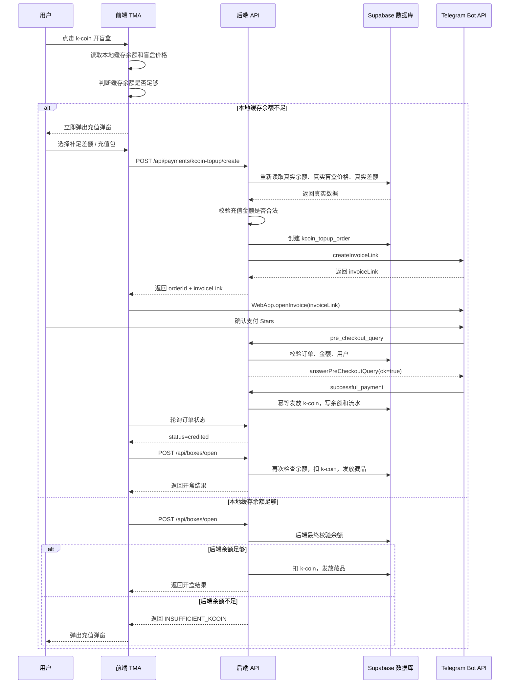

Telegram Stars 相关规则按官方文档整理：数字商品/服务应使用 Telegram Stars，币种为 `XTR`；支付流程需要处理 `pre_checkout_query`、调用 `answerPreCheckoutQuery`，再等待 `successful_payment` 后交付商品；`createInvoiceLink` 可用于创建发票链接，Stars 支付的 `prices` 只能有一个价格项；Mini App 的 invoice 关闭状态包含 `paid`、`cancelled`、`failed`、`pending`；webhook 可用 `X-Telegram-Bot-Api-Secret-Token` 校验来源。([Telegram][1])

下面是完整开发文档。

# k-coin 不足时使用 Telegram Stars 充值并继续开盲盒功能开发文档

---

## 1. 功能目标

当用户使用 `k-coin` 支付开盲盒费用时，如果余额不足，前端不要等待后端接口慢慢返回，而是先用本地缓存余额进行快速判断。

例如：

```text
开盲盒价格：10 k-coin
用户本地缓存余额：1 k-coin
预计还差：9 k-coin
```

用户点击“k-coin 开盲盒”后，前端立刻弹出充值弹窗：

```text
k-coin 不足

本次开盲盒需要 10 k-coin
当前余额 1 k-coin
预计还差 9 k-coin

请选择充值数量：

[补足 9 k-coin] 推荐
[500 k-coin]
[1000 k-coin]
[5000 k-coin]
[10000 k-coin]
```

用户选择充值数量后，前端打开 Telegram Stars 支付弹窗。

支付完成后：

```text
Telegram successful_payment webhook
→ 后端确认支付成功
→ 数据库幂等发放 k-coin
→ 前端确认订单 credited
→ 自动继续开盲盒
```

---

## 2. 核心原则

本功能必须遵守以下原则：

```text
前端本地余额检查 = 只用于快速反馈
后端真实余额检查 = 最终安全判断
Telegram successful_payment webhook = 发放 k-coin 的唯一依据
数据库事务 = 扣款、发币、写流水的唯一正确位置
```

不能这样做：

```text
前端 openInvoice 返回 paid
→ 前端直接给用户加 k-coin
```

必须这样做：

```text
前端 openInvoice 返回 paid
→ 前端轮询后端订单状态
→ 后端收到 Telegram successful_payment
→ 后端数据库事务发放 k-coin
→ 订单状态变成 credited
→ 前端刷新余额
```

---

## 3. 充值选项设计

### 3.1 第一版充值档位

第一版建议使用：

```text
补足差额
500 k-coin
1000 k-coin
5000 k-coin
10000 k-coin
```

例如用户还差 9 k-coin，则充值选项为：

```text
补足 9 k-coin
500 k-coin
1000 k-coin
5000 k-coin
10000 k-coin
```

### 3.2 推荐比例

第一版可以先使用简单比例：

```text
1 Telegram Star = 1 k-coin
```

也就是：

```text
充值 9 k-coin = 支付 9 Stars
充值 500 k-coin = 支付 500 Stars
充值 1000 k-coin = 支付 1000 Stars
```

后续如果要做优惠包，不要改数据库结构，只改配置：

```text
500 Stars = 550 k-coin
1000 Stars = 1150 k-coin
5000 Stars = 6000 k-coin
```

因此数据库必须分开记录：

```text
star_amount
kcoin_amount
```

不要把二者强行写死成永远相等。

---

## 4. 完整业务流程



---

## 5. 前端交互设计

### 5.1 页面初始化

用户进入 TMA 后，前端需要提前加载资产和盲盒数据。

建议接口：

```text
GET /api/me/assets
GET /api/boxes
```

资产接口返回示例：

```json
{
  "kcoinBalance": 1,
  "fgemsBalance": 2000,
  "updatedAt": "2026-06-06T12:00:00Z"
}
```

盲盒接口返回示例：

```json
{
  "boxes": [
    {
      "id": "box_normal_001",
      "name": "普通蛋",
      "kcoinPrice": 10,
      "isActive": true
    }
  ]
}
```

前端把资产数据放到全局缓存中，例如：

```text
React Query
Zustand
Redux
Context
```

推荐：

```text
React Query：负责服务端状态、请求、缓存刷新
Zustand：负责 UI 状态、当前余额快照、充值弹窗状态
```

---

## 6. 前端点击开盒逻辑

### 6.1 点击按钮时先用本地缓存判断

```ts
async function handleOpenBoxClick(boxId: string) {
  const box = boxStore.getBox(boxId);
  const localKcoinBalance = walletStore.kcoinBalance;

  if (!box) {
    showToast('盲盒信息加载中');
    return;
  }

  if (localKcoinBalance === null || localKcoinBalance === undefined) {
    showToast('余额加载中，请稍后');
    refreshWalletBalance();
    return;
  }

  if (localKcoinBalance < box.kcoinPrice) {
    const shortage = box.kcoinPrice - localKcoinBalance;

    showKcoinTopupModal({
      boxId,
      required: box.kcoinPrice,
      balance: localKcoinBalance,
      shortage,
      source: 'LOCAL_CACHE'
    });

    return;
  }

  await openBoxWithKcoin(boxId);
}
```

### 6.2 本地余额不足时的弹窗文案

因为这是本地缓存判断，所以文案建议写：

```text
预计还差 9 k-coin
```

不要写：

```text
还差 9 k-coin
```

原因：

```text
本地余额可能不是最新的。
真实差额必须以后端重新计算为准。
```

---

## 7. 充值弹窗设计

### 7.1 弹窗字段

弹窗需要展示：

```text
盲盒名称
本次开盒价格
当前缓存余额
预计差额
充值选项
```

示例：

```text
k-coin 不足

本次开盲盒需要：10 k-coin
当前余额：1 k-coin
预计还差：9 k-coin

请选择充值数量：

[补足 9 k-coin] 推荐
[500 k-coin]
[1000 k-coin]
[5000 k-coin]
[10000 k-coin]
```

### 7.2 前端生成充值选项

```ts
const FIXED_TOPUP_PACKAGES = [500, 1000, 5000, 10000];

function buildTopupOptions(shortage: number) {
  return [
    {
      label: `补足 ${shortage} k-coin`,
      amount: shortage,
      topupType: 'SHORTAGE',
      recommended: true
    },
    ...FIXED_TOPUP_PACKAGES.map((amount) => ({
      label: `${amount} k-coin`,
      amount,
      topupType: 'PACKAGE',
      recommended: false
    }))
  ];
}
```

---

## 8. 前端创建充值订单并支付

### 8.1 请求创建订单

用户选择某个充值选项后，前端请求：

```text
POST /api/payments/kcoin-topup/create
```

请求示例：

```json
{
  "intent": "OPEN_BOX",
  "boxId": "box_normal_001",
  "amount": 500,
  "topupType": "PACKAGE",
  "clientQuote": {
    "boxPrice": 10,
    "localBalance": 1,
    "localShortage": 9
  }
}
```

注意：

```text
clientQuote 只用于日志和排查问题。
后端不能相信 clientQuote。
```

### 8.2 打开 Telegram Stars 支付弹窗

```ts
async function createTopupAndPay(params: {
  boxId: string;
  amount: number;
  topupType: 'SHORTAGE' | 'PACKAGE';
}) {
  const res = await api.post('/api/payments/kcoin-topup/create', {
    intent: 'OPEN_BOX',
    boxId: params.boxId,
    amount: params.amount,
    topupType: params.topupType,
    clientQuote: {
      boxPrice: boxStore.getBox(params.boxId)?.kcoinPrice,
      localBalance: walletStore.kcoinBalance,
      localShortage:
        boxStore.getBox(params.boxId)?.kcoinPrice - walletStore.kcoinBalance
    }
  });

  if (res.code === 'BALANCE_ALREADY_ENOUGH') {
    walletStore.setKcoinBalance(res.balance);
    closeTopupModal();
    await openBoxWithKcoin(params.boxId);
    return;
  }

  if (res.code === 'TOPUP_QUOTE_CHANGED') {
    updateTopupModal({
      required: res.required,
      balance: res.balance,
      shortage: res.shortage
    });
    showToast('余额已变化，请重新选择充值数量');
    return;
  }

  const { orderId, invoiceLink } = res;

  window.Telegram.WebApp.openInvoice(invoiceLink, async (status) => {
    if (status === 'paid') {
      showToast('支付成功，正在确认入账');
      await waitUntilTopupCredited(orderId);
      await refreshWalletBalance();
      await openBoxWithKcoin(params.boxId);
      return;
    }

    if (status === 'pending') {
      showToast('支付处理中，请稍后刷新余额');
      await waitUntilTopupCredited(orderId);
      await refreshWalletBalance();
      return;
    }

    if (status === 'cancelled') {
      showToast('支付已取消');
      return;
    }

    if (status === 'failed') {
      showToast('支付失败，请重试');
      return;
    }
  });
}
```

### 8.3 轮询订单状态

```ts
async function waitUntilTopupCredited(orderId: string) {
  const maxAttempts = 20;
  const delayMs = 1000;

  for (let i = 0; i < maxAttempts; i++) {
    const res = await api.get(`/api/payments/kcoin-topup/status?orderId=${orderId}`);

    if (res.status === 'credited') {
      walletStore.setKcoinBalance(res.balance);
      return res;
    }

    if (res.status === 'failed' || res.status === 'expired' || res.status === 'refunded') {
      throw new Error(`TOPUP_NOT_CREDITED:${res.status}`);
    }

    await sleep(delayMs);
  }

  throw new Error('TOPUP_CONFIRM_TIMEOUT');
}
```

---

## 9. 前端状态机

| 状态                 | 说明               | UI 表现          |
| ------------------ | ---------------- | -------------- |
| assets_loading     | 余额加载中            | 开盒按钮 loading   |
| ready              | 余额和盲盒数据已加载       | 可点击开盒          |
| local_insufficient | 本地判断余额不足         | 立即弹充值弹窗        |
| opening            | 正在请求开盒           | 按钮显示“开盒中...”   |
| creating_invoice   | 正在创建支付订单         | 充值按钮 loading   |
| invoice_open       | Telegram 支付弹窗已打开 | 等待用户操作         |
| invoice_paid       | 前端收到 paid        | 显示“支付成功，确认入账中” |
| crediting          | 等待后端 webhook 入账  | 轮询订单状态         |
| credited           | 充值已入账            | 刷新余额，继续开盒      |
| open_success       | 开盒成功             | 展示开盒结果         |
| open_failed        | 开盒失败             | 显示错误           |

---

## 10. 后端接口设计

## 10.1 获取用户资产

```text
GET /api/me/assets
```

作用：

```text
返回用户当前 k-coin、fgems 等资产余额。
```

返回示例：

```json
{
  "kcoinBalance": 1,
  "fgemsBalance": 2000,
  "updatedAt": "2026-06-06T12:00:00Z"
}
```

---

## 10.2 k-coin 开盲盒接口

```text
POST /api/boxes/open
```

请求：

```json
{
  "boxId": "box_normal_001",
  "payCurrency": "KCOIN",
  "quantity": 1
}
```

后端逻辑：

```text
1. 校验用户 session
2. 查询盲盒是否存在、是否上架
3. 查询盲盒 k-coin 价格
4. 查询用户真实 k-coin 余额
5. 如果余额不足，返回 INSUFFICIENT_KCOIN
6. 如果余额足够，在数据库事务中：
   - 锁定用户余额
   - 扣除 k-coin
   - 写入扣款流水
   - 执行抽奖
   - 发放藏品
   - 写入开盒记录
7. 返回开盒结果和新余额
```

余额不足返回：

```json
{
  "code": "INSUFFICIENT_KCOIN",
  "required": 10,
  "balance": 1,
  "shortage": 9,
  "fixedTopupPackages": [500, 1000, 5000, 10000]
}
```

开盒成功返回：

```json
{
  "code": "OK",
  "newBalance": 90,
  "result": {
    "boxOpenId": "open_xxx",
    "items": [
      {
        "itemId": "item_001",
        "name": "小火龙",
        "rarity": "RARE"
      }
    ]
  }
}
```

---

## 10.3 创建 k-coin 充值订单

```text
POST /api/payments/kcoin-topup/create
```

请求：

```json
{
  "intent": "OPEN_BOX",
  "boxId": "box_normal_001",
  "amount": 500,
  "topupType": "PACKAGE",
  "clientQuote": {
    "boxPrice": 10,
    "localBalance": 1,
    "localShortage": 9
  }
}
```

后端必须重新计算：

```ts
const allowedPackages = [500, 1000, 5000, 10000];

const user = await requireSession(req);
const box = await getBox(boxId);
const realBalance = await getUserKcoinBalance(user.id);
const realPrice = box.kcoinPrice;
const realShortage = Math.max(0, realPrice - realBalance);
```

校验规则：

```ts
if (intent === 'OPEN_BOX' && realShortage <= 0) {
  return {
    code: 'BALANCE_ALREADY_ENOUGH',
    balance: realBalance,
    required: realPrice
  };
}

const isShortageTopup =
  topupType === 'SHORTAGE' && amount === realShortage;

const isFixedPackage =
  topupType === 'PACKAGE' && allowedPackages.includes(amount);

if (!isShortageTopup && !isFixedPackage) {
  return {
    code: 'TOPUP_QUOTE_CHANGED',
    required: realPrice,
    balance: realBalance,
    shortage: realShortage,
    fixedTopupPackages: allowedPackages
  };
}

if (intent === 'OPEN_BOX' && realBalance + amount < realPrice) {
  return {
    code: 'TOPUP_AMOUNT_NOT_ENOUGH_FOR_OPEN_BOX',
    required: realPrice,
    balance: realBalance,
    shortage: realShortage
  };
}
```

创建订单成功后返回：

```json
{
  "code": "OK",
  "orderId": "topup_order_uuid",
  "invoiceLink": "telegram_invoice_link",
  "kcoinAmount": 500,
  "starAmount": 500,
  "estimatedBalanceAfterTopup": 501,
  "estimatedBalanceAfterOpenBox": 491
}
```

---

## 10.4 查询充值订单状态

```text
GET /api/payments/kcoin-topup/status?orderId=xxx
```

返回：

```json
{
  "orderId": "xxx",
  "status": "credited",
  "kcoinAmount": 500,
  "starAmount": 500,
  "balance": 501
}
```

常见状态：

```text
pending
precheckout_approved
paid
credited
failed
expired
refunded
```

---

## 10.5 Telegram webhook

```text
POST /api/telegram/webhook
```

作用：

```text
接收 Telegram Bot API 推送的 update。
```

需要处理：

```text
pre_checkout_query
message.successful_payment
message.refunded_payment
```

webhook 必须校验：

```text
X-Telegram-Bot-Api-Secret-Token
```

伪代码：

```ts
export default async function telegramWebhook(req, res) {
  const secret = req.headers['x-telegram-bot-api-secret-token'];

  if (secret !== process.env.TELEGRAM_WEBHOOK_SECRET) {
    return res.status(401).json({ ok: false });
  }

  const update = req.body;

  await saveTelegramPaymentEvent(update);

  if (update.pre_checkout_query) {
    await handlePreCheckoutQuery(update.pre_checkout_query);
    return res.status(200).json({ ok: true });
  }

  if (update.message?.successful_payment) {
    await handleSuccessfulPayment(update);
    return res.status(200).json({ ok: true });
  }

  if (update.message?.refunded_payment) {
    await handleRefundedPayment(update);
    return res.status(200).json({ ok: true });
  }

  return res.status(200).json({ ok: true });
}
```

---

## 11. Telegram Stars invoice 创建逻辑

### 11.1 发票 payload 设计

payload 必须能定位订单。

推荐：

```text
kc_topup:<orderId>
```

例如：

```text
kc_topup:47fdc589-f3a6-45d1-a6d1-3dfc1c07d800
```

### 11.2 创建发票伪代码

```ts
async function createTelegramStarsInvoice(order: {
  id: string;
  kcoinAmount: number;
  starAmount: number;
}) {
  const payload = `kc_topup:${order.id}`;

  const body = {
    title: `充值 ${order.kcoinAmount} k-coin`,
    description: `用于补足开盲盒所需的 k-coin`,
    payload,
    currency: 'XTR',
    prices: [
      {
        label: `${order.kcoinAmount} k-coin`,
        amount: order.starAmount
      }
    ],
    provider_token: ''
  };

  const res = await fetch(`https://api.telegram.org/bot${process.env.TELEGRAM_BOT_TOKEN}/createInvoiceLink`, {
    method: 'POST',
    headers: {
      'Content-Type': 'application/json'
    },
    body: JSON.stringify(body)
  });

  const data = await res.json();

  if (!data.ok) {
    throw new Error(data.description || 'CREATE_INVOICE_LINK_FAILED');
  }

  return data.result;
}
```

说明：

```text
currency 使用 XTR。
Stars 支付的 prices 只放一个价格项。
provider_token 对数字商品 Stars 支付传空字符串。
```

---

## 12. pre_checkout_query 处理

Telegram 会在用户确认支付前发送 `pre_checkout_query`。

后端必须检查：

```text
1. payload 格式是否正确
2. 订单是否存在
3. 订单用户是否匹配
4. 订单状态是否允许支付
5. currency 是否为 XTR
6. total_amount 是否等于订单 star_amount
7. 订单是否过期
```

伪代码：

```ts
async function handlePreCheckoutQuery(q: any) {
  const payload = q.invoice_payload;

  if (!payload.startsWith('kc_topup:')) {
    return answerPreCheckout(q.id, false, '订单格式错误');
  }

  const orderId = payload.replace('kc_topup:', '');

  const result = await supabase.rpc('approve_kcoin_topup_precheckout', {
    p_order_id: orderId,
    p_telegram_user_id: q.from.id,
    p_currency: q.currency,
    p_total_amount: q.total_amount,
    p_pre_checkout_query_id: q.id
  });

  if (!result.data.ok) {
    return answerPreCheckout(q.id, false, result.data.error_message);
  }

  return answerPreCheckout(q.id, true);
}
```

调用 Telegram：

```ts
async function answerPreCheckout(
  preCheckoutQueryId: string,
  ok: boolean,
  errorMessage?: string
) {
  await fetch(`https://api.telegram.org/bot${process.env.TELEGRAM_BOT_TOKEN}/answerPreCheckoutQuery`, {
    method: 'POST',
    headers: {
      'Content-Type': 'application/json'
    },
    body: JSON.stringify({
      pre_checkout_query_id: preCheckoutQueryId,
      ok,
      ...(ok ? {} : { error_message: errorMessage || '订单无法支付' })
    })
  });
}
```

---

## 13. successful_payment 处理

Telegram 发送 `successful_payment` 后，后端才可以给用户发放 k-coin。

伪代码：

```ts
async function handleSuccessfulPayment(update: any) {
  const msg = update.message;
  const sp = msg.successful_payment;

  const payload = sp.invoice_payload;

  if (!payload.startsWith('kc_topup:')) {
    return;
  }

  const orderId = payload.replace('kc_topup:', '');

  await supabase.rpc('credit_kcoin_topup_order', {
    p_order_id: orderId,
    p_telegram_user_id: msg.from.id,
    p_telegram_payment_charge_id: sp.telegram_payment_charge_id,
    p_provider_payment_charge_id: sp.provider_payment_charge_id,
    p_currency: sp.currency,
    p_total_amount: sp.total_amount,
    p_raw_update: update
  });
}
```

---

## 14. 数据库设计

## 14.1 充值包配置表

建议把充值包做成配置表，不要写死在代码里。

```sql
create table kcoin_topup_packages (
  id uuid primary key default gen_random_uuid(),
  package_code text not null unique,
  kcoin_amount integer not null check (kcoin_amount > 0),
  star_amount integer not null check (star_amount > 0),
  is_active boolean not null default true,
  sort_order integer not null default 0,
  created_at timestamptz not null default now(),
  updated_at timestamptz not null default now()
);
```

初始化数据：

```sql
insert into kcoin_topup_packages
  (package_code, kcoin_amount, star_amount, is_active, sort_order)
values
  ('KCOIN_500', 500, 500, true, 1),
  ('KCOIN_1000', 1000, 1000, true, 2),
  ('KCOIN_5000', 5000, 5000, true, 3),
  ('KCOIN_10000', 10000, 10000, true, 4);
```

---

## 14.2 kcoin_topup_orders 表

```sql
create table kcoin_topup_orders (
  id uuid primary key default gen_random_uuid(),

  user_id uuid not null references users(id),
  telegram_user_id bigint not null,

  status text not null check (
    status in (
      'pending',
      'precheckout_approved',
      'paid',
      'credited',
      'failed',
      'expired',
      'refunded',
      'duplicate_paid'
    )
  ) default 'pending',

  topup_type text not null check (
    topup_type in ('SHORTAGE', 'PACKAGE')
  ),

  intent text not null check (
    intent in ('OPEN_BOX', 'MANUAL_TOPUP')
  ) default 'MANUAL_TOPUP',

  box_id uuid null references boxes(id),

  kcoin_amount integer not null check (kcoin_amount > 0),
  star_amount integer not null check (star_amount > 0),
  currency text not null default 'XTR',

  real_box_price_kcoin integer null,
  real_balance_at_create integer null,
  real_shortage_at_create integer null,

  client_box_price_kcoin integer null,
  client_balance_at_create integer null,
  client_shortage_at_create integer null,

  invoice_payload text not null unique,
  invoice_link text null,

  pre_checkout_query_id text null unique,
  precheckout_approved_at timestamptz null,

  telegram_payment_charge_id text null unique,
  provider_payment_charge_id text null,

  expires_at timestamptz not null default (now() + interval '15 minutes'),

  created_at timestamptz not null default now(),
  updated_at timestamptz not null default now(),
  paid_at timestamptz null,
  credited_at timestamptz null,
  refunded_at timestamptz null,

  metadata jsonb not null default '{}'::jsonb
);
```

索引：

```sql
create index idx_kcoin_topup_orders_user_created
  on kcoin_topup_orders(user_id, created_at desc);

create index idx_kcoin_topup_orders_status
  on kcoin_topup_orders(status);

create index idx_kcoin_topup_orders_payload
  on kcoin_topup_orders(invoice_payload);

create index idx_kcoin_topup_orders_tg_charge
  on kcoin_topup_orders(telegram_payment_charge_id);
```

---

## 14.3 Telegram payment event 日志表

用于记录 Telegram webhook 原始事件，方便排查重复回调、支付纠纷、退款等问题。

```sql
create table telegram_payment_events (
  id uuid primary key default gen_random_uuid(),

  update_id bigint null unique,
  event_type text not null,
  order_id uuid null references kcoin_topup_orders(id),
  user_id uuid null references users(id),
  telegram_user_id bigint null,

  telegram_payment_charge_id text null,
  provider_payment_charge_id text null,

  raw_update jsonb not null,

  created_at timestamptz not null default now()
);
```

---

## 14.4 余额表

如果你已有 `user_balances`，沿用现有表。

示例结构：

```sql
create table user_balances (
  user_id uuid primary key references users(id),
  kcoin_available integer not null default 0 check (kcoin_available >= 0),
  fgems_available integer not null default 0 check (fgems_available >= 0),
  updated_at timestamptz not null default now()
);
```

---

## 14.5 余额流水表

如果你已有 `currency_ledger`，沿用现有表。

示例结构：

```sql
create table currency_ledger (
  id uuid primary key default gen_random_uuid(),

  user_id uuid not null references users(id),
  currency text not null check (currency in ('KCOIN', 'FGEMS')),
  direction text not null check (direction in ('IN', 'OUT')),
  amount integer not null check (amount > 0),

  reason text not null,
  ref_type text not null,
  ref_id uuid not null,

  available_before integer not null,
  available_after integer not null,

  metadata jsonb not null default '{}'::jsonb,

  created_at timestamptz not null default now()
);
```

充值成功后写入：

```text
currency = KCOIN
direction = IN
reason = KCOIN_TOPUP_BY_STARS
ref_type = kcoin_topup_order
ref_id = kcoin_topup_orders.id
```

开盲盒扣款后写入：

```text
currency = KCOIN
direction = OUT
reason = OPEN_BOX_WITH_KCOIN
ref_type = box_open
ref_id = box_open_id
```

---

## 15. RPC 设计

## 15.1 approve_kcoin_topup_precheckout

作用：

```text
Telegram pre_checkout_query 阶段校验订单。
```

要求：

```text
1. 锁定订单
2. 防止同一订单重复支付
3. 校验用户
4. 校验币种
5. 校验金额
6. 校验过期时间
7. 写入 pre_checkout_query_id
```

SQL 示例：

```sql
create or replace function approve_kcoin_topup_precheckout(
  p_order_id uuid,
  p_telegram_user_id bigint,
  p_currency text,
  p_total_amount integer,
  p_pre_checkout_query_id text
)
returns jsonb
language plpgsql
security definer
as $$
declare
  v_order kcoin_topup_orders%rowtype;
begin
  select *
  into v_order
  from kcoin_topup_orders
  where id = p_order_id
  for update;

  if not found then
    return jsonb_build_object(
      'ok', false,
      'error_message', '订单不存在'
    );
  end if;

  if v_order.status <> 'pending' then
    return jsonb_build_object(
      'ok', false,
      'error_message', '订单已经处理，请重新创建订单'
    );
  end if;

  if v_order.expires_at < now() then
    update kcoin_topup_orders
    set status = 'expired',
        updated_at = now()
    where id = p_order_id;

    return jsonb_build_object(
      'ok', false,
      'error_message', '订单已过期，请重新创建订单'
    );
  end if;

  if v_order.telegram_user_id <> p_telegram_user_id then
    return jsonb_build_object(
      'ok', false,
      'error_message', '支付用户不匹配'
    );
  end if;

  if v_order.currency <> p_currency then
    return jsonb_build_object(
      'ok', false,
      'error_message', '支付币种错误'
    );
  end if;

  if v_order.star_amount <> p_total_amount then
    return jsonb_build_object(
      'ok', false,
      'error_message', '支付金额错误'
    );
  end if;

  update kcoin_topup_orders
  set status = 'precheckout_approved',
      pre_checkout_query_id = p_pre_checkout_query_id,
      precheckout_approved_at = now(),
      updated_at = now()
  where id = p_order_id;

  return jsonb_build_object('ok', true);
end;
$$;
```

---

## 15.2 credit_kcoin_topup_order

作用：

```text
successful_payment 后发放 k-coin。
```

要求：

```text
1. 必须幂等
2. 必须锁定订单
3. 必须锁定用户余额
4. 必须校验 payment_charge_id
5. 必须写入余额流水
6. 必须更新订单状态为 credited
```

SQL 示例：

```sql
create or replace function credit_kcoin_topup_order(
  p_order_id uuid,
  p_telegram_user_id bigint,
  p_telegram_payment_charge_id text,
  p_provider_payment_charge_id text,
  p_currency text,
  p_total_amount integer,
  p_raw_update jsonb default '{}'::jsonb
)
returns void
language plpgsql
security definer
as $$
declare
  v_order kcoin_topup_orders%rowtype;
  v_before integer;
  v_after integer;
begin
  select *
  into v_order
  from kcoin_topup_orders
  where id = p_order_id
  for update;

  if not found then
    raise exception 'TOPUP_ORDER_NOT_FOUND';
  end if;

  if v_order.status = 'credited'
     and v_order.telegram_payment_charge_id = p_telegram_payment_charge_id then
    return;
  end if;

  if v_order.status = 'credited'
     and v_order.telegram_payment_charge_id <> p_telegram_payment_charge_id then
    insert into telegram_payment_events (
      event_type,
      order_id,
      user_id,
      telegram_user_id,
      telegram_payment_charge_id,
      provider_payment_charge_id,
      raw_update
    )
    values (
      'duplicate_successful_payment',
      v_order.id,
      v_order.user_id,
      p_telegram_user_id,
      p_telegram_payment_charge_id,
      p_provider_payment_charge_id,
      p_raw_update
    );

    raise exception 'ORDER_ALREADY_CREDITED_WITH_DIFFERENT_CHARGE';
  end if;

  if v_order.status not in ('pending', 'precheckout_approved', 'paid') then
    raise exception 'INVALID_ORDER_STATUS_FOR_CREDIT';
  end if;

  if v_order.telegram_user_id <> p_telegram_user_id then
    raise exception 'TELEGRAM_USER_MISMATCH';
  end if;

  if v_order.currency <> p_currency then
    raise exception 'CURRENCY_MISMATCH';
  end if;

  if v_order.star_amount <> p_total_amount then
    raise exception 'AMOUNT_MISMATCH';
  end if;

  if exists (
    select 1
    from kcoin_topup_orders
    where telegram_payment_charge_id = p_telegram_payment_charge_id
      and id <> p_order_id
  ) then
    raise exception 'DUPLICATE_TELEGRAM_CHARGE_ID';
  end if;

  select kcoin_available
  into v_before
  from user_balances
  where user_id = v_order.user_id
  for update;

  if not found then
    insert into user_balances (
      user_id,
      kcoin_available,
      fgems_available,
      updated_at
    )
    values (
      v_order.user_id,
      0,
      0,
      now()
    );

    v_before := 0;
  end if;

  v_after := v_before + v_order.kcoin_amount;

  update user_balances
  set kcoin_available = v_after,
      updated_at = now()
  where user_id = v_order.user_id;

  insert into currency_ledger (
    user_id,
    currency,
    direction,
    amount,
    reason,
    ref_type,
    ref_id,
    available_before,
    available_after,
    metadata,
    created_at
  )
  values (
    v_order.user_id,
    'KCOIN',
    'IN',
    v_order.kcoin_amount,
    'KCOIN_TOPUP_BY_STARS',
    'kcoin_topup_order',
    v_order.id,
    v_before,
    v_after,
    jsonb_build_object(
      'telegram_payment_charge_id', p_telegram_payment_charge_id,
      'provider_payment_charge_id', p_provider_payment_charge_id,
      'star_amount', v_order.star_amount
    ),
    now()
  );

  update kcoin_topup_orders
  set status = 'credited',
      telegram_payment_charge_id = p_telegram_payment_charge_id,
      provider_payment_charge_id = p_provider_payment_charge_id,
      paid_at = coalesce(paid_at, now()),
      credited_at = now(),
      updated_at = now()
  where id = p_order_id;
end;
$$;
```

---

## 16. 后端创建充值订单逻辑

伪代码：

```ts
export async function createKcoinTopupOrder(req, res) {
  const user = await requireSession(req);

  const {
    intent,
    boxId,
    amount,
    topupType,
    clientQuote
  } = req.body;

  if (!['OPEN_BOX', 'MANUAL_TOPUP'].includes(intent)) {
    return badRequest('INVALID_INTENT');
  }

  if (!['SHORTAGE', 'PACKAGE'].includes(topupType)) {
    return badRequest('INVALID_TOPUP_TYPE');
  }

  const box = intent === 'OPEN_BOX'
    ? await getBoxOrThrow(boxId)
    : null;

  const balance = await getUserKcoinBalance(user.id);

  const realPrice = box?.kcoinPrice ?? null;
  const realShortage = box
    ? Math.max(0, realPrice - balance)
    : null;

  if (intent === 'OPEN_BOX' && realShortage <= 0) {
    return res.json({
      code: 'BALANCE_ALREADY_ENOUGH',
      balance,
      required: realPrice
    });
  }

  const activePackages = await getActiveTopupPackages();
  const fixedPackage = activePackages.find(
    (pkg) => pkg.kcoin_amount === amount
  );

  const isShortageTopup =
    intent === 'OPEN_BOX' &&
    topupType === 'SHORTAGE' &&
    amount === realShortage;

  const isFixedPackage =
    topupType === 'PACKAGE' &&
    Boolean(fixedPackage);

  if (!isShortageTopup && !isFixedPackage) {
    return res.status(409).json({
      code: 'TOPUP_QUOTE_CHANGED',
      required: realPrice,
      balance,
      shortage: realShortage,
      fixedTopupPackages: activePackages.map((p) => p.kcoin_amount)
    });
  }

  if (intent === 'OPEN_BOX' && balance + amount < realPrice) {
    return res.status(400).json({
      code: 'TOPUP_AMOUNT_NOT_ENOUGH_FOR_OPEN_BOX',
      required: realPrice,
      balance,
      shortage: realShortage
    });
  }

  const kcoinAmount = amount;

  const starAmount = isFixedPackage
    ? fixedPackage.star_amount
    : amount;

  const order = await createOrderInDb({
    userId: user.id,
    telegramUserId: user.telegramUserId,
    status: 'pending',
    topupType,
    intent,
    boxId,
    kcoinAmount,
    starAmount,
    currency: 'XTR',
    realBoxPriceKcoin: realPrice,
    realBalanceAtCreate: balance,
    realShortageAtCreate: realShortage,
    clientQuote
  });

  const invoiceLink = await createTelegramStarsInvoice({
    id: order.id,
    kcoinAmount,
    starAmount
  });

  await updateOrderInvoiceLink(order.id, invoiceLink);

  return res.json({
    code: 'OK',
    orderId: order.id,
    invoiceLink,
    kcoinAmount,
    starAmount,
    estimatedBalanceAfterTopup: balance + kcoinAmount,
    estimatedBalanceAfterOpenBox:
      intent === 'OPEN_BOX' ? balance + kcoinAmount - realPrice : null
  });
}
```

---

## 17. 退款处理

Telegram Stars 可以发生退款。后端需要保留：

```text
telegram_payment_charge_id
provider_payment_charge_id
```

退款 webhook 处理：

```text
message.refunded_payment
```

第一版建议策略：

```text
1. 收到退款事件
2. 找到对应充值订单
3. 标记 kcoin_topup_orders.status = refunded
4. 写入 telegram_payment_events
5. 如果用户 k-coin 余额足够，扣回对应 k-coin
6. 如果余额不足，记录负债 / 风控标记 / 限制提现或交易
```

建议新增风控字段或表：

```text
user_risk_flags
user_currency_debts
```

简单第一版可以先做：

```text
退款后如果余额不足，不允许用户继续交易、mint、提现、领取奖励，直到补足欠款。
```

---

## 18. 异常情况处理

| 场景                                             | 处理方式                                      |
| ---------------------------------------------- | ----------------------------------------- |
| 本地缓存余额不足                                       | 立即弹充值弹窗                                   |
| 本地缓存余额足够，但后端余额不足                               | 后端返回 INSUFFICIENT_KCOIN，前端弹充值弹窗           |
| 用户点击补足 9，但后端真实差额变成 5                           | 返回 TOPUP_QUOTE_CHANGED，前端刷新弹窗             |
| 用户点击补足 9，但后端余额已经够了                             | 返回 BALANCE_ALREADY_ENOUGH，前端关闭弹窗并继续开盒     |
| 用户选择 500 充值后不开盒                                | k-coin 留在余额中                              |
| openInvoice 返回 paid，但订单还没 credited             | 前端继续轮询订单状态                                |
| openInvoice 返回 failed/cancelled，但 webhook 后来成功 | 以后刷新余额或查订单状态时显示 credited                  |
| Telegram webhook 重复推送                          | RPC 幂等，不重复发放                              |
| 同一订单出现不同 charge_id                             | 记录 duplicate_successful_payment，人工处理或自动退款 |
| webhook 来源伪造                                   | 校验 X-Telegram-Bot-Api-Secret-Token        |
| 订单过期                                           | pre_checkout 阶段拒绝支付                       |
| 用户重复点击充值按钮                                     | 前端按钮 loading，后端可复用 pending 订单或创建新订单       |

---

## 19. 错误码设计

| 错误码                                  | 说明              | 前端处理        |
| ------------------------------------ | --------------- | ----------- |
| INSUFFICIENT_KCOIN                   | k-coin 余额不足     | 弹充值弹窗       |
| BALANCE_ALREADY_ENOUGH               | 后端发现余额已经够了      | 关闭充值弹窗，继续开盒 |
| TOPUP_QUOTE_CHANGED                  | 本地差额和后端真实差额不一致  | 刷新弹窗数据      |
| INVALID_TOPUP_AMOUNT                 | 非法充值金额          | 提示并刷新配置     |
| INVALID_TOPUP_TYPE                   | 非法充值类型          | 提示系统错误      |
| TOPUP_AMOUNT_NOT_ENOUGH_FOR_OPEN_BOX | 充值后仍不够开盒        | 重新选择更高档位    |
| CREATE_INVOICE_LINK_FAILED           | Telegram 发票创建失败 | 提示稍后重试      |
| TOPUP_CONFIRM_TIMEOUT                | 支付后等待入账超时       | 提示稍后刷新余额    |
| TOPUP_ORDER_NOT_FOUND                | 充值订单不存在         | 提示订单异常      |
| ORDER_EXPIRED                        | 订单已过期           | 重新创建订单      |
| PAYMENT_AMOUNT_MISMATCH              | 支付金额不匹配         | 拒绝支付        |
| PAYMENT_USER_MISMATCH                | 支付用户不匹配         | 拒绝支付        |

---

## 20. 安全规则

### 20.1 前端不能相信的数据

前端传来的这些数据都不能信：

```text
用户余额
盲盒价格
预计差额
充值金额
topupType
boxId 对应的价格
clientQuote
```

后端必须重新查数据库。

### 20.2 后端必须校验的数据

创建订单时必须校验：

```text
用户 session
box 是否存在
box 是否上架
真实 box 价格
真实 k-coin 余额
真实 shortage
充值金额是否为真实 shortage 或固定充值包
充值后是否足够本次开盒
```

pre_checkout 时必须校验：

```text
订单存在
订单状态 pending
订单未过期
telegram_user_id 匹配
currency = XTR
total_amount = star_amount
```

successful_payment 时必须校验：

```text
订单存在
telegram_user_id 匹配
currency = XTR
total_amount = star_amount
telegram_payment_charge_id 未被其他订单使用
订单未重复 credited
```

---

## 21. RLS / 权限建议

### 21.1 kcoin_topup_orders

建议：

```text
前端不直接写 kcoin_topup_orders。
所有创建和更新都通过后端 service role 或 security definer RPC。
```

用户可以只读自己的充值订单，或者完全不开放表读取，只通过：

```text
GET /api/payments/kcoin-topup/status
```

查询。

### 21.2 currency_ledger

建议：

```text
用户可以读取自己的流水。
用户不能 insert/update/delete 流水。
流水只能由 RPC 或后端 service role 写入。
```

### 21.3 user_balances

建议：

```text
用户可以读取自己的余额。
用户不能直接修改余额。
余额只能由 RPC 或后端 service role 修改。
```

---

## 22. 环境变量

后端需要：

```env
TELEGRAM_BOT_TOKEN=xxx
TELEGRAM_WEBHOOK_SECRET=xxx

SUPABASE_URL=xxx
SUPABASE_SERVICE_ROLE_KEY=xxx

APP_ENV=development
```

前端需要：

```env
VITE_API_BASE_URL=https://your-api-domain.com
```

---

## 23. 设置 Telegram webhook

后端部署后，需要设置 webhook。

请求示例：

```bash
curl -X POST "https://api.telegram.org/bot$TELEGRAM_BOT_TOKEN/setWebhook" \
  -H "Content-Type: application/json" \
  -d '{
    "url": "https://your-domain.com/api/telegram/webhook",
    "secret_token": "your_webhook_secret",
    "allowed_updates": ["message", "pre_checkout_query"]
  }'
```

---

## 24. 开发任务拆分

### Task 1：数据库迁移

创建：

```text
kcoin_topup_packages
kcoin_topup_orders
telegram_payment_events
必要索引
必要 RPC
```

检查已有：

```text
user_balances
currency_ledger
users
boxes
box_open_records
inventory
```

---

### Task 2：后端支付模块

新增：

```text
packages/server/src/payments/kcoinTopup.ts
packages/server/src/telegram/createInvoice.ts
packages/server/src/telegram/webhook.ts
```

实现：

```text
createKcoinTopupOrder
createTelegramStarsInvoice
handlePreCheckoutQuery
handleSuccessfulPayment
handleRefundedPayment
getTopupOrderStatus
```

---

### Task 3：API 路由

新增：

```text
api/payments/kcoin-topup/create.ts
api/payments/kcoin-topup/status.ts
api/telegram/webhook.ts
```

已有接口需要检查：

```text
api/boxes/open.ts
api/me/assets.ts
```

---

### Task 4：前端资产缓存

实现：

```text
useAssetsQuery
walletStore
refreshWalletBalance
```

要求：

```text
TMA 启动时加载余额
开盒成功后刷新余额
充值 credited 后刷新余额
余额加载中时禁用开盒按钮
```

---

### Task 5：前端充值弹窗

实现：

```text
KcoinTopupModal
TopupOptionButton
TopupConfirmPanel
```

弹窗支持：

```text
补足差额
500
1000
5000
10000
支付中 loading
确认入账中 loading
支付失败提示
订单状态轮询
```

---

### Task 6：前端开盒流程改造

实现：

```text
handleOpenBoxClick
openBoxWithKcoin
createTopupAndPay
waitUntilTopupCredited
```

核心要求：

```text
点击开盒先用本地缓存判断。
本地不足，立即弹充值弹窗。
本地足够，请求后端开盒。
后端返回不足，再弹充值弹窗。
充值成功 credited 后，自动重新请求开盒。
```

---

### Task 7：测试

需要测试：

```text
本地余额不足，立即弹窗
本地余额足够，直接开盒
本地余额足够但后端不足，弹窗
补足差额支付成功
500 包支付成功
支付成功后 webhook 重复推送
openInvoice 返回 paid 但订单未 credited
支付取消
支付失败
订单过期
用户伪造 amount
用户伪造 boxId
用户伪造 topupType
pre_checkout 用户不匹配
pre_checkout 金额不匹配
successful_payment 重复 charge_id
退款事件
```

---

## 25. 验收标准

功能完成后必须满足：

```text
1. 用户点击 k-coin 开盲盒，本地余额不足时，前端必须立即弹充值弹窗。
2. 弹窗必须显示补足差额、500、1000、5000、10000。
3. 前端显示的差额必须使用“预计还差”。
4. 创建充值订单时，后端必须重新计算真实余额和真实差额。
5. 后端只允许充值真实差额或固定充值包。
6. Telegram Stars 支付必须使用 XTR。
7. 支付成功后，必须由 successful_payment webhook 触发发放 k-coin。
8. 前端不能直接发放 k-coin。
9. 发放 k-coin 必须写入 currency_ledger。
10. webhook 重复推送不能重复发放 k-coin。
11. 用户支付完成后，前端必须等订单 status=credited 后再继续开盒。
12. 继续开盒时，后端必须再次检查余额并在事务中扣款。
13. 所有支付订单必须保存 telegram_payment_charge_id。
14. webhook 必须校验 X-Telegram-Bot-Api-Secret-Token。
15. 退款事件必须能记录并进入风控处理。
```

---

## 26. 最终推荐实现方式

本功能最终应该实现为：

```text
用户点击 k-coin 开盲盒
→ 前端用本地缓存余额快速判断
→ 如果本地余额不足，立即弹出充值弹窗
→ 用户选择补足差额 / 500 / 1000 / 5000 / 10000
→ 后端重新计算真实余额、真实价格、真实差额
→ 后端创建 kcoin_topup_order
→ 后端创建 Telegram Stars invoiceLink
→ 前端 openInvoice
→ Telegram pre_checkout_query
→ 后端校验订单并确认
→ Telegram successful_payment
→ 后端数据库事务发放 k-coin
→ 前端轮询到 credited
→ 前端刷新余额
→ 前端自动重新请求开盲盒
→ 后端扣 k-coin 并发放藏品
```

最关键的一句话：

```text
前端本地判断只解决“快”，后端最终校验和 webhook 入账解决“安全”。
```