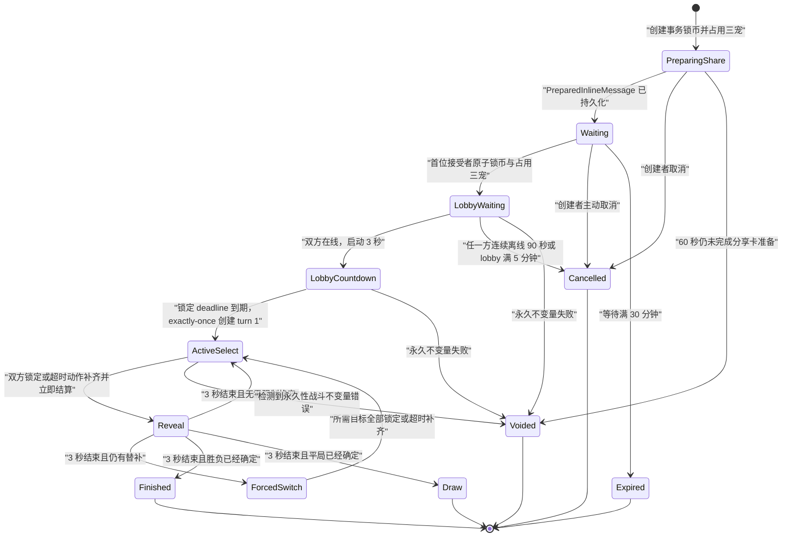
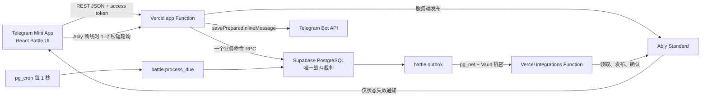

# PokePets 宠物藏品 Battle 功能开发方案

> 文档状态：已完成产品裁决后的唯一开发方案
>
> 项目基线：`main`，`3af830895e85116610460de7dc0c2add4b2744f9`，2026-07-28
>
> 适用范围：当前 Telegram Mini App、真实开发环境与未来独立生产环境
>
> 输入依据：用户在本次对话中的最新裁决、[Battle功能方向说明.md](Battle功能方向说明.md)、当前仓库与真实开发环境的只读核对结果

## 1. 最终结论

Battle 进入现有底部导航的“游戏”页，采用 React + TypeScript 渲染战斗界面，沿用 210 张正式藏品图片；Vercel REST API 负责身份、契约和 Telegram/Ably 外部服务编排；Supabase PostgreSQL RPC 是房间、资产、库存、出招、随机命中、回合结算和最终结算的唯一裁判；Ably Standard 只发送状态失效通知；Supabase `pg_cron` 每秒推进到期房间和超时动作；Ably 不可用时由短轮询恢复权威状态。

浏览器不运行战斗模拟器，不计算伤害，不生成命中结果，不决定行动顺序，不提交金额、属性、技能数值或结算结果。客户端只提交房间档位、按顺序排列的三个模板 ID、技能位置、换宠目标和幂等键。

Battle 一次性完整上线，不发布只有界面、只有房间、只有人机模拟或没有资产闭环的中间版本。

## 2. 功能范围

### 2.1 包含

- 玩家使用自己真实拥有且当前可用的藏品组建三宠队伍。
- 创建固定 K-coin 档位的持卡挑战房。
- 通过 Telegram 原生分享把挑战卡发送到用户私聊、好友或群组。
- 挑战卡被转发后继续有效，第一个原子接受成功的正常账号成为对手。
- 同步秘密选招、主动换宠、强制换宠、超时托管、断线托管和 20 回合裁决。
- K-coin 锁定、获胜结算、平台手续费、平局退款和异常退款。
- Battle 占用藏品与出售、分解、进化、远征、Mint 的统一库存互斥。
- 永久私有审计包与不向用户开放的精简对战摘要。

### 2.2 明确不包含

- 捕捉、地图掉落、免费战斗宠物、宠物升级、培养、装备或天赋。
- PVE、人机对战、全局匹配、群组匹配池、公开房间列表。
- 观战、认输、重赛、排行榜、赛季、段位、战斗任务和额外奖励。
- 被动技能、异常状态、能力变化、治疗、护盾、能量、次数、冷却、暴击和随机伤害浮动。
- 用户历史页、逐回合回放、审计查询接口。
- Pokémon、PokeAPI 或开源项目中的角色、数值、图片、音频、数据和战斗代码。

Battle 的唯一经济结果是双方等额入场费形成的奖池、胜者结算、平台手续费或平局退款。Battle 不推进现有每日任务、有效充值、邀请奖励或 VIP 手续费返还。

## 3. 当前项目接入事实

| 当前事实                                                                    | Battle 接入结论                                                                                           |
| --------------------------------------------------------------------------- | --------------------------------------------------------------------------------------------------------- |
| `apps/web/src/pages/game/GamePage.tsx` 目前为空页面                         | Battle 直接占用现有“游戏”页，不新增第六个底部导航                                                         |
| Web 为 React + Vite + TypeScript，主页面在会话内保持挂载                    | Battle 页面继续保持挂载；邀请 waiting 仅创建者发送展示心跳，双人 lobby 双方发送 presence 心跳，开战后停止 |
| 仓库没有 Phaser 依赖，藏品只有正式 WebP 图片而非逐帧精灵                    | Battle 使用 React、CSS 与 Web Animations API，不引入 Phaser                                               |
| `catalog.templates` 已有 210 个固定模板、链、阶段、稀有度、战斗力和图片路径 | Battle 新建独立、版本化的战斗配置，不改写目录身份字段；`combat_power` 只保留综合展示                      |
| `inventory.reservations` 已统一扣减可用数量                                 | reservation 新增 `battle` 类型，每名参战者的三个模板各占用 1 份                                           |
| `economy.balances` 已有 `available` 与 `locked`                             | 入场费在创建或接受时从 available 转入 locked，终局再退款或结算                                            |
| 写操作已经采用 `operations.begin_command` 和单事务 RPC                      | Battle 的创建、取消、接受、行动和强制换宠沿用同一幂等模型                                                 |
| 当前 Telegram `start_param` 只接受推荐码格式                                | 身份入口增加 Battle 专用 bearer token 类型，Battle 入口不触发推荐关系绑定                                 |
| 浏览器不直连 Supabase，Functions 使用 `service_role` 调用 `api` RPC         | Battle 保持相同可信边界，Ably 也不获得数据库裁决能力                                                      |
| 初始 migration 尚未作为正式生产历史发布                                     | 实现时直接修改声明式 Schema 和三份原始 migration，并从空库重建真实开发数据库                              |

## 4. 冻结产品规则

### 4.1 队伍与藏品

1. 每队固定三个不同 `template_id`。
2. 同一进化链的不同阶段属于不同模板，允许同时上阵。
3. 组队时固定三个槽位顺序，第 1 位自动首发。
4. 创建者创建房间时立即占用所选三个模板各 1 份；接受者接受时在同一事务内完成相同占用。
5. 等待与战斗期间，被占用的具体数量不能出售、分解、进化、远征或 Mint；同模板仍有额外可用数量时，额外数量不受影响。
6. 取消、过期、平局、正常结算或系统异常作废时释放全部 Battle reservation。
7. 每个账号最多存在一条 `preparing_share`、`waiting`、`lobby` 或 `active` 参与记录。

### 4.2 挑战档位与结算

| 每人入场费 | 奖池 | 胜者到账 | 平台手续费 | 胜者净变化 | 败者净变化 |
| ---------: | ---: | -------: | ---------: | ---------: | ---------: |
|  20 K-coin |   40 |       36 |          4 |        +16 |        -20 |
| 100 K-coin |  200 |      180 |         20 |        +80 |       -100 |
| 500 K-coin | 1000 |      900 |        100 |       +400 |       -500 |

- 创建者在创建房间的数据库事务内锁定入场费。
- 接受者在接受房间的数据库事务内锁定相同入场费。
- 胜者获得奖池的 90%，平台取得奖池的 10%。
- 平局时双方各自原额退款，平台手续费为 0。
- 系统永久性不变量错误导致房间作废时双方原额退款，平台手续费为 0。
- K-coin 不能提现，Battle 不提供玩家间自由转账。

### 4.3 房间、在线与分享

1. 分享卡准备完成后的等待有效期固定为 30 分钟。
2. 创建者在对手成功接受前允许取消。
3. 创建者在线状态只作展示；创建者离线不阻止队伍选择或接受，也不触发 90 秒取消。邀请页固定显示“离线 · 仍可接受”。
4. 有效邀请直接进入三槽队伍选择；创建者本人入口返回严格 `self` 状态，服务端仍拒绝自我接受。
5. 挑战卡允许分享到 Telegram 用户私聊和群组，不允许发到 Bot 会话或频道。
6. 挑战卡允许转发，不校验原分享群、不校验群成员身份。
7. 除创建者本人外，任何正常账号拿到有效卡片都允许尝试接受；只有第一个数据库事务成功者成为对手。
8. 首位接受事务锁定接受者三宠、reservation 和 stake，生成私有种子与 commitment，并进入双人 lobby；不得在接受事务创建 turn 1。
9. lobby 总时限固定 5 分钟。双方每 5 秒心跳，最近服务端心跳不超过 10 秒判定在线，连续离线恢复窗口固定 90 秒。
10. waiting 创建者与 lobby 双方的每次可见/激活 `/game` 时段各使用一个独立 UUID presence lease；命令携带数据库快照的下一 lifecycle version 与该 lease 内严格递增的 command sequence。
11. 页面隐藏、Telegram deactivated、`pagehide` 或离开 `/game` 立即结束当前 lease、中止在途 heartbeat 并尽力 offline；恢复必须先读取权威快照并取得数据库认可的新 lease。新 lease 接管后旧 heartbeat/offline 永久无副作用，安全不依赖 abort 或 offline 必达。
12. 创建者接受前已经离线时，其 90 秒窗口从接受事务成功时重新开始；接受者在接受事务成功时视为在线。
13. 在 `lobby_waiting` 中，任一方连续离线 90 秒、lobby 满 5 分钟或任一参与者被封禁时终结房间；双方原额退款、六个 reservation 释放、手续费为 0。双方同时在线且完整 3 秒能够落在 5 分钟边界内时，数据库在同一 room lock 内原子写入固定 `lobby_start_deadline` 并进入 `lobby_countdown`。
14. `lobby_countdown` 是不可撤销的参战锁定。合法 offline、新 lease、页面隐藏、离开 `/game`、刷新、重认证、旧请求、重复请求和乱序请求仍可更新或回正 presence，但均不得把状态改回等待，不得清空、延后或重置 `lobby_start_deadline`，也不得触发取消、退款或 reservation 释放。
15. 锁定 deadline 到期后不再复核双方在线；数据库在同一 room lock 内 exactly-once 创建 turn 1、写唯一 `battle_started` event/outbox 并进入 `active_select`。重复 tick、请求重放和服务恢复只能读取同一状态；永久不变量失败仍进入既有幂等安全作废事务。
16. 接受后不提供玩家取消、分享或重新选队。接受失败或竞争失败的玩家不扣款、不占用藏品。

### 4.4 挑战卡与接受页隐私

挑战卡和接受页只公开以下内容：

- 创建者的 Telegram 展示名和头像。
- 固定入场费。
- 创建者三只宠物的稀有度组合，按 `普通 → 稀有 → 史诗 → 传说 → 神话` 排序并省略数量为 0 的项，例如 `史诗 ×2、传说 ×1`。
- 30 分钟有效提示、当前剩余时间和创建者在线状态。

挑战卡和接受页不得返回或嵌入以下信息：

- 三个 `template_id`、名称、图片或进化链。
- 属性、生命、攻击、防御、速度。
- 模板实际拥有的技能、技能威力、命中率和优先级。
- `combat_power` 或由其推导的队伍总战斗力。

稀有度组合由服务端从已锁定阵容快照生成，前端不能提交。双方不强制同稀有度、同阶段、同档强度或同属性。

### 4.5 开战后的信息

- 双方接受完成前，创建者看不到接受者阵容，接受者只看到创建者的稀有度组合。
- 接受事务完成后的 lobby 只显示固定红/蓝方形 WebP 与双方 presence，不使用真实头像或阵容图片；数据库正式创建 turn 1 后，双方才同时看到对方三个模板的名称、图片、稀有度、阶段、存活状态和当前出战位置。
- 对手生命只显示百分比血条，不显示固定最大生命和精确剩余生命。
- 对手属性、固定四维、技能列表和 `combat_power` 不直接展示。
- 对手已经使用的技能只在该回合结算动画中显示技能名称、命中或未命中及克制结果，不形成可翻阅的回合日志。
- 自己的三个模板显示精确四维、属性、当前/最大生命和该阶段实际拥有的 2/3/4 个技能。
- 当前回合双方行动在两边都锁定或超时补齐前保持秘密。

### 4.6 回合规则

1. 正常战斗回合的选择时间固定为 15 秒。
2. 点击技能或换宠目标后立即提交，服务端成功锁定后本回合不可撤回。
3. 双方都锁定后立即结算，不等待倒计时结束。
4. 每次回合结算后的展示窗口固定为 3 秒，期间不能提交下一动作。
5. 超时自动选择当前宠物实际拥有技能中命中率最高的一项；命中率相同按连续技能位置从前到后取第一项。
6. 每次超时都自动出招，不累计超时判负；断线玩家允许由系统打完整场。
7. 主动换宠始终先于所有攻击。
8. 一方换宠、一方攻击时，换入宠物承受本回合攻击。
9. 双方都换宠时同时换宠，本回合不造成伤害。
10. 双方都攻击时先比较技能优先级，再比较当前宠物速度。
11. 优先级和速度都相同时，两次攻击使用同一结算前快照同时计算并同时生效；即使其中一只会被击倒，两次攻击仍都执行。
12. 顺序不相同时，先手攻击造成击倒后，已被击倒的后手宠物不再执行攻击。
13. 主动换宠消耗一个正常战斗回合。

### 4.7 强制换宠

- 宠物被击倒且队伍仍有存活宠物时，进入独立强制换宠状态，限时 15 秒。
- 只有需要换宠的一方提交目标，另一方不能攻击。
- 双方同时需要换宠时同时秘密选择；两边锁定后立即完成。
- 超时按队伍槽位顺序换入第一只存活宠物。
- 强制换宠不计入 20 个战斗回合。
- 换入完成后直接开始下一个正常战斗回合。

### 4.8 终局

每次正常回合结算后按以下固定顺序判断：

1. 双方都没有存活宠物：平局。
2. 只有一方没有存活宠物：另一方获胜。
3. 第 20 个正常战斗回合已经结算：先比较存活宠物数量。
4. 存活数量相同：比较三只宠物精确剩余生命百分比之和。
5. 百分比之和仍完全相同：平局。
6. 未到第 20 回合且双方仍能继续：进入强制换宠或下一回合。

剩余生命百分比使用 PostgreSQL `numeric` 直接比较 `Σ(current_hp / max_hp)`，不先四舍五入为页面百分比。双方最后一只宠物同时倒下直接平局。

开战后不提供认输、取消或退出结算。退出和断线只会停止玩家心跳及输入，系统继续按超时规则出招。

## 5. Battle v1 固定平衡数据

### 5.1 版本与快照

正式规则版本固定为 `battle-v1`。配置构建产物同时生成 SHA-256 checksum，包含：

- 五属性克制表。
- 五档稀有度强度系数。
- 14 个基础角色档案。
- 10 个技能数值槽位。
- 14 组四技能候选池及其 power 成长顺序。
- 70 条进化链的属性和角色档案映射。
- 210 个模板的最终生命、攻击、防御、速度、属性与按阶段固定的 2/3/4 技能配置。
- 房间时限、行动时限、展示时限、最大回合数和结算档位。

房间创建时固定 `ruleset_id` 与 checksum，并把三只宠物的实际配置复制为不可变快照。配置发布新版本不会改变已经创建的等待房、进行中的战斗或永久审计结果。

### 5.2 五属性与克制

唯一属性循环为：

```text
火焰 → 草系 → 土系 → 雷电 → 水系 → 火焰
```

| 关系                   | 倍率 |
| ---------------------- | ---: |
| 攻击属性克制防守属性   | 1.50 |
| 攻击属性被防守属性克制 | 0.75 |
| 同属性或不相邻属性     | 1.00 |

每只宠物只有一个属性，同一进化链三个阶段保持同一属性；候选池与模板实际拥有的技能全部与宠物属性一致。不存在双属性、无属性或特殊属性。

### 5.3 稀有度强度

| 稀有度 | 系数 basis points | 目标平衡预算 |
| ------ | ----------------: | -----------: |
| 普通   |             10000 |          400 |
| 稀有   |             11500 |          460 |
| 史诗   |             13200 |          528 |
| 传说   |             15200 |          608 |
| 神话   |             17500 |          700 |

平衡预算定义为：

```text
预算 = 生命 / 3 + 攻击 + 防御 + 速度
```

同稀有度的所有档案预算完全相同。高稀有度拥有更高预算，属于明确的真实战斗优势。`combat_power`、链类型和阶段编号不再作为隐藏倍率参与 Battle 计算；进化带来的实际强化由新模板对应的更高稀有度四维和按阶段固定增加的技能共同体现。

### 5.4 14 个基础角色档案

| 档案 | 定位名 | 基础生命 | 基础攻击 | 基础防御 | 基础速度 | 四技能候选池 |
| ---: | ------ | -------: | -------: | -------: | -------: | ------------ |
|    1 | 均衡   |      300 |      100 |      100 |      100 | L01          |
|    2 | 强攻   |      285 |      115 |       90 |      100 | L02          |
|    3 | 疾攻   |      270 |      110 |       85 |      115 | L03          |
|    4 | 铁壁   |      330 |       85 |      115 |       90 | L04          |
|    5 | 守势   |      315 |       95 |      110 |       90 | L05          |
|    6 | 前锋   |      300 |      110 |      100 |       90 | L06          |
|    7 | 决斗   |      285 |      105 |       95 |      105 | L07          |
|    8 | 迅捷   |      270 |       95 |       90 |      125 | L08          |
|    9 | 粉碎   |      300 |      120 |       85 |       95 | L09          |
|   10 | 厚甲   |      345 |       85 |      105 |       95 | L10          |
|   11 | 猎手   |      285 |      110 |       85 |      110 | L11          |
|   12 | 哨卫   |      300 |       90 |      115 |       95 | L12          |
|   13 | 斗士   |      315 |      110 |       90 |       95 | L13          |
|   14 | 灵动   |      300 |       95 |       95 |      110 | L14          |

每个基础档案的预算均为 400。

### 5.5 进化后的精确整数四维

对模板稀有度系数 `M` 和基础档案四维 `H0/A0/D0/S0`，使用以下唯一算法：

```text
攻击 A = floor((A0 × M + 5000) / 10000)
防御 D = floor((D0 × M + 5000) / 10000)
速度 S = floor((S0 × M + 5000) / 10000)
三倍目标预算 B3 = 1200 × M / 10000
生命 H = B3 - 3 × (A + D + S)
```

该算法同时满足：

- 所有实际数值均为正整数。
- 同稀有度所有档案严格满足相同目标预算。
- 同一档案从普通到稀有、史诗、传说、神话时，生命、攻击、防御、速度四项都严格上升。
- 同一进化链保持同一角色定位和同一四技能候选池；每次进化的攻击力和其余三维都真实增强，并按阶段增加一个固定技能。

产品数据构建门禁必须逐行验证上述四项性质，并把 210 行最终值写入版本化种子数据；运行时不临时推导或接受客户端数值。

### 5.6 70 条链的属性与档案映射

表内每一格代表一条进化链；该链三个阶段共用本行档案和本列属性。档案 1–8 对应普通链，9–12 对应高级链，13–14 对应顶级链。

| 档案 | 火焰        | 草系        | 土系        | 雷电        | 水系        |
| ---: | ----------- | ----------- | ----------- | ----------- | ----------- |
|    1 | CHAIN-N-001 | CHAIN-N-003 | CHAIN-N-004 | CHAIN-N-005 | CHAIN-N-002 |
|    2 | CHAIN-N-015 | CHAIN-N-010 | CHAIN-N-008 | CHAIN-N-006 | CHAIN-N-009 |
|    3 | CHAIN-N-017 | CHAIN-N-012 | CHAIN-N-020 | CHAIN-N-007 | CHAIN-N-011 |
|    4 | CHAIN-N-019 | CHAIN-N-016 | CHAIN-N-023 | CHAIN-N-013 | CHAIN-N-014 |
|    5 | CHAIN-N-022 | CHAIN-N-021 | CHAIN-N-027 | CHAIN-N-018 | CHAIN-N-025 |
|    6 | CHAIN-N-028 | CHAIN-N-024 | CHAIN-N-030 | CHAIN-N-026 | CHAIN-N-029 |
|    7 | CHAIN-N-037 | CHAIN-N-031 | CHAIN-N-035 | CHAIN-N-034 | CHAIN-N-032 |
|    8 | CHAIN-N-038 | CHAIN-N-033 | CHAIN-N-039 | CHAIN-N-040 | CHAIN-N-036 |
|    9 | CHAIN-A-005 | CHAIN-A-006 | CHAIN-A-004 | CHAIN-A-002 | CHAIN-A-001 |
|   10 | CHAIN-A-008 | CHAIN-A-013 | CHAIN-A-007 | CHAIN-A-009 | CHAIN-A-003 |
|   11 | CHAIN-A-014 | CHAIN-A-015 | CHAIN-A-010 | CHAIN-A-012 | CHAIN-A-011 |
|   12 | CHAIN-A-016 | CHAIN-A-017 | CHAIN-A-020 | CHAIN-A-018 | CHAIN-A-019 |
|   13 | CHAIN-T-003 | CHAIN-T-007 | CHAIN-T-005 | CHAIN-T-001 | CHAIN-T-002 |
|   14 | CHAIN-T-006 | CHAIN-T-010 | CHAIN-T-009 | CHAIN-T-008 | CHAIN-T-004 |

因此每个属性恰好拥有 14 条链、42 个模板和同一套数值生态，只替换模板身份、属性、技能名称与元素视觉。

### 5.7 10 个技能数值槽位

全部技能都是同级主动直接伤害技能，只由威力、命中率和优先级形成差异；不存在基础/战术/强力分类，也没有被动、冷却、次数、能量、异常状态或能力变化。

| 数值槽位 | 威力 | 命中率 basis points | 页面命中率 | 优先级 | 结算视觉轨迹 |
| -------: | ---: | ------------------: | ---------: | -----: | ------------ |
|      S01 |   45 |               10000 |       100% |     +1 | 单段突进     |
|      S02 |   60 |                9000 |        90% |     +1 | 双段疾行     |
|      S03 |   80 |                7000 |        70% |     +1 | 折线闪击     |
|      S04 |   55 |               10000 |       100% |      0 | 球形投射     |
|      S05 |   70 |                9500 |        95% |      0 | 环形冲击     |
|      S06 |   85 |                8500 |        85% |      0 | 垂直重击     |
|      S07 |  105 |                7000 |        70% |      0 | 径向爆发     |
|      S08 |   75 |               10000 |       100% |     -1 | 横向轰流     |
|      S09 |   95 |                9000 |        90% |     -1 | 全场风暴     |
|      S10 |  125 |                7000 |        70% |     -1 | 天降聚合     |

五个属性使用完全相同的数值槽位。视觉效果由“数值槽位轨迹 × 属性粒子”唯一组合而成：

| 属性 | 粒子、配色与命中特征         |
| ---- | ---------------------------- |
| 火焰 | 橙红火星、焰尾、炽热爆点     |
| 草系 | 翠绿叶片、藤蔓、花粉光点     |
| 土系 | 土黄岩片、尘浪、地裂纹       |
| 雷电 | 金黄电弧、蓝白闪光、雷击残影 |
| 水系 | 青蓝水滴、潮纹、泡沫飞溅     |

每个技能拥有独立 `effect_key = <element>-<01..10>`，共 50 个效果键；轨迹和元素粒子的组合使 50 个技能在视觉上保持不同，同时不改变数值对称性。

### 5.8 五属性技能名称

| 槽位 | 火焰     | 草系       | 土系     | 雷电     | 水系     |
| ---: | -------- | ---------- | -------- | -------- | -------- |
|  S01 | 火花突袭 | 飞叶突袭   | 砂砾突袭 | 电光突袭 | 水流突袭 |
|  S02 | 炽焰快攻 | 藤刺快攻   | 岩针快攻 | 雷针快攻 | 水刃快攻 |
|  S03 | 爆炎闪击 | 荆棘闪击   | 地裂闪击 | 霆光闪击 | 潮汐闪击 |
|  S04 | 灼热火球 | 种子弹     | 泥岩弹   | 电弧弹   | 泡沫弹   |
|  S05 | 烈焰冲击 | 叶刃冲击   | 岩崩冲击 | 雷鸣冲击 | 激流冲击 |
|  S06 | 熔岩重击 | 巨藤重击   | 山岳重击 | 霹雳重击 | 巨浪重击 |
|  S07 | 日炎爆破 | 森罗爆破   | 地脉爆破 | 雷暴爆破 | 海啸爆破 |
|  S08 | 焰流轰击 | 古木轰击   | 巨岩轰击 | 磁极轰击 | 深潮轰击 |
|  S09 | 炼狱坠火 | 万叶风暴   | 大地震荡 | 九霄天雷 | 沧海怒涛 |
|  S10 | 终焉天火 | 世界树坠击 | 天陨坠岩 | 万雷天劫 | 天河坠潮 |

### 5.9 14 组固定四技能候选池

| 组合 | 候选槽位原始顺序   |
| ---- | ------------------ |
| L01  | S01、S04、S06、S09 |
| L02  | S01、S05、S07、S08 |
| L03  | S01、S05、S06、S10 |
| L04  | S02、S04、S06、S08 |
| L05  | S02、S04、S07、S09 |
| L06  | S02、S05、S07、S08 |
| L07  | S03、S04、S06、S09 |
| L08  | S03、S05、S07、S08 |
| L09  | S03、S04、S07、S10 |
| L10  | S01、S04、S07、S10 |
| L11  | S01、S06、S08、S10 |
| L12  | S02、S04、S06、S10 |
| L13  | S02、S05、S08、S09 |
| L14  | S03、S04、S08、S10 |

生成器按 `(power 升序, 候选槽位原始位置升序)` 把四个候选技能整理为唯一成长顺序。模板实际技能数固定为 `stage + 1`：1 阶取前 2 个、2 阶取前 3 个、3 阶取全部 4 个；写入模板、房间快照和 API 时位置连续为 `1..N`。同链阶段技能必须保持前缀继承。

玩家不能学习、替换、手动解锁或重排技能。未拥有技能不进入返回数组、DOM 或锁定占位。模板不保证拥有 100% 命中技能，生成器不得为命中率改变 power 顺序；L06、L13 的 1 阶模板允许只有 90%/95% 命中技能。

### 5.10 确定伤害公式

命中后的计算只读取攻击者实际攻击 `A`、防守者实际防御 `D`、技能威力 `P` 和属性倍率 `T_bps`：

```text
raw_damage =
  floor(
    2 × P × A × A × T_bps
    ÷ ((A + D) × 100 × 10000)
  )

single_hit_cap = max(1, floor(defender_max_hp × 80 / 100))
damage = min(single_hit_cap, max(1, raw_damage))
applied_damage = min(defender_current_hp, damage)
defender_current_hp = max(0, defender_current_hp - damage)
```

全部计算使用 PostgreSQL `bigint` 的固定运算顺序。单次命中伤害不超过防守宠物最大生命的 80%，因此满生命宠物不会被一招击倒；当前生命已经低于伤害时仍正常被击倒。公式没有等级、`combat_power`、阶段加成、同属性加成、暴击、随机区间、状态或客户端参数。

当双方四维按同一稀有度系数放大时，伤害和生命同步放大，镜像对局的击倒节奏保持稳定；高稀有度对低稀有度同时获得更高生命、攻击、防御和速度形成明确优势。

### 5.11 唯一随机结果

接受成功时数据库使用 `gen_random_bytes(32)` 生成房间私有种子，永不返回客户端。每个攻击行动的命中随机数为：

```text
digest = HMAC-SHA256(
  room_private_seed,
  battle_id | turn_no | actor_side | action_ordinal | skill_id
)

roll = unsigned_first_32_bits(digest) mod 10000
hit = roll < accuracy_bps
```

- 同一行动重复恢复时得到完全相同的 roll。
- 行动处理先后顺序不会改变 roll。
- 100% 命中仍记录 roll 和阈值，便于审计。
- 审计事件永久保存 roll、阈值、命中结果、计算伤害和实际扣除生命。

## 6. 权威状态机



`LobbyWaiting` 与 `LobbyCountdown` 的回合号固定为 0；`LobbyCountdown` 只由数据库原子创建并按固定 deadline 完成，不能中止、暂停或重置。Presence 事件可以在该状态继续变化，但不再拥有房间终结权。`Reveal` 固定 3 秒；`ForcedSwitch` 不增加正常回合编号。终局结果在攻击结算时写为不可变待终结结果，3 秒展示到期后由同一终结事务结算 K-coin、释放 reservation、解除参与锁并写入 `finished/draw`。服务中断时 tick 恢复同一待终结结果，不能重新计算或重复结算。20 个正常回合全部用满且四次强制换宠分别用满时，服务端时限约为 7 分钟，符合 5–8 分钟目标。

## 7. 数据库设计

### 7.1 固定配置表

新建内部 `battle` schema：

| 表                        | 唯一职责                                                 |
| ------------------------- | -------------------------------------------------------- |
| `battle.rulesets`         | 规则版本、checksum、固定时限、最大回合、手续费和启用状态 |
| `battle.entry_tiers`      | 20、100、500 三档及对应奖池、到账、手续费                |
| `battle.rarity_factors`   | 五档稀有度系数和目标预算                                 |
| `battle.type_matchups`    | 五属性唯一克制矩阵                                       |
| `battle.skill_slots`      | 十组威力、命中率、优先级和视觉轨迹                       |
| `battle.skills`           | 50 个属性技能名称与 `effect_key`                         |
| `battle.role_profiles`    | 14 个基础四维档案                                        |
| `battle.profile_loadouts` | 14 组按 power 排序后的四技能候选成长顺序                 |
| `battle.chain_configs`    | 70 条链的属性与角色档案                                  |
| `battle.template_configs` | 210 个模板的最终固定四维、属性和按阶段 2/3/4 技能配置    |

配置表一经激活不得原地修改。开发期调整 `battle-v1` 时重建产品数据；正式上线后的调整创建新规则版本。

### 7.2 运行表

| 表                           | 核心内容与约束                                                                                                                                 |
| ---------------------------- | ---------------------------------------------------------------------------------------------------------------------------------------------- |
| `battle.rooms`               | 创建者、规则快照、档位、状态、接受时间、lobby 总时限与开战 deadline、当前回合、版本号、私有随机种子、终局                                      |
| `battle.prepared_shares`     | Telegram prepared message ID、Telegram 到期时间、准备状态和尝试次数                                                                            |
| `battle.participants`        | 创建者/接受者、用户、参与状态、加入操作、在线时间、离线 deadline、lifecycle version、lease UUID、command sequence、lease active 和结果确认时间 |
| `battle.team_members`        | 槽位 1–3、模板及战斗配置快照、当前/最大生命、存活和出战状态                                                                                    |
| `battle.stakes`              | 每名参与者锁定额、状态、锁定/退款/到账 ledger ID                                                                                               |
| `battle.turns`               | 回合开始快照 hash、deadline、结算结果 hash                                                                                                     |
| `battle.actions`             | 唯一玩家行动、技能/换宠目标、player/timeout 来源、锁定时间                                                                                     |
| `battle.events`              | 永久私有事件序列、命中 roll、伤害、换宠、终局和状态 hash                                                                                       |
| `battle.settlements`         | 唯一终局、胜者、奖池、手续费、双方到账与 ledger ID                                                                                             |
| `battle.summaries`           | 双方各一条私有摘要：对手、胜负、入场费、到账、净变化、结束时间                                                                                 |
| `battle.outbox`              | Ably 失效通知、投递租约、重试次数和投递状态                                                                                                    |
| `battle.rate_limit_attempts` | 用户、动作、invite hash 和一分钟持久限流记录                                                                                                   |

关键约束：

- `rooms.invite_token_hash` 唯一，只保存 SHA-256，不保存原始 bearer token。
- `participants` 对 `preparing_share/waiting/lobby/active` 状态建立用户部分唯一索引。
- 每个房间最多一个 creator 和一个 opponent。
- `team_members` 唯一键为 `(participant_id, slot)` 与 `(participant_id, template_id)`。
- `template_configs` 与 `team_members` 的技能 1、2 必填；技能 3 只允许 2/3 阶非空，技能 4 只允许 3 阶非空，空值只能形成连续尾部且所有非空技能互不重复。
- `actions` 唯一键为 `(room_id, turn_no, participant_id)`。
- `settlements` 对 `room_id` 唯一。
- `events` 对 `(room_id, sequence)` 唯一且只追加。
- 到期邀请、lobby 总时限、participant presence deadline、lobby 开战 deadline、到期行动、到期强制换宠和待投递 outbox 都建立部分索引。
- Battle 审计表永久保留，不进入 30 天操作清理。

### 7.3 库存

`inventory.reservations.kind` 增加 `battle`，`reference_id` 固定使用 `battle.participants.id`。创建和接受 RPC 对三个模板按 `template_id` 排序锁定 holding，再分别调用统一 reservation 逻辑。

库存读模型增加：

```text
total = available + listed + trading + minting + expedition + battling
```

`inventory.item_json` 返回 `battling`。市场、分解、进化、远征和 Mint 继续只读取 `inventory.available_quantity`，因此无需在前端互相调用领域逻辑也能阻止重复使用。

### 7.4 K-coin 锁定与账本

锁定、退款和结算都在对应 Battle RPC 的同一事务内完成。

| 动作                        | available | locked | ledger                                      |
| --------------------------- | --------: | -----: | ------------------------------------------- |
| 锁定入场费 `x`              |      `-x` |   `+x` | `battle_stake_lock`，amount `-x`            |
| 取消/过期/平局/作废退款 `x` |      `+x` |   `-x` | `battle_stake_refund`，amount `+x`          |
| 胜者结算                    |   `+1.8x` |   `-x` | `battle_win_payout`，amount `+1.8x`         |
| 败者结算                    |      不变 |   `-x` | 初始负向 lock ledger 已代表最终可用余额变化 |

`battle.stakes` 记录 locked 的去向；`battle.settlements` 记录败者 locked 被消费和平台手续费。Battle ledger 的 `(reason, reference)` 建立部分唯一索引，重复恢复不能重复退款或到账。

涉及双方余额的结算统一按用户 UUID 排序锁定 balance 行。房间行始终先于该房间的参与者、余额、reservation、行动和结算行锁定。

### 7.5 原子命令

| RPC                               | 单事务结果                                                                                                                                                                                       |
| --------------------------------- | ------------------------------------------------------------------------------------------------------------------------------------------------------------------------------------------------ |
| `api.battle_prepare_room`         | 验证服务端生成的 room ID/token hash、账号、唯一参与、规则、档位、三个不同模板、余额和可用数量；创建 room/creator/snapshot；占用三宠；锁定入场费；操作进入 pending                                |
| `api.battle_activate_share`       | 保存 prepared message ID，开始 30 分钟等待计时，完成创建操作                                                                                                                                     |
| `api.battle_abort_share`          | 分享准备明确失败或 60 秒超时；退款、释放、终结创建操作                                                                                                                                           |
| `api.battle_cancel_room`          | 只允许创建者在接受成功前取消；退款、释放并终结                                                                                                                                                   |
| `api.battle_accept_room`          | 锁房间；验证有效期、非本人、唯一参与、档位、余额和阵容；不检查创建者在线；首位成功者占用三宠和锁币，创建快照、种子及双人 lobby，不创建第 1 回合                                                  |
| `api.battle_submit_action`        | 验证参与者、状态、deadline 和动作；不可逆插入；双方齐备时在同一事务立即结算                                                                                                                      |
| `api.battle_submit_forced_switch` | 验证仅需换宠方、存活目标和 deadline；双方齐备时立即换入并开始下一回合                                                                                                                            |
| `api.battle_heartbeat`            | 裁决 waiting 创建者或 lobby 当前 participant 的 version + lease + sequence 在线意图；旧命令无副作用，普通续租不增加 room 版本，返回 viewer snapshot                                              |
| `api.battle_mark_offline`         | 裁决同一组单调标识的离线意图并永久关闭该 lease；旧 heartbeat/offline 无副作用；`lobby_waiting` 可推进 90 秒窗口，`lobby_countdown` 只更新 presence 且不得改变锁定 deadline，返回 viewer snapshot |
| `api.battle_process_due`          | 推进邀请到期、lobby 离线/总时限/封禁取消、lobby 开战、超时技能/强制换宠和 3 秒展示窗口                                                                                                           |
| `api.battle_acknowledge_result`   | 只允许本人确认本人终局展示，首次确认时间幂等落库                                                                                                                                                 |
| `api.battle_claim_outbox`         | 只供受保护的 integration 领取待投递通知                                                                                                                                                          |
| `api.battle_complete_outbox`      | 确认投递或记录重试，不改变 Battle 业务状态                                                                                                                                                       |

房间的接受、取消、邀请到期、lobby 到期、心跳、离线、倒计时锁定与完成都先锁定同一 room 行。heartbeat/offline 在推进任何 presence、deadline 或资产终态前先裁决 lifecycle version、lease UUID 与 command sequence；只接受当前活动 lease 的更高序号或当前版本加一的新 lease，其他命令直接返回当前快照。offline 关闭 lease 后同 lease 不能被 heartbeat 复活。`lobby_waiting` 的 90 秒与 5 分钟终结保持不变；数据库只在完整 3 秒不越过 5 分钟边界时启动倒计时。一旦写入 `lobby_start_deadline`，所有 heartbeat/offline、旧/新 lease、重复 tick 与恢复路径都不得清空、延后或重置它，倒计时到期也不再复核在线。普通心跳续租不写 `state_version/event/outbox`；真实 presence 转换、倒计时锁定、开战和等待期取消产生事件，不再存在 `lobby_countdown_stopped`。动作提交和 deadline 托管也先锁定同一 room 行。数据库时间满足 `now < deadline` 时接收玩家动作；`now >= deadline` 时由托管结果获胜。

`battle.advance_lobby` 在任何开战写入前、同一 room lock 内复核正好两名正确归属 participant、两份正确金额/归属的 locked stake 与 lock ledger、每方三个合法快照且槽位 1 唯一 active、正好六个匹配 participant/template/user 的 active Battle reservation，以及 ruleset/checksum、tier、deadline、seed/commitment 和无既有 turn/action/settlement/summary 等启动条件。永久失败不创建 turn，直接复用幂等安全作废事务。`battle.monitor_invariants` 只在取得 room-first 锁后执行同一复核和作废路径，因此不会观察接受事务的瞬时中间态。

创建操作的 request hash 只覆盖客户端提交的档位与有序三个模板，不包含服务端派生 token。相同 `operation_id` 的 pending/succeeded 重试返回已经存在的 room 与 `create_operation_id`，绝不插入第二个 room。

### 7.6 永久审计

服务端永久保存：

- 双方用户、锁定阵容与队伍顺序。
- 规则版本、checksum 和所有模板战斗快照。
- 每回合 deadline、两边动作、动作来源和结算顺序。
- 每次命中 roll、命中阈值、属性倍率、计算伤害和实际伤害。
- 每次换宠、击倒、强制换宠和超时补齐。
- 最终生命、存活数量、生命百分比比较值和终局原因。
- reservation ID、stake 状态、settlement 与全部 ledger ID。
- 最终 canonical audit SHA-256。

这些数据不进入任何 Web/API 用户历史或回放响应。终局结果确认后，旧房间的参与者读取接口也不再返回审计内容。

## 8. 服务端与实时架构



### 8.1 PostgreSQL 战斗引擎

战斗引擎全部位于 `battle` 内部函数：

- 输入只使用数据库快照和已经锁定的动作。
- 命中、伤害、先后手、换宠、击倒、终局和经济结算都在同一事务内。
- 普通换宠双方分支与强制换宠统一调用内部原子切换函数：先将当前 active 宠物设为 inactive，再激活已验证的存活目标；禁止使用同一条多行 `UPDATE` 同时翻转 active 状态并依赖数据库行处理顺序。
- 每次状态变化递增 `rooms.state_version` 和 `events.sequence`。
- RPC 返回按当前用户裁剪的读模型，不把私有审计 JSON 交给 Functions 再过滤。
- 检测到规则缺失、快照不完整、负生命、重复活动宠物或账本不变量错误时，不继续猜测结算；系统在独立安全事务把房间标为 `voided`、退款全部已有原始 stake、释放藏品，并原子记录双方/room 终态、零手续费 settlement、审计、outbox 与 `operations.invariant_violations`。
- prepared-share 明确失败形成的合法 `voided` 是另一类未开战事实：一份已有 stake 已 refunded、三份 reservation 已 released、settlement 为 0。监控以明确 `share_failed` 终态事件分类，并独立验证 `cancelled`、`expired` 和全部未开战终态；不忽略其他 `voided`。

### 8.2 每秒 deadline 推进

真实开发与生产 Supabase 安装 `pg_cron` 与 `pg_net`。唯一 cron job `battle-tick-v1` 每秒调用 `battle.process_due(limit => 100)`：

- advisory lock 阻止同一时刻重叠 tick。
- 到期 room 使用索引和 `FOR UPDATE SKIP LOCKED` 分批处理。
- `preparing_share` 的下一次外部尝试到期时，tick 只在存在待恢复任务时通过 `pg_net` 唤醒 `/api/integrations/battle-share`。
- 一次 tick 未处理完时下一秒继续。
- 服务恢复后按数据库 deadline 追赶，不依据浏览器计时器补算。
- 每次状态变化与 outbox 写入同一事务。
- 停用或重建前先 `cron.unschedule('battle-tick-v1')`，再在独立语句执行 `pg_reload_conf()`；保存原 `jobid` 连续两个调度周期没有新增 run 的证据后才允许删除 Battle schema，避免旧 scheduler 缓存继续执行已停用 job。
- 三条 migration 的提交事务完成后，数据库 owner 必须在独立语句执行一次 `pg_reload_conf()`，随后只以 `cron.job_run_details` 中同一 `jobid` 的至少两个连续自然周期作为恢复成功证据；手工调用 `battle.process_due` 不属于调度健康证据。
- `battle.tick_health()` 固定核对唯一 job、schedule、command、database、worker、scheduler 数量及最近 5 秒成功记录。五分钟 `monitor-invariants` 把配置错误、调度停滞写为 `BATTLE_TICK_UNHEALTHY`，把真实失败写为 `BATTLE_TICK_RUN_FAILED`；失败摘要和 SHA-256、jobid、runid、开始/结束时间进入现有私有 violation 运维链路。
- `cron.job_run_details` 中该 command 的成功与失败记录固定保留 7 天，由既有每日 `cleanup-idempotency` 最多清理 100000 条更早记录；不增加第二个 Supabase cron job，未关闭的失败 violation 不随运行记录清理。

当前真实开发 Supabase 在 2026-07-27 已列出 `pg_cron 1.6.4`、`pg_net 0.20.4`，Vault `0.3.1` 已安装；实现时仍通过从空库执行完整 migration 确认扩展和 job 真实可用。

### 8.3 Ably

前后端锁定 `ably@2.26.0`：

- 服务端使用 `ABLY_API_KEY` 发布。
- Web 通过 `/api/battle/realtime-token` 获取 5 分钟短期 token。
- token capability 只允许 subscribe 当前用户频道、当前参与房间频道，或当前 Battle 入口对应的邀请状态频道。
- 浏览器不能 publish、presence-enter 或管理频道。
- Ably 消息只包含 `event_id`、`room_id`、`state_version` 和 `event_kind`，不包含阵容、行动、命中、伤害、余额或结算。
- 客户端收到消息后用 REST 读取最新权威快照，并丢弃低于当前 `state_version` 的重复通知。
- Ably presence 不参与任何在线裁决；participant 的 REST 心跳与数据库时间字段是 waiting 展示和 lobby 双方 presence 的唯一依据。

### 8.4 outbox 与短轮询

- 玩家命令 RPC 提交后，当前 Vercel 请求立即尝试投递本次 outbox，降低延迟。
- `pg_cron` 产生的超时状态通过 `pg_net` 调用 `/api/integrations/battle-outbox`。
- 分享卡外部结果未知时，`pg_net` 调用 `/api/integrations/battle-share`；该接口领取原 pending room，并由 `create_operation_id` 重建同一 bearer token。
- integration 使用 Supabase Vault 与 Vercel 共同持有的 `BATTLE_OUTBOX_SECRET` 鉴权，body 只作为唤醒信号；真实 outbox 仍由受保护 RPC 领取。
- 没有到期 share task 或待投递 outbox 时不发出 HTTP 请求。
- 发布失败时保留 outbox，采用 1、2、5、10、30 秒重试，之后每 30 秒重试；重复消息由 `event_id/state_version` 消除影响。
- Ably 为 `disconnected/suspended/failed` 时，邀请 waiting、接受页和 lobby 每 2 秒轮询，战斗选择/强制换宠状态每 1 秒轮询。
- 页面隐藏时停止 UI 轮询并让超时托管继续；重新可见时立即读取完整快照。
- 即使 Ably 显示连接，客户端在 deadline 到达后仍执行一次权威读取，避免遗漏状态变化。

## 9. Telegram 挑战卡与入口

### 9.1 创建外部事务

创建房间是固定外部 saga：

1. Web 立即禁用创建按钮并显示“正在创建挑战”，但不提前显示扣款成功。
2. Vercel 以本次固定 `operation_id` 计算 `HMAC-SHA256(BATTLE_INVITE_SECRET, "battle-invite-v1|" + operation_id)`，取前 24 字节生成 32 位 base64url token；同一幂等操作在任何恢复请求中都得到同一 token。
3. `api.battle_prepare_room` 原子锁币、占用三宠，并只保存完整 `BTL_` token 的 SHA-256；原始 token 不进入数据库。
4. Vercel 使用创建者 Telegram user ID 调用 Bot API `savePreparedInlineMessage`。
5. Prepared inline message 使用文字卡片，不包含宠物图片或模板信息，固定内容为创建者、入场费、稀有度组合、30 分钟提示和“接受挑战”按钮。
6. 参数固定允许 user chats 与 group chats，禁止 bot chats 与 channel chats。
7. 按钮链接为 `https://t.me/<bot>/<mini_app>?startapp=BTL_<32位base64url>`。
8. 服务端恢复任务只读取 room 的 `create_operation_id`，并使用同一机密重新生成同一 token，不需要持久化 bearer token。
9. `api.battle_activate_share` 持久化 prepared message ID，并从该事务提交时间开始计算 30 分钟。
10. Web 收到完整成功结果后才启用 `Telegram.WebApp.shareMessage(prepared_message_id)`。

Telegram 明确返回失败时立即调用 `api.battle_abort_share`。响应未知时 integration 在 60 秒内重试；重复生成的 prepared message 都指向同一个 bearer invite，不会生成第二个房间或第二次锁币。60 秒仍未激活则自动退款、释放并返回 `BATTLE_SHARE_FAILED`。

原生分享弹窗被用户关闭或发送失败不会自动取消已经激活的等待房；创建者继续重试分享或主动取消房间。

本段的 60 秒只裁决 Prepared inline message 创建阶段：在 `api.battle_activate_share` 之前，服务端外部结果未知继续按原 `create_operation_id` 恢复，超时后安全作废、退款并释放。房间进入 `waiting` 后调用 `shareMessage` 属于另一条客户端平台反馈路径，不使用这 60 秒推断发送结果。

刷新、重认证或创建响应丢失后，Web 先从 identity participation 定位原 room，再调用既有 `GET /api/battle/rooms/:room_id`。`BattleRoomSnapshotDto.prepare_deadline` 只在当前 viewer 是创建者且 room 为 `preparing_share` 时返回时间，否则固定为 `null`；`prepared_message_id` 只在当前 viewer 是创建者、prepared share 已激活且 room 仍为 `waiting` 时返回，其他 viewer 或状态固定为 `null`。`prepared_message_id` 长度固定为 1—256 个字符。响应不返回原始 `BTL_` token、创建 operation 机密、Telegram user ID、Bot token 或 prepared payload。

### 9.2 Battle 入口参数

身份入口只接受两种互斥格式：

```text
推荐入口：TMA[A-F0-9]{20}
Battle 入口：BTL_[A-Za-z0-9_-]{32}
```

- API 在 Telegram `initData` 验证成功后先分类入口。
- 推荐入口沿用现有新用户推荐交接。
- Battle 入口不创建 referral candidate，不绑定邀请人，新老正常账号都直接完成登录。
- Function 只在内存中读取原始 Battle token，立即计算 SHA-256 后传给数据库；session 只保存 `entry_kind = battle` 和 token hash。
- Battle token 不进入日志、错误详情、分析事件或 URL 之外的客户端持久化。
- 无效、已取消、已接受或已过期 token 不阻止账号登录；Game 页显示真实不可用状态。
- `chat_type` 和 `chat_instance` 不参与授权。

### 9.3 Web Telegram 适配

更新 Web 类型和 wrapper，支持：

- `shareMessage(messageId, callback)`。
- `shareMessageSent`。
- `shareMessageFailed`。

客户端只做能力检测。缺少 `shareMessage` 时显示固定提示“当前 Telegram 版本不支持发送挑战卡，请更新 Telegram 后重试”，不降级为客户端拼接一张可能泄漏阵容的消息。

`waiting` 房间分享结果固定分类如下：

- `USER_DECLINED` 或 callback 明确返回未发送：用户关闭面板或取消分享，显示既定可重试反馈，不属于发送失败。
- `MESSAGE_SEND_FAILED` 或 Telegram 官方等价的明确失败事件：显示既定失败/重试反馈。该事件依赖真实平台故障，运行证据状态为 `PLATFORM_CONDITIONAL`；发布时以 Telegram 官方协议、代码路径与既有恢复证据验收，未来自然发生后追加脱敏运行证据。
- `shareMessageSent` 或成功 callback：发送成功，使用已有真实运行证据。
- Telegram 官方没有规定“分享调用超过固定 deadline 未回调即 unknown”。不得新增或推断 waiting 分享 no-callback `unknown`，该验收项固定为 `NOT_APPLICABLE_BY_PLATFORM_CONTRACT`。官方 `UNKNOWN_ERROR` 是已经到达的明确失败事件，不是 no-callback `unknown`。

上述分类只影响分享反馈证据口径，不改变房间状态、资产、错误码或 prepared-message 创建阶段的 60 秒恢复。

## 10. REST 与 OpenAPI

### 10.1 玩家接口

| 路由                                            | 用途                                           | 客户端允许提交                                                                       |
| ----------------------------------------------- | ---------------------------------------------- | ------------------------------------------------------------------------------------ |
| `GET /api/battle/bootstrap`                     | 档位、规则摘要、当前活动房、最新未确认当场结果 | 无                                                                                   |
| `GET /api/battle/team-options`                  | 本人当前可用模板与本人可见战斗配置             | 无                                                                                   |
| `GET /api/battle/invites/current`               | 当前 Battle 入口的脱敏挑战预览                 | 无                                                                                   |
| `GET /api/battle/rooms/:room_id`                | 参与者专属当前快照                             | `room_id`                                                                            |
| `POST /api/battle/rooms`                        | 创建房和 prepared share saga                   | `tier`、有序三个 `template_id`、幂等键                                               |
| `POST /api/battle/rooms/:room_id/cancel`        | 创建者取消未接受房间                           | `room_id`、幂等键                                                                    |
| `POST /api/battle/invites/current/accept`       | 接受当前 bearer invite                         | 有序三个 `template_id`、幂等键                                                       |
| `POST /api/battle/rooms/:room_id/actions`       | 当前正常回合直接锁定动作                       | `turn_no`、`attack + skill_position` 或 `switch + team_slot`、幂等键                 |
| `POST /api/battle/rooms/:room_id/forced-switch` | 强制换宠直接锁定目标                           | `turn_no`、`team_slot`、幂等键                                                       |
| `POST /api/battle/rooms/:room_id/heartbeat`     | waiting 创建者或 lobby 参与者在线意图          | `room_id`、`presence_lease_id`、`presence_lifecycle_version`、`presence_command_seq` |
| `POST /api/battle/rooms/:room_id/offline`       | 当前 presence 生命周期离线意图                 | `room_id`、`presence_lease_id`、`presence_lifecycle_version`、`presence_command_seq` |
| `POST /api/battle/results/:room_id/acknowledge` | 确认当场结果已展示                             | `room_id`                                                                            |
| `POST /api/battle/realtime-token`               | 获取最小权限 Ably token                        | 当前上下文，不接受频道名                                                             |

服务器自行读取档位金额、稀有度、战斗配置、技能数值、属性、持有数量、余额、deadline 和当前状态。

`team-options` 与己方队伍中的 `skills` 只返回实际拥有技能，数组长度固定等于 `stage + 1` 且范围为 2—4，位置必须连续为 `1..N`，power 必须非递减；不返回 `null`、锁定槽位或隐藏字段。动作入参仍允许 `skill_position = 1..4`，但提交当前模板不存在的位置由数据库返回 `BATTLE_ACTION_INVALID` 且不写 action。

### 10.2 内部接口

| 路由                                   | 网关         | 鉴权                                     |
| -------------------------------------- | ------------ | ---------------------------------------- |
| `POST /api/integrations/battle-share`  | integrations | `BATTLE_OUTBOX_SECRET` + 待处理任务 RPC  |
| `POST /api/integrations/battle-outbox` | integrations | `BATTLE_OUTBOX_SECRET` + outbox 领取租约 |

不存在 history、replay、audit、spectator 或公开 room API。

### 10.3 稳定错误码

新增错误码至少覆盖：

- `BATTLE_RULESET_UNAVAILABLE`
- `BATTLE_TIER_INVALID`
- `BATTLE_TEAM_INVALID`
- `BATTLE_TEAM_TEMPLATE_DUPLICATE`
- `BATTLE_ALREADY_PARTICIPATING`
- `BATTLE_SHARE_PREPARING`
- `BATTLE_SHARE_FAILED`
- `BATTLE_INVITE_INVALID`
- `BATTLE_ROOM_NOT_FOUND`
- `BATTLE_ROOM_EXPIRED`
- `BATTLE_ROOM_CANCELLED`
- `BATTLE_ROOM_ALREADY_ACCEPTED`
- `BATTLE_SELF_ACCEPT_FORBIDDEN`
- `BATTLE_NOT_PARTICIPANT`
- `BATTLE_ACTION_PHASE_INVALID`
- `BATTLE_ACTION_ALREADY_LOCKED`
- `BATTLE_ACTION_INVALID`
- `BATTLE_SWITCH_TARGET_INVALID`
- `BATTLE_RESULT_NOT_ACKNOWLEDGEABLE`
- `BATTLE_STATE_CONFLICT`
- `BATTLE_VOIDED`

余额与库存继续使用现有 `INSUFFICIENT_BALANCE`、`INSUFFICIENT_INVENTORY`、`INVENTORY_RESERVED`。每个错误在 `errorRegistry` 固定 HTTP 状态、内部说明、刷新范围和恢复动作，并在各 route contract 显式声明；内部说明只用于契约、日志与开发诊断，Battle Web 不得直接渲染。

### 10.4 Viewer-specific 恢复字段

公共契约新增严格 `BattleLobbyDto`，包含 `phase`、`expires_at`、`start_deadline`，以及固定 `creator/opponent` presence 的 `online` 与 `reconnect_deadline`。`BattleRoomSnapshotDto` 固定嵌入 `lobby: BattleLobbyDto | null`，并保留以下数据库权威恢复字段，不增加路由：

- `prepare_deadline: timestamp | null` 与 `prepared_message_id: string | null` 使用第 9.1 节的 creator-only 裁剪和统一 `null` 语义。
- `presence_lifecycle` 严格包含当前 viewer 的非负 `version`、可空 lease UUID、非负 `last_command_seq` 和 `active`；初始值固定为 `0/null/0/false`，不返回对手 lease。
- `viewer_action_state: "not_applicable" | "available" | "locked"` 只描述当前 viewer 在当前 room、当前回合、当前 phase 的提交状态。`active_select` 中当前 viewer 未提交且数据库 deadline 未到时为 `available`，已有当前 normal action 时为 `locked`；`forced_switch` 中只有当前 viewer 确实需要换宠时才进入 `available/locked`，无需换宠的一方为 `not_applicable`；其他 room 状态或 deadline 已到且尚未由 tick 推进时为 `not_applicable`。
- 数据库只查询当前 viewer 的 action，不返回或暗示对手是否锁定，也不返回当前 viewer 已锁定动作的种类、技能、目标或其他秘密输入。
- heartbeat 与 offline 返回更新后的 viewer-specific `BattleRoomSnapshotDto`，客户端不拼接 presence 终态。

heartbeat/offline 路由契约固定声明最大可能刷新域 `battle + assets + inventory`。普通续租和非终态转换只应用 room snapshot；同次请求实际跨过 30 分钟、90 秒或 5 分钟边界并形成退款终态时，Web 才一次性刷新 Battle、顶部资产和 inventory。终态响应丢失后的重新可见回正与相关错误按同一契约/错误注册表执行；不得每 5 秒无条件刷新 assets 或 inventory。

`BattleResolutionEventDto.actions` 保持按 `kind` 严格判别。`attack` 分支必须返回数据库随已裁决 skill 写入的 `effect_key`，格式固定为 `^(fire|grass|earth|lightning|water)-(0[1-9]|10)$`；`switch` 与 `forced_switch` 分支禁止该字段。Function 和 Web 不从 `skill_name`、属性或技能位置反推效果键。

## 11. Web 页面与交互

### 11.1 页面状态

“游戏”页只渲染当前用户唯一对应的状态：

1. Battle 首页：顶部仅保留居中的 `1v1 BATTLE`和“胜者拿走奖池”，搭配约 3 秒自动循环的双怪兽像素对战装饰；删除档位区标题与规则说明，下方三个房间卡片顶部居中且只以纯文字显示“奖池金额：{双方奖池}　门票：{每人入场费} K-coin”，不显示“每人入场”“双方奖池”“胜者到账”标签或数值背景，创建入口保持不变。该动画与展示不读取或推测真实战斗状态，不进入 API、RPC、数据库或资产链路。
2. 三槽队伍选择：按槽位选择模板、查看本人四维与技能、调整顺序。
3. 正在准备挑战卡：按钮锁定、原操作恢复。
4. 等待页：本人队伍、入场费、倒计时、在线状态、分享和取消。
5. 接受页：创建者稀有度组合、入场费、纯展示在线状态和接受者三槽选择；有效邀请直接显示本页。
6. 双人 lobby：`lobby_waiting` 左侧固定红方正方形 WebP、右侧固定蓝方正方形 WebP，中间 VS；在线显示彩色图片、状态点和“已进入房间”，离线显示中性用户图标、文字与权威重连剩余，并显示 5 分钟总时限。数据库进入 `lobby_countdown` 后立即切换为参考红蓝能量对决视觉的全屏 3 秒专用页面，覆盖顶部资产栏、主导航与全部产品内按钮，固定显示“倒计时已锁定”“离开不会取消战斗”，不提供取消、退出、分享或重新选队动作。
7. 战斗页：继续显示项目原有的全局顶部资产栏与共享底部导航；只有中部实际战场使用红宝石式 GBA 单宠 1v1 构图，展示对手区域、己方区域、当前宠物实际拥有的 2/3/4 技能、换宠入口和服务端倒计时。
8. 强制换宠覆盖层：沿用实际战场的红宝石式 GBA 对战视觉，只向需要换宠的一方显示存活目标；全局顶部资产栏与共享底部导航继续使用项目原有样式。
9. 当场结果覆盖层：胜/负/平/作废、入场费、到账、净变化、手续费或退款。

视觉作用域固定为战斗页中部实际战场及强制换宠覆盖层：使用深青硬边框、奶油色信息面板、薄荷绿战场、青绿色指令条、橙红色选择反馈和项目正式高清宠物美术。应用全局顶部资产栏、共享底部导航，以及 Battle 首页、三槽队伍选择、准备、等待、接受、lobby 与结果页面全部继续使用项目原有样式，Battle 首页继续使用原双怪兽像素循环动画。布局与交互节奏只参考早期 GBA 宠物对战游戏，不复制或引入 Pokémon 图片、精灵、图标、音频、文字商标、PokeAPI 或第三方战斗代码。所有触控目标至少 44px，并按 Telegram 顶部、底部和左右安全区布局。

结果覆盖层确认成功后返回 Battle 首页。页面没有“历史”“回放”“再次挑战”按钮。

### 11.2 前端先行反馈

- 选择宠物时立即填入槽位。
- 点击创建时立即禁用提交和编辑，显示不带成功结论的准备动画。
- 点击接受时立即锁定本地表单并显示“正在确认对战资格”，不提前扣减页面余额。
- 点击技能或换宠后立即显示“已提交”，禁用本回合全部动作；只有服务端成功响应才显示“已锁定”。
- 动作响应丢失、刷新或重认证后，页面只按 `BattleRoomSnapshotDto.viewer_action_state` 恢复按钮状态；`locked` 禁止本回合重新选择，`available` 允许当前 viewer 提交，`not_applicable` 不提供动作入口。
- 服务端拒绝、状态过期或快照冲突时撤销临时状态，并只静默重新读取错误注册表声明的领域。
- 普通 heartbeat/offline 拒绝只刷新其错误声明的领域；只有已确认退款/释放终态才刷新 room、顶部资产和 inventory。
- Battle 只展示九种游戏页面及其行内交互状态；API、查询、网络、会话或权威协调器错误不得形成浮层、Toast、Alert、“重新读取”按钮，也不得把 `Error.message`、错误码或 `errorRegistry` 内部说明直接交给用户。权威查询协调器内部抑制必须使用 TanStack cancellation 语义，不得进入 observer error 状态。
- 命中、伤害和击倒动画只消费服务端 resolution event，不在浏览器重算。
- `prefers-reduced-motion` 下使用静态状态切换，服务端 3 秒展示窗口和业务时序不变。

### 11.3 战斗布局

- 战场使用正式 `/assets/battle/ui/ruby-arena-field.webp`，界面固定为对手状态左上、对手宠物右上、己方宠物左下、己方状态右下。
- 对手三宠位于上半区，当前宠物使用正式 768px 图片，其余使用 256px 缩略图。
- 己方三宠位于下半区。
- 对手只显示百分比血条；己方显示精确生命。
- 实际拥有的技能按钮显示技能名、威力、命中率和优先级；三技能时最后一个按钮横跨两列，页面不渲染未拥有技能。
- 换宠按钮打开两只替补，倒下和当前宠物禁用。
- 15 秒计时使用服务器 `deadline` 与 `server_time` 校准；本地计时归零只触发读取，不自行选招。
- 战斗页不生成可回滚的客户端战斗状态；刷新或重新进入直接展示数据库当前快照，错过的旧回合不补播。

### 11.4 K-coin 不足

创建或接受前端预检查到 K-coin 不足时立即打开现有充值弹窗：

- 创建场景保存档位与本人三个槽位。
- 接受场景保存当前 invite 上下文与本人三个槽位。
- 充值到账后返回原确认界面，重新读取房间仍为 waiting、未过期、未接受、本人资格、余额、库存和唯一参与状态；创建者在线只作展示。
- 充值成功绝不自动创建或自动接受。
- 返回时房间已取消、过期或被接受，则停止原动作，已充值 K-coin 保留。
- `battle_create` 补差意图由数据库再次拒绝已有 `preparing_share/waiting/lobby/active` 参与记录，统一返回 `BATTLE_ALREADY_PARTICIPATING`。

## 12. 安全、并发与恢复

### 12.1 权限与数据最小化

- 所有 Battle 玩家接口要求正常 Telegram 会话。
- invite preview 只能由当前 session 的 `battle` token hash 解析。
- participant snapshot 只能由房间参与者读取。
- 创建者本人不能接受自己的 token。
- viewer-specific DTO 的唯一清单是七种独立严格 Schema：`BattleChallengeCardDto`、`BattleInvitePreviewDto`、`BattleLobbyDto`、`BattleSelfTeamDto`、`BattleOpponentTeamDto`、`BattleResolutionEventDto`、`BattleRoomSnapshotDto`；API 不允许先返回完整对象再让 CSS 隐藏。
- `battle` schema 不加入 Supabase Exposed schemas。
- `anon` 与 `authenticated` 无表权限和函数执行权限；`service_role` 只执行显式 `api` RPC。
- Ably token 由服务端决定频道，客户端不能请求任意频道名。
- `BATTLE_OUTBOX_SECRET` 只存在 Vercel Secret 与 Supabase Vault。

### 12.2 持久限流

认证后 Battle 请求使用 PostgreSQL 用户级固定一分钟窗口：

| 动作                       | 每用户上限 |
| -------------------------- | ---------: |
| 创建房                     |  3 次/分钟 |
| 读取 invite preview        | 60 次/分钟 |
| 尝试接受                   | 10 次/分钟 |
| 提交正常动作与强制换宠合计 | 30 次/分钟 |
| 心跳                       | 30 次/分钟 |
| 获取 Ably token            | 10 次/分钟 |

限流记录五分钟后清理，命中统一返回 `RATE_LIMITED`；限流不替代 room lock、唯一索引或业务校验。

### 12.3 并发裁决

| 竞争                 | 唯一结果                                                                                                                         |
| -------------------- | -------------------------------------------------------------------------------------------------------------------------------- |
| 多人同时接受         | 首个锁定 waiting room 并完成全部校验的事务成功，其余零扣款、零 reservation                                                       |
| 接受与取消           | 先取得 room lock 的合法事务生效，另一方读取终态并失败                                                                            |
| 接受与到期           | `now >= expires_at` 时到期结果优先，接受者无副作用                                                                               |
| lobby 心跳与离线     | room lock 后先裁决 version/lease/sequence；旧、重复和乱序命令完全无副作用，普通续租不增加状态版本                                |
| lobby 开战与终结     | 先锁 room；未锁定时 90 秒/5 分钟终结优先阻止新倒计时；锁定后 deadline 不可撤销，到期不复核在线并只开战一次；永久不变量仍安全作废 |
| 玩家提交与超时托管   | `now < deadline` 接受玩家动作；等于或超过 deadline 使用托管动作                                                                  |
| 同一动作重复请求     | operation request hash 相同则回放；不同则 `IDEMPOTENCY_KEY_REUSED`                                                               |
| 两边最后一次动作并发 | room lock 串行插入；第二个合法动作在同一事务触发一次结算                                                                         |
| 结算重复执行         | settlement 唯一键、stake 状态和 ledger reference 保证只结算一次                                                                  |

### 12.4 恢复

| 故障                          | 固定处理                                                                                                                                                                                                         |
| ----------------------------- | ---------------------------------------------------------------------------------------------------------------------------------------------------------------------------------------------------------------- |
| 创建 API 响应丢失             | 查询原 operation、identity participation 与 room snapshot；share integration 继续同一 room，创建者按 `prepare_deadline` 或 `prepared_message_id` 恢复，绝不创建第二个房间                                        |
| Telegram 明确创建失败         | 原操作失败、立即退款并释放                                                                                                                                                                                       |
| Prepared message 创建结果未知 | 60 秒内服务端恢复；超时作废并退款；不得与 `waiting` 分享 callback 或 no-callback 混淆                                                                                                                            |
| 接受响应丢失                  | 查询原 operation 与当前 Battle snapshot；不再次锁币                                                                                                                                                              |
| 动作响应丢失                  | 查询原 operation/room；以数据库 `viewer_action_state` 恢复，`locked` 动作不可重选                                                                                                                                |
| Ably 断线                     | 自动进入 1–2 秒短轮询                                                                                                                                                                                            |
| WebView 隐藏/关闭或离开游戏页 | 立即结束 lease、中止在途 heartbeat 并尽力 offline；邀请 waiting 只更新纯展示在线，`lobby_waiting` 进入 90 秒重连；`lobby_countdown` 保留锁定 deadline 并继续开战；恢复先回正并取得新 lease；战斗中按超时技能继续 |
| pg_cron 短暂停止              | 恢复后按数据库 deadline 追赶                                                                                                                                                                                     |
| 永久状态不变量错误            | lobby RPC 与 monitor 在 room-first 锁内复用同一幂等安全作废：不创建 turn，退款、释放、写终态/settlement/审计/outbox/violation                                                                                    |
| 邀请 waiting 创建者被封禁     | 房间取消并退款；账号继续遵循全局空白门禁                                                                                                                                                                         |
| lobby 任一方被封禁            | 房间终结、双方原额退款并释放六个 reservation                                                                                                                                                                     |
| 开战后任一账号被封禁          | 前端保持全局空白，战斗继续托管至正常终局                                                                                                                                                                         |
| 规则版本更新                  | 旧房使用创建时快照，新房使用新激活版本                                                                                                                                                                           |

### 12.5 当场结果恢复

`identity.bootstrap` 增加当前 Battle participation 和最新未确认当场结果摘要。用户在终局瞬间断线时，重新进入只显示该场最终结果；确认后不再返回。

最新未确认 `current_result` 本身就是服务端权威的结果恢复入口，不依赖当前 participation 或 bootstrap room 继续作为活动状态返回。Web 在只有 `current_result` 时，必须先以其 `room_id` 调用既有参与者专属 room 读取，重新验证当前用户确为参与者并取得终态 `status + state_version`；随后统一执行 Battle bootstrap、identity bootstrap 与 inventory 三域权威刷新。只有三域全部成功、同一 room 的未确认结果仍存在且终态版本没有被更高权威快照替代时，才允许提交 acknowledge。room 读取失败、房间尚未终态、资产/藏品刷新失败、结果已经消失或版本发生变化时继续保留结果覆盖层且不显示错误浮层，不得无条件放行；其中终态三域权威刷新失败时，仅在 `/game` 前台按 1 秒、2 秒、5 秒、此后每 5 秒静默重试，离开页面暂停，返回页面立即恢复。

acknowledge 仍由 `api.battle_acknowledge_result` 在数据库内验证当前 session、参与者归属与 `finished/draw/voided` 终态，并以首次确认时间幂等写入；Web 不提交 `Idempotency-Key`，不自行清除结果。响应成功或丢失后，Web 必须再次读取 Battle bootstrap 与 identity bootstrap，只有两者都不再返回同一 room 的未确认结果时才关闭覆盖层并返回 Battle 首页。重复点击、网络重放、重新加载、重新认证和迟到的旧 bootstrap/room 响应都不能重复改变资产、stake、reservation、ledger、outbox 或确认时间。

用户界面不提供已确认结果列表。服务端 `battle.summaries` 和完整审计继续永久保留，但没有面向用户或管理端的 HTTP 回放接口。

## 13. 全项目文件改动清单

本次实现必须在同一个完整交付中同步以下文件；任何一层缺失都不允许开放 Battle 入口。

### 13.1 产品与架构文档

- `docs/product/功能说明文档.md`
  - 新增第 21 章 Battle 主功能说明。
  - 同步第 3、5、7、8、11、17、18、19、20 章的库存、充值、资产栏、风险与跨功能关系。
- `docs/architecture/README.md`
- `docs/architecture/domain-map.md`
- `docs/architecture/runtime.md`
- `docs/architecture/data-transactions.md`
- `docs/architecture/security-boundaries.md`
- `docs/architecture/operation-recovery.md`
- 新增 `docs/architecture/adr/ADR-014-battle-authority-and-ruleset.md`
- 新增 `docs/architecture/adr/ADR-015-battle-realtime-and-scheduler.md`
- 新增 `docs/architecture/adr/ADR-022-battle-stage-skill-progression.md`
- `docs/operations/acceptance.md`
- `docs/operations/environment-matrix.md`
- `docs/operations/release.md`
- `docs/operations/rollback.md`
- `docs/operations/incident-recovery.md`

### 13.2 产品数据与数据库

- 新增 `tools/product_data/battle.py`。
- 更新 `tools/product_data/build.py` 与 `tools/product_data/check.py`。
- 生成版本化 Battle 配置 JSON/checksum 与 product-data SQL。
- `supabase/schemas/00_foundation.sql`：`battle` schema、所需扩展。
- `supabase/schemas/10_identity.sql`：区分 referral/Battle 入口并只保存 Battle token hash。
- `supabase/schemas/30_operations.sql`：Battle 创建恢复和清理保护。
- `supabase/schemas/31_economy.sql`：Battle ledger 唯一性与 locked 不变量。
- `supabase/schemas/32_inventory.sql`：`battle` reservation 与 `battling` 读模型。
- 新增 `supabase/schemas/44_battle.sql`：配置、运行表、引擎、RPC、审计与 outbox。
- `supabase/schemas/95_jobs.sql`：Battle 不变量监控。
- 重新生成 `supabase/migrations/20260719104533_baseline.sql`。
- 重新生成 `supabase/migrations/20260719104602_product_data_v1.sql`。
- 更新 `supabase/migrations/20260719104614_api_security.sql`。
- 更新根 `db:lint` schema 清单和 `tools/db/check_schema.py` 的顺序。

数据库实现不能追加一份“修复 Battle”migration；本地初始序列直接成为唯一正确定义。

### 13.3 API 契约与服务端

- 新增 `packages/api-contracts/src/domains/battle/models.ts`。
- 新增 `packages/api-contracts/src/domains/battle/routes.ts`。
- 更新 app/integrations registries、公共错误表和生成的 OpenAPI 3.1。
- 新增 `apps/api/src/domains/battle/routes.ts`。
- 新增 `apps/api/src/workflows/battle-share/`。
- 新增 `apps/api/src/workflows/battle-outbox/`。
- 更新 `apps/api/src/platform/telegram/bot.ts`，接入 `savePreparedInlineMessage`。
- 更新 `apps/api/src/domains/identity/routes.ts` 与 session 类型。
- 更新 app/integrations handler map。
- 更新 `apps/api/src/platform/env/index.ts`、根 `.env.example` 和配置隔离检查。

### 13.4 Web

- 用 Battle 页面替换 `apps/web/src/pages/game/GamePage.tsx` 的空内容。
- 新增 `apps/web/src/domains/battle/`，只拥有 Battle UI、读模型和交互。
- 新增 `apps/web/src/workflows/battle-realtime/`，管理 Ably token、订阅、state version 和轮询降级。
- 更新 `apps/web/src/platform/telegram/index.ts` 与 `apps/web/src/types.d.ts`。
- 更新 session bootstrap 与 app recovery coordinator。
- 更新充值 navigation intent，加入创建和接受两种 Battle 恢复。
- 更新 inventory 类型/UI，显示 `battling` 数量。
- 更新全局 CSS 与移动端安全区布局。
- Web 与 API package 固定增加 `ably@2.26.0`，同步 workspace catalog 与 `pnpm-lock.yaml`。

### 13.5 环境

Vercel 新增：

- `ABLY_API_KEY`
- `BATTLE_OUTBOX_SECRET`
- `BATTLE_INVITE_SECRET`，每个环境独立且至少 32 字节，只用于可重复生成 30 分钟 bearer invite

Supabase Vault 新增环境独立的：

- Battle outbox callback URL。
- Battle share callback URL。
- 与对应 Vercel 环境一致的 `BATTLE_OUTBOX_SECRET`。

真实开发与未来生产使用相同代码、OpenAPI、Battle checksum 和 migration，只使用各自 Bot、Ably key、callback URL、数据库项目与机密。

## 14. 一次性交付依赖顺序

第 1—6 步表示实现依赖，第 7—9 步是不可调整的维护窗口切换顺序；全程不构成分批上线：

1. 把本方案的产品规则同步进主功能文档、架构文档与 ADR。
2. 固化 Battle v1 生成器、210 模板配置、checksum 和契约模型。
3. 完成声明式 Schema、原始 migration、权限、RPC、deadline tick 和审计。
4. 完成 REST handlers、Telegram prepared share、Ably token/outbox 与错误映射。
5. 完成 Game 页、队伍选择、等待、接受、战斗、强制换宠、结果和充值恢复。
6. 运行全部静态门禁。
7. 冻结 Git commit、三份 migration、OpenAPI、Catalog manifest 与 `battle-v1` checksum；关闭入口并清零活动 Battle，暂停 Vercel Production、Telegram webhook、Vercel Cron 与 `battle-tick-v1`，确认稳定域名返回 `503 DEPLOYMENT_PAUSED`。
8. 保持流量暂停，通过 `main` 推送让 Git Integration 自动部署完整提交并核对 `READY` 与 source SHA，再从该提交的三份原始 migration 清空重建真实开发数据库；新应用与旧数据库、旧应用与新数据库都不得承载流量。
9. 核对应用、数据库、OpenAPI、checksum、Vault、Ably 和调度属于同一发布单元，完成受控健康检查后依次恢复服务、调度与 Telegram 入口，并在真实 Telegram、真实 Vercel、真实 Supabase 和真实 Ably 上完成全部验收。

第 9 步全部通过前，Battle 不能被视为完成或允许进入正式生产。

## 15. 验收方案

项目不新增本地功能 test 代码。仓库内只运行现有静态门禁；业务验收全部在真实开发环境通过真实 API、真实数据库事务、真实 Telegram 客户端和真实 Ably 完成。

### 15.1 静态门禁

必须通过：

```text
pnpm product-data:build
pnpm product-data:check
pnpm contracts:openapi
pnpm validate:static
git diff --check
```

产品数据门禁额外断言：

- 70 链、210 模板、每属性 14 链/42 模板。
- 每链三个阶段属性和四技能候选池一致，实际技能严格满足 2/3/4 前缀继承。
- 五属性的档案、技能数值和稀有度分布完全镜像。
- 50 个技能名和 `effect_key` 唯一。
- 1/2/3 阶各 70 个模板，分别恰好拥有 2/3/4 个技能，有效技能位置总数为 630。
- 每模板技能位置连续、power 非递减、元素匹配且无重复；不校验每模板拥有 100% 命中技能。
- 所有同稀有度模板预算相同。
- 每个档案的五档四维逐档严格上升。
- checksum 与数据库种子、API ruleset 完全一致。

### 15.2 数据库重建

- 清空当前真实开发数据库和 migration history。
- 从三份原始 migration 连续重建。
- 确认 `battle` 不在 Exposed schemas。
- 确认 `anon/authenticated` 无访问权限。
- 确认 `pg_cron` 每秒 job、`pg_net` callback、Vault 和 outbox 真实工作。
- migration 提交后独立执行 `pg_reload_conf()`，确认 `(battle.tick_health()->>'healthy')::boolean = true`，并保存同一 jobid 至少两个连续自然成功周期的 runid、起止时间、状态和返回摘要。
- 确认 `monitor-invariants` 能静态覆盖 `BATTLE_TICK_UNHEALTHY` 与 `BATTLE_TICK_RUN_FAILED`，`cleanup-idempotency` 固定保留 7 天 tick 运行记录；不得主动制造失败样本。
- 确认本地声明式 Schema 与远端结构无差异。

### 15.3 真实 Telegram

至少使用创建者、两个普通接受者和一个并发竞争账号：

- 分享到用户私聊。
- 分享到普通群和超级群。
- 把原卡转发到另一个群后接受。
- Bot 不在目标群时仍能分享和接受。
- 卡片与接受页只出现稀有度组合，不出现模板或战斗配置。
- 创建者本人打开卡片不能接受。
- 两个账号同时接受时仅一人成功，失败者余额和库存完全不变。
- 邀请 waiting 中创建者在线、离线、显式离开和突然断网只改变展示且均可接受；30 分钟到期和创建者主动取消都立即退款、释放。
- 接受后双方进入 lobby；逐项验证 5 秒心跳、10 秒在线判定、89 秒重连、90 秒终结和 5 分钟到期仅在 `lobby_waiting` 生效；双方在线后原子锁定唯一 3 秒 deadline，offline、旧/新 lease、页面生命周期、重复 tick 与服务恢复均不能取消或重置，截止后只产生一个 turn 1、`battle_started` event/outbox 与状态迁移。
- 逐项交换同 lease heartbeat/offline 到达顺序，并覆盖隐藏时在途 heartbeat、offline 未送达、重新可见、离开再返回 `/game`、页面重载、重新认证、重复命令和旧 lease 重放；数据库认可新 lease 后，旧命令不得改变 presence、倒计时、`state_version` 或资产。
- lobby 正常终结双方原额退款、六个 reservation 释放、手续费为 0；接受后不存在玩家取消、分享或重新选队入口。
- 90 秒、5 分钟和 waiting 到期由 heartbeat/offline 触发时，顶部余额和 `inventory.battling` 随终态一次回正；普通 5 秒续租的网络记录不得出现 assets/inventory 请求。
- 原生分享关闭或 `USER_DECLINED` 显示可重试本地取消反馈；旧 Telegram 缺少 `shareMessage` 时显示既定能力提示。
- 平台明确发送失败以 Telegram 官方协议、现有 `MESSAGE_SEND_FAILED` 等代码路径和恢复机制验收，状态为 `PLATFORM_CONDITIONAL`；不使用故障注入、断网、Bot/群权限篡改或测试 API 制造真实 PASS。
- waiting 分享 no-callback `unknown` 为 `NOT_APPLICABLE_BY_PLATFORM_CONTRACT`，不新增固定超时或用户可见 unknown 行为；Prepared message 创建阶段的 60 秒恢复继续独立验收。

### 15.4 资产与并发

- 三个档位逐一核对 lock、winner payout、fee、loser、draw refund。
- 创建、接受、取消、过期、结算和作废的重复调用不重复改余额。
- Battle reservation 阻止出售、分解、进化、远征和 Mint。
- 同模板有两份、Battle 只占一份时，剩余一份仍可使用。
- 一个账号不能同时创建、等待或接受第二场。
- `battle_create` 充值补差对 `preparing_share/waiting/lobby/active` 四种参与状态统一返回 `BATTLE_ALREADY_PARTICIPATING`，不创建订单。
- 接受/取消、接受/过期、动作/超时、双方动作并发都只有一个终态。
- 每个终局后 `available + locked`、reservation、stake、settlement、ledger 与审计一致。
- 在持有/释放 room lock 的真实事务边界验证 lobby 完整性：永久损坏 participant、stake/ledger、六个快照、六个 reservation 或启动条件时，advance 与 monitor 都进入同一安全作废且不创建 turn 1；接受事务中间态不被误判。
- prepared-share 明确失败的 `voided` 必须是一份 stake refunded、三份 reservation released、零 settlement；`cancelled/expired` 全量退款释放，不变量 `voided` 保留安全 settlement，monitor 对三类均不误报或漏报。

### 15.5 战斗规则

在真实开发数据库使用受控开发账号和正式 RPC/API 验证：

- 五属性的 1.5、0.75、1.0 三种结果。
- 十组技能命中边界与 timeout 最高命中率规则。
- 1/2/3 阶的队伍选项、房间快照和操作区只出现 2/3/4 个真实技能；L06、L13 的 1 阶模板可以没有 100% 命中技能。
- 对 1/2 阶模板提交不存在的第 3/4 技能位置固定返回 `BATTLE_ACTION_INVALID`、不写 action，同幂等键重放保持同一结果；超时只能从实际拥有技能中选择。
- 优先级、速度和完全相同的同时攻击。
- 先手击倒后后手不行动。
- 单方换宠承伤、双方换宠无伤害。
- 单方和双方强制换宠、15 秒超时和槽位顺序。
- 普通超时连续托管直至完赛。
- 单方全灭、同时全灭、第 20 回合三种裁决。
- 平局不收手续费。
- 断线重进直接同步当前快照，不补播历史回合。

验收不得增加测试专用 API、跳过权限的代码路径或生产不可用的战斗开关。

### 15.6 实时与性能

- 两边动作锁定到数据库提交完成，真实开发环境 p95 不超过 800ms。
- deadline 到达后的托管状态在 2 秒内完成数据库提交。
- 正常 Ably 通知从数据库提交到另一端收到，p95 不超过 1 秒。
- 断开 Ably 后，战斗状态在 2 秒内通过短轮询回正。
- 重复、乱序和迟到的 Ably 消息不覆盖更高 `state_version`。
- Vercel Function 重启、Ably 中断和单次 pg_net 失败均不改变最终战斗或资产结果。

### 15.7 受控四账号验收夹具

四个已经通过真实 Telegram 认证且状态正常的内部用户固定按第 1—4 位绑定 A/B/C/D。角色位置、`battle-v1` 与四个内部 UUID 的有序序列共同进入规范化 payload hash；交换任意两个 UUID 都是不同 payload。同一 request UUID 不允许更换 payload，不同 request UUID 的重新绑定必须再次通过全部门禁和 fixture-owned reconciliation；绑定变化时只撤回旧绑定尚存的 fixture-owned 数量，再建立新绑定目标，旧用户的非 fixture-owned 资产不得改变。

正式入口固定为 owner-only 的 `admin.reconcile_battle_fixture`，只接受 fixture version、request UUID 与四个有序内部 UUID。`admin` 不进入 Data API，不增加 HTTP/REST/GraphQL/Vercel 测试接口，也不授予 `PUBLIC`、`anon`、`authenticated` 或 `service_role`。迁移不写环境身份或启用记录；真实开发库从空重建后由数据库所有者一次性绑定 `environment = real_development` 与当前 project ref，再写入同一 project ref、明确启用且不超过 24 小时的门禁。未来生产库默认没有绑定和 enable 记录，`production` 身份不能启用该能力。

函数在单一事务内锁定相关业务表，重新校验四用户存在、状态正常、两两不同，且 Battle、locked KCoin、reservation、outbox、violation、市场、远征、Mint、支付和 `pending/unknown` operation 全部空闲；同时核对 Catalog v1 与 `battle-v1` checksum、十二个模板、五属性和十个技能槽位。任何失败整笔回滚。资产以 fixture-owned provenance 管理，余额和 holding 的正常消耗同步减少该来源；重新对齐只修改仍属于夹具的数量，不删除或覆盖用户的其他资产。KCoin ledger、宠物变更审计、管理 command、不可逆 run key、payload hash、前后聚合与执行结果在同一事务落库。

固定矩阵为：

| 角色 | fixture-owned KCoin | 模板与数量                                           |
| ---- | ------------------: | ---------------------------------------------------- |
| A    |                 500 | `PET-N-001-1 ×2`、`PET-N-033-2 ×1`、`PET-A-020-3 ×1` |
| B    |                 500 | `PET-N-003-2 ×2`、`PET-N-039-3 ×1`、`PET-A-018-1 ×1` |
| C    |                 500 | `PET-N-004-3 ×2`、`PET-N-040-1 ×1`、`PET-A-019-2 ×1` |
| D    |                 100 | `PET-N-005-1 ×2`、`PET-N-036-2 ×1`、`PET-A-016-3 ×1` |

每个角色各有一个 1 阶、2 阶和 3 阶模板，并固定覆盖 P01、P08、P12 档案及 S01—S10；全矩阵覆盖五属性、三种属性倍率、三档技能优先级、速度差和镜像同时攻击。首模板数量 2、其余数量 1 覆盖 reservation 竞争和同模板额外可用数量；A/B/C 可执行 500 档与接受竞争，四角色均可执行 20/100 档，D 对 500 档形成余额不足。换宠、全灭、20 回合、胜负、平局、作废以及市场/分解/进化/远征/Mint 竞争仍只通过正式玩家 RPC 在后续真实四账号验收中产生，不由夹具函数伪造 Battle 状态。

`admin.battle_fixture_status` 只供 owner 通道读取内部 UUID、目标、fixture-owned 数量、真实聚合、payload hash、不可逆 run key 与对齐状态。它不返回 Telegram ID、用户名、`initData`、token 或凭据。没有四个真实用户时不得执行正向恢复，不得创建虚假 Telegram 用户。

## 16. 开源项目与官方资料裁决

用户提供的 [共享对话](https://chatgpt.com/share/6a663e34-63fc-83e8-bb8e-90dcdcdfeada) 仅作为研究线索，项目结论以仓库事实、用户裁决和上游原始资料为准。

已核对：

- [Pokémon Showdown](https://github.com/smogon/pokemon-showdown)：MIT；采用“客户端选择、服务端模拟、双方 choice commit 后结算、稳定行动队列、种子与输入日志可恢复”的架构思想，不复制其完整 Pokémon 规则和代码。
- [pkmn/ps](https://github.com/pkmn/ps)：MIT；属于 Showdown 模块化生态，不作为运行依赖。
- [pkmn/dmg](https://github.com/pkmn/dmg)、[Smogon Damage Calculator](https://github.com/smogon/damage-calc)：面向完整 Pokémon 伤害体系，与本项目固定四维、单属性、无状态规则不一致，不作为依赖。
- [pkmn/engine](https://github.com/pkmn/engine)：仍标明处于重度开发和 breaking change 状态，不进入上线链路。
- [PokeAPI](https://github.com/PokeAPI/pokeapi) 与 [pokeemerald-expansion](https://github.com/rh-hideout/pokeemerald-expansion)：数据、平台和许可边界均不适合当前 210 个原创固定模板。

最终依赖裁决：Battle 不引入任何 Pokémon 战斗引擎、伤害库或数据 API；只借鉴服务端权威、稳定行动排序、确定随机输入和审计日志模式，独立实现本方案的 PostgreSQL 引擎。

官方能力依据：

- [Telegram Bot API：Prepared Inline Message](https://core.telegram.org/bots/api#savepreparedinlinemessage)
- [Telegram Mini Apps](https://core.telegram.org/bots/webapps)
- [Ably Token Authentication](https://ably.com/docs/auth/token)
- [Ably Capabilities](https://ably.com/docs/auth/capabilities)
- [Supabase Cron](https://supabase.com/docs/guides/cron)
- [Supabase pg_net](https://supabase.com/docs/guides/database/extensions/pg_net)
- [PostgreSQL pgcrypto](https://www.postgresql.org/docs/17/pgcrypto.html)

## 17. 完成定义

只有以下条件全部成立，Battle 才算完成：

- 210 个模板拥有唯一、版本化、经过 checksum 校验的固定 Battle 配置。
- 高稀有度四维与预算严格更高，每次进化四维严格上升。
- 三宠占用、双方 K-coin 锁定、接受竞争、结算和退款全部由数据库原子裁决。
- 首位接受成功只进入双人 lobby；数据库在双方在线满 3 秒后才原子创建第 1 回合。
- 挑战卡和接受页只公开创建者稀有度组合。
- 15 秒选择、3 秒展示、强制换宠、20 回合、断线托管和所有终局规则完全生效。
- Ably 只负责通知，短轮询和数据库 deadline 在其故障时仍能完成战斗。
- 用户没有历史、回放、认输、观战或匹配入口。
- 永久私有审计包能从规则、动作、命中、终局和 ledger 解释每一场结果。
- 主文档、架构、OpenAPI、Schema、迁移、环境矩阵、恢复手册与验收文档不存在互相冲突。
- 同一 commit 已在真实开发 Telegram/Vercel/Supabase/Ably 环境通过全部验收。
