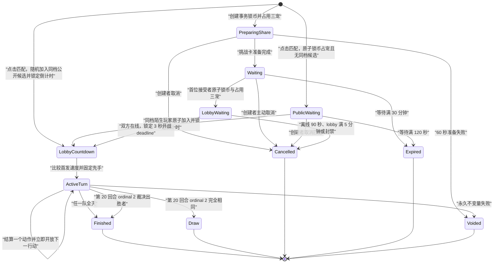
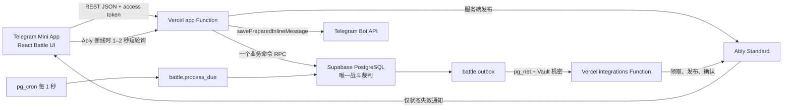

# PokePets 宠物藏品 Battle 功能开发方案

> 文档状态：已完成产品裁决后的唯一开发方案
>
> 项目基线：`main`，`992969d97d95a424c216c5567fd9f0f541999dcf`，2026-08-04
>
> 适用范围：当前 Telegram Mini App、真实开发环境与未来独立生产环境
>
> 输入依据：用户在本次对话中的最新裁决、[Battle功能方向说明.md](Battle功能方向说明.md)、当前仓库代码与正式契约

## 1. 最终结论

Battle 进入现有底部导航的“游戏”页，采用 React + TypeScript 渲染战斗界面，沿用 210 张正式藏品图片；Vercel REST API 负责身份、契约和 Telegram/Ably 外部服务编排；Supabase PostgreSQL RPC 是好友邀请、同档公开随机匹配、房间、资产、库存、出招、随机命中、回合结算和最终结算的唯一裁判；Ably Standard 只发送状态失效通知；Supabase `pg_cron` 每秒推进到期房间和超时动作；Ably 不可用时由短轮询恢复权威状态。

浏览器不运行战斗模拟器，不计算伤害，不生成命中结果，不决定行动顺序，不提交金额、属性、技能数值或结算结果。客户端只提交房间档位、按顺序排列的三个模板 ID、动作种类、回合号、行动序号、技能位置、换宠目标和幂等键。

Battle 一次性完整上线，不发布只有界面、只有房间、只有人机模拟或没有资产闭环的中间版本。

## 2. 功能范围

### 2.1 包含

- 玩家使用自己真实拥有且当前可用的藏品组建三宠队伍。
- 创建固定 K-coin 档位的持卡挑战房。
- 通过 Telegram 原生分享把挑战卡发送到用户私聊、好友或群组。
- 挑战卡被转发后继续有效，第一个原子接受成功的正常账号成为对手。
- 固定首发速度先手、单行动者轮流操作、主动换宠、倒下换宠反击、超时托管、断线托管和 20 个完整回合裁决。
- K-coin 锁定、获胜结算、平台手续费、平局退款和异常退款。
- Battle 占用藏品与出售、分解、进化、远征、Mint 的统一库存互斥。
- 永久私有审计包与不向用户开放的精简对战摘要。

### 2.2 明确不包含

- 捕捉、地图掉落、免费战斗宠物、宠物升级、培养、装备或天赋。
- PVE、人机对战、群组匹配池、公开房间列表或公开 room 读取 API。
- 观战、认输、重赛、排行榜、赛季、段位、战斗任务和额外奖励。
- 被动技能、异常状态、能力变化、治疗、护盾、能量、次数、冷却、暴击和随机伤害浮动。
- 用户历史页、逐回合回放、审计查询接口。
- Pokémon、PokeAPI 或开源项目中的角色、数值、图片、音频、数据和战斗代码。

Battle 的唯一经济结果是双方等额入场费形成的奖池、胜者结算、平台手续费或平局退款。Battle 不推进现有每日任务、有效充值、邀请奖励或 VIP 手续费返还。

## 3. 当前项目接入事实

| 当前事实                                                                    | Battle 接入结论                                                                                           |
| --------------------------------------------------------------------------- | --------------------------------------------------------------------------------------------------------- |
| `apps/web/src/pages/game/GamePage.tsx` 已组合现有 Battle 领域               | 本次在原“游戏”页内替换战斗状态机与表现队列，不新增底部导航                                                |
| Web 为 React + Vite + TypeScript，主页面在会话内保持挂载                    | Battle 页面继续保持挂载；邀请 waiting 仅创建者发送展示心跳，双人 lobby 双方发送 presence 心跳，开战后停止 |
| 仓库没有 Phaser 依赖，藏品只有正式 WebP 图片而非逐帧精灵                    | Battle 使用 React、CSS 与 Web Animations API，不引入 Phaser                                               |
| `catalog.templates` 已有 210 个固定模板、链、阶段、稀有度、战斗力和图片路径 | Battle 新建独立、版本化的战斗配置，不改写目录身份字段；`combat_power` 只保留综合展示                      |
| `inventory.reservations` 已统一扣减可用数量                                 | reservation 新增 `battle` 类型，每名参战者的三个模板各占用 1 份                                           |
| `economy.balances` 已有 `available` 与 `locked`                             | 入场费在创建或接受时从 available 转入 locked，终局再退款或结算                                            |
| 写操作已经采用 `operations.begin_command` 和单事务 RPC                      | Battle 的创建、取消、接受以及三种战斗动作沿用同一幂等模型                                                 |
| 身份入口已区分 referral 与 Battle bearer token                              | 本次保持入口和分享链不变，Battle 入口继续不触发推荐关系绑定                                               |
| 浏览器不直连 Supabase，Functions 使用 `service_role` 调用 `api` RPC         | Battle 保持相同可信边界，Ably 也不获得数据库裁决能力                                                      |
| 初始 migration 尚未作为正式生产历史发布                                     | 实现时直接修改声明式 Schema 和三份原始 migration，并从空库重建真实开发数据库                              |

## 4. 冻结产品规则

### 4.1 队伍与藏品

1. 每队固定三个不同 `template_id`。
2. 同一进化链的不同阶段属于不同模板，允许同时上阵。
3. 组队时固定三个槽位顺序，第 1 位自动首发。
4. 好友房创建者创建房间、接受者接受，以及公开匹配玩家点击匹配时，都在各自单一事务内立即占用所选三个模板各 1 份并锁定入场费。
5. 等待与战斗期间，被占用的具体数量不能出售、分解、进化、远征或 Mint；同模板仍有额外可用数量时，额外数量不受影响。
6. 取消、过期、平局、正常结算或系统异常作废时释放全部 Battle reservation。
7. 每个账号最多存在一条 `preparing_share`、`waiting`、`lobby` 或 `active` 参与记录。

### 4.2 挑战档位与结算

| 每人入场费 | 奖池 | 胜者到账 | 平台手续费 | 胜者净变化 | 败者净变化 |
| ---------: | ---: | -------: | ---------: | ---------: | ---------: |
|  20 K-coin |   40 |       36 |          4 |        +16 |        -20 |
| 100 K-coin |  200 |      180 |         20 |        +80 |       -100 |
| 500 K-coin | 1000 |      900 |        100 |       +400 |       -500 |

- 创建者在创建房间的数据库事务内锁定入场费。
- 接受者在接受房间的数据库事务内锁定相同入场费。
- 胜者获得奖池的 90%，平台取得奖池的 10%。
- 平局时双方各自原额退款，平台手续费为 0。
- 系统永久性不变量错误导致房间作废时双方原额退款，平台手续费为 0。
- K-coin 不能提现，Battle 不提供玩家间自由转账。

### 4.3 房间、在线、分享与公开匹配

1. 分享卡准备完成后的等待有效期固定为 30 分钟。
2. 创建者在对手成功接受前允许取消。
3. 创建者在线状态只作展示；创建者离线不阻止队伍选择或接受，也不触发 90 秒取消。邀请页固定显示“离线 · 仍可接受”。
4. 有效邀请直接进入三槽队伍选择；创建者本人入口返回严格 `self` 状态，服务端仍拒绝自我接受。
5. 挑战卡允许分享到 Telegram 用户私聊和群组，不允许发到 Bot 会话或频道。
6. 挑战卡允许转发，不校验原分享群、不校验群成员身份。
7. 除创建者本人外，任何正常账号拿到有效卡片都允许尝试接受；只有第一个数据库事务成功者成为对手。
8. 首位接受事务锁定接受者三宠、reservation 和 stake，生成私有种子与 commitment，并进入双人 lobby；不得在接受事务创建 turn 1。
9. lobby 总时限固定 5 分钟。双方每 5 秒心跳，最近服务端心跳不超过 10 秒判定在线，连续离线恢复窗口固定 90 秒。
10. waiting 创建者与 lobby 双方的每次可见/激活 `/game` 时段各使用一个独立 UUID presence lease；命令携带数据库快照的下一 lifecycle version 与该 lease 内严格递增的 command sequence。
11. 页面隐藏、Telegram deactivated、`pagehide` 或离开 `/game` 立即结束当前 lease、中止在途 heartbeat 并尽力 offline；恢复必须先读取权威快照并取得数据库认可的新 lease。新 lease 接管后旧 heartbeat/offline 永久无副作用，安全不依赖 abort 或 offline 必达。
12. 创建者接受前已经离线时，其 90 秒窗口从接受事务成功时重新开始；接受者在接受事务成功时视为在线。
13. 在 `lobby_waiting` 中，任一方连续离线 90 秒、lobby 满 5 分钟或任一参与者被封禁时终结房间；双方原额退款、六个 reservation 释放、手续费为 0。双方同时在线且完整 3 秒能够落在 5 分钟边界内时，数据库在同一 room lock 内原子写入固定 `lobby_start_deadline` 并进入 `lobby_countdown`。
14. `lobby_countdown` 是不可撤销的参战锁定。合法 offline、新 lease、页面隐藏、离开 `/game`、刷新、重认证、旧请求、重复请求和乱序请求仍可更新或回正 presence，但均不得把状态改回等待，不得清空、延后或重置 `lobby_start_deadline`，也不得触发取消、退款或 reservation 释放。
15. 锁定 deadline 到期后不再复核双方在线；数据库在同一 room lock 内 exactly-once 创建 round 1、按首发速度固定先手、写唯一 `battle_started` event/outbox 并进入 `active_turn`。重复 tick、请求重放和服务恢复只能读取同一状态；永久不变量失败仍进入既有幂等安全作废事务。
16. 接受后不提供玩家取消、分享或重新选队。接受失败或竞争失败的玩家不扣款、不占用藏品。

17. 公开匹配只使用 `public_match` 房间，好友分享只使用 `friend_invite` 房间；两类房间在等待阶段双向隔离。
18. 公开匹配池按 `ruleset_id + entry_tier_id` 完全隔离，20、100、500 三档禁止跨档。每档使用独立事务 advisory lock 串行“查找或创建”。
19. `api.battle_matchmake` 先以同一 operation 原子校验并冻结当前玩家的 K-coin 与三宠；同档匹配请求由档位事务锁串行，同档存在公开 waiting 候选时通过 `ORDER BY random() LIMIT 1 FOR UPDATE` 等待并锁定一个后调用统一对手加入函数，不存在候选时创建公开 waiting 房。
20. 公开 waiting 从创建事务提交起固定 120 秒；创建者可主动取消。取消或超时调用统一未开战终结函数，原额退款、释放三宠、零 settlement。
21. 点击“随机匹配”即代表同意对战。匹配成功事务固定直接写入不可撤销的 `lobby_countdown` 与 3 秒 deadline，不以创建者当前 presence 作为前置条件；双方不再确认、取消、分享或重新选队，页面离开或离线也不能退出本场。
22. 公开房的 `invite_token_hash`、`prepare_deadline` 与 prepared share 固定为空；好友房不进入匹配候选索引，公开房不进入 invite preview/accept 路径。

### 4.4 挑战卡与接受页隐私

挑战卡和接受页只公开以下内容：

- 创建者的 Telegram 展示名和头像。
- 固定入场费。
- 创建者三只宠物的稀有度组合，按 `普通 → 稀有 → 史诗 → 传说 → 神话` 排序并省略数量为 0 的项，例如 `史诗 ×2、传说 ×1`。
- 30 分钟有效提示、当前剩余时间和创建者在线状态。

挑战卡和接受页不得返回或嵌入以下信息：

- 三个 `template_id`、名称、图片或进化链。
- 属性、生命、攻击、防御、速度。
- 模板实际拥有的技能、技能威力和命中率。
- `combat_power` 或由其推导的队伍总战斗力。

稀有度组合由服务端从已锁定阵容快照生成，前端不能提交。双方不强制同稀有度、同阶段、同档强度或同属性。

### 4.5 开战后的信息

- 双方接受完成前，创建者看不到接受者阵容，接受者只看到创建者的稀有度组合。
- 接受事务完成后的 lobby 只显示固定红/蓝方形 WebP 与双方 presence，不使用真实头像或阵容图片；数据库正式创建第 1 个完整回合后，双方才看到对方三个模板的名称、图片、稀有度、阶段、存活状态和当前出战位置。
- 对手生命只显示百分比血条，不显示最大生命和精确剩余生命；己方显示精确当前/最大生命、四维、属性和实际拥有的技能。
- 对手属性、固定四维、技能列表和 `combat_power` 不直接展示。对手已经使用的技能只随当前动作事件播放，不形成可翻阅的历史回放。
- 动作事件不返回私有种子、roll、公式中间值、operation ID 或对手精确生命。

### 4.6 固定先手与完整回合

1. 开战时只比较双方第 1 槽首发宠物的速度；速度较高者成为整场固定先手，速度相同固定创建者先手。
2. `first_actor_side` 在开战事务写入后永久不变；主动换宠、倒下换宠和后续宠物速度都不重新计算先手。
3. 一个完整回合固定包含两个行动：固定先手执行 `action_ordinal = 1`，固定后手执行 `action_ordinal = 2`。
4. 每个行动者轮到自己时独立获得完整 15 秒，非行动者没有提交入口。
5. 服务端结算当前动作后立即开放下一行动者的按钮和新 15 秒 deadline，不等待任何客户端动画。
6. 行动者可以使用当前宠物技能，或主动换入一只存活替补；主动换宠消耗本次行动且不会攻击。
7. 行动超时且当前宠物仍存活时，服务器固定使用当前宠物技能位置 1；不存在额外“普通攻击”技能。
8. 每次超时都执行托管动作，不累计超时判负；断线玩家可由服务器完成整场战斗。
9. 玩家动作与 deadline 竞争统一先锁 room；`now() < phase_deadline` 接受玩家动作，等于或超过 deadline 时只接受服务器托管结果。

### 4.7 倒下后的换宠反击

- 当前行动者没有 active 宠物但队伍仍有存活宠物时，唯一合法模式为 `replace_attack`。
- 玩家在同一个 15 秒窗口先选择一只存活替补，再直接选择该宠物实际拥有的技能；一次提交同时携带 `team_slot` 与 `skill_position`，不增加确认步骤。
- 点选替补后，本人客户端立即把该槽位作为战场本地预览 active，显示正式大图、名称、生命和槽位高亮，再展示其真实技能；该预览不写 authority、不发送请求且不向对手可见。
- 数据库在一个事务内先换入已验证宠物，再用所选技能攻击、扣除生命、处理击倒并转换行动权。
- `replace_attack` 仍只占当前行动者的一次行动；不存在独立换宠阶段或额外回合。
- 超时时按开战前队伍槽位顺序选择第一只仍存活的宠物，并固定使用该宠物技能位置 1。
- 被击倒一方没有任何存活宠物时立即终局，不创建新的 deadline，也不开放反击入口。

### 4.8 终局

每次动作结算后立即检查双方全队存活状态：

1. 对方已无存活宠物时，当前行动者立即获胜。
2. 对方仍有存活宠物但没有 active 宠物时，其下一次行动进入 `replace_attack`。
3. `action_ordinal = 1` 完成后切换到固定后手的 ordinal 2。
4. ordinal 2 完成后才算一个完整回合；未到 20 回合时增加回合号并重新从固定先手开始。
5. 第 20 回合 ordinal 2 完成后，先比较存活宠物数量，再比较三只宠物精确剩余生命百分比之和；仍相同则平局。

剩余生命百分比使用 PostgreSQL `numeric` 比较 `Σ(current_hp / max_hp)`，不按页面显示值取整。终局动作事务立即完成 stake、K-coin、reservation、ledger、summary、settlement、审计和 outbox；数据库结算与资产释放不等待动画。客户端收到终局快照后立即刷新资产与库存，但结果覆盖层必须等待当前客户端动作队列清空。

开战后不提供认输、取消或退出结算。退出和断线只停止玩家输入，系统继续按 deadline 托管。

## 5. Battle v1 固定平衡数据

### 5.1 版本与快照

正式规则版本固定为 `battle-v1`。配置构建产物同时生成 SHA-256 checksum，包含：

- 五属性克制表。
- 五档稀有度强度系数。
- 14 个基础角色档案。
- 10 个技能数值槽位。
- 14 组四技能候选池及其 power 成长顺序。
- 70 条进化链的属性和角色档案映射。
- 210 个模板的最终生命、攻击、防御、速度、属性与按阶段固定的 2/3/4 技能配置。
- 房间时限、独立行动时限、每回合两个行动、托管技能位置、固定先手规则、最大完整回合数和结算档位。

房间创建时固定 `ruleset_id` 与 checksum，并把三只宠物的实际配置复制为不可变快照。配置发布新版本不会改变已经创建的等待房、进行中的战斗或永久审计结果。

### 5.2 五属性与克制

唯一属性循环为：

```text
火焰 → 草系 → 土系 → 雷电 → 水系 → 火焰
```

| 关系                   | 倍率 |
| ---------------------- | ---: |
| 攻击属性克制防守属性   | 1.50 |
| 攻击属性被防守属性克制 | 0.75 |
| 同属性或不相邻属性     | 1.00 |

每只宠物只有一个属性，同一进化链三个阶段保持同一属性；候选池与模板实际拥有的技能全部与宠物属性一致。不存在双属性、无属性或特殊属性。

### 5.3 稀有度强度

| 稀有度 | 系数 basis points | 目标平衡预算 |
| ------ | ----------------: | -----------: |
| 普通   |             10000 |          400 |
| 稀有   |             11500 |          460 |
| 史诗   |             13200 |          528 |
| 传说   |             15200 |          608 |
| 神话   |             17500 |          700 |

平衡预算定义为：

```text
预算 = 生命 / 3 + 攻击 + 防御 + 速度
```

同稀有度的所有档案预算完全相同。高稀有度拥有更高预算，属于明确的真实战斗优势。`combat_power`、链类型和阶段编号不再作为隐藏倍率参与 Battle 计算；进化带来的实际强化由新模板对应的更高稀有度四维和按阶段固定增加的技能共同体现。

### 5.4 14 个基础角色档案

| 档案 | 定位名 | 基础生命 | 基础攻击 | 基础防御 | 基础速度 | 四技能候选池 |
| ---: | ------ | -------: | -------: | -------: | -------: | ------------ |
|    1 | 均衡   |      300 |      100 |      100 |      100 | L01          |
|    2 | 强攻   |      285 |      115 |       90 |      100 | L02          |
|    3 | 疾攻   |      270 |      110 |       85 |      115 | L03          |
|    4 | 铁壁   |      330 |       85 |      115 |       90 | L04          |
|    5 | 守势   |      315 |       95 |      110 |       90 | L05          |
|    6 | 前锋   |      300 |      110 |      100 |       90 | L06          |
|    7 | 决斗   |      285 |      105 |       95 |      105 | L07          |
|    8 | 迅捷   |      270 |       95 |       90 |      125 | L08          |
|    9 | 粉碎   |      300 |      120 |       85 |       95 | L09          |
|   10 | 厚甲   |      345 |       85 |      105 |       95 | L10          |
|   11 | 猎手   |      285 |      110 |       85 |      110 | L11          |
|   12 | 哨卫   |      300 |       90 |      115 |       95 | L12          |
|   13 | 斗士   |      315 |      110 |       90 |       95 | L13          |
|   14 | 灵动   |      300 |       95 |       95 |      110 | L14          |

每个基础档案的预算均为 400。

### 5.5 进化后的精确整数四维

对模板稀有度系数 `M` 和基础档案四维 `H0/A0/D0/S0`，使用以下唯一算法：

```text
攻击 A = floor((A0 × M + 5000) / 10000)
防御 D = floor((D0 × M + 5000) / 10000)
速度 S = floor((S0 × M + 5000) / 10000)
三倍目标预算 B3 = 1200 × M / 10000
生命 H = B3 - 3 × (A + D + S)
```

该算法同时满足：

- 所有实际数值均为正整数。
- 同稀有度所有档案严格满足相同目标预算。
- 同一档案从普通到稀有、史诗、传说、神话时，生命、攻击、防御、速度四项都严格上升。
- 同一进化链保持同一角色定位和同一四技能候选池；每次进化的攻击力和其余三维都真实增强，并按阶段增加一个固定技能。

产品数据构建门禁必须逐行验证上述四项性质，并把 210 行最终值写入版本化种子数据；运行时不临时推导或接受客户端数值。

### 5.6 70 条链的属性与档案映射

表内每一格代表一条进化链；该链三个阶段共用本行档案和本列属性。档案 1–8 对应普通链，9–12 对应高级链，13–14 对应顶级链。

| 档案 | 火焰        | 草系        | 土系        | 雷电        | 水系        |
| ---: | ----------- | ----------- | ----------- | ----------- | ----------- |
|    1 | CHAIN-N-001 | CHAIN-N-003 | CHAIN-N-004 | CHAIN-N-005 | CHAIN-N-002 |
|    2 | CHAIN-N-015 | CHAIN-N-010 | CHAIN-N-008 | CHAIN-N-006 | CHAIN-N-009 |
|    3 | CHAIN-N-017 | CHAIN-N-012 | CHAIN-N-020 | CHAIN-N-007 | CHAIN-N-011 |
|    4 | CHAIN-N-019 | CHAIN-N-016 | CHAIN-N-023 | CHAIN-N-013 | CHAIN-N-014 |
|    5 | CHAIN-N-022 | CHAIN-N-021 | CHAIN-N-027 | CHAIN-N-018 | CHAIN-N-025 |
|    6 | CHAIN-N-028 | CHAIN-N-024 | CHAIN-N-030 | CHAIN-N-026 | CHAIN-N-029 |
|    7 | CHAIN-N-037 | CHAIN-N-031 | CHAIN-N-035 | CHAIN-N-034 | CHAIN-N-032 |
|    8 | CHAIN-N-038 | CHAIN-N-033 | CHAIN-N-039 | CHAIN-N-040 | CHAIN-N-036 |
|    9 | CHAIN-A-005 | CHAIN-A-006 | CHAIN-A-004 | CHAIN-A-002 | CHAIN-A-001 |
|   10 | CHAIN-A-008 | CHAIN-A-013 | CHAIN-A-007 | CHAIN-A-009 | CHAIN-A-003 |
|   11 | CHAIN-A-014 | CHAIN-A-015 | CHAIN-A-010 | CHAIN-A-012 | CHAIN-A-011 |
|   12 | CHAIN-A-016 | CHAIN-A-017 | CHAIN-A-020 | CHAIN-A-018 | CHAIN-A-019 |
|   13 | CHAIN-T-003 | CHAIN-T-007 | CHAIN-T-005 | CHAIN-T-001 | CHAIN-T-002 |
|   14 | CHAIN-T-006 | CHAIN-T-010 | CHAIN-T-009 | CHAIN-T-008 | CHAIN-T-004 |

因此每个属性恰好拥有 14 条链、42 个模板和同一套数值生态，只替换模板身份、属性、技能名称与元素视觉。

### 5.7 10 个技能数值槽位

全部技能都是同级主动直接伤害技能，只由威力与命中率形成数值差异；技能不改变行动顺序，也没有基础/战术/强力分类、被动、冷却、次数、能量、异常状态或能力变化。

| 数值槽位 | 威力 | 命中率 basis points | 页面命中率 | 结算视觉轨迹 |
| -------: | ---: | ------------------: | ---------: | ------------ |
|      S01 |   45 |               10000 |       100% | 单段突进     |
|      S02 |   60 |                9000 |        90% | 双段疾行     |
|      S03 |   80 |                7000 |        70% | 折线闪击     |
|      S04 |   55 |               10000 |       100% | 球形投射     |
|      S05 |   70 |                9500 |        95% | 环形冲击     |
|      S06 |   85 |                8500 |        85% | 垂直重击     |
|      S07 |  105 |                7000 |        70% | 径向爆发     |
|      S08 |   75 |               10000 |       100% | 横向轰流     |
|      S09 |   95 |                9000 |        90% | 全场风暴     |
|      S10 |  125 |                7000 |        70% | 天降聚合     |

五个属性使用完全相同的数值槽位。每个技能拥有独立 `effect_key = <element>-<01..10>`，共 50 个效果键；十条轨迹与五种属性粒子的组合只改变表现，不参与行动顺序或伤害裁决。

### 5.8 五属性技能名称

| 槽位 | 火焰     | 草系       | 土系     | 雷电     | 水系     |
| ---: | -------- | ---------- | -------- | -------- | -------- |
|  S01 | 火花突袭 | 飞叶突袭   | 砂砾突袭 | 电光突袭 | 水流突袭 |
|  S02 | 炽焰快攻 | 藤刺快攻   | 岩针快攻 | 雷针快攻 | 水刃快攻 |
|  S03 | 爆炎闪击 | 荆棘闪击   | 地裂闪击 | 霆光闪击 | 潮汐闪击 |
|  S04 | 灼热火球 | 种子弹     | 泥岩弹   | 电弧弹   | 泡沫弹   |
|  S05 | 烈焰冲击 | 叶刃冲击   | 岩崩冲击 | 雷鸣冲击 | 激流冲击 |
|  S06 | 熔岩重击 | 巨藤重击   | 山岳重击 | 霹雳重击 | 巨浪重击 |
|  S07 | 日炎爆破 | 森罗爆破   | 地脉爆破 | 雷暴爆破 | 海啸爆破 |
|  S08 | 焰流轰击 | 古木轰击   | 巨岩轰击 | 磁极轰击 | 深潮轰击 |
|  S09 | 炼狱坠火 | 万叶风暴   | 大地震荡 | 九霄天雷 | 沧海怒涛 |
|  S10 | 终焉天火 | 世界树坠击 | 天陨坠岩 | 万雷天劫 | 天河坠潮 |

### 5.9 14 组固定四技能候选池

| 组合 | 候选槽位原始顺序   |
| ---- | ------------------ |
| L01  | S01、S04、S06、S09 |
| L02  | S01、S05、S07、S08 |
| L03  | S01、S05、S06、S10 |
| L04  | S02、S04、S06、S08 |
| L05  | S02、S04、S07、S09 |
| L06  | S02、S05、S07、S08 |
| L07  | S03、S04、S06、S09 |
| L08  | S03、S05、S07、S08 |
| L09  | S03、S04、S07、S10 |
| L10  | S01、S04、S07、S10 |
| L11  | S01、S06、S08、S10 |
| L12  | S02、S04、S06、S10 |
| L13  | S02、S05、S08、S09 |
| L14  | S03、S04、S08、S10 |

生成器按 `(power 升序, 候选槽位原始位置升序)` 把四个候选技能整理为唯一成长顺序。模板实际技能数固定为 `stage + 1`：1 阶取前 2 个、2 阶取前 3 个、3 阶取全部 4 个；写入模板、房间快照和 API 时位置连续为 `1..N`。同链阶段技能必须保持前缀继承。

玩家不能学习、替换、手动解锁或重排技能。未拥有技能不进入返回数组、DOM 或锁定占位。模板不保证拥有 100% 命中技能，生成器不得为命中率改变 power 顺序；L06、L13 的 1 阶模板允许只有 90%/95% 命中技能。

### 5.10 确定伤害公式

命中后的计算只读取攻击者实际攻击 `A`、防守者实际防御 `D`、技能威力 `P` 和属性倍率 `T_bps`：

```text
raw_damage =
  floor(
    2 × P × A × A × T_bps
    ÷ ((A + D) × 100 × 10000)
  )

single_hit_cap = max(1, floor(defender_max_hp × 80 / 100))
damage = min(single_hit_cap, max(1, raw_damage))
applied_damage = min(defender_current_hp, damage)
defender_current_hp = max(0, defender_current_hp - damage)
```

全部计算使用 PostgreSQL `bigint` 的固定运算顺序。单次命中伤害不超过防守宠物最大生命的 80%，因此满生命宠物不会被一招击倒；当前生命已经低于伤害时仍正常被击倒。公式没有等级、`combat_power`、阶段加成、同属性加成、暴击、随机区间、状态或客户端参数。

当双方四维按同一稀有度系数放大时，伤害和生命同步放大，镜像对局的击倒节奏保持稳定；高稀有度对低稀有度同时获得更高生命、攻击、防御和速度形成明确优势。

### 5.11 唯一随机结果

接受成功时数据库使用 `gen_random_bytes(32)` 生成房间私有种子，永不返回客户端。每个攻击行动的命中随机数为：

```text
digest = HMAC-SHA256(
  room_private_seed,
  battle_id | round_no | actor_side | action_ordinal | skill_id
)

roll = unsigned_first_32_bits(digest) mod 10000
hit = roll < accuracy_bps
```

- 同一行动重复恢复时得到完全相同的 roll。
- 行动处理先后顺序不会改变 roll。
- 100% 命中仍记录 roll 和阈值，便于审计。
- 审计事件永久保存 roll、阈值、命中结果、计算伤害和实际扣除生命。

## 6. 权威状态机



`LobbyWaiting` 与 `LobbyCountdown` 的回合号和行动序号固定为 0。锁定开战 deadline 到期后，数据库 exactly-once 创建第 1 个完整回合，比较双方首发速度，写入 `first_actor_side`、`active_actor_side`、`current_round_no = 1`、`current_action_ordinal = 1`，并进入唯一活动战斗状态 `active_turn`。

每次 `attack`、`switch` 或 `replace_attack` 都在单一事务结算并立即推进到下一行动。动作表现由 viewer-specific 事件流异步播放，不形成数据库阶段。终局同样在最后一个动作事务内立即完成经济结算；客户端结果层延后展示不改变数据库状态。

## 7. 数据库设计

### 7.1 固定配置表

新建内部 `battle` schema：

| 表                        | 唯一职责                                                 |
| ------------------------- | -------------------------------------------------------- |
| `battle.rulesets`         | 规则版本、checksum、固定时限、最大回合、手续费和启用状态 |
| `battle.entry_tiers`      | 20、100、500 三档及对应奖池、到账、手续费                |
| `battle.rarity_factors`   | 五档稀有度系数和目标预算                                 |
| `battle.type_matchups`    | 五属性唯一克制矩阵                                       |
| `battle.skill_slots`      | 十组威力、命中率和视觉轨迹                               |
| `battle.skills`           | 50 个属性技能名称与 `effect_key`                         |
| `battle.role_profiles`    | 14 个基础四维档案                                        |
| `battle.profile_loadouts` | 14 组按 power 排序后的四技能候选成长顺序                 |
| `battle.chain_configs`    | 70 条链的属性与角色档案                                  |
| `battle.template_configs` | 210 个模板的最终固定四维、属性和按阶段 2/3/4 技能配置    |

配置表一经激活不得原地修改。开发期调整 `battle-v1` 时重建产品数据；正式上线后的调整创建新规则版本。

### 7.2 运行表

| 表                           | 核心内容与约束                                                                                                                                                       |
| ---------------------------- | -------------------------------------------------------------------------------------------------------------------------------------------------------------------- |
| `battle.rooms`               | 创建者、规则快照、状态、`first_actor_side`、`active_actor_side`、`current_round_no`、`current_action_ordinal`、`phase_deadline`、`latest_action_sequence` 与私有种子 |
| `battle.prepared_shares`     | Telegram prepared message ID、准备状态、租约和重试                                                                                                                   |
| `battle.participants`        | 双方用户、参与状态、presence lifecycle、lease 与命令序号                                                                                                             |
| `battle.team_members`        | 槽位 1—3、不可变配置快照、当前/最大生命、存活与 active                                                                                                               |
| `battle.stakes`              | 每方锁定额、状态及锁定/退款/到账 ledger ID                                                                                                                           |
| `battle.turns`               | 每个完整回合一条开始快照 hash 与最终 resolution hash                                                                                                                 |
| `battle.actions`             | `(room_id, round_no, action_ordinal)` 唯一的 `attack/switch/replace_attack`，含 player/timeout 来源                                                                  |
| `battle.events`              | 只追加事件序列；`action_resolved` 保存 1—2 个有序表现动作、双方 HP 结果和私有审计输入                                                                                |
| `battle.settlements`         | 每房间唯一终局、胜者、奖池、手续费与 ledger ID                                                                                                                       |
| `battle.summaries`           | 双方各一条私有终局摘要                                                                                                                                               |
| `battle.outbox`              | Ably 失效通知、投递租约、重试和状态                                                                                                                                  |
| `battle.rate_limit_attempts` | 用户、动作、invite hash 与持久限流记录                                                                                                                               |

关键约束：

- room 的活动战斗状态只有 `active_turn`；其他活动状态只用于分享准备、等待与 lobby。
- 开战后 `first_actor_side` 非空且不再修改；`active_actor_side`、round、ordinal 与 deadline 必须构成唯一当前行动。
- `turns` 主键固定为 `(room_id, round_no)`；`actions` 唯一键固定为 `(room_id, round_no, action_ordinal)`。
- `actions.kind` 只允许 `attack`、`switch`、`replace_attack`，字段组合由数据库 check 约束。
- `events` 对 `(room_id, sequence)` 唯一；`latest_action_sequence` 只追踪最新 `action_resolved` 事件。
- `settlements` 对 `room_id` 唯一；审计表只追加并永久保留。
- 到期邀请、lobby、当前行动、participant presence 和待投递 outbox 都有部分索引。

### 7.3 库存

`inventory.reservations.kind` 增加 `battle`，`reference_id` 固定使用 `battle.participants.id`。创建和接受 RPC 对三个模板按 `template_id` 排序锁定 holding，再分别调用统一 reservation 逻辑。

库存读模型增加：

```text
total = available + listed + trading + minting + expedition + battling
```

`inventory.item_json` 返回 `battling`。市场、分解、进化、远征和 Mint 继续只读取 `inventory.available_quantity`，因此无需在前端互相调用领域逻辑也能阻止重复使用。

### 7.4 K-coin 锁定与账本

锁定、退款和结算都在对应 Battle RPC 的同一事务内完成。

| 动作                        | available | locked | ledger                                      |
| --------------------------- | --------: | -----: | ------------------------------------------- |
| 锁定入场费 `x`              |      `-x` |   `+x` | `battle_stake_lock`，amount `-x`            |
| 取消/过期/平局/作废退款 `x` |      `+x` |   `-x` | `battle_stake_refund`，amount `+x`          |
| 胜者结算                    |   `+1.8x` |   `-x` | `battle_win_payout`，amount `+1.8x`         |
| 败者结算                    |      不变 |   `-x` | 初始负向 lock ledger 已代表最终可用余额变化 |

`battle.stakes` 记录 locked 的去向；`battle.settlements` 记录败者 locked 被消费和平台手续费。Battle ledger 的 `(reason, reference)` 建立部分唯一索引，重复恢复不能重复退款或到账。

涉及双方余额的结算统一按用户 UUID 排序锁定 balance 行。房间行始终先于该房间的参与者、余额、reservation、行动和结算行锁定。

### 7.5 原子命令

| RPC                                                | 单事务结果                                                                                                                                        |
| -------------------------------------------------- | ------------------------------------------------------------------------------------------------------------------------------------------------- |
| `api.battle_prepare_room`                          | 验证账号、唯一参与、规则、档位、队伍、余额与数量；创建房间和创建者快照、占用三宠、锁定入场费                                                      |
| `api.battle_activate_share`                        | 保存 prepared message ID，开始 30 分钟等待并完成创建操作                                                                                          |
| `api.battle_abort_share`                           | 分享准备明确失败或 60 秒超时；退款、释放并终结创建操作                                                                                            |
| `api.battle_cancel_room`                           | 只允许创建者在接受成功前取消；退款、释放并终结                                                                                                    |
| `api.battle_matchmake`                             | 按规则版本与档位串行随机查找公开 waiting 房；原子加入，或创建 120 秒公开房并冻结当前玩家 K-coin 与三宠                                            |
| `battle.attach_opponent_and_start_lobby`           | 好友接受与公开匹配共用；原子锁定加入者资源、创建对手快照与私有种子并进入既有双人 lobby                                                            |
| `api.battle_accept_room`                           | 首位成功者锁币占宠，创建对手快照、私有种子及双人 lobby，不提前创建回合                                                                            |
| `api.battle_submit_action`                         | 重新验证当前行动方、round、ordinal、deadline、active 宠物、替补和技能归属；写入唯一动作，调用 `battle.resolve_active_action` 并立即返回新权威快照 |
| `api.battle_heartbeat` / `api.battle_mark_offline` | 裁决 waiting/lobby 的单调 lifecycle + lease + sequence；开战后不参与行动权                                                                        |
| `api.battle_process_due`                           | 推进邀请、lobby、开战 deadline 与唯一当前行动超时；有 active 时技能 1，无 active 时首个存活槽位 + 技能 1                                          |
| outbox RPC                                         | 领取、确认或重试通知，不改变战斗规则状态                                                                                                          |

`battle.resolve_active_action` 固定完成一个行动：

- `attack`：读取当前 active 与已验证技能并结算命中、伤害、HP、击倒。
- `switch`：调用原子切换函数，只换宠并结束行动。
- `replace_attack`：在同一事务先原子换入，再由该宠物执行已验证技能。
- 动作后立即判断全灭、第 20 回合或下一行动；终局时同事务调用 `battle.finalize_room` 完成全部经济与库存写入。

玩家请求和 tick 都先锁同一 room 行。deadline 前只有当前 `active_actor_side` 能提交匹配的 round/ordinal；deadline 到达后由持锁事务写入唯一 timeout action。若玩家请求在取得锁时已经过期，该事务先完成托管推进，再以 `BATTLE_STATE_CONFLICT` 结束玩家 operation，不能把托管随错误回滚。

`battle.advance_lobby` 在开战前复核双方 participant、stake/ledger、每方三个快照、六个 reservation、ruleset/checksum、tier、seed/commitment 和无既有回合/动作/终局；随后只比较两只首发速度并写入固定先手。永久不变量失败不猜测结果，统一进入安全作废事务。

### 7.6 永久审计

服务端永久保存双方用户与队伍顺序、规则 checksum、固定先手依据、每个 round/ordinal 的 deadline、动作来源、命中 roll、伤害、HP、换宠、击倒、终局比较、reservation、stake、settlement、ledger ID 和 canonical audit hash。

用户 DTO 只返回 viewer-specific 表现数据：本人精确 HP、对手生命百分比、当前事件的技能名/effect key/命中/克制/击倒和公开换入信息。用户接口不返回 seed、roll、公式中间值、operation ID 或永久审计包。

## 8. 服务端与实时架构



### 8.1 PostgreSQL 战斗引擎

战斗引擎全部位于 `battle` 内部函数：

- 输入只使用不可变队伍快照、room 当前行动字段和已锁定动作。
- 固定先手、命中、伤害、换宠、击倒、行动权转换、终局和资产结算全部由数据库裁决。
- `battle.switch_active_member` 固定先停用旧 active，再激活已验证的存活目标；普通换宠和换宠反击共用此函数。
- 每个已结算动作写一个 `action_resolved` 事件并推进 `latest_action_sequence`；事件和 outbox 与状态更新同事务。
- `battle.action_event_json` 在数据库按 viewer 裁剪精确/百分比 HP，Functions 不接触私有审计 payload。
- 永久性规则、快照、生命、active、账本或结算不变量错误统一安全作废、退款、释放并写 violation；不得继续猜测战斗结果。

### 8.2 每秒 deadline 推进

真实开发与生产 Supabase 安装 `pg_cron` 与 `pg_net`。唯一 cron job `battle-tick-v1` 每秒调用 `battle.process_due(limit => 100)`：

- advisory lock 阻止同一时刻重叠 tick。
- 到期 room 使用索引和 `FOR UPDATE SKIP LOCKED` 分批处理。
- `preparing_share` 的下一次外部尝试到期时，tick 只在存在待恢复任务时通过 `pg_net` 唤醒 `/api/integrations/battle-share`。
- 一次 tick 未处理完时下一秒继续。
- 服务恢复后按数据库 deadline 追赶，不依据浏览器计时器补算。
- 每次状态变化与 outbox 写入同一事务。
- 停用或重建前先 `cron.unschedule('battle-tick-v1')`，再在独立语句执行 `pg_reload_conf()`；保存原 `jobid` 连续两个调度周期没有新增 run 的证据后才允许删除 Battle schema，避免旧 scheduler 缓存继续执行已停用 job。
- 从空库重放时，baseline 只创建 Battle 函数和表；`product_data_v1` 在 active ruleset 及全部规则参数写入后才创建唯一 `battle-tick-v1`，禁止在规则数据尚未提交时启动 tick。
- 三条 migration 的提交事务完成后，数据库 owner 必须在独立语句执行一次 `pg_reload_conf()`，随后只以 `cron.job_run_details` 中同一 `jobid` 的至少两个连续自然周期作为恢复成功证据；手工调用 `battle.process_due` 不属于调度健康证据。
- `battle.tick_health()` 固定核对唯一 job、schedule、command、database、worker、scheduler 数量及最近 5 秒成功记录。五分钟 `monitor-invariants` 把配置错误、调度停滞写为 `BATTLE_TICK_UNHEALTHY`，把真实失败写为 `BATTLE_TICK_RUN_FAILED`；失败摘要和 SHA-256、jobid、runid、开始/结束时间进入现有私有 violation 运维链路。
- `cron.job_run_details` 中该 command 的成功与失败记录固定保留 7 天，由既有每日 `cleanup-idempotency` 最多清理 100000 条更早记录；不增加第二个 Supabase cron job，未关闭的失败 violation 不随运行记录清理。

当前真实开发 Supabase 在 2026-07-27 已列出 `pg_cron 1.6.4`、`pg_net 0.20.4`，Vault `0.3.1` 已安装；实现时仍通过从空库执行完整 migration 确认扩展和 job 真实可用。

### 8.3 Ably

前后端锁定 `ably@2.26.0`：

- 服务端使用 `ABLY_API_KEY` 发布。
- Web 通过 `/api/battle/realtime-token` 获取 5 分钟短期 token。
- token capability 只允许 subscribe 当前用户频道、当前参与房间频道，或当前 Battle 入口对应的邀请状态频道。
- 浏览器不能 publish、presence-enter 或管理频道。
- Ably 消息只包含 `event_id`、`room_id`、`state_version` 和 `event_kind`，不包含阵容、行动、命中、伤害、余额或结算。
- 客户端收到消息后用 REST 读取最新权威快照，并丢弃低于当前 `state_version` 的重复通知。
- Ably presence 不参与任何在线裁决；participant 的 REST 心跳与数据库时间字段是 waiting 展示和 lobby 双方 presence 的唯一依据。

### 8.4 outbox、游标与短轮询

- 每次状态变化都由数据库在同一事务写入 outbox 并调用 `pg_net`；HTTP 请求只在事务提交后异步唤醒受保护 integration。玩家 Function 在数据库 RPC 完成后立即返回权威结果，不领取或发布 outbox；`battle.process_due` 每秒重新唤醒到期或租约过期的待投递记录。
- Ably 只携带 `event_id/room_id/state_version/event_kind`，客户端收到后通过 REST 读取权威状态。
- `GET /api/battle/rooms/:room_id?after_action_sequence=N` 每次最多返回 16 个 viewer-specific 动作事件，并以 `has_more_action_events` 驱动继续补齐。
- 页面持续可见时始终使用最后已接收 cursor，因此 Ably 或网络中断期间的动作不会丢失；事件按 sequence 排队，不能覆盖或并行播放。
- 初次进入、刷新、重新认证或从隐藏恢复时，把 cursor 直接初始化为快照的 `latest_action_sequence`，不补播历史动作，并立即用最新权威快照回正表现状态。
- Ably 离线时 waiting/accept/lobby 每 2 秒、`active_turn` 每 1 秒轮询；本地 deadline 归零立即触发权威读取，在权威 deadline 尚未前进或该次读取失败时按同一 2 秒/1 秒节奏继续静默读取，直到权威状态前进或终结。当前会话已经持有未终局 room 时，bootstrap 的空 participation 只能触发该 room 权威读取，不能单独清空 room 或返回首页。
- 发布失败保留 outbox，按 1、2、5、10、30 秒后每 30 秒重试；重复通知由 event ID、state version 与动作 cursor 消除影响。

## 9. Telegram 挑战卡与入口

### 9.1 创建外部事务

创建房间是固定外部 saga：

1. Web 立即禁用创建按钮并显示“正在创建挑战”，但不提前显示扣款成功。
2. Vercel 以本次固定 `operation_id` 计算 `HMAC-SHA256(BATTLE_INVITE_SECRET, "battle-invite-v1|" + operation_id)`，取前 24 字节生成 32 位 base64url token；同一幂等操作在任何恢复请求中都得到同一 token。
3. `api.battle_prepare_room` 原子锁币、占用三宠，并只保存完整 `BTL_` token 的 SHA-256；原始 token 不进入数据库。
4. Vercel 使用创建者 Telegram user ID 调用 Bot API `savePreparedInlineMessage`。
5. Prepared inline message 使用文字卡片，不包含宠物图片或模板信息，固定内容为创建者、入场费、稀有度组合、30 分钟提示和“接受挑战”按钮。
6. 参数固定允许 user chats 与 group chats，禁止 bot chats 与 channel chats。
7. 按钮链接为 `https://t.me/<bot>/<mini_app>?startapp=BTL_<32位base64url>`。
8. 服务端恢复任务只读取 room 的 `create_operation_id`，并使用同一机密重新生成同一 token，不需要持久化 bearer token。
9. `api.battle_activate_share` 持久化 prepared message ID，并从该事务提交时间开始计算 30 分钟。
10. Web 收到完整成功结果后才启用 `Telegram.WebApp.shareMessage(prepared_message_id)`。

Telegram 明确返回失败时立即调用 `api.battle_abort_share`。响应未知时 integration 在 60 秒内重试；重复生成的 prepared message 都指向同一个 bearer invite，不会生成第二个房间或第二次锁币。60 秒仍未激活则自动退款、释放并返回 `BATTLE_SHARE_FAILED`。

原生分享弹窗被用户关闭或发送失败不会自动取消已经激活的等待房；创建者继续重试分享或主动取消房间。

本段的 60 秒只裁决 Prepared inline message 创建阶段：在 `api.battle_activate_share` 之前，服务端外部结果未知继续按原 `create_operation_id` 恢复，超时后安全作废、退款并释放。房间进入 `waiting` 后调用 `shareMessage` 属于另一条客户端平台反馈路径，不使用这 60 秒推断发送结果。

刷新、重认证或创建响应丢失后，Web 先从 identity participation 定位原 room，再调用既有 `GET /api/battle/rooms/:room_id`。`BattleRoomSnapshotDto.prepare_deadline` 只在当前 viewer 是创建者且 room 为 `preparing_share` 时返回时间，否则固定为 `null`；`prepared_message_id` 只在当前 viewer 是创建者、prepared share 已激活且 room 仍为 `waiting` 时返回，其他 viewer 或状态固定为 `null`。`prepared_message_id` 长度固定为 1—256 个字符。响应不返回原始 `BTL_` token、创建 operation 机密、Telegram user ID、Bot token 或 prepared payload。

### 9.2 Battle 入口参数

身份入口只接受两种互斥格式：

```text
推荐入口：TMA[A-F0-9]{20}
Battle 入口：BTL_[A-Za-z0-9_-]{32}
```

- API 在 Telegram `initData` 验证成功后先分类入口。
- 推荐入口沿用现有新用户推荐交接。
- Battle 入口不创建 referral candidate，不绑定邀请人，新老正常账号都直接完成登录。
- Function 只在内存中读取原始 Battle token，立即计算 SHA-256 后传给数据库；session 只保存 `entry_kind = battle` 和 token hash。
- Battle token 不进入日志、错误详情、分析事件或 URL 之外的客户端持久化。
- 无效、已取消、已接受或已过期 token 不阻止账号登录；Game 页显示真实不可用状态。
- `chat_type` 和 `chat_instance` 不参与授权。

### 9.3 Web Telegram 适配

更新 Web 类型和 wrapper，支持：

- `shareMessage(messageId, callback)`。
- `shareMessageSent`。
- `shareMessageFailed`。

客户端只做能力检测。缺少 `shareMessage` 时显示固定提示“当前 Telegram 版本不支持发送挑战卡，请更新 Telegram 后重试”，不降级为客户端拼接一张可能泄漏阵容的消息。

`waiting` 房间分享结果固定分类如下：

- `USER_DECLINED` 或 callback 明确返回未发送：用户关闭面板或取消分享，显示既定可重试反馈，不属于发送失败。
- `MESSAGE_SEND_FAILED` 或 Telegram 官方等价的明确失败事件：显示既定失败/重试反馈。该事件依赖真实平台故障，运行证据状态为 `PLATFORM_CONDITIONAL`；发布时以 Telegram 官方协议、代码路径与既有恢复证据验收，未来自然发生后追加脱敏运行证据。
- `shareMessageSent` 或成功 callback：发送成功，使用已有真实运行证据。
- Telegram 官方没有规定“分享调用超过固定 deadline 未回调即 unknown”。不得新增或推断 waiting 分享 no-callback `unknown`，该验收项固定为 `NOT_APPLICABLE_BY_PLATFORM_CONTRACT`。官方 `UNKNOWN_ERROR` 是已经到达的明确失败事件，不是 no-callback `unknown`。

上述分类只影响分享反馈证据口径，不改变房间状态、资产、错误码或 prepared-message 创建阶段的 60 秒恢复。

## 10. REST 与 OpenAPI

### 10.1 玩家接口

| 路由                                        | 用途                                        | 客户端允许提交                                                                                 |
| ------------------------------------------- | ------------------------------------------- | ---------------------------------------------------------------------------------------------- |
| `GET /api/battle/bootstrap`                 | 档位、规则摘要、当前活动房                  | 无                                                                                             |
| `GET /api/battle/team-options`              | 本人可用模板与本人战斗配置                  | 无                                                                                             |
| `GET /api/battle/invites/current`           | 当前 Battle 入口的脱敏预览                  | 无                                                                                             |
| `GET /api/battle/rooms/:room_id`            | 参与者专属权威快照和动作事件补齐            | `room_id`、可选 `after_action_sequence`                                                        |
| `POST /api/battle/rooms`                    | 创建房和 prepared share saga                | `tier`、有序三个 `template_id`、幂等键                                                         |
| `POST /api/battle/matchmaking`              | 随机加入同档公开房；无候选时建 120 秒公开房 | `tier`、有序三个 `template_id`、幂等键                                                         |
| `POST /api/battle/rooms/:room_id/cancel`    | 创建者取消未接受房间                        | `room_id`、幂等键                                                                              |
| `POST /api/battle/invites/current/accept`   | 接受当前 bearer invite                      | 有序三个 `template_id`、幂等键                                                                 |
| `POST /api/battle/rooms/:room_id/actions`   | 提交唯一当前行动                            | `round_no`、`action_ordinal`，以及严格 `attack`、`switch` 或 `replace_attack` 联合输入和幂等键 |
| `POST /api/battle/rooms/:room_id/heartbeat` | waiting 创建者或 lobby 参与者在线意图       | room 与单调 presence lifecycle 字段                                                            |
| `POST /api/battle/rooms/:room_id/offline`   | 当前 presence 生命周期离线意图              | room 与单调 presence lifecycle 字段                                                            |
| `POST /api/battle/realtime-token`           | 获取最小权限 Ably token                     | 不接受频道名                                                                                   |

动作严格联合固定为：

- `attack`: `room_id + round_no + action_ordinal + skill_position`。
- `switch`: `room_id + round_no + action_ordinal + team_slot`。
- `replace_attack`: `room_id + round_no + action_ordinal + team_slot + skill_position`。

服务器重新读取当前行动方、round、ordinal、deadline、active 宠物、替补、技能归属、规则和资产事实。客户端不提交行动权、速度、伤害、命中、HP 或终局。

### 10.2 内部接口

| 路由                                   | 网关         | 鉴权                                     |
| -------------------------------------- | ------------ | ---------------------------------------- |
| `POST /api/integrations/battle-share`  | integrations | `BATTLE_OUTBOX_SECRET` + 待处理任务 RPC  |
| `POST /api/integrations/battle-outbox` | integrations | `BATTLE_OUTBOX_SECRET` + outbox 领取租约 |

不存在 history、replay、audit、spectator、公开 room 读取 API 或公开房间列表；匹配只通过 `POST /api/battle/matchmaking` 完成。

### 10.3 稳定错误码

错误注册表覆盖规则、档位、队伍、唯一参与、分享、邀请、房间、参与者、阶段、动作、换宠目标、状态冲突、作废、余额、库存、限流和幂等。非当前行动者提交固定返回 `BATTLE_NOT_YOUR_TURN`，HTTP 409，refresh scope 为 `battle`；不存在“双方锁招”错误。

### 10.4 Viewer-specific 恢复字段

`BattleRoomSnapshotDto` 除 lobby、presence、队伍和终局字段外，固定包含：

- `round_no`、`action_ordinal`。
- `first_actor: self | opponent | null` 与 `active_actor: self | opponent | null`。
- `active_action_mode: normal | replace_attack`。
- `phase_deadline`、`latest_action_sequence`。
- `viewer_action_state: available | not_applicable`。
- `action_events` 与 `has_more_action_events`。

`BattleActionEventDto` 固定包含 sequence、event ID、state version、round、ordinal、actor、1—2 个有序表现动作、本人精确 HP 结果和对手百分比 HP 结果。`attack` 动作携带服务端已裁决 skill 的 `effect_key`；`switch` 动作携带公开换入信息。DTO 不返回 seed、roll、公式中间值、operation ID 或对手精确生命。

当未提供 `after_action_sequence` 时，`action_events` 固定为空，客户端把 `latest_action_sequence` 作为新游标；提供游标时最多返回后续 16 条，直到 `has_more_action_events = false`。heartbeat/offline 普通响应只应用 room；只有已确认退款或终局才刷新 Battle、资产与 inventory。

## 11. Web 页面与交互

### 11.1 页面状态

“游戏”页只渲染八种权威页面状态：Battle 首页、三槽队伍选择、挑战卡准备、等待、接受、双人 lobby、战斗、当场结果。Battle 首页按主功能文档第 21.3 节的唯一映射展示“选择战场”及三个横向档位卡片，战场名称和稀有度只属于界面展示元数据，不展示战场等级。稀有度宝石只渲染真实数量并统一使用项目橘色，不使用灰色宝石补足三枚；奖池与门票整行文字统一放大并使用项目橘色。这些展示元数据不进入 API 命令、匹配隔离、战斗配置或经济结算。三槽队伍选择固定提供“邀请好友”和“随机匹配”；同一 `waiting` 页面按 `room_mode` 分别渲染 30 分钟好友分享等待或 120 秒同档公开匹配等待。战斗页同时承载普通行动和倒下后的换宠反击，不存在独立换宠页面。

lobby countdown 继续使用全稳定视口 3 秒锁定页，明确显示“倒计时已锁定”“离开不会取消战斗”。进入战斗后，中部战场显示双方宠物、表现 HP、动作反馈和队列；底部操作区只由最新 authority snapshot 决定。当前行动者看到技能与主动换宠；非行动者只看到等待。`replace_attack` 模式先显示存活替补；本人选中后战场立即以本地预览显示该宠物及槽位高亮，再显示该宠物真实技能，点击技能即提交。对手只在服务端成功结算后消费权威换入结果。

### 11.2 前端先行与权威反馈

- 页面维护 `authorityRoom` 与 `presentationState` 两层状态。authority 一到立即更新按钮、合法选项、倒计时、资产恢复和终局事实；presentation 只按动作事件队列更新宠物、HP 和反馈。
- `replace_attack` 的选宠只在本人 `presentationState` 上覆盖当前显示宠物，不改变 `authorityRoom`；重新选宠、行动身份推进或页面恢复会撤销该预览并按权威快照回正。
- 点击本人攻击时先把 `(room_id, round_no, action_ordinal)` 本地施法加入队列，再调用 API；服务端返回前只允许施法、移动和弹道。
- 成功的行动响应已经是完整 viewer-specific 权威 room snapshot；Web 立即写入 `battle.room` 查询缓存并更新 authority，不再失效整个 `battle` scope。动作错误、响应丢失、Ably 通知、deadline 到达、重新可见和终局仍按各自恢复链读取数据库事实。
- 命中、未命中、受击、伤害、HP、击倒和终局反馈只能由 `BattleActionEventDto` 触发。请求拒绝时取消未完成的本地结果并按权威快照静默回正，不显示服务器错误浮层。
- 本人本地动作与同 tuple 的服务端事件合并，禁止重复播放；对手动作从服务端事件开始完整播放。
- 新动作始终排到旧动作之后。服务端已推进时，下一玩家可立即操作；动画层固定 `pointer-events: none`，不得阻止按钮。
- reduced-motion 仍按 sequence 逐个应用结果，只跳过运动过程。
- 终局快照到达后立即刷新资产与 inventory；结果层必须等待当前客户端队列清空。

### 11.3 战斗布局与恢复

- 战场使用正式 `/assets/battle/ui/ruby-arena-field.webp`，对手状态左上、对手宠物右上、己方宠物左下、己方状态右下。
- 对手只显示百分比 HP；己方显示精确 HP。技能卡只显示名称、威力和命中率。
- 主动换宠打开存活替补选择，提交后消耗行动且不攻击。
- 15 秒计时使用最新 `phase_deadline` 与 `server_time` 校准；本地归零只触发权威读取。
- 页面持续可见时按 cursor 补齐网络/Ably 中断期间的动作。初次进入、刷新、重新认证或重新可见时直接把游标设为最新序号并展示当前快照，不补播历史动作。
- 页面不生成伤害或胜负预测，不提供历史、回放、认输、观战或再次挑战按钮。

### 11.4 K-coin 不足

创建、随机匹配或接受前端预检查到 K-coin 不足时立即打开现有充值弹窗：

- 创建场景保存档位与本人三个槽位。
- 随机匹配场景以 `battle_matchmaking` 保存档位与本人三个槽位。
- 接受场景保存当前 invite 上下文与本人三个槽位。
- 充值到账后返回原确认界面，重新读取房间仍为 waiting、未过期、未接受、本人资格、余额、库存和唯一参与状态；创建者在线只作展示。
- 充值成功绝不自动创建、自动进入匹配队列或自动接受。
- 返回时房间已取消、过期或被接受，则停止原动作，已充值 K-coin 保留。
- `battle_create` 与 `battle_matchmaking` 补差意图都由数据库再次拒绝已有 `preparing_share/waiting/lobby/active` 参与记录，统一返回 `BATTLE_ALREADY_PARTICIPATING`。

## 12. 安全、并发与恢复

### 12.1 权限与数据最小化

- 所有 Battle 玩家接口要求正常 Telegram 会话。
- invite preview 只能由当前 session 的 `battle` token hash 解析。
- participant snapshot 只能由房间参与者读取。
- 创建者本人不能接受自己的 token。
- viewer-specific DTO 的唯一清单是七种独立严格 Schema：`BattleChallengeCardDto`、`BattleInvitePreviewDto`、`BattleLobbyDto`、`BattleSelfTeamDto`、`BattleOpponentTeamDto`、`BattleActionEventDto`、`BattleRoomSnapshotDto`；API 不允许先返回完整对象再让 CSS 隐藏。
- `battle` schema 不加入 Supabase Exposed schemas。
- `anon` 与 `authenticated` 无表权限和函数执行权限；`service_role` 只执行显式 `api` RPC。
- Ably token 由服务端决定频道，客户端不能请求任意频道名。
- `BATTLE_OUTBOX_SECRET` 只存在 Vercel Secret 与 Supabase Vault。

### 12.2 持久限流

认证后 Battle 请求使用 PostgreSQL 用户级固定一分钟窗口：

| 动作                             | 每用户上限 |
| -------------------------------- | ---------: |
| 创建房                           |  3 次/分钟 |
| 读取 invite preview              | 60 次/分钟 |
| 尝试接受                         | 10 次/分钟 |
| 提交攻击、主动换宠与换宠反击合计 | 30 次/分钟 |
| 心跳                             | 30 次/分钟 |
| 获取 Ably token                  | 10 次/分钟 |

限流记录五分钟后清理，命中统一返回 `RATE_LIMITED`；限流不替代 room lock、唯一索引或业务校验。

### 12.3 并发裁决

| 竞争                       | 唯一结果                                                                      |
| -------------------------- | ----------------------------------------------------------------------------- |
| 多人同时接受               | 首个完成 room lock 与全部校验的事务成功，其余零扣款、零 reservation           |
| 接受与取消/到期            | room lock 与数据库时间确定唯一终态                                            |
| lobby 心跳与离线           | version + lease + sequence 单调裁决，旧、重复、乱序命令无副作用               |
| lobby 开战                 | 锁定 deadline 不可撤销；到期 exactly-once 固定首发速度先手                    |
| 非行动者提交               | 不写 action，返回 `BATTLE_NOT_YOUR_TURN`                                      |
| 玩家提交与 deadline        | room lock 后 `now < deadline` 才接受玩家动作；否则写唯一 timeout action       |
| 同 tuple 重复/不同请求并发 | operation hash、actions 唯一键与 room 当前字段保证只有一个结果                |
| 动作 1 与动作 2            | 由 `active_actor_side` 与 ordinal 严格串行，不存在两边同时锁定后结算          |
| 终局重复                   | room lock、settlement 唯一键、stake 状态和 ledger reference 保证 exactly-once |

### 12.4 恢复

- 创建、分享准备、接受与取消继续通过 operation、participation 与 room snapshot 恢复，不创建第二个房间或重复锁币。
- 动作响应丢失时查询原 operation 与带 cursor 的 room；若服务端已结算则取得该动作事件，若请求未生效则 authority 仍允许当前行动者重试。
- Ably 中断时自动按 active 状态 1 秒、其他活动页面 2 秒短轮询；重复、乱序通知不改变高版本状态。
- 页面隐藏、关闭、刷新或重新认证时停止动画和轮询，恢复后以最新 action sequence 为新游标并直接回正，不补播离线期间历史。
- pg_cron 短暂停止后按数据库 deadline 追赶；每次只托管当前行动者。
- 永久不变量错误进入统一安全作废，退款、释放并写 settlement、审计、outbox 与 violation。

### 12.5 当场结果展示

数据库在终局动作事务内一次性完成胜负或平局、stake、reservation、summary、settlement、ledger、审计与 outbox；动画和用户点击都不是结算条件。

Web 收到终局快照时先应用 authority 并立即执行 Battle、identity 与 inventory 恢复，使顶部资产和 `inventory.battling` 回正。若当前客户端仍有动作在队列中，继续渲染战斗页并按顺序播放；队列清空后才显示唯一结果层。刷新或重新进入没有待播队列时直接显示服务端已确定结果。

结果按钮只执行本地返回 Battle 首页，不发送确认 API。迟到的 room、Ably 或命令响应不能让同一结果重复出现。

## 13. 全项目文件改动清单

本次实现必须在同一个完整交付中同步以下文件；任何一层缺失都不允许开放 Battle 入口。

### 13.1 产品与架构文档

- `Battle功能方向说明.md`、本方案与 `docs/product/功能说明文档.md` 第 21 章统一固定先手、三类动作、八种页面状态和动画队列规则。
- `docs/architecture/README.md`、`domain-map.md`、`runtime.md`、`data-transactions.md`、`security-boundaries.md` 与 `operation-recovery.md` 同步权威边界、游标恢复和终局展示。
- ADR-003、ADR-004、ADR-014、ADR-015、ADR-016、ADR-020、ADR-022、ADR-025 与 ADR-026 同步契约、事务、调度、夹具、换宠和表现裁决。
- `docs/operations/acceptance.md` 固定真实环境验收矩阵；既有历史证据文件保持原始事实，不改写为新方案通过证明。

### 13.2 产品数据与数据库

- `tools/product_data/battle.py` 删除旧字段并生成新的规则参数、状态和 checksum；同步 `generated/battle/*` 与 product-data migration。
- `supabase/schemas/44_battle.sql` 重建单行动者状态机、动作事件、当前行动 RPC、deadline 托管和终局事务；`96_admin.sql` 同步空闲状态判断。
- 重新生成 `20260719104533_baseline.sql`，更新 `20260719104602_product_data_v1.sql` 与 `20260719104614_api_security.sql`，不追加修补 migration。
- `tools/db/check_schema.py` 与 `tools/architecture/check.py` 同时验证新结构并拒绝旧状态、字段、路由和生成物。

数据库实现不能追加一份“修复 Battle”migration；本地初始序列直接成为唯一正确定义。

### 13.3 API 契约与服务端

- 更新 Battle models、routes、公共错误表与生成的 OpenAPI 3.1，删除旧动作字段和独立换宠路由。
- `apps/api/src/domains/battle/routes.ts` 只映射严格联合动作和可选动作游标；分享、身份、环境与 outbox 接口保持现有边界。

### 13.4 Web

- `BattleView.tsx` 拆分 authority room、动作游标和表现队列输入，并使终局结果等待队列。
- `BattleArena.tsx`、`useBattleAnimation.ts` 与 `battle-core.css` 实现当前行动操作区、本地施法、权威反馈、顺序队列和无指针遮挡动画；`battleRuntimeLoader.ts`、`battleEffectPlayer.ts` 与 `battle-effects.css` 固定可重试的重表现动态边界。
- battle-realtime workflow 把 Ably SDK 隔离到 `battleRealtimeRuntime.ts`，token 与模块并行取得；`battleModulePreload.ts` 只从 realtime 动态 preload 提示删除已经执行的应用入口 JS，保留真实 ESM 依赖和其余提示；`battleRuntimeBudget.ts` 对 Battle 增量核心执行 JS/CSS 四项预算、禁止模块和动态 preload 入口为零门禁。原 `game-page.css` 只由实际组合转盘的任务页加载，不进入 `/game`。
- `useBattleCommand.ts`、`useBattleTerminalRefresh.ts` 与 battle-realtime workflow 同步新路由、游标补齐和恢复规则。
- `TeamSelector.tsx`、技能卡与 Battle 文案删除已撤销字段和阶段语义。

### 13.5 环境

本次不新增环境变量。发布时保留现有 `ABLY_API_KEY`、`BATTLE_OUTBOX_SECRET`、`BATTLE_INVITE_SECRET` 及 Supabase Vault callback 配置；真实开发与未来生产继续使用相同代码、OpenAPI、Battle checksum 和 migration，只使用各自 Bot、Ably key、callback URL、数据库项目与机密。

## 14. 一次性交付依赖顺序

第 1—6 步表示实现依赖，第 7—9 步是不可调整的维护窗口切换顺序；全程不构成分批上线：

1. 把本方案的产品规则同步进主功能文档、架构文档与 ADR。
2. 固化 Battle v1 生成器、210 模板配置、checksum 和契约模型。
3. 完成声明式 Schema、原始 migration、权限、RPC、deadline tick 和审计。
4. 完成 REST handlers、Telegram prepared share、Ably token/outbox 与错误映射。
5. 完成 Game 页、队伍选择、等待、接受、单行动者战斗、换宠反击、动画队列、结果和充值恢复。
6. 运行全部静态门禁。
7. 冻结 Git commit、三份 migration、OpenAPI、Catalog manifest 与 `battle-v1` checksum；关闭入口并清零活动 Battle，暂停 Vercel Production、Telegram webhook、Vercel Cron 与 `battle-tick-v1`，确认稳定域名返回 `503 DEPLOYMENT_PAUSED`。
8. 保持流量暂停，通过 `main` 推送让 Git Integration 自动部署完整提交并核对 `READY` 与 source SHA，再从该提交的三份原始 migration 清空重建真实开发数据库；新应用与旧数据库、旧应用与新数据库都不得承载流量。
9. 核对应用、数据库、OpenAPI、checksum、Vault、Ably 和调度属于同一发布单元，完成受控健康检查后依次恢复服务、调度与 Telegram 入口，并在真实 Telegram、真实 Vercel、真实 Supabase 和真实 Ably 上完成全部验收。

第 9 步全部通过前，Battle 不能被视为完成或允许进入正式生产。

## 15. 验收方案

项目不新增本地功能 test 代码。仓库内只运行现有静态门禁；业务验收全部在真实开发环境通过真实 API、真实数据库事务、真实 Telegram 客户端和真实 Ably 完成。

### 15.1 静态门禁

必须通过：

```text
pnpm product-data:build
pnpm product-data:check
pnpm contracts:openapi
pnpm validate:static
git diff --check
```

产品数据门禁额外断言：

- 70 链、210 模板、每属性 14 链/42 模板。
- 每链三个阶段属性和四技能候选池一致，实际技能严格满足 2/3/4 前缀继承。
- 五属性的档案、技能数值和稀有度分布完全镜像。
- 50 个技能名和 `effect_key` 唯一。
- 1/2/3 阶各 70 个模板，分别恰好拥有 2/3/4 个技能，有效技能位置总数为 630。
- 每模板技能位置连续、power 非递减、元素匹配且无重复；不校验每模板拥有 100% 命中技能。
- 所有同稀有度模板预算相同。
- 每个档案的五档四维逐档严格上升。
- checksum 与数据库种子、API ruleset 完全一致。

### 15.2 数据库重建

- 清空当前真实开发数据库和 migration history。
- 从三份原始 migration 连续重建。
- 确认 `battle` 不在 Exposed schemas。
- 确认 `anon/authenticated` 无访问权限。
- 确认 `pg_cron` 每秒 job、`pg_net` callback、Vault 和 outbox 真实工作。
- migration 提交后独立执行 `pg_reload_conf()`，确认 `(battle.tick_health()->>'healthy')::boolean = true`，并保存同一 jobid 至少两个连续自然成功周期的 runid、起止时间、状态和返回摘要。
- 确认 `monitor-invariants` 能静态覆盖 `BATTLE_TICK_UNHEALTHY` 与 `BATTLE_TICK_RUN_FAILED`，`cleanup-idempotency` 固定保留 7 天 tick 运行记录；不得主动制造失败样本。
- 确认本地声明式 Schema 与远端结构无差异。

### 15.3 真实 Telegram

至少使用创建者、两个普通接受者和一个并发竞争账号：

- 分享到用户私聊。
- 分享到普通群和超级群。
- 把原卡转发到另一个群后接受。
- Bot 不在目标群时仍能分享和接受。
- 卡片与接受页只出现稀有度组合，不出现模板或战斗配置。
- 创建者本人打开卡片不能接受。
- 两个账号同时接受时仅一人成功，失败者余额和库存完全不变。
- 邀请 waiting 中创建者在线、离线、显式离开和突然断网只改变展示且均可接受；30 分钟到期和创建者主动取消都立即退款、释放。
- 接受后双方进入 lobby；逐项验证 5 秒心跳、10 秒在线判定、89 秒重连、90 秒终结和 5 分钟到期仅在 `lobby_waiting` 生效；双方在线后原子锁定唯一 3 秒 deadline，offline、旧/新 lease、页面生命周期、重复 tick 与服务恢复均不能取消或重置，截止后只产生一个 round 1、固定先手、`battle_started` event/outbox 与状态迁移。
- 逐项交换同 lease heartbeat/offline 到达顺序，并覆盖隐藏时在途 heartbeat、offline 未送达、重新可见、离开再返回 `/game`、页面重载、重新认证、重复命令和旧 lease 重放；数据库认可新 lease 后，旧命令不得改变 presence、倒计时、`state_version` 或资产。
- lobby 正常终结双方原额退款、六个 reservation 释放、手续费为 0；接受后不存在玩家取消、分享或重新选队入口。
- 90 秒、5 分钟和 waiting 到期由 heartbeat/offline 触发时，顶部余额和 `inventory.battling` 随终态一次回正；普通 5 秒续租的网络记录不得出现 assets/inventory 请求。
- 原生分享关闭或 `USER_DECLINED` 显示可重试本地取消反馈；旧 Telegram 缺少 `shareMessage` 时显示既定能力提示。
- 平台明确发送失败以 Telegram 官方协议、现有 `MESSAGE_SEND_FAILED` 等代码路径和恢复机制验收，状态为 `PLATFORM_CONDITIONAL`；不使用故障注入、断网、Bot/群权限篡改或测试 API 制造真实 PASS。
- waiting 分享 no-callback `unknown` 为 `NOT_APPLICABLE_BY_PLATFORM_CONTRACT`，不新增固定超时或用户可见 unknown 行为；Prepared message 创建阶段的 60 秒恢复继续独立验收。

### 15.4 资产与并发

- 三个档位逐一核对 lock、winner payout、fee、loser、draw refund。
- 创建、接受、取消、过期、结算和作废的重复调用不重复改余额。
- Battle reservation 阻止出售、分解、进化、远征和 Mint。
- 同模板有两份、Battle 只占一份时，剩余一份仍可使用。
- 一个账号不能同时创建、等待或接受第二场。
- `battle_create` 与 `battle_matchmaking` 充值补差对 `preparing_share/waiting/lobby/active` 四种参与状态统一返回 `BATTLE_ALREADY_PARTICIPATING`，不创建订单。
- 接受/取消、接受/过期、玩家动作/deadline 以及双方并发请求都只有一个终态。
- 每个终局后 `available + locked`、reservation、stake、settlement、ledger 与审计一致。
- 在持有/释放 room lock 的真实事务边界验证 lobby 完整性：永久损坏 participant、stake/ledger、六个快照、六个 reservation 或启动条件时，advance 与 monitor 都进入同一安全作废且不创建 turn 1；接受事务中间态不被误判。
- prepared-share 明确失败的 `voided` 必须是一份 stake refunded、三份 reservation released、零 settlement；`cancelled/expired` 全量退款释放，不变量 `voided` 保留安全 settlement，monitor 对三类均不误报或漏报。

### 15.5 战斗规则

在真实开发环境通过正式 RPC/API 验证：

- 创建者更快、接受者更快、同速创建者先手；换宠后固定先手不变。
- 非行动者提交返回 `BATTLE_NOT_YOUR_TURN`，无 action 写入。
- 双方各自获得完整 15 秒，服务端结算后下一 deadline 立即开始。
- 普通超时固定使用当前宠物技能位置 1。
- 主动换宠消耗行动且不攻击。
- 击倒后有替补时同一 15 秒完成“选择宠物 + 选择技能”；超时按首个存活槽位 + 技能 1。
- 无替补时立即终局，不开放反击。
- 第 20 回合必须完成 ordinal 1 和 2 后才进行存活数量、精确生命百分比和平局裁决；中途全灭立即结束。
- 玩家/deadline、重复幂等键和两个不同 operation 并发只有一个动作结果。
- 五属性倍率、技能命中边界、实际 2/3/4 技能归属和不存在技能位置拒绝仍符合规则。
- 三档资金、平局退款、stake、reservation、ledger、summary、settlement、audit 与 outbox exactly-once。

### 15.6 实时、动画与性能

- Battle 增量核心生产构建必须满足 JS 原始 `160000` 字节、gzip `45000` 字节，CSS 原始 `45000` 字节、gzip `9000` 字节，且静态闭包不含 Ably、`battleEffectPlayer.ts` 或技能轨迹 CSS。
- 首次进入 `home` 时不随核心下载 Ably 和重特效；首页稳定后只在可见、在线、Telegram active、明确非省流量 4G 的 idle 时准备。非首页权威状态和触摸、指针、键盘意图立即准备，不等待 Promise。
- 第一次玩家意图后的应用入口资源请求总数必须仍为一；动态 preload 映射不得包含 `assets/index-*.js`，不得通过全局缓存策略掩盖重复请求。
- Realtime token 与 Ably 模块并行；达到 `connected` 前保持 active 1 秒、其他活动状态 2 秒 REST 回正。模块下载中不显示离线，实际失败后进入同一恢复且后续可以重试。
- 技能命令与重表现下载并行；未完成时只显示“战斗准备中”且倒计时优先。模块、CSS 或动画失败时跳过重表现，仍按权威事件推进 HP、动作权与结果，不重提命令。
- 本人点击后立即出现施法/移动/弹道；服务端事件前绝不出现命中、伤害、HP 或死亡反馈。
- 对手动作完整播放；两个客户端看到相同动作顺序。新动作入队但不覆盖当前动画。
- 上一动画期间，authority 已开放的下一玩家按钮和倒计时可操作；其提交立即到服务端。
- 终局资产立即回正，结果层等待表现队列；reduced-motion 也按事件顺序清空队列。
- 可见期间 Ably 中断按 cursor 补齐；刷新、隐藏返回和重新认证不补播历史。
- 动作数据库提交 p95 不超过 800ms，deadline 后 2 秒内托管，Ably 通知 p95 不超过 1 秒，断线 REST 2 秒内回正。
- 玩家 `battle.*` 与 `battle-outbox` integration 的单条请求终态结构日志固定输出鉴权、输入解析、handler、响应、数据库 RPC 与 Ably 累计耗时；outbox HTTP 200 同时输出 processed/published/deferred。日志只含 `request_id`、路由、状态、稳定错误码与固定数值指标，不记录用户、session、operation、room、event、channel、token、请求/响应内容、RPC 名称或原始外部错误。

### 15.7 受控四账号验收夹具

四个已经通过真实 Telegram 认证且状态正常的内部用户固定按第 1—4 位绑定 A/B/C/D。角色位置、`battle-v1` 与四个内部 UUID 的有序序列共同进入规范化 payload hash；交换任意两个 UUID 都是不同 payload。同一 request UUID 不允许更换 payload，不同 request UUID 的重新绑定必须再次通过全部门禁和 fixture-owned reconciliation；绑定变化时只撤回旧绑定尚存的 fixture-owned 数量，再建立新绑定目标，旧用户的非 fixture-owned 资产不得改变。

正式入口固定为 owner-only 的 `admin.reconcile_battle_fixture`，只接受 fixture version、request UUID 与四个有序内部 UUID。`admin` 不进入 Data API，不增加 HTTP/REST/GraphQL/Vercel 测试接口，也不授予 `PUBLIC`、`anon`、`authenticated` 或 `service_role`。迁移不写环境身份或启用记录；真实开发库从空重建后由数据库所有者一次性绑定 `environment = real_development` 与当前 project ref，再写入同一 project ref、明确启用且不超过 24 小时的门禁。未来生产库默认没有绑定和 enable 记录，`production` 身份不能启用该能力。

函数在单一事务内锁定相关业务表，重新校验四用户存在、状态正常、两两不同，且 Battle、locked KCoin、reservation、outbox、violation、市场、远征、Mint、支付和 `pending/unknown` operation 全部空闲；同时核对 Catalog v1 与 `battle-v1` checksum、十二个模板、五属性和十个技能槽位。任何失败整笔回滚。资产以 fixture-owned provenance 管理，余额和 holding 的正常消耗同步减少该来源；重新对齐只修改仍属于夹具的数量，不删除或覆盖用户的其他资产。KCoin ledger、宠物变更审计、管理 command、不可逆 run key、payload hash、前后聚合与执行结果在同一事务落库。

固定矩阵为：

| 角色 | fixture-owned KCoin | 模板与数量                                           |
| ---- | ------------------: | ---------------------------------------------------- |
| A    |                 500 | `PET-N-001-1 ×2`、`PET-N-033-2 ×1`、`PET-A-020-3 ×1` |
| B    |                 500 | `PET-N-003-2 ×2`、`PET-N-039-3 ×1`、`PET-A-018-1 ×1` |
| C    |                 500 | `PET-N-004-3 ×2`、`PET-N-040-1 ×1`、`PET-A-019-2 ×1` |
| D    |                 100 | `PET-N-005-1 ×2`、`PET-N-036-2 ×1`、`PET-A-016-3 ×1` |

每个角色各有一个 1 阶、2 阶和 3 阶模板，并固定覆盖 P01、P08、P12 档案及 S01—S10；全矩阵覆盖五属性、三种属性倍率、首发速度差、同速创建者先手和固定行动顺序。首模板数量 2、其余数量 1 覆盖 reservation 竞争和同模板额外可用数量；A/B/C 可执行 500 档与接受竞争，四角色均可执行 20/100 档，D 对 500 档形成余额不足。换宠、全灭、20 回合、胜负、平局、作废以及市场/分解/进化/远征/Mint 竞争仍只通过正式玩家 RPC 在后续真实四账号验收中产生，不由夹具函数伪造 Battle 状态。

`admin.battle_fixture_status` 只供 owner 通道读取内部 UUID、目标、fixture-owned 数量、真实聚合、payload hash、不可逆 run key 与对齐状态。它不返回 Telegram ID、用户名、`initData`、token 或凭据。没有四个真实用户时不得执行正向恢复，不得创建虚假 Telegram 用户。

## 16. 开源项目与官方资料裁决

用户提供的 [共享对话](https://chatgpt.com/share/6a663e34-63fc-83e8-bb8e-90dcdcdfeada) 仅作为研究线索，项目结论以仓库事实、用户裁决和上游原始资料为准。

已核对：

- [Pokémon Showdown](https://github.com/smogon/pokemon-showdown)：MIT；采用“客户端提交意图、服务端裁决、稳定事件序列和输入日志可恢复”的架构思想，不复制其完整 Pokémon 规则和代码。
- [pkmn/ps](https://github.com/pkmn/ps)：MIT；属于 Showdown 模块化生态，不作为运行依赖。
- [pkmn/dmg](https://github.com/pkmn/dmg)、[Smogon Damage Calculator](https://github.com/smogon/damage-calc)：面向完整 Pokémon 伤害体系，与本项目固定四维、单属性、无状态规则不一致，不作为依赖。
- [pkmn/engine](https://github.com/pkmn/engine)：仍标明处于重度开发和 breaking change 状态，不进入上线链路。
- [PokeAPI](https://github.com/PokeAPI/pokeapi) 与 [pokeemerald-expansion](https://github.com/rh-hideout/pokeemerald-expansion)：数据、平台和许可边界均不适合当前 210 个原创固定模板。

最终依赖裁决：Battle 不引入任何 Pokémon 战斗引擎、伤害库或数据 API；只借鉴服务端权威、稳定行动排序、确定随机输入和审计日志模式，独立实现本方案的 PostgreSQL 引擎。

官方能力依据：

- [Telegram Bot API：Prepared Inline Message](https://core.telegram.org/bots/api#savepreparedinlinemessage)
- [Telegram Mini Apps](https://core.telegram.org/bots/webapps)
- [Ably Token Authentication](https://ably.com/docs/auth/token)
- [Ably Capabilities](https://ably.com/docs/auth/capabilities)
- [Supabase Cron](https://supabase.com/docs/guides/cron)
- [Supabase pg_net](https://supabase.com/docs/guides/database/extensions/pg_net)
- [PostgreSQL pgcrypto](https://www.postgresql.org/docs/17/pgcrypto.html)

## 17. 完成定义

只有以下条件全部成立，Battle 才算完成：

- 210 个模板拥有唯一、版本化、经过 checksum 校验的固定 Battle 配置。
- 高稀有度四维与预算严格更高，每次进化四维严格上升。
- 三宠占用、双方 K-coin 锁定、接受竞争、结算和退款全部由数据库原子裁决。
- 首位接受成功只进入双人 lobby；数据库在双方在线满 3 秒后才原子创建第 1 回合。
- 挑战卡和接受页只公开创建者稀有度组合。
- 固定首发速度先手、双方独立 15 秒、每回合两个行动、换宠反击、技能 1 托管、20 个完整回合和所有终局规则完全生效。
- Ably 只负责通知，短轮询和数据库 deadline 在其故障时仍能完成战斗。
- 用户没有历史、回放、认输、观战或公开房间列表；随机匹配入口固定在三槽队伍选择页。
- 永久私有审计包能从规则、动作、命中、终局和 ledger 解释每一场结果。
- 主文档、架构、OpenAPI、Schema、迁移、环境矩阵、恢复手册与验收文档不存在互相冲突。
- 同一 commit 已在真实开发 Telegram/Vercel/Supabase/Ably 环境通过全部验收。
