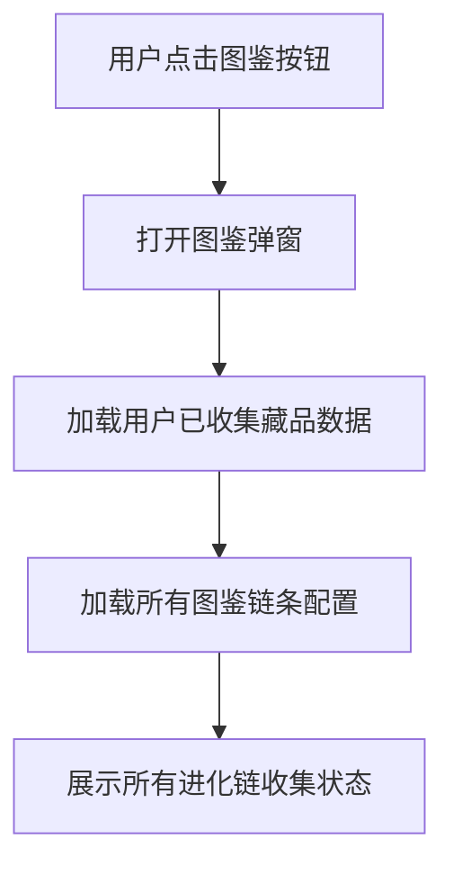
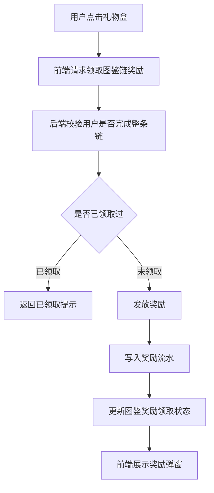
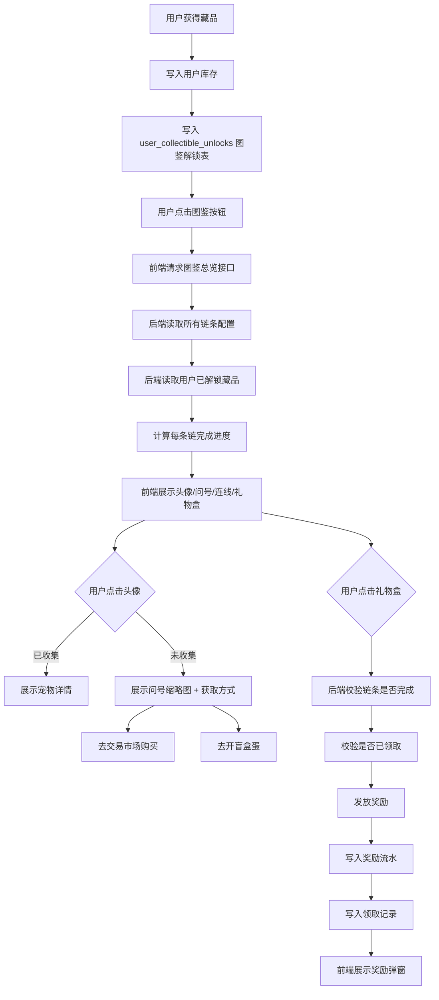

下面是完善后的 **图鉴功能完整设计方案**，可以直接给产品、前端、后端、数据库开发人员使用。

# 图鉴功能设计方案

## 1. 功能定位

图鉴不是单纯展示藏品列表，而是一个 **收集进度 + 进化链展示 + 缺失引导 + 完成奖励** 的系统。

它的核心目标有 4 个：

1. 让玩家清楚知道自己已经收集了哪些宠物。
2. 让玩家知道每个宠物属于哪条进化链。
3. 引导玩家补齐缺失藏品，例如去交易市场购买或继续开蛋。
4. 给完成整条进化链的玩家发放奖励，提高收集动力。

---

# 2. 用户操作流程

## 2.1 入口流程

用户点击底部导航或藏品页中的 **“图鉴”按钮**

进入图鉴弹窗：



---

# 3. 图鉴弹窗结构

弹窗建议分成 5 个区域：

```text
┌─────────────────────────────┐
│ 图鉴标题区                   │
│ 已收集 36 / 100    完成链 3/20 │
├─────────────────────────────┤
│ 系列筛选 / 稀有度筛选 / 搜索  │
├─────────────────────────────┤
│ 进化链展示区                 │
│ 小火龙 → 火恐龙 → 喷火龙 🎁   │
│ 妙蛙种子 → ？ → 妙蛙花        │
│ 杰尼龟 → 卡咪龟 → ？          │
├─────────────────────────────┤
│ 宠物详情预览区 / 点击后弹出   │
├─────────────────────────────┤
│ 关闭按钮                     │
└─────────────────────────────┘
```

---

# 4. 图鉴展示规则

## 4.1 已收集藏品

如果玩家已经拥有某个藏品，则显示该宠物头像。

例如：

```text
小火龙头像 → 火恐龙头像 → 喷火龙头像
```

显示内容建议包括：

| 内容    | 展示方式                |
| ----- | ------------------- |
| 宠物头像  | 正常彩色头像              |
| 宠物名称  | 头像下方显示              |
| 稀有度   | 小标签，例如 普通 / 稀有 / 史诗 |
| 已拥有数量 | 右上角角标，例如 x3         |
| 是否可操作 | 可点击查看详情             |

---

## 4.2 未收集藏品

如果玩家没有拥有某个藏品，则显示问号头像。

例如：

```text
小火龙头像 → ？ → 喷火龙头像
```

未收集状态建议展示：

| 内容  | 展示方式                |
| --- | ------------------- |
| 头像  | 灰色问号头像              |
| 名称  | 可以显示真实名称，也可以显示“未收集” |
| 稀有度 | 可显示，也可隐藏            |
| 按钮  | 点击后弹出获取方式           |

建议你采用：**显示名称，但头像用问号**。

原因是这样能刺激玩家补齐收集链，例如：

```text
小火龙 → ？火恐龙 → 喷火龙
```

玩家知道自己缺的是“火恐龙”，就更容易产生购买或开蛋行为。

---

# 5. 点击交互设计

## 5.1 点击已收集宠物头像

当用户点击已经收集的宠物头像时，弹出宠物详情卡片。

展示内容：

| 字段    | 示例               |
| ----- | ---------------- |
| 宠物缩略图 | 小火龙图片            |
| 宠物名称  | 小火龙              |
| 稀有度   | 普通               |
| 阵营    | 火焰阵营             |
| 系列    | 初代火系             |
| 拥有数量  | 3 个              |
| 战力    | 120              |
| 等级    | Lv. 8            |
| 可操作按钮 | 查看详情 / 去升级 / 去出售 |

建议弹窗文案：

```text
小火龙
普通 · 火焰阵营

你已拥有：3 个
最高等级：Lv.8
最高战力：120

[查看详情] [去升级]
```

---

## 5.2 点击未收集问号头像

当用户点击未收集藏品时，弹出缺失藏品提示卡片。

展示内容：

| 字段   | 示例              |
| ---- | --------------- |
| 缩略图  | 问号图片            |
| 藏品名称 | 火恐龙             |
| 状态   | 尚未收集            |
| 所属链条 | 小火龙 → 火恐龙 → 喷火龙 |
| 获取方式 | 交易市场 / 开盲盒蛋     |

建议弹窗文案：

```text
火恐龙
你还没有收集这个宠物。

它是“小火龙 → 火恐龙 → 喷火龙”进化链中的关键藏品。

你可以通过以下方式获得：

[去交易市场购买] [去开盲盒蛋]
```

按钮逻辑：

| 按钮      | 跳转目标               |
| ------- | ------------------ |
| 去交易市场购买 | 跳转交易市场，并自动筛选该藏品    |
| 去开盲盒蛋   | 跳转开蛋页面，并推荐能开出该藏品的蛋 |

---

# 6. 完成整条进化链后的奖励机制

## 6.1 完成条件

当用户拥有某条进化链中的所有藏品时，该链条视为完成。

例如：

```text
小火龙 → 火恐龙 → 喷火龙
```

用户只要每个宠物至少拥有 1 个，即可完成该链条。

不要求全部宠物都升级，也不要求数量超过 1。

---

## 6.2 礼物盒显示规则

当链条完成后，在链条末尾显示礼物盒图标：

```text
小火龙 → 火恐龙 → 喷火龙 → 🎁
```

礼物盒状态分为 3 种：

| 状态  | 展示              | 说明 |
| --- | --------------- | -- |
| 未完成 | 不显示礼物盒，或显示灰色礼物盒 |    |
| 可领取 | 彩色礼物盒 + 动效      |    |
| 已领取 | 灰色礼物盒 + 已领取标记   |    |

建议采用：

```text
未完成：不显示礼物盒
完成未领取：显示彩色礼物盒
完成已领取：显示灰色礼物盒 + √
```

这样用户最容易理解。

---

## 6.3 点击礼物盒领取奖励

用户点击礼物盒后：



奖励弹窗示例：

```text
恭喜完成进化链！

你已完成：
小火龙 → 火恐龙 → 喷火龙

获得奖励：
+500 Fgems
+1 次稀有蛋抽取机会

[开心收下]
```

---

# 7. 推荐奖励设计

不同稀有度链条可以设置不同奖励。

| 链条类型 | 示例           | 推荐奖励           |
| ---- | ------------ | -------------- |
| 普通链  | 普通 → 稀有 → 稀有 | 100-300 Fgems  |
| 稀有链  | 稀有 → 史诗 → 史诗 | 300-800 Fgems  |
| 史诗链  | 史诗 → 传说      | 800-1500 Fgems |
| 传说链  | 传说 → 神话      | 稀有蛋机会 / 专属头像框  |
| 活动链  | 联名活动藏品       | 限定徽章 / 活动积分    |

建议不要一开始奖励太复杂。

第一版可以只做：

| 完成链条类型 | 奖励               |
| ------ | ---------------- |
| 普通链    | 200 Fgems        |
| 稀有链    | 500 Fgems        |
| 史诗链    | 1000 Fgems       |
| 传说链    | 1 次稀有蛋机会         |
| 神话链    | 限定头像框 + 1 次稀有蛋机会 |

---

# 8. 图鉴链条分类设计

如果你的项目有 100 个藏品，不建议全部直接铺在一个弹窗里。建议分组展示。

可以按以下方式分类：

## 8.1 按系列分类

例如：

```text
火焰系列
水灵系列
森林系列
雷电系列
暗影系列
机械系列
神话系列
活动限定系列
```

## 8.2 按稀有度分类

```text
全部
普通
稀有
史诗
传说
神话
```

## 8.3 按完成状态分类

```text
全部
已完成
未完成
可领奖
已领奖
```

这是最有用的筛选方式。

建议图鉴弹窗顶部放 3 个筛选：

```text
[全部系列 v] [全部稀有度 v] [可领奖]
```

---

# 9. 图鉴状态设计

每条链条可以有以下状态：

| 状态         | 说明       | 前端表现             |
| ---------- | -------- | ---------------- |
| locked     | 用户一个都没收集 | 全部问号，链条偏灰        |
| collecting | 部分收集     | 已收集显示头像，未收集显示问号  |
| completed  | 已完成但未领奖  | 全部头像点亮，末尾显示彩色礼物盒 |
| claimed    | 已完成且已领奖  | 全部头像点亮，末尾显示灰色礼物盒 |

---

# 10. 前端页面交互细节

## 10.1 弹窗打开

建议使用大弹窗，而不是全屏页面。

Telegram Mini App 里屏幕比较小，建议图鉴弹窗高度占屏幕 85%-92%。

```text
弹窗宽度：屏幕宽度 92%-96%
弹窗高度：屏幕高度 85%-92%
圆角：24px
背景：#FFFDFA
```

---

## 10.2 链条展示方式

每条链条用横向卡片展示：

```text
┌─────────────────────────────┐
│ 火焰初心者链                 │
│ 小火龙 → 火恐龙 → 喷火龙 🎁  │
│ 收集进度：3/3                │
└─────────────────────────────┘
```

如果链条很长，可以横向滑动。

如果链条只有 2-3 个藏品，直接完整显示。

---

## 10.3 头像状态

| 状态     | 样式          |
| ------ | ----------- |
| 已拥有    | 彩色头像 + 发光边框 |
| 未拥有    | 灰色圆形 + 问号   |
| 当前点击   | 放大 1.05 倍   |
| 可进化链完成 | 整条链轻微发光     |
| 可领奖    | 礼物盒轻微跳动     |

---

## 10.4 连线样式

头像之间用线连接：

```text
头像 ─── 头像 ─── 头像
```

建议连线状态也跟随收集状态变化：

| 连线状态   | 样式    |
| ------ | ----- |
| 两边都已收集 | 橙色实线  |
| 有一个未收集 | 灰色虚线  |
| 整条完成   | 橙色发光线 |

---

# 11. 数据库建议

图鉴功能建议至少需要 3 类数据。

## 11.1 藏品基础表

记录所有宠物基础信息。

```sql
collectibles
```

建议字段：

| 字段                 | 说明     |
| ------------------ | ------ |
| id                 | 藏品 ID  |
| name               | 藏品名称   |
| rarity             | 稀有度    |
| faction            | 阵营     |
| series             | 系列     |
| image_url          | 正常图片   |
| thumbnail_url      | 缩略图    |
| question_image_url | 问号图，可选 |
| description        | 描述     |
| is_active          | 是否启用   |

---

## 11.2 图鉴链条配置表

记录每条进化链。

```sql
collection_chains
```

建议字段：

| 字段            | 说明    |
| ------------- | ----- |
| id            | 链条 ID |
| name          | 链条名称  |
| series        | 所属系列  |
| reward_type   | 奖励类型  |
| reward_amount | 奖励数量  |
| sort_order    | 排序    |
| is_active     | 是否启用  |

---

## 11.3 图鉴链条节点表

记录每条链中包含哪些藏品，以及顺序。

```sql
collection_chain_nodes
```

建议字段：

| 字段             | 说明    |
| -------------- | ----- |
| id             | 节点 ID |
| chain_id       | 链条 ID |
| collectible_id | 藏品 ID |
| node_order     | 链条顺序  |

示例：

| chain_id | collectible_id | node_order |
| -------- | -------------- | ---------- |
| fire_001 | 小火龙            | 1          |
| fire_001 | 火恐龙            | 2          |
| fire_001 | 喷火龙            | 3          |

---

## 11.4 用户图鉴奖励领取表

记录用户是否领取过某条链的奖励。

```sql
user_collection_chain_rewards
```

建议字段：

| 字段            | 说明    |
| ------------- | ----- |
| id            | 主键    |
| user_id       | 用户 ID |
| chain_id      | 链条 ID |
| claimed_at    | 领取时间  |
| reward_type   | 奖励类型  |
| reward_amount | 奖励数量  |

必须设置唯一约束：

```sql
unique(user_id, chain_id)
```

防止用户重复领取奖励。

---

# 12. 后端接口建议

## 12.1 获取图鉴数据

```http
GET /api/album/overview
```

返回：

```json
{
  "totalCollectibles": 100,
  "ownedCollectibles": 36,
  "totalChains": 20,
  "completedChains": 3,
  "claimableChains": 1,
  "chains": [
    {
      "chainId": "fire_001",
      "chainName": "火焰初心者链",
      "status": "completed",
      "rewardStatus": "claimable",
      "progress": {
        "owned": 3,
        "total": 3
      },
      "nodes": [
        {
          "collectibleId": "c001",
          "name": "小火龙",
          "owned": true,
          "ownedCount": 2,
          "thumbnailUrl": "/images/charmander.png"
        },
        {
          "collectibleId": "c002",
          "name": "火恐龙",
          "owned": true,
          "ownedCount": 1,
          "thumbnailUrl": "/images/charmeleon.png"
        },
        {
          "collectibleId": "c003",
          "name": "喷火龙",
          "owned": true,
          "ownedCount": 1,
          "thumbnailUrl": "/images/charizard.png"
        }
      ]
    }
  ]
}
```

---

## 12.2 领取链条奖励

```http
POST /api/album/claim-chain-reward
```

请求：

```json
{
  "chainId": "fire_001"
}
```

后端必须校验：

1. 用户是否登录。
2. chainId 是否存在。
3. 用户是否拥有该链条的所有藏品。
4. 用户是否已经领取过奖励。
5. 奖励发放是否成功。
6. 是否写入奖励流水。
7. 是否写入领取记录。

返回：

```json
{
  "success": true,
  "reward": {
    "type": "fgems",
    "amount": 500
  }
}
```

---

# 13. 防刷与安全规则

图鉴奖励涉及资产发放，所以不能只靠前端判断。

必须由后端重新校验：

| 风险           | 解决方案                             |
| ------------ | -------------------------------- |
| 用户伪造完成状态     | 后端查询真实库存                         |
| 用户重复领取奖励     | user_id + chain_id 唯一约束          |
| 并发重复点击       | 数据库事务 + 唯一约束                     |
| 前端篡改奖励金额     | 奖励从服务端配置表读取                      |
| 用户库存变动导致状态变化 | 领取时实时校验库存                        |
| 藏品被挂单出售      | 建议只计算 available 库存，不计算 locked 库存 |

重点建议：

**用户只要曾经拥有过某个藏品，就永久点亮图鉴；图鉴链完成按所有藏品已解锁判断**

---

# 14. 推荐业务规则

## 14.1 图鉴完成是否消耗藏品？

建议：**不消耗。**

图鉴是收集成就系统，不应该领取奖励后消耗藏品。

---

## 14.2 挂单中的藏品是否算已收集？

建议分两层：

| 场景   | 是否算已收集 |
| ---- | ------ |
| 图鉴展示 | 可以算    |
| 领取奖励 | 不建议算   |

更稳妥的规则：

```text
图鉴展示：曾经拥有过也可以点亮。
图鉴奖励：必须当前 available 库存中拥有完整链条。
```

但第一版为了简单，可以先采用：

```text
只要当前库存中拥有，就算已收集。
```

---

## 14.3 已经卖掉的藏品是否还点亮？

这里有两种方案。

### 方案 A：当前拥有制

用户卖掉后，图鉴重新变成未收集。

优点：逻辑简单。
缺点：用户体验一般。

### 方案 B：永久解锁制

用户曾经获得过该藏品，就永久点亮图鉴。

优点：用户体验好，符合大多数图鉴系统。
缺点：需要额外记录用户曾经获得过哪些藏品。

推荐使用 **方案 B：永久解锁制**。

也就是用户只要曾经获得过某个藏品，就永久点亮图鉴。即使后续卖掉、分解、合成、mint，也不会取消点亮。

---

# 15. 推荐增加一张用户图鉴解锁表

如果采用永久解锁制，建议增加：

```sql
user_collectible_unlocks
```

字段：

| 字段                | 说明                                                |
| ----------------- | ------------------------------------------------- |
| user_id           | 用户 ID                                             |
| collectible_id    | 藏品 ID                                             |
| first_unlocked_at | 第一次获得时间                                           |
| source            | 来源，例如 box_open / market_buy / evolution / airdrop |

唯一约束：

```sql
unique(user_id, collectible_id)
```

当用户通过以下方式获得藏品时，都写入这张表：

| 来源      | 是否解锁图鉴 |
| ------- | ------ |
| 开蛋获得    | 是      |
| 市场购买    | 是      |
| 合成获得    | 是      |
| 活动空投    | 是      |
| 管理员发放   | 是      |
| mint 回流 | 视业务而定  |

---

# 16. 最终推荐的图鉴规则

我建议你的项目采用这套规则：

| 规则项      | 建议               |
| -------- | ---------------- |
| 图鉴点亮     | 用户曾经拥有过该藏品即可永久点亮 |
| 图鉴链完成    | 该链所有藏品都已解锁       |
| 领取奖励     | 每条链只能领取一次        |
| 领取是否消耗藏品 | 不消耗              |
| 未收集头像    | 显示问号头像 + 藏品名称    |
| 缺失引导     | 去交易市场购买 / 去开盲盒蛋  |
| 礼物盒      | 完成链条后显示          |
| 礼物盒状态    | 可领取 / 已领取        |
| 奖励配置     | 服务端配置，不允许前端传金额   |
| 防重复领取    | 数据库唯一约束 + RPC 事务 |

---

# 17. 完整业务闭环



---

# 18. 给开发人员的简化版本

第一版 MVP 可以这样做：

## 必做功能

1. 点击图鉴按钮，打开图鉴弹窗。
2. 展示所有进化链。
3. 已收集显示宠物头像。
4. 未收集显示问号头像。
5. 点击已收集头像，展示宠物缩略图和基础信息。
6. 点击问号头像，展示藏品名称和两个按钮：

   * 去交易市场购买
   * 去开盲盒蛋
7. 完成整条链后，末尾显示礼物盒。
8. 点击礼物盒可以领取奖励。
9. 领取后礼物盒变成已领取状态。
10. 奖励不能重复领取。

## 暂时可以不做

1. 多套复杂筛选。
2. 动效。
3. 多种奖励类型。
4. 成就徽章。
5. 排行榜展示。
6. 图鉴分享海报。
7. 链条完成进度动画。

---

# 19. 最终产品文案示例

## 图鉴顶部

```text
宠物图鉴
收集所有宠物，点亮进化链，领取专属奖励！
```

## 未收集提示

```text
你还没有收集到它。

这个宠物是当前进化链中的关键成员。
你可以去交易市场购买，也可以继续开蛋获取。
```

## 完成链条提示

```text
进化链已完成！
点击礼物盒领取奖励。
```

## 已领取提示

```text
该进化链奖励已领取。
继续收集其他链条吧。
```

---

# 20. 总结建议

你的图鉴功能可以设计成：

```text
图鉴弹窗
= 宠物进化链展示
+ 已收集头像点亮
+ 未收集问号提示
+ 缺失藏品获取引导
+ 完成链条礼物盒奖励
+ 图鉴永久解锁记录
```

最推荐的核心规则是：

```text
用户只要曾经获得过某个藏品，就永久点亮图鉴；
完成整条进化链后，可以领取一次链条奖励；
奖励不消耗藏品；
未收集藏品点击后，引导用户去市场购买或开蛋。
```

这样既能提高收集欲望，也能自然促进交易市场和开蛋消费。
