下面是一份可以直接放进开发文档的 **图鉴功能业务全流程设计**。核心原则是：

```text
图鉴点亮 = 用户曾经合法获得过该藏品
当前拥有数量 = 用户仓库当前还有多少
图鉴奖励 = 根据图鉴永久解锁记录判断，而不是根据当前仓库判断
```

---

# 1. 图鉴功能涉及的数据表

建议最少需要这 5 张表。

| 表名                              | 作用              |
| ------------------------------- | --------------- |
| `collectibles`                  | 所有藏品基础信息        |
| `user_inventory`                | 用户当前仓库，记录当前拥有数量 |
| `user_collectible_unlocks`      | 用户图鉴永久解锁记录      |
| `collection_chains`             | 图鉴进化链配置         |
| `collection_chain_nodes`        | 每条进化链包含哪些藏品     |
| `user_collection_chain_rewards` | 用户领取图鉴链条奖励记录    |

重点是这张表：

```sql
user_collectible_unlocks
```

它表示：

```text
用户曾经获得过某个藏品，因此图鉴永久点亮。
```

不是表示当前库存。

---

# 2. 推荐表关系 ERD

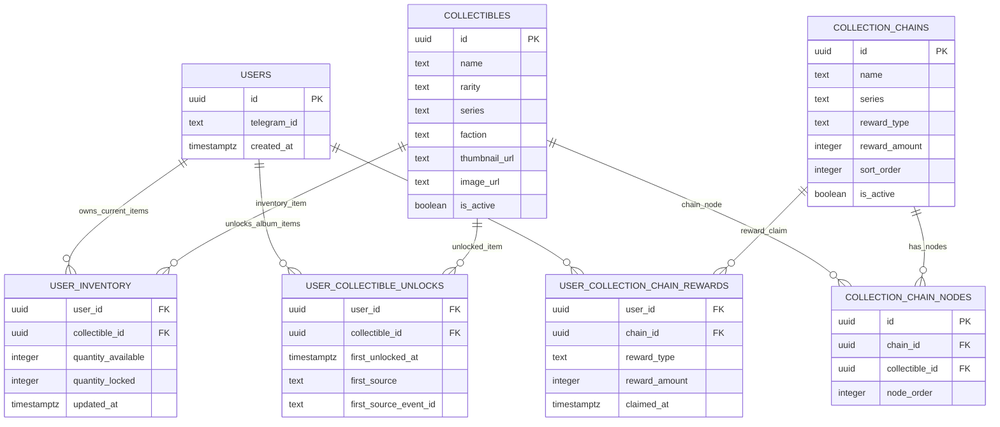

---

# 3. 图鉴核心业务规则

| 场景        | 是否写入 `user_collectible_unlocks` | 是否改变图鉴点亮状态 |
| --------- | ------------------------------: | ---------: |
| 开盲盒获得藏品   |                               是 |         点亮 |
| 市场购买藏品    |                               是 |         点亮 |
| 合成成功获得新藏品 |                               是 |      点亮新藏品 |
| 活动奖励获得藏品  |                               是 |         点亮 |
| 后台发放藏品    |                               是 |         点亮 |
| 图鉴链奖励发放藏品 |                     如果奖励是藏品，则写入 |         点亮 |
| 出售藏品      |                               否 |      不取消点亮 |
| 分解藏品      |                               否 |      不取消点亮 |
| 合成消耗材料藏品  |                               否 |      不取消点亮 |
| Mint 上链   |                               否 |      不取消点亮 |
| 挂单出售      |                               否 |      不取消点亮 |

结论：

```text
只要用户曾经获得过，就永久点亮。
用户卖掉、分解、合成消耗、mint 后，图鉴不回退。
```

---

# 4. 图鉴完整总流程 Mermaid

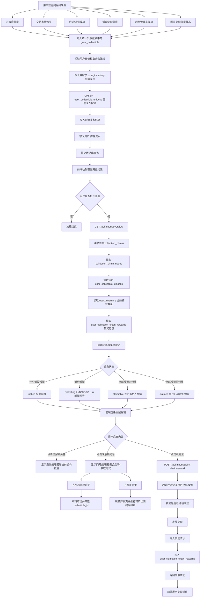

---

# 5. 和开盲盒功能的连接流程

开盲盒是图鉴最重要的数据来源之一。

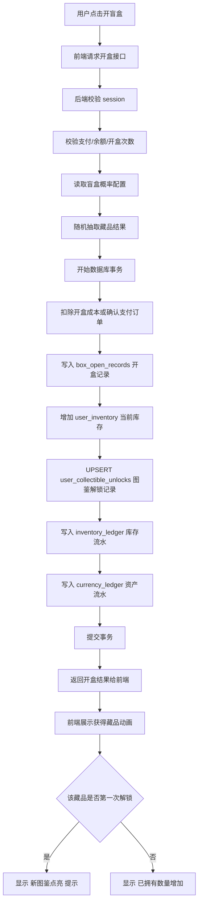

开盒成功后，不需要前端再单独请求“图鉴同步接口”。

正确做法是：

```text
开盒事务内部自动 upsert 图鉴解锁记录。
```

---

# 6. 和交易市场购买功能的连接流程

用户从市场购买藏品后，也要点亮买家的图鉴。

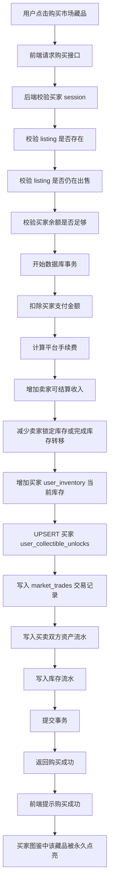

注意：

```text
卖家出售藏品，不会取消卖家的图鉴点亮。
买家购买藏品，会点亮买家的图鉴。
```

---

# 7. 和合成/进化功能的连接流程

例如：

```text
3 个小火龙 → 1 个火恐龙
```

合成成功后，用户获得新藏品，需要点亮新藏品。

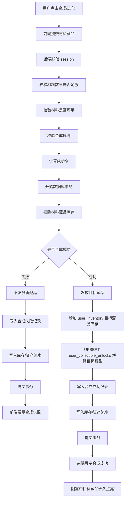

注意：

```text
被消耗的材料藏品，不会从图鉴中熄灭。
```

例如用户用 3 个小火龙合成火恐龙，合成后仓库里可能没有小火龙了，但图鉴里“小火龙”仍然点亮。

---

# 8. 和分解功能的连接流程

分解只影响仓库，不影响图鉴。

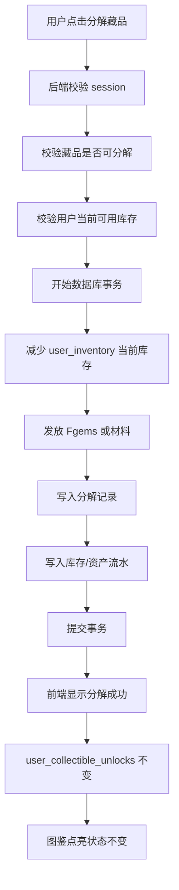

---

# 9. 和 Mint 上链功能的连接流程

Mint 也不应该让图鉴回退。

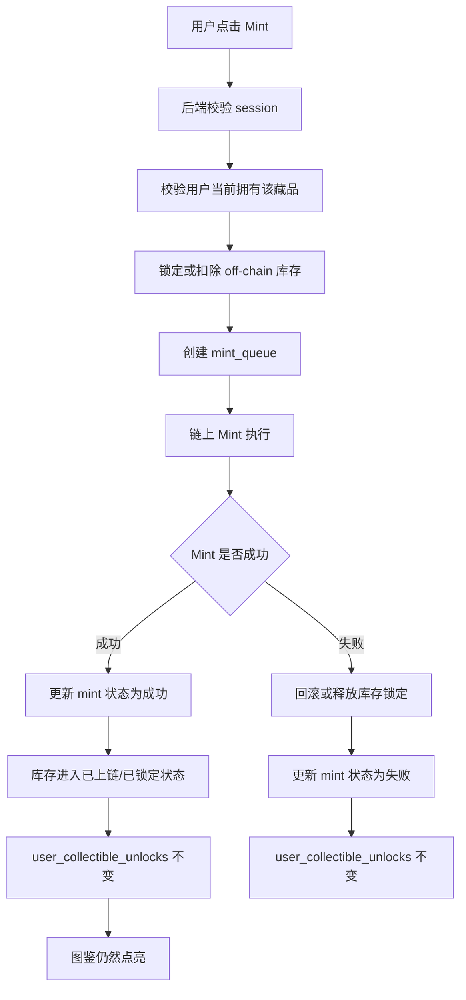

---

# 10. 图鉴查看流程

用户点击图鉴按钮后，前端只需要请求一个总览接口。

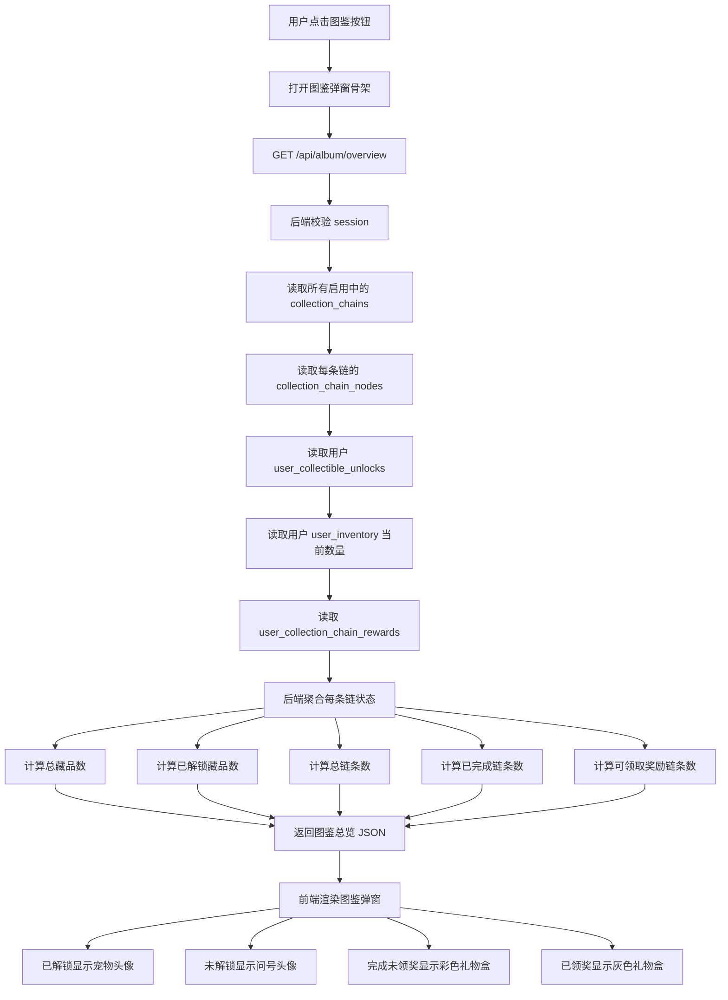

---

# 11. 点击未收集问号的流程

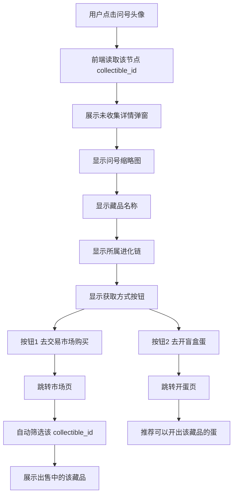

这里建议后端在 `/api/album/overview` 返回每个未解锁节点的获取方式，例如：

```json
{
  "collectibleId": "c002",
  "name": "火恐龙",
  "owned": false,
  "marketsAvailable": true,
  "boxSources": [
    {
      "boxId": "rare_egg",
      "boxName": "稀有蛋"
    }
  ]
}
```

这样前端点击问号时，不需要再请求很多接口。

---

# 12. 图鉴链条奖励领取流程

图鉴奖励应该根据 `user_collectible_unlocks` 判断，而不是根据 `user_inventory` 判断。

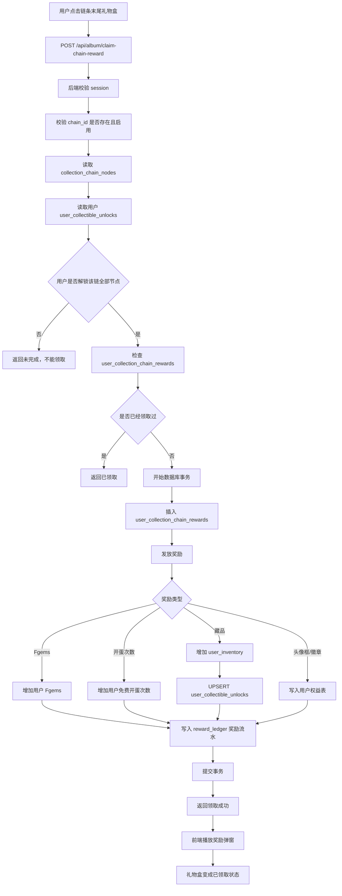

必须加唯一约束：

```sql
unique(user_id, chain_id)
```

防止用户重复领取同一条图鉴链奖励。

---

# 13. 图鉴链条状态机

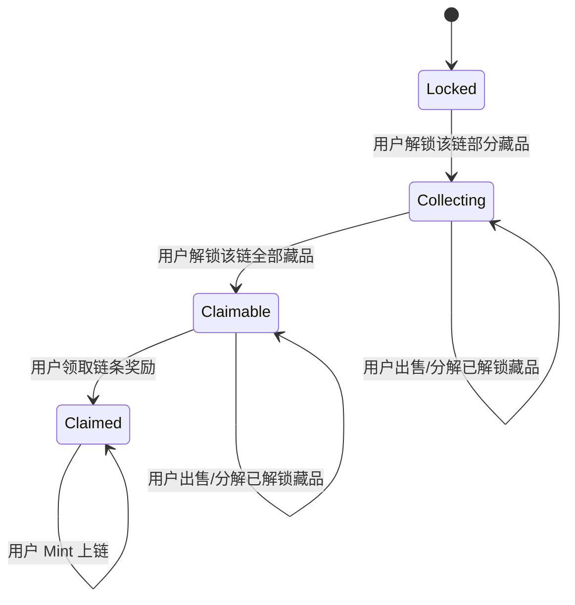

这个状态机表达的核心是：

```text
图鉴状态只会前进，不会因为出售、分解、合成消耗而回退。
```

---

# 14. 推荐接口设计

## 14.1 获取图鉴总览

```http
GET /api/album/overview
```

作用：

```text
返回所有图鉴链条、用户解锁状态、当前拥有数量、奖励领取状态。
```

后端返回结构建议：

```json
{
  "summary": {
    "totalCollectibles": 100,
    "unlockedCollectibles": 36,
    "totalChains": 20,
    "completedChains": 3,
    "claimableChains": 1
  },
  "chains": [
    {
      "chainId": "fire_001",
      "chainName": "火焰初心者链",
      "status": "claimable",
      "rewardStatus": "claimable",
      "progress": {
        "unlocked": 3,
        "total": 3
      },
      "reward": {
        "type": "fgems",
        "amount": 500
      },
      "nodes": [
        {
          "collectibleId": "c001",
          "name": "小火龙",
          "unlocked": true,
          "currentQuantity": 2,
          "thumbnailUrl": "/images/charmander.png",
          "nodeOrder": 1
        },
        {
          "collectibleId": "c002",
          "name": "火恐龙",
          "unlocked": true,
          "currentQuantity": 0,
          "thumbnailUrl": "/images/charmeleon.png",
          "nodeOrder": 2
        },
        {
          "collectibleId": "c003",
          "name": "喷火龙",
          "unlocked": true,
          "currentQuantity": 1,
          "thumbnailUrl": "/images/charizard.png",
          "nodeOrder": 3
        }
      ]
    }
  ]
}
```

注意这里：

```json
"unlocked": true,
"currentQuantity": 0
```

表示：

```text
图鉴已经点亮，但是用户当前仓库没有这个藏品。
```

这就是“永久解锁”和“当前库存”的区别。

---

## 14.2 领取图鉴链奖励

```http
POST /api/album/claim-chain-reward
```

请求：

```json
{
  "chainId": "fire_001"
}
```

后端校验：

| 校验项          | 说明 |
| ------------ | -- |
| 用户是否登录       | 必须 |
| chainId 是否存在 | 必须 |
| chain 是否启用   | 必须 |
| 用户是否解锁该链所有节点 | 必须 |
| 是否已经领取过      | 必须 |
| 奖励配置是否有效     | 必须 |
| 是否成功写入奖励流水   | 必须 |

返回：

```json
{
  "success": true,
  "reward": {
    "type": "fgems",
    "amount": 500
  }
}
```

---

# 15. 不建议开放的接口

不建议开放这种接口给前端：

```http
POST /api/album/unlock
```

原因：

```text
前端不能直接告诉后端“我要解锁某个图鉴”。
```

否则用户可能伪造请求，直接解锁稀有藏品。

正确方式是：

```text
开盒、购买、合成、活动奖励、后台发放这些业务成功后，
由后端在同一个事务里自动 upsert user_collectible_unlocks。
```

---

# 16. 统一发放藏品函数设计

为了避免每个业务单独写一遍图鉴逻辑，建议后端封装一个统一方法：

```text
grant_collectible(user_id, collectible_id, quantity, source, source_event_id)
```

它负责：

```text
1. 增加用户当前库存
2. upsert 图鉴解锁记录
3. 写入库存流水
4. 返回是否首次解锁
```

伪 SQL：

```sql
-- 1. 增加当前库存
insert into user_inventory (
  user_id,
  collectible_id,
  quantity_available,
  quantity_locked,
  updated_at
)
values (
  :user_id,
  :collectible_id,
  :quantity,
  0,
  now()
)
on conflict (user_id, collectible_id)
do update set
  quantity_available = user_inventory.quantity_available + excluded.quantity_available,
  updated_at = now();

-- 2. 图鉴永久解锁
insert into user_collectible_unlocks (
  user_id,
  collectible_id,
  first_unlocked_at,
  first_source,
  first_source_event_id
)
values (
  :user_id,
  :collectible_id,
  now(),
  :source,
  :source_event_id
)
on conflict (user_id, collectible_id)
do nothing;
```

---

# 17. 来源 source 建议

`user_collectible_unlocks.first_source` 建议使用枚举。

| source         | 含义      |
| -------------- | ------- |
| `box_open`     | 开盲盒获得   |
| `market_buy`   | 市场购买获得  |
| `evolution`    | 合成/进化获得 |
| `event_reward` | 活动奖励获得  |
| `album_reward` | 图鉴奖励获得  |
| `admin_grant`  | 后台发放    |
| `airdrop`      | 空投获得    |

`first_source_event_id` 用来追踪来源记录，例如：

| source         | source_event_id 对应       |
| -------------- | ------------------------ |
| `box_open`     | `box_open_records.id`    |
| `market_buy`   | `market_trades.id`       |
| `evolution`    | `evolution_records.id`   |
| `event_reward` | `event_reward_claims.id` |
| `admin_grant`  | `admin_grant_records.id` |

---

# 18. 最终业务闭环总结

完整图鉴系统应该是：

```text
用户获得藏品
→ 当前仓库增加
→ 图鉴永久解锁表 upsert
→ 用户打开图鉴
→ 后端根据图鉴解锁表计算收集进度
→ 前端展示头像 / 问号 / 礼物盒
→ 用户点击问号
→ 引导去市场购买或开蛋
→ 用户补齐整条链
→ 礼物盒出现
→ 用户领取链条奖励
→ 奖励写入流水
→ 礼物盒变成已领取
```

最重要的设计原则是：

```text
user_inventory 负责“当前还有多少”
user_collectible_unlocks 负责“曾经收集过哪些”
user_collection_chain_rewards 负责“哪些图鉴链奖励已经领取”
```

这样你的图鉴功能才能和开盲盒、交易市场、合成、分解、Mint、奖励系统稳定连接，不会因为用户卖掉或消耗藏品导致图鉴反复熄灭。
