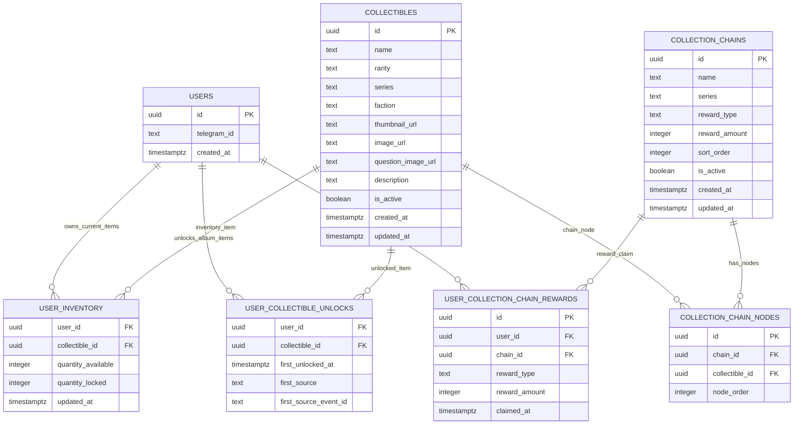
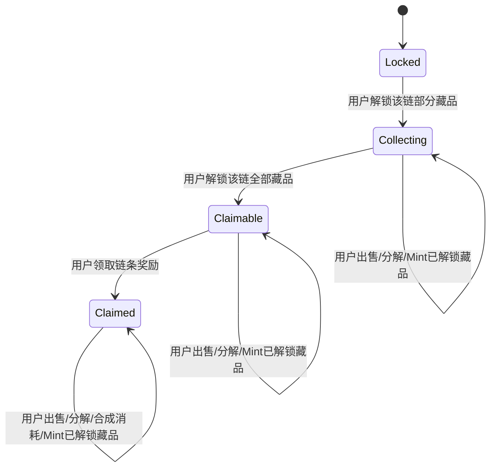
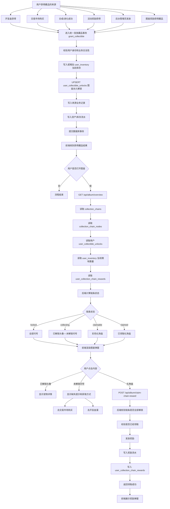
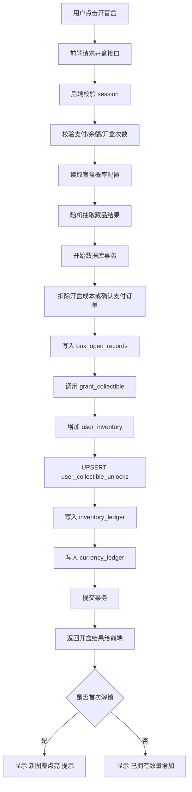
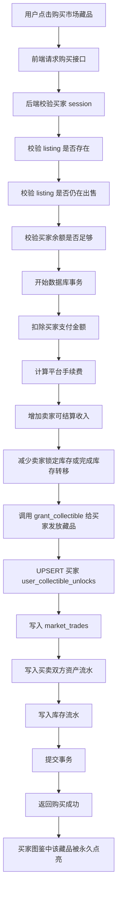
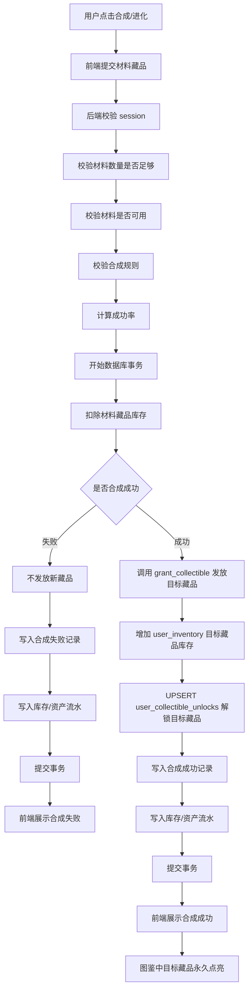
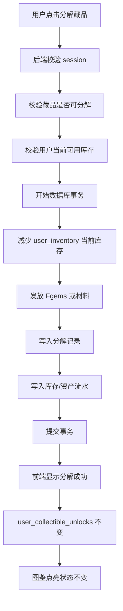
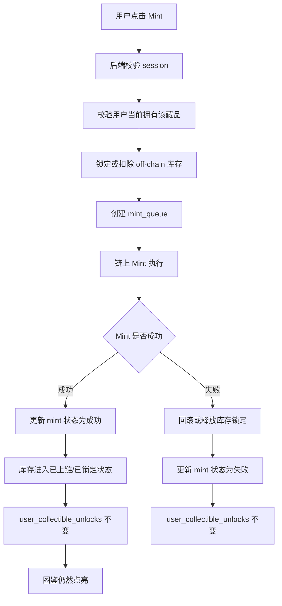
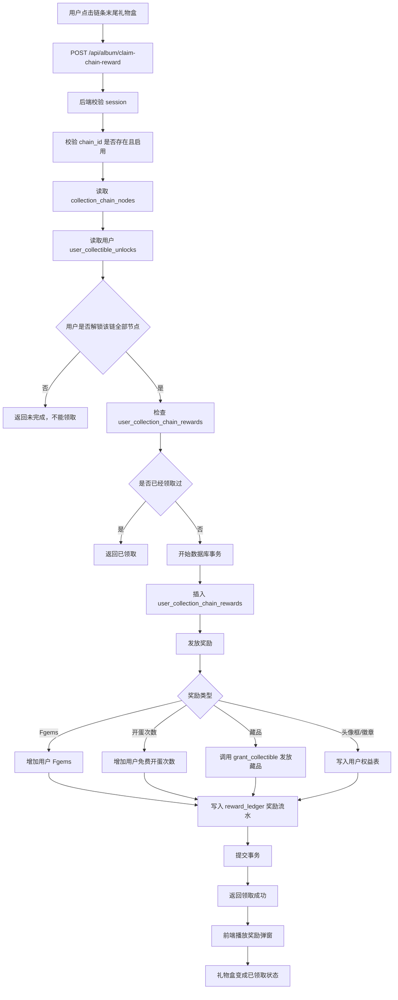

# 图鉴功能开发说明书（融合版）

---

## 1. 最终采用的核心方案

### 1.1 一句话结论

```text
图鉴点亮 = 用户曾经合法获得过该藏品
当前拥有数量 = 用户仓库现在还有多少
图鉴链完成 = 该链所有节点都已在 user_collectible_unlocks 中解锁
图鉴奖励 = 根据永久解锁记录判断，每条链只能领取一次
```

### 1.2 为什么使用这个方案

不要用 `user_inventory` 直接判断图鉴是否点亮。

原因：

1. 用户可能已经卖掉藏品。
2. 用户可能已经分解藏品。
3. 用户可能已经用藏品作为合成材料。
4. 用户可能已经 Mint 上链。
5. 如果只按当前仓库判断，图鉴会反复熄灭，体验差，也容易导致奖励状态混乱。

最终规则：

```text
user_inventory 负责“当前还有多少”
user_collectible_unlocks 负责“曾经收集过哪些”
user_collection_chain_rewards 负责“哪些链条奖励已经领取”
```

---

## 2. 功能目标

图鉴不是普通藏品列表，而是一个：

```text
收集进度
+ 进化链展示
+ 缺失藏品引导
+ 完成链条奖励
+ 永久成就记录
```

核心目标：

1. 展示用户已经点亮了哪些宠物。
2. 展示每个宠物属于哪条进化链。
3. 对未收集宠物显示问号，并引导用户去市场购买或开蛋。
4. 当用户完成整条进化链后，展示礼物盒并允许领取奖励。
5. 图鉴状态只前进，不因出售、分解、合成消耗、Mint 而回退。

---

## 3. MVP 范围

### 3.1 第一版必须做

1. 点击图鉴按钮，打开图鉴弹窗。
2. 展示所有启用中的进化链。
3. 已解锁藏品显示宠物头像。
4. 未解锁藏品显示问号头像，但显示真实藏品名称。
5. 点击已解锁头像，显示宠物缩略图和基础信息。
6. 点击未解锁问号，显示缺失提示，并提供：
   - 去交易市场购买
   - 去开盲盒蛋
7. 完成整条链后，在链条末尾显示礼物盒。
8. 点击礼物盒领取奖励。
9. 领取后礼物盒变成已领取状态。
10. 奖励不能重复领取。
11. 所有获得藏品的业务，都必须在同一个事务中 upsert 图鉴解锁记录。

### 3.2 第一版暂时不做

1. 图鉴分享海报。
2. 图鉴排行榜。
3. 大量复杂动效。
4. 多层成就徽章系统。
5. 复杂多奖励组合。
6. 跨赛季图鉴。
7. 稀有度收藏墙。
8. 社交炫耀页。

---

## 4. 数据表设计

图鉴功能建议使用以下 6 张核心表。

| 表名 | 作用 |
| --- | --- |
| `collectibles` | 所有藏品基础信息 |
| `user_inventory` | 用户当前仓库，记录当前可用数量和锁定数量 |
| `user_collectible_unlocks` | 用户图鉴永久解锁记录 |
| `collection_chains` | 图鉴进化链配置 |
| `collection_chain_nodes` | 每条进化链包含哪些藏品 |
| `user_collection_chain_rewards` | 用户领取图鉴链条奖励记录 |

---

## 5. ERD 表关系



---

## 6. 表结构说明

### 6.1 `collectibles`

作用：记录所有宠物/藏品基础信息。

| 字段 | 类型 | 说明 |
| --- | --- | --- |
| `id` | uuid | 藏品 ID |
| `name` | text | 藏品名称 |
| `rarity` | text | 稀有度，例如 common / rare / epic / legendary / mythic |
| `series` | text | 系列，例如 fire / water / forest |
| `faction` | text | 阵营 |
| `thumbnail_url` | text | 缩略图 |
| `image_url` | text | 大图 |
| `question_image_url` | text | 未解锁问号图，可选 |
| `description` | text | 描述 |
| `is_active` | boolean | 是否启用 |

建议索引：

```sql
create index idx_collectibles_active on collectibles(is_active);
create index idx_collectibles_series on collectibles(series);
create index idx_collectibles_rarity on collectibles(rarity);
```

---

### 6.2 `user_inventory`

作用：记录用户当前仓库数量。

| 字段 | 类型 | 说明 |
| --- | --- | --- |
| `user_id` | uuid | 用户 ID |
| `collectible_id` | uuid | 藏品 ID |
| `quantity_available` | integer | 当前可用数量 |
| `quantity_locked` | integer | 挂单、Mint、其他锁定数量 |
| `updated_at` | timestamptz | 更新时间 |

唯一约束：

```sql
unique(user_id, collectible_id)
```

注意：

```text
这个表只表示“当前拥有数量”，不能作为图鉴永久点亮依据。
```

---

### 6.3 `user_collectible_unlocks`

作用：记录用户曾经合法获得过哪些藏品。这个表是图鉴系统最关键的表。

| 字段 | 类型 | 说明 |
| --- | --- | --- |
| `user_id` | uuid | 用户 ID |
| `collectible_id` | uuid | 藏品 ID |
| `first_unlocked_at` | timestamptz | 第一次解锁时间 |
| `first_source` | text | 首次来源 |
| `first_source_event_id` | text | 来源业务记录 ID |

唯一约束：

```sql
unique(user_id, collectible_id)
```

重要规则：

```text
只 insert / upsert，不因为出售、分解、合成消耗、Mint 而删除。
```

---

### 6.4 `collection_chains`

作用：配置进化链。

| 字段 | 类型 | 说明 |
| --- | --- | --- |
| `id` | uuid | 链条 ID |
| `name` | text | 链条名称，例如 火焰初心者链 |
| `series` | text | 所属系列 |
| `reward_type` | text | 奖励类型，例如 fgems / egg_chance / collectible / badge |
| `reward_amount` | integer | 奖励数量 |
| `sort_order` | integer | 排序 |
| `is_active` | boolean | 是否启用 |

建议约束：

```sql
check (reward_amount >= 0)
```

---

### 6.5 `collection_chain_nodes`

作用：配置每条链包含哪些藏品，以及顺序。

| 字段 | 类型 | 说明 |
| --- | --- | --- |
| `id` | uuid | 节点 ID |
| `chain_id` | uuid | 链条 ID |
| `collectible_id` | uuid | 藏品 ID |
| `node_order` | integer | 节点顺序 |

唯一约束：

```sql
unique(chain_id, collectible_id)
unique(chain_id, node_order)
```

示例：

| chain_id | collectible_id | node_order |
| --- | --- | --- |
| fire_001 | 小火龙 | 1 |
| fire_001 | 火恐龙 | 2 |
| fire_001 | 喷火龙 | 3 |

---

### 6.6 `user_collection_chain_rewards`

作用：记录用户是否领取过某条链的奖励。

| 字段 | 类型 | 说明 |
| --- | --- | --- |
| `id` | uuid | 主键 |
| `user_id` | uuid | 用户 ID |
| `chain_id` | uuid | 链条 ID |
| `reward_type` | text | 实际领取的奖励类型 |
| `reward_amount` | integer | 实际领取的奖励数量 |
| `claimed_at` | timestamptz | 领取时间 |

必须设置唯一约束：

```sql
unique(user_id, chain_id)
```

目的：

```text
防止用户重复领取同一条图鉴链奖励。
```

---

## 7. 图鉴核心业务规则

### 7.1 点亮规则

| 场景 | 是否写入 `user_collectible_unlocks` | 图鉴是否点亮 |
| --- | ---: | ---: |
| 开盲盒获得藏品 | 是 | 点亮 |
| 市场购买藏品 | 是 | 点亮 |
| 合成成功获得新藏品 | 是 | 点亮 |
| 活动奖励获得藏品 | 是 | 点亮 |
| 后台管理员发放 | 是 | 点亮 |
| 图鉴奖励发放藏品 | 如果奖励是藏品，则写入 | 点亮 |
| 出售藏品 | 否 | 不取消点亮 |
| 分解藏品 | 否 | 不取消点亮 |
| 合成消耗材料藏品 | 否 | 不取消点亮 |
| Mint 上链 | 否 | 不取消点亮 |
| 挂单出售 | 否 | 不取消点亮 |

### 7.2 链条完成规则

```text
如果 collection_chain_nodes 中该链所有 collectible_id
都存在于当前用户的 user_collectible_unlocks 中，
则该链完成。
```

不要求：

1. 当前仓库还有该藏品。
2. 每个藏品数量大于 1。
3. 藏品达到某个等级。
4. 藏品没有挂单。
5. 藏品没有 Mint。

### 7.3 奖励领取规则

```text
链条奖励根据永久解锁记录判断。
每条链每个用户只能领取一次。
领取奖励不消耗藏品。
```

---

## 8. 图鉴链条状态机

### 8.1 状态定义

| 状态 | 后端状态值 | 说明 | 前端表现 |
| --- | --- | --- | --- |
| 未开始 | `locked` | 用户一个节点都没有解锁 | 全部问号，链条偏灰 |
| 收集中 | `collecting` | 用户解锁部分节点 | 已解锁头像 + 未解锁问号 |
| 可领取 | `claimable` | 全部节点已解锁，但未领取奖励 | 全部点亮 + 彩色礼物盒 |
| 已领取 | `claimed` | 全部节点已解锁，奖励已领取 | 全部点亮 + 灰色礼物盒/已领取标记 |

### 8.2 状态机



核心原则：

```text
图鉴状态只会前进，不会因为库存减少而回退。
```

---

## 9. 统一发放藏品函数

所有能让用户获得藏品的业务，都必须复用统一发放逻辑。

建议封装为 RPC 或后端事务函数：

```text
grant_collectible(user_id, collectible_id, quantity, source, source_event_id)
```

### 9.1 职责

1. 增加或初始化 `user_inventory`。
2. UPSERT `user_collectible_unlocks`。
3. 写入库存流水。
4. 返回是否首次解锁。
5. 在同一个数据库事务中完成。

### 9.2 伪 SQL

```sql
-- 1. 增加当前库存
insert into user_inventory (
  user_id,
  collectible_id,
  quantity_available,
  quantity_locked,
  updated_at
)
values (
  :user_id,
  :collectible_id,
  :quantity,
  0,
  now()
)
on conflict (user_id, collectible_id)
do update set
  quantity_available = user_inventory.quantity_available + excluded.quantity_available,
  updated_at = now();

-- 2. 图鉴永久解锁
insert into user_collectible_unlocks (
  user_id,
  collectible_id,
  first_unlocked_at,
  first_source,
  first_source_event_id
)
values (
  :user_id,
  :collectible_id,
  now(),
  :source,
  :source_event_id
)
on conflict (user_id, collectible_id)
do nothing;
```

### 9.3 来源枚举

| source | 含义 | source_event_id 对应 |
| --- | --- | --- |
| `box_open` | 开盲盒获得 | `box_open_records.id` |
| `market_buy` | 市场购买获得 | `market_trades.id` |
| `evolution` | 合成/进化获得 | `evolution_records.id` |
| `event_reward` | 活动奖励获得 | `event_reward_claims.id` |
| `album_reward` | 图鉴奖励获得 | `user_collection_chain_rewards.id` 或奖励记录 ID |
| `admin_grant` | 后台发放 | `admin_grant_records.id` |
| `airdrop` | 空投获得 | `airdrop_records.id` |

---

## 10. 总业务闭环



---

## 11. 和开盲盒功能的连接

### 11.1 业务规则

开盲盒成功后，不需要前端再请求“图鉴同步接口”。

正确做法：

```text
开盒事务内部自动 upsert user_collectible_unlocks。
```

### 11.2 流程



---

## 12. 和交易市场购买功能的连接

### 12.1 业务规则

```text
卖家出售藏品，不会取消卖家的图鉴点亮。
买家购买藏品，会点亮买家的图鉴。
```

### 12.2 流程



---

## 13. 和合成/进化功能的连接

### 13.1 业务规则

例如：

```text
3 个小火龙 → 1 个火恐龙
```

合成成功后：

1. 扣除材料藏品库存。
2. 发放目标藏品。
3. 目标藏品写入 `user_collectible_unlocks`。
4. 被消耗的材料藏品不从图鉴熄灭。

### 13.2 流程



---

## 14. 和分解功能的连接

### 14.1 业务规则

```text
分解只影响当前仓库，不影响图鉴点亮状态。
```

### 14.2 流程



---

## 15. 和 Mint 上链功能的连接

### 15.1 业务规则

```text
Mint 也不应该让图鉴回退。
```

### 15.2 流程



---

## 16. 后端接口设计

### 16.1 获取图鉴总览

```http
GET /api/album/overview
```

作用：

```text
返回所有图鉴链条、用户解锁状态、当前拥有数量、奖励领取状态、缺失藏品获取方式。
```

后端必须做：

1. 校验 session。
2. 读取启用中的 `collection_chains`。
3. 读取 `collection_chain_nodes`。
4. 读取用户 `user_collectible_unlocks`。
5. 读取用户 `user_inventory` 当前数量。
6. 读取用户 `user_collection_chain_rewards`。
7. 聚合每条链的状态。
8. 返回前端渲染所需 JSON。

### 16.2 返回结构建议

```json
{
  "summary": {
    "totalCollectibles": 100,
    "unlockedCollectibles": 36,
    "totalChains": 20,
    "completedChains": 3,
    "claimableChains": 1
  },
  "chains": [
    {
      "chainId": "fire_001",
      "chainName": "火焰初心者链",
      "series": "fire",
      "status": "claimable",
      "rewardStatus": "claimable",
      "progress": {
        "unlocked": 3,
        "total": 3
      },
      "reward": {
        "type": "fgems",
        "amount": 500
      },
      "nodes": [
        {
          "collectibleId": "c001",
          "name": "小火龙",
          "rarity": "common",
          "series": "fire",
          "faction": "火焰阵营",
          "unlocked": true,
          "currentQuantity": 2,
          "thumbnailUrl": "/images/charmander.png",
          "questionImageUrl": "/images/question.png",
          "nodeOrder": 1,
          "marketsAvailable": true,
          "boxSources": [
            {
              "boxId": "normal_egg",
              "boxName": "普通蛋"
            }
          ]
        },
        {
          "collectibleId": "c002",
          "name": "火恐龙",
          "rarity": "rare",
          "series": "fire",
          "faction": "火焰阵营",
          "unlocked": true,
          "currentQuantity": 0,
          "thumbnailUrl": "/images/charmeleon.png",
          "questionImageUrl": "/images/question.png",
          "nodeOrder": 2,
          "marketsAvailable": true,
          "boxSources": [
            {
              "boxId": "rare_egg",
              "boxName": "稀有蛋"
            }
          ]
        }
      ]
    }
  ]
}
```

注意：

```json
"unlocked": true,
"currentQuantity": 0
```

表示：

```text
图鉴已经点亮，但用户当前仓库没有这个藏品。
```

这正是永久解锁和当前库存的区别。

---

### 16.3 领取图鉴链奖励

```http
POST /api/album/claim-chain-reward
```

请求：

```json
{
  "chainId": "fire_001"
}
```

后端必须校验：

| 校验项 | 是否必须 |
| --- | --- |
| 用户是否登录 | 必须 |
| `chainId` 是否存在 | 必须 |
| chain 是否启用 | 必须 |
| 用户是否解锁该链所有节点 | 必须 |
| 是否已经领取过 | 必须 |
| 奖励配置是否有效 | 必须 |
| 是否成功写入奖励流水 | 必须 |

返回：

```json
{
  "success": true,
  "reward": {
    "type": "fgems",
    "amount": 500
  }
}
```

---

## 17. 领取图鉴链奖励流程



事务要求：

```text
插入 user_collection_chain_rewards
+ 发放奖励
+ 写入奖励流水
必须在同一个事务中完成。
```

---

## 18. 不建议开放的接口

不建议开放：

```http
POST /api/album/unlock
```

原因：

```text
前端不能直接告诉后端“我要解锁某个图鉴”。
```

否则用户可以伪造请求，直接解锁稀有藏品。

正确方式：

```text
开盒、购买、合成、活动奖励、后台发放这些业务成功后，
由后端在同一个事务里自动 upsert user_collectible_unlocks。
```

---

## 19. 前端 UI 结构

### 19.1 弹窗结构

```text
┌─────────────────────────────┐
│ 宠物图鉴                     │
│ 已点亮 36 / 100    完成链 3/20 │
├─────────────────────────────┤
│ 系列筛选 / 稀有度筛选 / 状态筛选 │
├─────────────────────────────┤
│ 进化链展示区                 │
│ 小火龙 → 火恐龙 → 喷火龙 🎁   │
│ 妙蛙种子 → ？ → 妙蛙花        │
│ 杰尼龟 → 卡咪龟 → ？          │
├─────────────────────────────┤
│ 点击头像后弹出详情卡片         │
├─────────────────────────────┤
│ 关闭按钮                     │
└─────────────────────────────┘
```

### 19.2 弹窗尺寸建议

```text
宽度：屏幕宽度 92%-96%
高度：屏幕高度 85%-92%
圆角：24px
背景：#FFFDFA
```

---

## 20. 前端展示规则

### 20.1 已解锁藏品

显示：

| 内容 | 展示方式 |
| --- | --- |
| 宠物头像 | 正常彩色头像 |
| 宠物名称 | 头像下方显示 |
| 稀有度 | 小标签 |
| 当前拥有数量 | 右上角角标，例如 x3；如果为 0，可显示“已点亮” |
| 点击操作 | 点击后显示详情 |

### 20.2 未解锁藏品

显示：

| 内容 | 展示方式 |
| --- | --- |
| 头像 | 灰色问号头像 |
| 名称 | 显示真实藏品名称 |
| 稀有度 | 可显示，也可隐藏 |
| 点击操作 | 弹出获取方式 |

建议采用：

```text
头像用问号，但名称显示真实名称。
```

原因：

```text
用户知道自己缺的是哪个藏品，才会产生购买或开蛋行为。
```

---

## 21. 点击交互

### 21.1 点击已解锁头像

展示宠物详情卡片。

示例：

```text
小火龙
普通 · 火焰阵营

图鉴状态：已点亮
当前拥有：3 个
最高等级：Lv.8
最高战力：120

[查看详情] [去升级]
```

字段建议：

| 字段 | 示例 |
| --- | --- |
| 宠物缩略图 | 小火龙图片 |
| 宠物名称 | 小火龙 |
| 稀有度 | 普通 |
| 阵营 | 火焰阵营 |
| 系列 | 初代火系 |
| 图鉴状态 | 已点亮 |
| 当前拥有数量 | 3 个 |
| 最高等级 | Lv.8 |
| 最高战力 | 120 |
| 操作按钮 | 查看详情 / 去升级 / 去出售 |

### 21.2 点击未解锁问号

展示缺失提示卡片。

示例：

```text
火恐龙
你还没有收集这个宠物。

它是“小火龙 → 火恐龙 → 喷火龙”进化链中的关键藏品。

你可以通过以下方式获得：

[去交易市场购买] [去开盲盒蛋]
```

按钮逻辑：

| 按钮 | 跳转目标 |
| --- | --- |
| 去交易市场购买 | 跳转交易市场，并自动筛选该 `collectible_id` |
| 去开盲盒蛋 | 跳转开蛋页面，并推荐能开出该藏品的蛋 |

### 21.3 点击礼物盒

如果 `rewardStatus = claimable`：

```text
调用 POST /api/album/claim-chain-reward
```

成功后显示：

```text
恭喜完成进化链！

你已完成：
小火龙 → 火恐龙 → 喷火龙

获得奖励：
+500 Fgems

[开心收下]
```

如果 `rewardStatus = claimed`：

```text
该进化链奖励已领取。
```

---

## 22. 链条和连线样式

### 22.1 链条卡片

```text
┌─────────────────────────────┐
│ 火焰初心者链                 │
│ 小火龙 → 火恐龙 → 喷火龙 🎁  │
│ 收集进度：3/3                │
└─────────────────────────────┘
```

### 22.2 头像状态

| 状态 | 样式 |
| --- | --- |
| 已点亮且当前拥有 | 彩色头像 + 发光边框 + 数量 |
| 已点亮但当前没有 | 彩色头像 + “已点亮”标识 |
| 未点亮 | 灰色圆形 + 问号 |
| 当前点击 | 放大 1.05 倍 |
| 可领奖 | 礼物盒轻微跳动 |
| 已领奖 | 灰色礼物盒 + √ |

### 22.3 连线状态

| 连线状态 | 样式 |
| --- | --- |
| 两边都已解锁 | 橙色实线 |
| 有一边未解锁 | 灰色虚线 |
| 整条完成 | 橙色发光线 |

---

## 23. 筛选设计

第一版可以做 3 个筛选：

```text
[全部系列 v] [全部稀有度 v] [全部状态 v]
```

状态筛选：

```text
全部
未开始
收集中
可领奖
已领奖
```

如果时间不足，第一版只做：

```text
全部 / 可领奖
```

---

## 24. 奖励配置建议

### 24.1 第一版奖励

建议先做简单奖励：

| 链条类型 | 奖励 |
| --- | --- |
| 普通链 | 200 Fgems |
| 稀有链 | 500 Fgems |
| 史诗链 | 1000 Fgems |
| 传说链 | 1 次稀有蛋机会 |
| 神话链 | 限定头像框 + 1 次稀有蛋机会 |

### 24.2 奖励类型枚举

| reward_type | 含义 |
| --- | --- |
| `fgems` | 发放 Fgems |
| `egg_chance` | 发放免费开蛋次数 |
| `collectible` | 发放藏品 |
| `badge` | 发放徽章 |
| `avatar_frame` | 发放头像框 |

第一版建议只实现：

```text
fgems
egg_chance
```

其他类型预留字段即可。

---

## 25. 安全与防刷规则

图鉴奖励涉及资产发放，不能只靠前端判断。

| 风险 | 解决方案 |
| --- | --- |
| 用户伪造完成状态 | 后端根据 `user_collectible_unlocks` 重新计算 |
| 用户重复领取奖励 | `unique(user_id, chain_id)` |
| 并发重复点击礼物盒 | 数据库事务 + 唯一约束 |
| 前端篡改奖励金额 | 奖励从 `collection_chains` 服务端配置读取 |
| 用户传入不存在的 chainId | 后端校验 chain 是否存在且启用 |
| 用户伪造 unlock 请求 | 不开放 `/api/album/unlock` |
| 奖励发放部分成功 | 奖励发放、奖励记录、流水必须同事务 |
| RPC 被匿名调用 | RPC 必须校验当前 session / auth user |
| RLS 泄露其他用户记录 | 用户只能读取自己的 unlock/reward 记录 |

---

## 26. RLS 建议

### 26.1 公共可读表

以下表可以允许登录用户读取启用数据：

```text
collectibles
collection_chains
collection_chain_nodes
```

限制：

```text
只能读 is_active = true 的数据。
```

### 26.2 用户私有表

以下表只能用户读自己的记录：

```text
user_inventory
user_collectible_unlocks
user_collection_chain_rewards
```

用户不能直接 insert/update/delete：

```text
user_collectible_unlocks
user_collection_chain_rewards
```

这些写操作必须由后端 RPC / service role / 安全事务完成。

---

## 27. 后端实现建议

建议新增或检查以下文件。

### 27.1 Validation

```text
packages/validation/album.schemas.ts
```

需要包含：

```ts
claimChainRewardSchema = {
  chainId: string().uuid()
}
```

### 27.2 API

```text
api/album/overview.ts
api/album/claim-chain-reward.ts
```

### 27.3 Server Service

```text
packages/server/src/services/albumService.ts
packages/server/src/services/grantCollectible.ts
```

### 27.4 RPC / SQL

```text
supabase/rpc/grant_collectible.sql
supabase/rpc/claim_collection_chain_reward.sql
supabase/migrations/xxxx_album_tables.sql
supabase/rls/album.policies.sql
```

---

## 28. 数据库函数建议

### 28.1 `grant_collectible`

职责：

```text
统一发放藏品 + 写入图鉴永久解锁 + 写入库存流水。
```

输入：

| 参数 | 类型 | 说明 |
| --- | --- | --- |
| `p_user_id` | uuid | 用户 ID |
| `p_collectible_id` | uuid | 藏品 ID |
| `p_quantity` | integer | 数量 |
| `p_source` | text | 来源 |
| `p_source_event_id` | text | 来源记录 ID |

输出：

| 字段 | 说明 |
| --- | --- |
| `success` | 是否成功 |
| `first_unlocked` | 是否首次点亮图鉴 |
| `quantity_available` | 更新后的可用数量 |

### 28.2 `claim_collection_chain_reward`

职责：

```text
校验链条完成状态 + 防重复领取 + 发放奖励 + 写入奖励记录和流水。
```

输入：

| 参数 | 类型 | 说明 |
| --- | --- | --- |
| `p_user_id` | uuid | 用户 ID |
| `p_chain_id` | uuid | 链条 ID |

输出：

| 字段 | 说明 |
| --- | --- |
| `success` | 是否成功 |
| `reward_type` | 奖励类型 |
| `reward_amount` | 奖励数量 |
| `claimed_at` | 领取时间 |

---

## 29. 测试用例

### 29.1 图鉴点亮测试

| 用例 | 预期 |
| --- | --- |
| 用户开蛋获得小火龙 | `user_inventory` +1，`user_collectible_unlocks` 写入小火龙 |
| 用户再次获得小火龙 | `user_inventory` +1，`user_collectible_unlocks` 不重复插入 |
| 用户市场购买火恐龙 | 买家 `user_collectible_unlocks` 写入火恐龙 |
| 用户合成成功获得喷火龙 | `user_collectible_unlocks` 写入喷火龙 |
| 用户分解小火龙 | `user_inventory` 减少，`user_collectible_unlocks` 不变 |
| 用户出售火恐龙 | 卖家 `user_collectible_unlocks` 不变 |
| 用户 Mint 喷火龙 | `user_collectible_unlocks` 不变 |

### 29.2 链条状态测试

| 场景 | 预期状态 |
| --- | --- |
| 链条 3 个节点都未解锁 | `locked` |
| 只解锁 1 个节点 | `collecting` |
| 3 个节点全部解锁，未领奖 | `claimable` |
| 3 个节点全部解锁，已领奖 | `claimed` |
| 已领奖后出售其中一个藏品 | 仍然 `claimed` |
| 已解锁但当前数量为 0 | `unlocked = true`，`currentQuantity = 0` |

### 29.3 奖励领取测试

| 用例 | 预期 |
| --- | --- |
| 未完成链条领取奖励 | 返回失败 |
| 完成链条首次领取 | 成功发放奖励 |
| 重复点击领取 | 只能成功一次 |
| 并发请求领取 | 只有一个事务成功 |
| 前端伪造奖励金额 | 后端忽略前端金额，按配置发放 |
| 奖励类型为藏品 | 调用 `grant_collectible` 并点亮对应藏品 |
| 奖励发放失败 | 整个事务回滚 |

---

## 30. 开发任务拆分

### 30.1 数据库任务

1. 新增或检查 `user_collectible_unlocks` 表。
2. 新增或检查 `collection_chains` 表。
3. 新增或检查 `collection_chain_nodes` 表。
4. 新增或检查 `user_collection_chain_rewards` 表。
5. 给 `user_collectible_unlocks` 添加唯一约束：`unique(user_id, collectible_id)`。
6. 给 `user_collection_chain_rewards` 添加唯一约束：`unique(user_id, chain_id)`。
7. 给 `collection_chain_nodes` 添加唯一约束：
   - `unique(chain_id, collectible_id)`
   - `unique(chain_id, node_order)`
8. 添加必要索引。
9. 添加 RLS。
10. 添加 seed 数据，至少包含 3 条进化链用于测试。

### 30.2 RPC / 事务任务

1. 实现 `grant_collectible`。
2. 修改开盲盒事务，获得藏品时调用 `grant_collectible`。
3. 修改市场购买事务，买家获得藏品时调用 `grant_collectible`。
4. 修改合成成功事务，发放目标藏品时调用 `grant_collectible`。
5. 修改活动奖励 / 后台发放逻辑，发放藏品时调用 `grant_collectible`。
6. 实现 `claim_collection_chain_reward`。
7. 确保奖励领取、奖励流水、奖励记录同事务完成。
8. 写并发领取测试。

### 30.3 后端 API 任务

1. 新增 `GET /api/album/overview`。
2. 新增 `POST /api/album/claim-chain-reward`。
3. 增加请求参数校验。
4. 增加 session 校验。
5. 增加统一错误码。
6. 返回前端所需的链条状态、节点状态、当前数量、奖励状态。
7. 禁止前端直接调用图鉴解锁接口。

### 30.4 前端任务

1. 新增图鉴入口按钮。
2. 新增图鉴弹窗组件。
3. 调用 `GET /api/album/overview`。
4. 渲染 summary：
   - 已点亮数量
   - 总藏品数量
   - 完成链数量
   - 可领奖数量
5. 渲染链条卡片。
6. 渲染已解锁头像。
7. 渲染未解锁问号。
8. 渲染连线状态。
9. 渲染礼物盒状态。
10. 点击已解锁头像显示详情。
11. 点击未解锁问号显示获取方式。
12. 点击“去交易市场购买”跳转市场并带 `collectible_id` 筛选。
13. 点击“去开盲盒蛋”跳转开蛋页并展示可产出该藏品的蛋。
14. 点击礼物盒调用领取接口。
15. 领取成功后刷新图鉴状态或局部更新礼物盒状态。

---

## 31. 验收标准

### 31.1 数据库验收

1. 用户获得藏品后，`user_inventory` 正确增加。
2. 用户获得藏品后，`user_collectible_unlocks` 正确写入。
3. 用户重复获得同一藏品时，不重复插入解锁记录。
4. 用户卖掉、分解、合成消耗、Mint 藏品后，图鉴解锁记录不删除。
5. 同一用户同一链条只能领取一次奖励。

### 31.2 API 验收

1. `GET /api/album/overview` 能返回所有链条。
2. 能正确区分：
   - 未解锁
   - 已解锁但当前数量为 0
   - 已解锁且当前拥有
   - 可领奖
   - 已领奖
3. `POST /api/album/claim-chain-reward` 对未完成链条拒绝领取。
4. 完成链条后能领取奖励。
5. 重复领取失败。
6. 并发领取只有一次成功。

### 31.3 前端验收

1. 图鉴按钮可以打开弹窗。
2. 已解锁藏品显示彩色头像。
3. 未解锁藏品显示问号头像和真实名称。
4. 点击已解锁头像显示详情。
5. 点击问号显示获取方式。
6. 完成链条显示彩色礼物盒。
7. 已领取链条显示灰色礼物盒或已领取标识。
8. 领取成功后展示奖励弹窗。

---

## 32. 给 AI Coding 的最终提示词

可以直接把下面这段发给 AI Vibe Coding：

```text
请根据《图鉴功能开发说明书（融合版）》开发图鉴功能。

必须遵守以下规则：

1. 图鉴点亮采用永久解锁制。
2. 图鉴点亮依据 user_collectible_unlocks，不依据 user_inventory。
3. user_inventory 只表示当前拥有数量。
4. 用户卖掉、分解、合成消耗、Mint 藏品后，图鉴不回退。
5. 所有获得藏品的业务必须调用统一 grant_collectible 事务。
6. grant_collectible 必须同时更新 user_inventory，并 upsert user_collectible_unlocks。
7. 图鉴链完成和图鉴奖励领取，必须根据 user_collectible_unlocks 判断。
8. 每条图鉴链每个用户只能领取一次奖励。
9. 奖励配置必须从服务端 collection_chains 读取，不能相信前端传入金额。
10. 不允许开放 POST /api/album/unlock 这类前端直接解锁接口。
11. 需要实现：
   - 数据库表和约束
   - RLS
   - grant_collectible RPC
   - claim_collection_chain_reward RPC
   - GET /api/album/overview
   - POST /api/album/claim-chain-reward
   - 前端图鉴弹窗
   - 已解锁/未解锁/可领奖/已领奖状态展示
   - 与开盲盒、市场购买、合成成功、活动奖励、后台发放的连接
12. 必须补充 SQL 测试或 API 测试，覆盖重复获得、出售后不熄灭、分解后不熄灭、重复领奖失败、并发领奖只有一次成功。
```

---

## 33. 最终结论

后续编写代码时，只使用这份融合版文档。

最终架构可以概括为：

```text
用户获得藏品
→ grant_collectible
→ user_inventory 当前库存增加
→ user_collectible_unlocks 永久点亮
→ 图鉴总览按 unlocks 计算状态
→ 前端展示头像 / 问号 / 礼物盒
→ 用户完成链条
→ 领取一次奖励
→ user_collection_chain_rewards 记录已领取
```

最重要的三个表：

```text
user_inventory：当前还有多少
user_collectible_unlocks：曾经获得过哪些
user_collection_chain_rewards：哪些链条奖励已经领取
```
