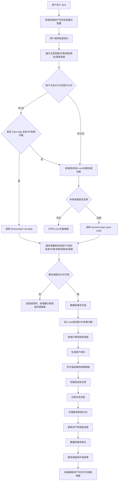
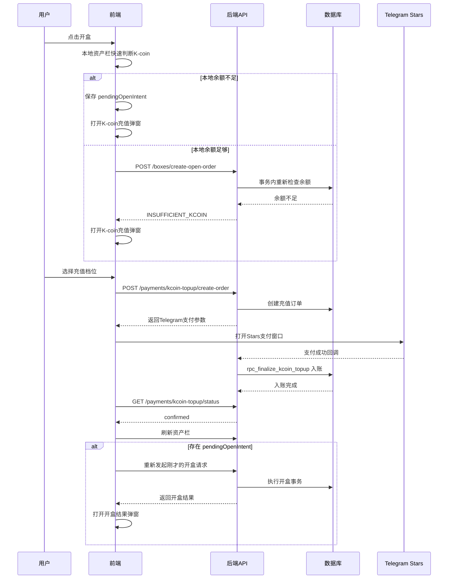
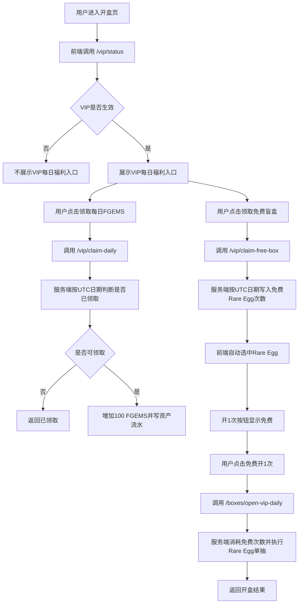

# TMA 项目：开盒功能开发设计文档

## 1. 功能目标

开盒功能是 TMA 项目的核心付费玩法之一。用户进入 `/box` 页面后，可以选择不同档次的盲盒蛋，使用 K-coin 进行单抽或十连抽，获得游戏藏品。

本功能需要同时连接以下系统：

* 资产系统：扣除 K-coin、充值 K-coin。
* 库存系统：开盒成功后生成用户藏品。
* 图鉴系统：首次获得藏品时写入图鉴发现记录。
* 任务系统：开盒成功后更新任务进度。
* 邀请系统：处理首开邀请奖励和后续邀请分红。
* VIP 系统：月卡用户每日领取 FGEMS 和免费 Rare Egg 单抽次数。
* 充值系统：K-coin 不足时通过 Telegram Stars 充值。
* 风控系统：开盒前进行限制判断。
* 市场 / NFT / 升级 / 进化系统：开出的藏品后续进入其他玩法。

核心原则：

> 前端只负责展示、交互和发起请求；真实价格、扣款、抽奖、保底、库存生成、图鉴记录、任务进度、邀请奖励都必须以后端和数据库事务为准。

---

## 2. 功能范围

### 2.1 本期需要实现

* `/box` 页面展示。
* 3 个盲盒档次切换。
* 当前盲盒主视觉图展示。
* 当前盲盒奖励预览。
* “可能获得”完整概率弹窗。
* 保底进度展示。
* K-coin 单抽。
* K-coin 十连。
* K-coin 不足时弹出充值弹窗。
* Telegram Stars 充值 K-coin。
* 充值到账后刷新资产栏。
* 充值成功后自动继续刚才的开盒操作。
* 开盒结果弹窗。
* VIP 每日 FGEMS 领取入口。
* VIP 每日免费 Rare Egg 单抽次数领取入口。
* VIP 免费 Rare Egg 单抽。
* 开盒结果查询。
* 支付 / 充值状态查询。
* 异常处理。
* 幂等处理。
* 风控检查。

### 2.2 本期不做

* 不在前端写死真实线上价格。
* 不在前端写死真实线上概率。
* 不在前端计算中奖结果。
* 不在前端直接修改用户余额。
* 不在前端直接生成库存。
* 不在前端直接写图鉴。
* 不在前端直接处理邀请奖励。
* 不做链上 NFT mint。
* 不做市场挂单。
* 不做藏品升级、进化、分解逻辑，只保留后续连接入口。

---

## 3. 盲盒档次设计

### 3.1 页面展示配置

| 页面显示          | 代码名称          | 档次 |      单抽展示价 |       十连展示价 | 当前保底        |
| ------------- | ------------- | -- | ---------: | ----------: | ----------- |
| Normal Egg    | starter_egg   | 普通 |  10 K-coin |   90 K-coin | 50 抽保底稀有或以上 |
| Rare Egg      | premium_egg   | 稀有 |  40 K-coin |  360 K-coin | 30 抽保底史诗或以上 |
| Legendary Egg | legendary_egg | 传奇 | 120 K-coin | 1080 K-coin | 15 抽保底传说或以上 |

说明：

* 十连展示价为 9 折。
* 前端可以使用静态配置做展示。
* 服务端必须读取后端配置或数据库配置作为真实价格。
* 最终扣款以后端为准。
* 前端提交的价格、概率、奖励池、保底信息一律不可信。

### 3.2 后端档次枚举

建议统一使用以下枚举：

```ts
type BoxCode = "starter_egg" | "premium_egg" | "legendary_egg";

type BoxTier = "normal" | "rare" | "legendary";

type OpenMode = "single" | "ten";
```

建议映射关系：

| box_code      | box_tier  |
| ------------- | --------- |
| starter_egg   | normal    |
| premium_egg   | rare      |
| legendary_egg | legendary |

---

## 4. 页面入口设计

### 4.1 路由

| 路由     | 说明           |
| ------ | ------------ |
| `/`    | 自动跳转到 `/box` |
| `/box` | 开盒主页面        |

### 4.2 导航

底部导航栏中的“开盒”按钮跳转到 `/box`。

### 4.3 顶部资产栏

顶部资产栏属于全局布局，不属于开盒页单独组件。

资产栏展示：

* 用户头像。
* K-coin 余额。
* FGEMS 余额。
* 钱包入口。

交互：

* 点击 K-coin 余额，打开 K-coin 充值弹窗。

---

## 5. 前端页面结构

开盒页建议拆成以下组件：

```txt
BoxPage
├── GlobalAssetBar                 // 全局资产栏，不属于 BoxPage 私有逻辑
├── BoxHero                        // 当前盲盒主视觉图
├── VipDailyEntry                  // VIP 每日福利入口
├── BoxTierTabs                    // Normal / Rare / Legendary 切换
├── BoxRewardPreview               // 当前盲盒奖励预览
├── PityProgress                   // 当前盲盒保底进度
├── OpenButtons                    // 开 1 次 / 开 10 次
├── RewardPoolModal                // 可能获得弹窗
├── KcoinTopupModal                // K-coin 充值弹窗
├── OpenResultModal                // 开盒结果弹窗
└── Loading / Error / Retry states
```

---

## 6. 前端状态设计

### 6.1 页面核心状态

```ts
type BoxPageState = {
  selectedBoxCode: "starter_egg" | "premium_egg" | "legendary_egg";
  selectedOpenMode: "single" | "ten" | null;

  assetSnapshot: {
    kcoin: number;
    fgems: number;
  };

  boxDisplayConfig: BoxDisplayConfig[];
  currentBoxPreview: BoxRewardPreviewItem[];
  currentPityProgress: PityProgress | null;

  vipStatus: VipStatus | null;
  vipFreeBoxAvailable: boolean;

  isOpening: boolean;
  isTopupModalOpen: boolean;
  isRewardPoolModalOpen: boolean;
  isResultModalOpen: boolean;

  pendingOpenIntent: PendingOpenIntent | null;
  latestOpenResult: BoxOpenResult | null;
};
```

### 6.2 待继续开盒意图

当用户点击开盒但余额不足，前端需要记住本次意图。充值到账后自动继续开盒。

```ts
type PendingOpenIntent = {
  boxCode: "starter_egg" | "premium_egg" | "legendary_egg";
  openMode: "single" | "ten";
  requiredKcoin: number;
  createdAt: string;
};
```

注意：

* pendingOpenIntent 只用于前端恢复用户操作。
* 不能作为后端扣款依据。
* 充值成功后重新请求服务端开盒。
* 服务端仍然要重新检查余额、价格、盲盒状态、风控状态和保底状态。

---

## 7. 前端交互流程

### 7.1 选择盲盒档位

用户点击 Normal Egg / Rare Egg / Legendary Egg：

1. 前端切换 `selectedBoxCode`。
2. 更新主视觉图。
3. 更新展示价格。
4. 更新奖励预览。
5. 请求或刷新当前盲盒保底进度。
6. 如果当前档位是 Rare Egg 且有 VIP 免费次数，则“开 1 次”显示免费。

---

### 7.2 查看全部可能获得

用户点击“查看全部”：

1. 打开 `RewardPoolModal`。
2. 展示当前盲盒完整奖励池。
3. 每一项展示：

   * 藏品缩略图。
   * 藏品名称。
   * 稀有度。
   * 概率。

说明：

* 前端可以用静态配置展示概率。
* 真实抽奖概率以后端配置为准。
* 如果项目后期有后台配置系统，建议改为从 API 读取展示概率。

---

### 7.3 点击“开 1 次”

前端逻辑：

1. 判断当前是否为 Rare Egg。
2. 判断用户是否有 VIP 免费 Rare Egg 次数。
3. 如果有免费次数：

   * 调用 `/boxes/open-vip-daily`。
4. 如果没有免费次数：

   * 使用本地资产栏余额做快速判断。
   * 如果本地余额不足，打开 K-coin 充值弹窗。
   * 如果本地余额足够，调用 `/boxes/create-open-order`。

注意：

本地余额判断只用于提升用户体验，不能代替后端校验。

---

### 7.4 点击“开 10 次”

前端逻辑：

1. 十连只使用 K-coin。
2. 十连不消耗 VIP 免费次数。
3. 使用本地资产栏余额做快速判断。
4. 如果余额不足，打开 K-coin 充值弹窗。
5. 如果余额足够，调用 `/boxes/create-open-order`。

---

### 7.5 K-coin 不足

弹窗展示：

* 当前操作需要多少 K-coin。
* 用户当前有多少 K-coin。
* 还差多少 K-coin。
* 推荐补足差额选项。
* 固定充值档位：

  * 500 K-coin。
  * 1000 K-coin。
  * 5000 K-coin。
  * 10000 K-coin。

充值比例：

```txt
1 Telegram Star = 1 K-coin
```

---

### 7.6 用户选择充值档位

流程：

1. 前端调用 `/payments/kcoin-topup/create-order`。
2. 服务端创建充值订单。
3. 服务端返回 Telegram Stars 支付参数。
4. 前端打开 Telegram Stars 支付窗口。
5. 用户完成支付或关闭支付窗口。
6. 前端轮询 `/payments/kcoin-topup/status`。
7. 服务端收到 Telegram 支付成功回调后，入账 K-coin。
8. 前端刷新顶部资产栏。
9. 如果存在 `pendingOpenIntent`，前端继续发起刚才那次开盒。

注意：

支付窗口关闭不等于支付成功。只有服务端确认到账后，余额才算增加。

---

## 8. 后端 API 设计

### 8.1 API 总览

| API                                  | 方法   | 说明                 |
| ------------------------------------ | ---- | ------------------ |
| `/boxes/create-open-order`           | POST | K-coin 普通开盒        |
| `/boxes/open-vip-daily`              | POST | VIP 免费 Rare Egg 单抽 |
| `/boxes/result`                      | GET  | 读取开盒结果             |
| `/boxes/payment-status`              | GET  | 读取开盒订单状态           |
| `/payments/kcoin-topup/create-order` | POST | 创建 K-coin 充值订单     |
| `/payments/kcoin-topup/status`       | GET  | 查询 K-coin 充值状态     |
| `/vip/status`                        | GET  | 查询 VIP 状态          |
| `/vip/claim-daily`                   | POST | 领取每日 FGEMS         |
| `/vip/claim-free-box`                | POST | 领取每日免费盲盒次数         |

---

## 9. API 详细设计

### 9.1 K-coin 开盒

#### Endpoint

```http
POST /boxes/create-open-order
```

#### Request

```json
{
  "box_code": "starter_egg",
  "open_mode": "single",
  "client_request_id": "uuid"
}
```

字段说明：

| 字段                | 类型     | 必填 | 说明           |
| ----------------- | ------ | -- | ------------ |
| box_code          | string | 是  | 盲盒代码         |
| open_mode         | string | 是  | single 或 ten |
| client_request_id | string | 是  | 前端生成的幂等 ID   |

#### Response 成功

```json
{
  "ok": true,
  "open_order_id": "uuid",
  "result_id": "uuid",
  "box_code": "starter_egg",
  "open_mode": "single",
  "cost_kcoin": 10,
  "refund_kcoin": 0,
  "items": [
    {
      "inventory_item_id": "uuid",
      "collectible_id": "uuid",
      "name": "xxx",
      "rarity": "rare",
      "evolution_stage": 1,
      "image_url": "https://...",
      "thumbnail_url": "https://...",
      "is_pity_hit": false
    }
  ],
  "asset_after": {
    "kcoin": 990,
    "fgems": 100
  },
  "pity_after": {
    "box_tier": "normal",
    "pity_count": 18,
    "hard_pity": 50
  }
}
```

#### Response 余额不足

```json
{
  "ok": false,
  "code": "INSUFFICIENT_KCOIN",
  "message": "K-coin balance is not enough.",
  "required_kcoin": 90,
  "current_kcoin": 30,
  "missing_kcoin": 60,
  "suggested_topup_options": [60, 500, 1000, 5000, 10000]
}
```

---

### 9.2 VIP 免费 Rare Egg 单抽

#### Endpoint

```http
POST /boxes/open-vip-daily
```

#### Request

```json
{
  "client_request_id": "uuid"
}
```

说明：

* 不允许传 box_code。
* 服务端固定为 Rare Egg。
* 只允许单抽。
* 不允许十连。
* 消耗用户今日已领取的免费 Rare Egg 次数。

#### Response

结构与 K-coin 开盒结果一致，但增加：

```json
{
  "payment_type": "vip_free_daily",
  "cost_kcoin": 0,
  "free_box_used": true
}
```

---

### 9.3 查询开盒结果

#### Endpoint

```http
GET /boxes/result?result_id=uuid
```

用途：

* 前端结果弹窗异常时重试。
* 网络断开后恢复结果。
* 用户刷新页面后重新读取最近一次开盒结果。

#### Response

```json
{
  "ok": true,
  "result": {
    "result_id": "uuid",
    "open_order_id": "uuid",
    "box_code": "starter_egg",
    "open_mode": "ten",
    "status": "completed",
    "items": []
  }
}
```

---

### 9.4 创建 K-coin 充值订单

#### Endpoint

```http
POST /payments/kcoin-topup/create-order
```

#### Request

```json
{
  "kcoin_amount": 500,
  "client_request_id": "uuid",
  "source": "box_insufficient_balance"
}
```

#### Response

```json
{
  "ok": true,
  "topup_order_id": "uuid",
  "kcoin_amount": 500,
  "star_amount": 500,
  "telegram_invoice_payload": "xxx",
  "payment_url": "https://..."
}
```

---

### 9.5 查询 K-coin 充值状态

#### Endpoint

```http
GET /payments/kcoin-topup/status?topup_order_id=uuid
```

#### Response

```json
{
  "ok": true,
  "status": "confirmed",
  "kcoin_amount": 500,
  "asset_after": {
    "kcoin": 530,
    "fgems": 100
  }
}
```

充值状态建议：

| 状态                   | 说明                  |
| -------------------- | ------------------- |
| created              | 订单已创建               |
| invoice_opened       | 支付窗口已打开             |
| user_closed          | 用户关闭支付窗口            |
| paid_pending_confirm | Telegram 已支付，服务端待确认 |
| crediting            | 服务端入账中              |
| confirmed            | 入账完成                |
| failed               | 支付失败                |
| expired              | 订单过期                |

---

## 10. 数据库表设计

说明：

如果项目中已经有资产表、库存表、图鉴表、任务表、邀请表、VIP 表，则优先复用原有表，不要重复建表。以下表结构是开盒功能需要的数据边界。

---

### 10.1 box_configs：盲盒配置表

```sql
create table box_configs (
  id uuid primary key default gen_random_uuid(),
  box_code text not null unique,
  box_tier text not null,
  display_name text not null,
  status text not null default 'active',
  starts_at timestamptz,
  ends_at timestamptz,
  sort_order int not null default 0,
  created_at timestamptz not null default now(),
  updated_at timestamptz not null default now()
);
```

字段说明：

| 字段        | 说明                                        |
| --------- | ----------------------------------------- |
| box_code  | starter_egg / premium_egg / legendary_egg |
| box_tier  | normal / rare / legendary                 |
| status    | active / paused / ended / hidden          |
| starts_at | 开始时间                                      |
| ends_at   | 结束时间                                      |

---

### 10.2 box_price_configs：盲盒价格配置表

```sql
create table box_price_configs (
  id uuid primary key default gen_random_uuid(),
  box_code text not null references box_configs(box_code),
  open_mode text not null,
  price_kcoin int not null check (price_kcoin >= 0),
  version int not null default 1,
  is_active boolean not null default true,
  created_at timestamptz not null default now(),
  unique (box_code, open_mode, version)
);
```

说明：

* open_mode 为 single 或 ten。
* 服务端读取 is_active = true 的价格。
* 真实扣款以该表为准。

---

### 10.3 box_reward_pool_entries：盲盒奖励池表

```sql
create table box_reward_pool_entries (
  id uuid primary key default gen_random_uuid(),
  box_code text not null references box_configs(box_code),
  collectible_id uuid not null,
  rarity text not null,
  weight int not null check (weight > 0),
  is_active boolean not null default true,
  pool_version int not null default 1,
  created_at timestamptz not null default now()
);
```

说明：

* 抽奖建议用 weight，不建议直接用浮点概率。
* 展示概率可以由 weight 计算。
* 后台可以通过 pool_version 做概率版本管理。

---

### 10.4 box_pity_rules：保底规则表

```sql
create table box_pity_rules (
  id uuid primary key default gen_random_uuid(),
  box_code text not null references box_configs(box_code),
  box_tier text not null,
  hard_pity int not null check (hard_pity > 0),
  target_min_rarity text not null,
  is_active boolean not null default true,
  version int not null default 1,
  created_at timestamptz not null default now(),
  unique (box_code, version)
);
```

配置示例：

| box_code      | hard_pity | target_min_rarity |
| ------------- | --------: | ----------------- |
| starter_egg   |        50 | rare              |
| premium_egg   |        30 | epic              |
| legendary_egg |        15 | legendary         |

---

### 10.5 user_box_pity：用户保底进度表

```sql
create table user_box_pity (
  id uuid primary key default gen_random_uuid(),
  user_id uuid not null,
  box_code text not null references box_configs(box_code),
  pity_rule_id uuid not null references box_pity_rules(id),
  pity_count int not null default 0 check (pity_count >= 0),
  updated_at timestamptz not null default now(),
  unique (user_id, box_code, pity_rule_id)
);
```

说明：

* 每个用户、每个盲盒、每个保底规则单独记录。
* 普通、稀有、传奇不能共用保底进度。
* 保底规则版本变化后，可以生成新的 pity_rule_id。

---

### 10.6 box_open_orders：开盒订单表

```sql
create table box_open_orders (
  id uuid primary key default gen_random_uuid(),
  user_id uuid not null,
  box_code text not null references box_configs(box_code),
  open_mode text not null,
  payment_type text not null,
  client_request_id text not null,
  status text not null default 'created',
  cost_kcoin int not null default 0,
  kcoin_reward int not null default 0,
  error_code text,
  created_at timestamptz not null default now(),
  completed_at timestamptz,
  unique (user_id, client_request_id)
);
```

payment_type：

| 值              | 说明           |
| -------------- | ------------ |
| kcoin          | 普通 K-coin 开盒 |
| vip_free_daily | VIP 每日免费开盒   |

status：

| 状态         | 说明  |
| ---------- | --- |
| created    | 已创建 |
| processing | 处理中 |
| completed  | 成功  |
| failed     | 失败  |
| cancelled  | 取消  |

---

### 10.7 box_open_results：开盒结果表

```sql
create table box_open_results (
  id uuid primary key default gen_random_uuid(),
  open_order_id uuid not null references box_open_orders(id),
  user_id uuid not null,
  box_code text not null,
  open_mode text not null,
  total_count int not null,
  created_at timestamptz not null default now()
);
```

---

### 10.8 box_open_result_items：开盒结果明细表

```sql
create table box_open_result_items (
  id uuid primary key default gen_random_uuid(),
  result_id uuid not null references box_open_results(id),
  open_order_id uuid not null references box_open_orders(id),
  user_id uuid not null,
  draw_index int not null,
  collectible_id uuid not null,
  inventory_item_id uuid not null,
  rarity text not null,
  is_pity_hit boolean not null default false,
  created_at timestamptz not null default now(),
  unique (result_id, draw_index)
);
```

说明：

* 十连需要 10 条明细。
* draw_index 从 1 到 10。
* 保底需要逐抽计算。
* 哪一抽触发保底，哪一条 `is_pity_hit = true`。

---

### 10.9 kcoin_topup_orders：K-coin 充值订单表

```sql
create table kcoin_topup_orders (
  id uuid primary key default gen_random_uuid(),
  user_id uuid not null,
  client_request_id text not null,
  kcoin_amount int not null check (kcoin_amount > 0),
  star_amount int not null check (star_amount > 0),
  source text,
  telegram_payment_charge_id text,
  provider_payment_charge_id text,
  status text not null default 'created',
  created_at timestamptz not null default now(),
  paid_at timestamptz,
  confirmed_at timestamptz,
  expired_at timestamptz,
  unique (user_id, client_request_id)
);
```

---

### 10.10 vip_daily_box_claims：VIP 每日免费盲盒领取表

```sql
create table vip_daily_box_claims (
  id uuid primary key default gen_random_uuid(),
  user_id uuid not null,
  claim_date date not null,
  box_code text not null default 'premium_egg',
  free_count int not null default 1,
  used_count int not null default 0,
  created_at timestamptz not null default now(),
  updated_at timestamptz not null default now(),
  unique (user_id, claim_date, box_code)
);
```

说明：

* claim_date 按 UTC 日期计算。
* 免费盲盒只用于 Rare Egg 单抽。
* free_count 默认 1。
* used_count 消耗后增加。

---

## 11. 核心数据库 RPC / 函数设计

建议将核心开盒逻辑放在数据库 RPC 或服务端事务中执行。为了减少并发和一致性问题，推荐使用数据库事务。

### 11.1 rpc_open_box_with_kcoin

用途：

* 普通 K-coin 开盒。
* 支持单抽和十连。
* 完成扣款、抽奖、保底、库存、图鉴、任务、邀请奖励。

入参：

```sql
p_user_id uuid,
p_box_code text,
p_open_mode text,
p_client_request_id text
```

核心步骤：

1. 校验用户状态。
2. 校验风控状态。
3. 校验 box_code 是否存在。
4. 校验盲盒是否 active。
5. 校验 open_mode 是否为 single 或 ten。
6. 获取真实价格。
7. 锁定用户资产行。
8. 判断 K-coin 是否足够。
9. 创建或复用开盒订单。
10. 扣除 K-coin，写资产流水。
11. 读取奖励池。
12. 读取保底规则。
13. 读取并锁定用户当前盲盒保底进度。
14. 按抽数逐次抽奖。
15. 每一抽判断是否触发保底。
16. 写入用户库存。
17. 写入开盒结果。
18. 写入图鉴发现记录。
19. 更新任务进度。
20. 处理邀请首开和后续邀请分红。
21. 更新订单状态为 completed。
22. 返回开盒结果。

---

### 11.2 rpc_open_box_with_vip_daily

用途：

* VIP 免费 Rare Egg 单抽。

入参：

```sql
p_user_id uuid,
p_client_request_id text
```

核心步骤：

1. 校验用户 VIP 是否生效。
2. 使用 UTC 日期判断今日是否已领取免费 Rare Egg 次数。
3. 判断今日免费次数是否还有剩余。
4. 固定 box_code = premium_egg。
5. 固定 open_mode = single。
6. 不扣 K-coin。
7. 消耗一次今日免费次数。
8. 执行抽奖、保底、库存、图鉴、任务流程。
9. 返回开盒结果。

说明：

VIP 免费开盒也应该写：

* 开盒订单。
* 开盒结果。
* 结果明细。
* 库存。
* 图鉴发现。
* 任务进度。

是否触发邀请奖励，需要根据你的经济设计决定。建议：

* VIP 免费开盒不触发邀请首付费奖励。
* VIP 免费开盒可以计入普通开盒任务进度。
* VIP 免费开盒是否影响保底，需要配置化。默认建议影响 Rare Egg 保底，因为用户确实完成了一次 Rare Egg 开盒。

---

### 11.3 rpc_finalize_kcoin_topup

用途：

* Telegram Stars 支付成功后，服务端回调确认充值入账。

入参：

```sql
p_topup_order_id uuid,
p_telegram_payment_charge_id text,
p_provider_payment_charge_id text
```

核心步骤：

1. 查询充值订单。
2. 判断订单状态是否已经 confirmed。
3. 如果已 confirmed，直接返回成功，保证幂等。
4. 校验订单未过期。
5. 锁定用户资产行。
6. 增加 K-coin。
7. 写资产流水。
8. 更新充值订单为 confirmed。
9. 返回用户最新资产。

---

## 12. 抽奖与保底设计

### 12.1 抽奖方式

建议使用权重抽奖：

```txt
每个奖励项有 weight
总权重 = 所有 active 奖励 weight 之和
随机数 r = 1 到 总权重
根据累计权重命中奖励
```

不要使用前端传入概率。

---

### 12.2 保底目标

| 盲盒            | 保底次数 | 保底目标  |
| ------------- | ---: | ----- |
| Normal Egg    |   50 | 稀有或以上 |
| Rare Egg      |   30 | 史诗或以上 |
| Legendary Egg |   15 | 传说或以上 |

---

### 12.3 保底计算规则

每一抽都按以下顺序处理：

1. 读取当前 pity_count。
2. 判断本抽是否达到 hard_pity。
3. 如果达到 hard_pity：

   * 从保底池抽取奖励。
   * 本抽标记 `is_pity_hit = true`。
4. 如果未达到 hard_pity：

   * 从普通奖励池抽取奖励。
5. 判断抽中奖励是否达到保底目标。
6. 如果达到目标：

   * 当前盲盒保底进度清零。
7. 如果未达到目标：

   * 当前盲盒保底进度 +1。

十连必须逐抽计算，不允许十连结束后统一计算。

---

### 12.4 错误示例

不要这样做：

```txt
用户用 Normal Egg 抽 49 次
然后去 Legendary Egg 抽 1 次触发 Legendary 保底
```

原因：

不同盲盒档次必须有独立保底进度。

---

## 13. 开盒主流程 Mermaid



---

## 14. 余额不足与充值流程 Mermaid



---

## 15. VIP 每日福利流程 Mermaid



---

## 16. 错误码设计

### 16.1 开盒错误码

| 错误码                    | 说明           | 前端处理                   |
| ---------------------- | ------------ | ---------------------- |
| UNAUTHORIZED           | 用户未登录        | 跳转登录或重新初始化 Telegram 登录 |
| USER_RISK_BLOCKED      | 用户被风控限制      | 展示限制提示                 |
| BOX_NOT_FOUND          | 盲盒不存在        | 展示系统错误                 |
| BOX_NOT_ACTIVE         | 盲盒未开始、已结束或暂停 | 展示盲盒不可用                |
| INVALID_OPEN_MODE      | 不是单抽或十连      | 展示系统错误                 |
| EMPTY_REWARD_POOL      | 奖励池为空        | 展示系统维护中                |
| INSUFFICIENT_KCOIN     | K-coin 不足    | 打开充值弹窗                 |
| IDEMPOTENCY_CONFLICT   | 同一请求被用于不同操作  | 提示刷新后重试                |
| LEDGER_WRITE_FAILED    | 资产流水失败       | 展示系统错误                 |
| INVENTORY_WRITE_FAILED | 库存写入失败       | 展示系统错误                 |
| OPEN_ORDER_PROCESSING  | 订单处理中        | 显示处理中，可查询结果            |
| OPEN_RESULT_NOT_FOUND  | 找不到结果        | 提供重试按钮                 |

---

### 16.2 充值错误码

| 错误码                     | 说明            | 前端处理   |
| ----------------------- | ------------- | ------ |
| TOPUP_ORDER_NOT_FOUND   | 充值订单不存在       | 提示订单异常 |
| TOPUP_ORDER_EXPIRED     | 订单过期          | 重新创建订单 |
| TELEGRAM_INVOICE_FAILED | 支付窗口打开失败      | 提示重试   |
| USER_CLOSED_PAYMENT     | 用户关闭支付窗口      | 保持充值弹窗 |
| PAYMENT_FAILED          | Telegram 支付失败 | 展示失败原因 |
| PAYMENT_PENDING         | 已支付但服务端未确认    | 显示到账中  |
| CREDITING               | 服务端入账中        | 继续轮询   |
| CONFIRMED               | 充值到账          | 刷新资产栏  |

---

## 17. 幂等设计

必须使用 `client_request_id` 防止重复请求。

### 17.1 开盒幂等

唯一约束：

```sql
unique (user_id, client_request_id)
```

规则：

* 同一个 user_id + client_request_id 只能对应一次开盒操作。
* 如果相同 client_request_id 的请求参数完全一致：

  * 如果订单已完成，直接返回已有结果。
  * 如果订单处理中，返回 processing。
* 如果相同 client_request_id 但参数不同：

  * 返回 `IDEMPOTENCY_CONFLICT`。

### 17.2 充值幂等

充值订单也需要：

```sql
unique (user_id, client_request_id)
```

Telegram 支付回调也要幂等：

* 同一个 `telegram_payment_charge_id` 只能入账一次。
* 如果重复收到回调，直接返回已处理成功。
* 不允许重复增加 K-coin。

---

## 18. 风控设计

开盒前建议检查：

* 用户是否被封禁。
* 用户是否被限制开盒。
* 用户短时间开盒频率是否异常。
* 用户是否存在大量失败支付。
* 用户是否存在异常退款风险。
* 用户是否使用重复请求攻击。
* 用户是否存在异常邀请关系。

建议风控结果：

| 状态     | 处理          |
| ------ | ----------- |
| pass   | 允许开盒        |
| warn   | 允许，但记录风险事件  |
| block  | 阻止开盒        |
| review | 进入人工审核或临时限制 |

风控事件建议写入：

```sql
risk_events (
  id uuid,
  user_id uuid,
  event_type text,
  risk_level text,
  metadata jsonb,
  created_at timestamptz
)
```

---

## 19. 资产流水设计

开盒相关资产流水类型：

| 类型                       | 说明              |
| ------------------------ | --------------- |
| box_open_cost            | 开盒扣除 K-coin     |
| kcoin_topup              | Stars 充值 K-coin |
| vip_daily_fgems          | VIP 每日 FGEMS    |
| invite_first_open_reward | 邀请首开奖励          |
| invite_open_rebate       | 邀请后续分红          |

资产流水必须记录：

* user_id。
* currency。
* amount。
* direction。
* reason。
* ref_type。
* ref_id。
* available_before。
* available_after。
* created_at。

---

## 20. 和其他系统的连接

### 20.1 库存系统

每次抽中藏品后插入用户库存：

```txt
user_inventory
- user_id
- collectible_id
- source = box_open
- source_ref_id = box_open_result_items.id
- status = available
```

---

### 20.2 图鉴系统

每次获得藏品后执行 upsert：

```txt
user_album_collections
- user_id
- collectible_id
- first_seen_at
- source = box_open
```

规则：

* 用户第一次获得该藏品时插入。
* 如果已经获得过，不重复插入。
* 用户后续出售、分解、进化该藏品，不影响图鉴已发现记录。

---

### 20.3 任务系统

开盒成功后更新任务进度：

可能任务类型：

* 今日开盒次数。
* 累计开盒次数。
* 开出稀有藏品。
* 开出史诗藏品。
* 完成十连。
* VIP 免费开盒。

---

### 20.4 邀请系统

K-coin 付费开盒成功后：

* 判断是否用户首次有效开盒。
* 如果是首次有效开盒，触发邀请首开奖励。
* 后续成功开盒可以按配置触发邀请分红。

建议：

* VIP 免费开盒不触发“首付费开盒奖励”。
* 只有真实消耗 K-coin 的开盒才算付费开盒。

---

### 20.5 VIP 系统

VIP 系统提供：

* 是否月卡生效。
* 今日是否可领取 FGEMS。
* 今日是否可领取免费 Rare Egg 次数。
* 今日免费 Rare Egg 是否已使用。

---

## 21. 前端弹窗设计

### 21.1 可能获得弹窗

展示字段：

* 缩略图。
* 藏品名字。
* 稀有度。
* 概率。

状态：

* loading。
* success。
* empty。
* error。

---

### 21.2 K-coin 充值弹窗

展示字段：

* 本次需要 K-coin。
* 当前 K-coin。
* 差额 K-coin。
* 推荐补足差额。
* 固定档位：500 / 1000 / 5000 / 10000。

按钮：

* 选择充值档位。
* 关闭。
* 刷新到账状态。

---

### 21.3 开盒结果弹窗

展示字段：

* 本次获得几件藏品。
* 每件藏品图片。
* 名字。
* 稀有度。
* 进化阶级。
* 是否保底命中。
* 关闭按钮。
* 查看库存按钮。
* 再开一次按钮。
* 再开十次按钮。

---

## 22. 安全要求

### 22.1 前端不可信

前端传入的以下内容都不可信：

* 价格。
* 用户余额。
* 概率。
* 奖励结果。
* 保底进度。
* VIP 状态。
* 免费次数。
* 邀请关系。

### 22.2 服务端必须校验

服务端必须校验：

* Telegram 登录态。
* user_id。
* box_code。
* open_mode。
* 盲盒状态。
* 真实价格。
* 真实奖励池。
* 用户真实余额。
* 用户真实 VIP 状态。
* 用户真实免费次数。
* 风控状态。
* 幂等 ID。
* 订单状态。

### 22.3 数据库事务

以下操作必须在同一个事务中完成：

* 扣 K-coin。
* 抽奖。
* 更新保底。
* 生成库存。
* 写开盒结果。
* 写图鉴记录。
* 写任务进度。
* 写邀请奖励。
* 写资产流水。
* 更新订单状态。

任何一步失败，整个开盒事务回滚。

---

## 23. 测试用例

### 23.1 普通开盒

| 用例                   | 预期                      |
| -------------------- | ----------------------- |
| Normal Egg 单抽余额足够    | 扣 10 K-coin，生成 1 个藏品    |
| Normal Egg 十连余额足够    | 扣 90 K-coin，生成 10 个藏品   |
| Rare Egg 单抽余额足够      | 扣 40 K-coin，生成 1 个藏品    |
| Legendary Egg 十连余额足够 | 扣 1080 K-coin，生成 10 个藏品 |

---

### 23.2 余额不足

| 用例                          | 预期                    |
| --------------------------- | --------------------- |
| 用户 1 K-coin，点击 10 K-coin 单抽 | 返回 INSUFFICIENT_KCOIN |
| 前端本地余额不足                    | 立即打开充值弹窗              |
| 服务端判断余额不足                   | 返回差额和充值建议             |
| 充值完成后                       | 刷新资产栏                 |
| 充值完成且存在 pendingOpenIntent   | 自动继续刚才开盒              |

---

### 23.3 VIP 免费开盒

| 用例               | 预期                        |
| ---------------- | ------------------------- |
| VIP 生效           | 展示每日福利入口                  |
| 非 VIP            | 不展示每日福利入口                 |
| 领取免费 Rare Egg    | 今日 free_count 增加          |
| 使用免费 Rare Egg 单抽 | 不扣 K-coin                 |
| 免费次数已用完          | 返回 FREE_BOX_NOT_AVAILABLE |
| 免费次数尝试十连         | 拒绝                        |

---

### 23.4 保底

| 用例                   | 预期          |
| -------------------- | ----------- |
| Normal Egg 未达到 50 抽  | 正常奖励池抽奖     |
| Normal Egg 第 50 抽    | 从稀有或以上保底池抽  |
| Rare Egg 第 30 抽      | 从史诗或以上保底池抽  |
| Legendary Egg 第 15 抽 | 从传说或以上保底池抽  |
| 十连中第 3 抽触发保底         | 第 3 条结果标记保底 |
| 抽中达到目标稀有度            | 当前盲盒保底清零    |
| 不同盲盒切换               | 保底进度互不影响    |

---

### 23.5 幂等

| 用例                        | 预期                      |
| ------------------------- | ----------------------- |
| 相同 client_request_id 重复提交 | 不重复扣款，不重复生成库存           |
| 相同 client_request_id 参数不同 | 返回 IDEMPOTENCY_CONFLICT |
| Telegram 支付回调重复发送         | 不重复入账                   |
| 前端断网后重试 result            | 可以读取已有开盒结果              |

---

## 24. 验收标准

### 24.1 前端验收

* `/` 可以自动跳转到 `/box`。
* `/box` 能正常展示 3 个盲盒档次。
* 切换盲盒后，主视觉、价格、奖励预览、保底展示同步变化。
* 点击“查看全部”可以打开完整概率弹窗。
* 点击“开 1 次”可以正常单抽。
* 点击“开 10 次”可以正常十连。
* 本地余额不足时可以立即打开充值弹窗。
* 服务端返回余额不足时也可以打开充值弹窗。
* 充值成功后可以刷新资产栏。
* 充值成功后可以自动继续刚才的开盒。
* 开盒结果弹窗展示正确。
* 保底命中时显示“保底”标记。
* VIP 用户能看到每日福利入口。
* 非 VIP 用户看不到 VIP 福利入口。
* VIP 免费 Rare Egg 只能用于单抽。

---

### 24.2 后端验收

* 真实价格以后端配置为准。
* 前端传入价格不会影响扣款。
* 余额不足不会扣款。
* 开盒失败不会生成库存。
* 开盒失败不会写图鉴。
* 开盒失败不会写任务进度。
* 开盒成功必须写资产流水。
* 开盒成功必须写库存。
* 开盒成功必须写开盒结果。
* 开盒成功必须写结果明细。
* 开盒成功必须更新保底。
* 十连逐抽计算保底。
* 不同盲盒保底互不影响。
* 幂等请求不会重复扣款。
* 支付回调重复不会重复入账。
* VIP 免费开盒不扣 K-coin。
* VIP 免费开盒会消耗免费次数。

---

### 24.3 数据库验收

* 用户资产不会出现负数。
* 并发开盒不会导致重复扣款或余额错误。
* 并发充值不会重复入账。
* user_box_pity 有唯一约束。
* box_open_orders 有幂等唯一约束。
* box_open_result_items 能记录每一抽。
* 图鉴发现记录使用 upsert，不重复插入。
* 充值订单状态流转完整。
* 资产流水 before / after 正确。

---

## 25. 开发顺序建议

### 第一步：数据库

1. 创建盲盒配置表。
2. 创建价格配置表。
3. 创建奖励池表。
4. 创建保底规则表。
5. 创建用户保底进度表。
6. 创建开盒订单表。
7. 创建开盒结果表。
8. 创建开盒结果明细表。
9. 创建 K-coin 充值订单表。
10. 创建 VIP 免费盲盒领取表。

---

### 第二步：RPC / 服务端事务

1. 实现 K-coin 开盒事务。
2. 实现 VIP 免费开盒事务。
3. 实现 K-coin 充值入账事务。
4. 实现开盒结果查询。
5. 实现保底进度查询。
6. 实现错误码统一返回。

---

### 第三步：后端 API

1. `/boxes/create-open-order`
2. `/boxes/open-vip-daily`
3. `/boxes/result`
4. `/boxes/payment-status`
5. `/payments/kcoin-topup/create-order`
6. `/payments/kcoin-topup/status`
7. `/vip/status`
8. `/vip/claim-daily`
9. `/vip/claim-free-box`

---

### 第四步：前端页面

1. `/box` 页面。
2. 盲盒档位切换。
3. 奖励预览。
4. 保底进度。
5. 开盒按钮。
6. 充值弹窗。
7. 可能获得弹窗。
8. 开盒结果弹窗。
9. VIP 每日福利入口。
10. 资产栏刷新。
11. pendingOpenIntent 自动继续开盒。

---

### 第五步：测试

1. 单抽测试。
2. 十连测试。
3. 余额不足测试。
4. 充值测试。
5. 保底测试。
6. VIP 免费开盒测试。
7. 幂等测试。
8. 并发测试。
9. 异常回滚测试。
10. 任务、图鉴、邀请系统联动测试。

---

## 26. 给 AI 编码时的禁止规则

开发时必须遵守：

1. 不允许前端生成开盒结果。
2. 不允许前端直接扣余额。
3. 不允许前端直接加余额。
4. 不允许前端直接写库存。
5. 不允许前端直接写图鉴。
6. 不允许相信前端传来的价格。
7. 不允许相信前端传来的概率。
8. 不允许不同盲盒共用保底进度。
9. 不允许十连结束后才统一计算保底。
10. 不允许开盒部分成功。
11. 不允许支付窗口关闭就认为充值成功。
12. 不允许 Telegram 支付回调重复入账。
13. 不允许同一个幂等 ID 执行不同开盒操作。
14. 不允许 VIP 免费次数用于十连。
15. 不允许 VIP 免费次数用于非 Rare Egg。
16. 不允许服务端错误时前端伪造成功结果。

---

## 27. 最终交付物

本功能完成后应交付：

* 数据库 migration。
* RLS policy。
* RPC / SQL 函数。
* 后端 API。
* 前端 `/box` 页面。
* 前端弹窗组件。
* 前端 API client。
* 前端状态管理。
* 测试 seed。
* 单元测试。
* 集成测试。
* Mermaid 流程图。
* 错误码文档。
* 验收测试清单。
