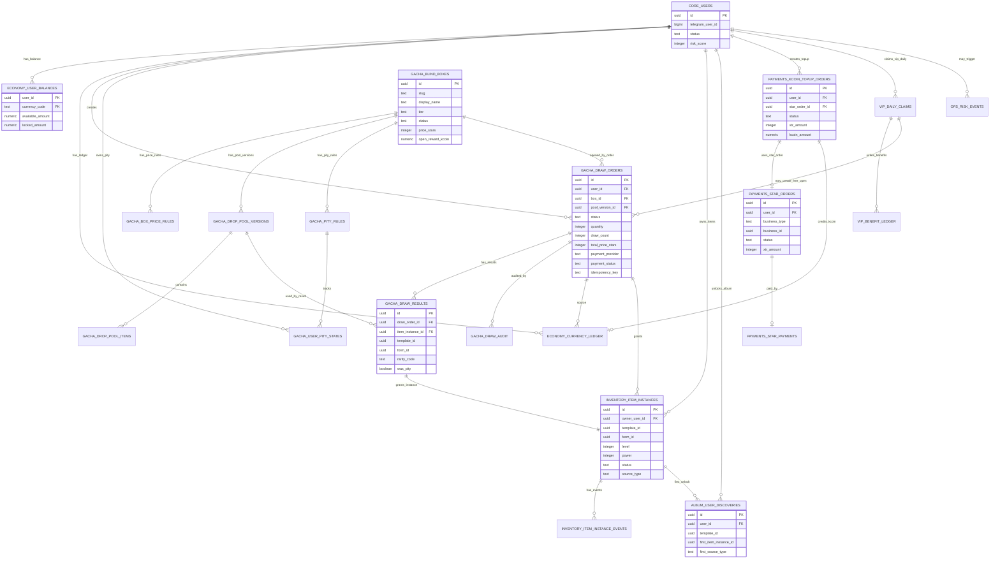
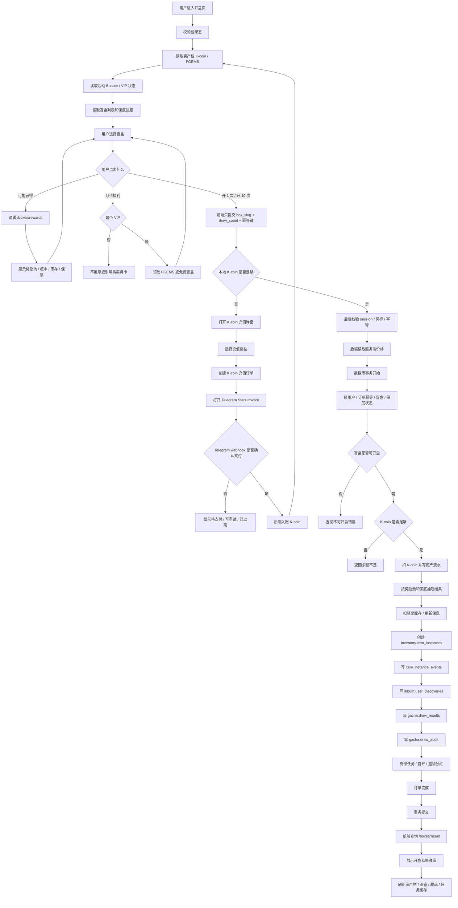
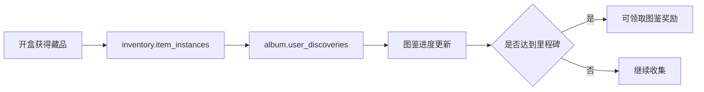
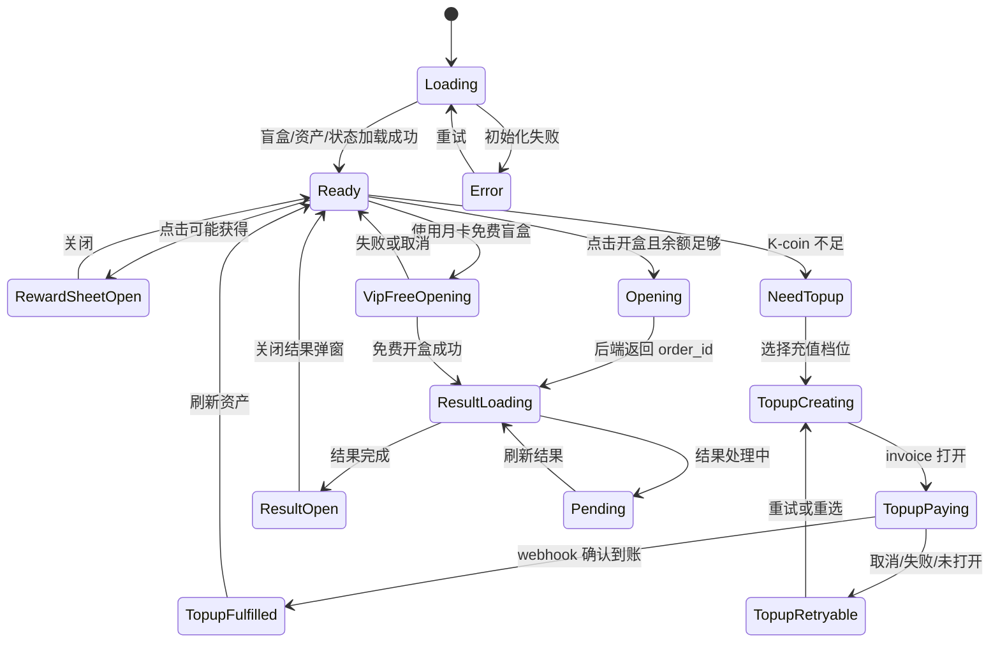
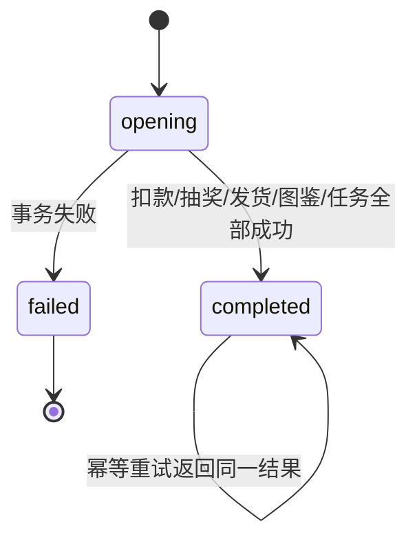
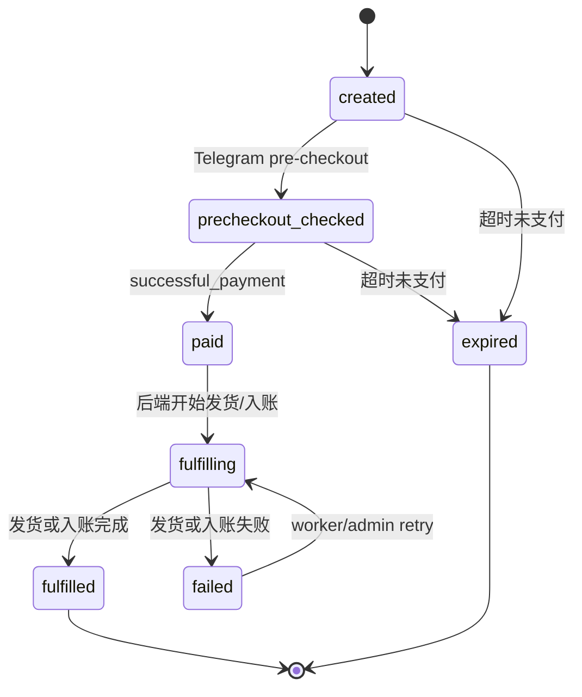

# 开盒界面业务流程设计方案

本文用于重构开盒流程时给产品、前端、后端、数据库和测试一起对齐。重点不是只画一个页面，而是把“用户点击开盒”背后的资产、概率、保底、库存、图鉴、任务、邀请、月卡、充值和风控全部串起来。

## 0. 编写依据与边界

本文已参考：

- `项目功能与界面说明.md`
- `图鉴功能.md`
- `图鉴功能mermaid.md`
- 当前开盒前端：`apps/web/src/features/box/**`
- 当前开盒后端：`api/boxes/**`、`api/payments/kcoin-topup/**`
- 当前校验规则：`packages/validation/src/box.schemas.ts`、`packages/validation/src/payment.schemas.ts`
- 当前远程 Supabase 项目 `tmaGame` 的真实表结构、RPC 列表和部分业务配置

本文不写可直接执行的 SQL，不创建 migration，不推送远程 Supabase。后面如果真的要改数据库，必须先在 Docker 本地 Supabase 测试通过，再问你：“是否需要推送应用到远程supabase。”

当前远程 Supabase 真实状态里有一个需要确认的不一致点：

| 位置 | 当前内容 |
| --- | --- |
| `项目功能与界面说明.md` | 开盒后返还 100 K-coin |
| `apps/web/src/features/box/staticBoxes.ts` | `KCOIN_RETURN_PER_DRAW = 100` |
| `.env.example` | `OPEN_BOX_REWARD_KCOIN=100` |
| 远程 `gacha.blind_boxes` | `open_reward_kcoin = 0` |
| 远程 `api.gacha_open_with_kcoin_from_server_price` | 不再执行 `open_box_rebate` 入账 |

所以本文不会把“每抽返 100 K-coin”写成当前线上已生效规则，只会写成“业务待确认项”。

## 1. 功能定位

开盒界面是游戏的核心交易入口。它不是普通展示页，而是一个强事务页面：

1. 用户选择盲盒档位。
2. 用户选择开 1 次或开 10 次。
3. 后端确认价格、余额、活动状态、奖励池、库存和保底。
4. 后端扣 K-coin。
5. 后端生成随机结果。
6. 后端发放藏品。
7. 后端点亮图鉴。
8. 后端推进任务、邀请首开、分红等业务。
9. 前端只展示结果和余额变化。

开盒页的目标有 5 个：

| 目标 | 说明 |
| --- | --- |
| 付费转化 | 引导用户用 K-coin 开盒；K-coin 不足时再走 Stars 充值 |
| 收集驱动 | 通过可能获得、稀有度、保底进度引导继续开盒 |
| 资产闭环 | 开盒产出藏品，藏品进入库存、图鉴、交易、升级、进化、分解和 Mint |
| 增长闭环 | 首次开盒触发邀请任务、邀请奖励、分红统计 |
| 安全闭环 | 价格、概率、扣款、发货、保底都以后端和数据库事务为准 |

## 2. 当前关键方案对比

这里列出重构时会遇到的几个分叉。本文会给推荐，但不替你最终拍板。

### 2.1 支付方式

| 方案 | 做法 | 优点 | 缺点 | 推荐 |
| --- | --- | --- | --- | --- |
| A. K-coin 直接开盒，Stars 只充值 K-coin | 当前主流程。用户余额够就直接扣 K-coin；余额不足才充值 | 资产模型简单，开盒能同步完成，少等 webhook | 要保证 K-coin 入账、扣款、流水和充值状态很稳 | 推荐 |
| B. Stars 直接开盒 | 每次开盒直接拉 Telegram Stars 支付 | 少一层 K-coin 充值概念 | 支付后要等 webhook，失败补发复杂，用户体验更慢 | 不推荐作为主流程 |
| C. K-coin + Stars 直接开盒混用 | 用户可选 K-coin 或 Stars | 看起来灵活 | 资产、退款、补发、风控、账本全变复杂 | 不推荐 |

建议：商业化主流程用 A。Stars 只作为 K-coin 的外部支付入口，开盒事务只认 K-coin。

### 2.2 盲盒展示数据来源

| 方案 | 做法 | 优点 | 缺点 | 推荐 |
| --- | --- | --- | --- | --- |
| A. 前端静态写死三档盒子 | 当前前端 `createStaticBoxes` 主要这样做 | 页面快，开发简单 | 容易和远程价格、状态、返还、图片、奖励池不一致 | 不推荐长期使用 |
| B. 全部从 `/boxes/list` 读取 | 前端只展示后端返回 | 和线上配置一致 | 需要处理加载、失败、缓存 | 推荐 |
| C. 静态兜底 + 后端数据优先 | 先显示骨架或兜底，后端返回后替换 | 体验较稳 | 如果兜底当成真实数据，会继续漂移 | 可作为过渡 |

建议：重构后 `/boxes/list` 是展示唯一可信来源。静态配置最多做骨架或本地开发兜底。

### 2.3 开盒价格来源

| 方案 | 做法 | 优点 | 缺点 | 推荐 |
| --- | --- | --- | --- | --- |
| A. Vercel 服务端环境变量定价 | 当前 `/boxes/create-open-order` 从 `GACHA_*` env 读取价格 | 不暴露真实运营配置，热修方便 | 要保证前端展示和 env 一致 | 当前可继续 |
| B. 数据库 `gacha.box_price_rules` 定价 | 由远程 DB 的价格规则决定 | 和盲盒配置更统一 | 运营改价需要严格发布流程，不能信前端缓存 | 可作为下一阶段 |
| C. 前端传价格给后端 | 前端提交价格、折扣、总价 | 前端写起来省事 | 极不安全，用户可改包 | 禁止 |

建议：短期继续 A，但 `/boxes/list` 也要由后端按同一套价格源返回展示价。中长期可以改成 B，但必须做价格版本、审计和测试。

### 2.4 每抽是否返 K-coin

| 方案 | 做法 | 优点 | 缺点 | 推荐 |
| --- | --- | --- | --- | --- |
| A. 每抽返 100 K-coin | 总说明、前端静态和 `.env.example` 当前这样写 | 用户获得感强，利于留存 | 会改变经济模型，可能被刷返利 | 需要你确认 |
| B. 不返 K-coin | 远程库当前实际配置是 0 | 经济模型更干净 | 和旧说明、前端展示不一致 | 当前线上实际状态 |
| C. 只做活动返利 | 特定活动、特定盒子、特定时间返 | 可控 | 规则复杂，需要展示清楚 | 可考虑 |

建议：先确认是否真的要恢复每抽 100 K-coin。没有确认前，前端不要继续展示“返还 100”。

## 3. 用户操作流程

### 3.1 进入开盒页

用户从底部导航或活动 Banner 进入开盒页后：

1. 前端确认登录态。
2. 前端读取资产栏：K-coin、FGEMS、头像、钱包入口。
3. 前端读取顶部活动 Banner。
4. 前端读取月卡状态。
5. 前端读取盲盒列表、价格、状态、保底进度。
6. 默认选中第一个可开启盲盒。

正确原则：

```text
前端可以缓存展示数据，但不能把缓存当成交易依据。
开盒时重新以后端事务校验为准。
```

### 3.2 普通 K-coin 开盒流程

1. 用户选择盲盒档位。
2. 用户点击“可能获得”查看奖励池、概率、保底规则。
3. 用户点击“开 1 次”或“开 10 次”。
4. 前端只提交 `box_slug` 和 `draw_count`。
5. 后端读取服务端价格配置。
6. 后端校验用户、余额、盲盒状态、奖励池、保底、库存、幂等键。
7. 后端在一个数据库事务里扣 K-coin、抽奖、发藏品、写结果、写图鉴、写任务进度。
8. 前端根据 `order_id` 查询结果并展示。

### 3.3 K-coin 不足时的充值流程

1. 前端本地先用资产栏余额做一次体验判断。
2. 如果余额不足，打开 K-coin 充值弹窗。
3. 充值档位为 1、500、1000、5000、10000。
4. 前端提交充值档位和幂等键。
5. 后端创建 `payments.kcoin_topup_orders` 和 `payments.star_orders`。
6. 后端创建 Telegram Stars invoice。
7. 用户完成 Stars 支付。
8. Telegram webhook 到后端。
9. 后端确认支付并给用户入账 K-coin。
10. 前端刷新充值状态和资产栏。
11. 用户再点击开盒。

充值原则：

```text
1 Star = 1 K-coin 只是充值规则。
开盒事务不应该直接信任 Stars 支付窗口返回值。
```

### 3.4 月卡免费盲盒流程

当前开盒页已经接了月卡入口：

1. 用户是 VIP 时，开盒页展示每日 FGEMS 和免费盲盒入口。
2. 用户领取免费盲盒后，前端选中 `premium_egg`。
3. 用户点击开 1 次时，走 `api.vip_open_daily_free_premium_egg`。
4. 后端校验月卡、每日领取状态、免费次数。
5. 后端消耗一次免费次数，并发放一次 `premium_egg` 开盒结果。

注意：月卡免费盲盒只应该支持开 1 次，不应该支持 10 连免费。

## 4. 界面结构

建议开盒页面结构如下：

```text
┌──────────────────────────────┐
│ 顶部资产栏：头像 / K-coin / FGEMS / 钱包 │
├──────────────────────────────┤
│ 活动 Banner：月卡、限时活动、充值活动       │
├──────────────────────────────┤
│ 当前盲盒主视觉：蛋图、品质氛围、状态       │
├──────────────────────────────┤
│ 月卡福利入口：每日 FGEMS / 免费盲盒        │
├──────────────────────────────┤
│ 盲盒档位选择：Normal / Rare / Legendary   │
├──────────────────────────────┤
│ 状态提示：未开始 / 已结束 / 售罄 / 暂停    │
├──────────────────────────────┤
│ 可能获得：奖励预览 + 点击展开             │
├──────────────────────────────┤
│ 保底进度：当前次数 / 保底阈值 / 目标稀有度 │
├──────────────────────────────┤
│ 操作区：开 1 次 / 开 10 次                │
└──────────────────────────────┘
```

弹窗结构：

| 弹窗 | 作用 |
| --- | --- |
| 可能获得弹窗 | 展示当前盲盒生效奖励池、概率、库存、是否保底池 |
| 充值 K-coin 弹窗 | K-coin 不足时选择 Stars 充值档位 |
| 支付等待弹窗 | 仅用于充值或历史 Stars 订单等待 webhook |
| 开盒结果弹窗 | 展示本次获得的藏品、稀有度、是否保底、余额变化 |
| 错误弹窗/Toast | 展示余额不足、活动结束、奖励池为空、风控拦截等 |

## 5. 点击交互设计

| 用户点击 | 前端动作 | 后端动作 | 反馈 |
| --- | --- | --- | --- |
| 选择盲盒档位 | 切换 `selectedBoxSlug` | 无 | 主视觉、价格、保底、奖励预览切换 |
| 可能获得 | 打开奖励池弹窗 | 推荐从 `/boxes/rewards` 取当前池 | 展示概率、稀有度、库存、保底标记 |
| 开 1 次 | 校验按钮锁、余额、月卡免费状态 | 创建并执行开盒事务 | 成功后显示结果 |
| 开 10 次 | 校验按钮锁、余额 | 创建并执行 10 连事务 | 成功后显示 10 个结果 |
| K-coin 不足 | 打开充值弹窗 | 无 | 展示缺口和充值档位 |
| 选择充值档位 | 创建充值订单并打开 Stars invoice | 创建 topup order + star order | 展示支付状态 |
| 刷新到账状态 | 查询充值状态 | 读取支付和入账状态 | 到账后刷新资产 |
| 月卡每日 FGEMS | 调用月卡领取接口 | 发放 FGEMS | Toast 提示到账 |
| 月卡免费盲盒 | 领取或使用免费盲盒 | 消耗免费次数并开 Rare Egg | 显示结果 |
| 关闭结果弹窗 | 清空本地 `resultOrderId` | 无 | 回到开盒页 |

按钮交互细节：

1. 请求中按钮必须禁用，防止重复点击。
2. 同一开盒动作必须带 `X-Idempotency-Key`。
3. 如果结果接口返回 pending，前端只能展示“处理中”，不能自己生成结果。
4. 如果用户关闭支付窗口，不代表支付成功。
5. 如果支付已成功但发货失败，要展示“补发中”，不要引导重复支付。

## 6. 前端页面交互细节

当前 `BoxPage.tsx` 主要状态如下：

| 状态 | 作用 |
| --- | --- |
| `selectedBoxSlug` | 当前选择的盲盒档位 |
| `rewardsOpen` | 是否打开可能获得弹窗 |
| `resultOrderId` | 当前要读取结果的订单 ID |
| `paymentPendingOrder` | 支付或发货还没终态的订单 |
| `paymentOpenNotice` | Telegram invoice 打开、关闭、失败、pending 等提示 |
| `vipFreeModeSelected` | 用户是否选择使用今日月卡免费盲盒 |
| `openRequestLockedRef` | 防止同一页面重复触发开盒 |

前端必须遵守：

1. 前端只提交用户动作：`box_slug`、`draw_count`、充值 `amount`、幂等键。
2. 前端不能提交价格、概率、奖励结果、保底命中结果。
3. 前端不能保存真实服务端密钥、Bot Token、service role key、TON 私钥。
4. 前端展示余额只是体验判断，最终余额以后端扣款为准。
5. 前端展示“可能获得”只能来自后端当前生效奖励池，不能写死概率。
6. 前端可以做按钮锁，但后端必须也做幂等和事务锁。

当前需要重构的前端点：

| 问题 | 影响 | 建议 |
| --- | --- | --- |
| `createStaticBoxes` 静态生成盒子 | 可能和远程状态、价格、返还不一致 | 改为 `/boxes/list` 数据优先 |
| `staticRewards` 静态奖励池 | 可能和真实奖励池不一致 | 改为 `/boxes/rewards` 数据优先 |
| 前端显示每抽返 100 | 远程当前是 0 | 等你确认后再统一 |
| 开盒页仍保留 Stars 开盒等待逻辑 | 当前主流程是 K-coin 开盒 | 保留充值等待，弱化或移除 Stars 直接开盒展示 |

## 7. 后端接口现状与推荐接口设计

### 7.1 当前已有接口

| 接口 | 方法 | 当前作用 |
| --- | --- | --- |
| `/boxes/list` | GET | 读取可展示盲盒，底层 RPC：`api.gacha_list_boxes` |
| `/boxes/rewards` | GET | 读取盲盒奖励池，底层 RPC：`api.gacha_get_box_rewards` |
| `/boxes/create-open-order` | POST | K-coin 开盒，底层 RPC：`api.gacha_open_with_kcoin_from_server_price` |
| `/boxes/result` | GET | 查询开盒结果，底层 RPC：`api.gacha_get_draw_result` |
| `/boxes/payment-status` | GET | 查询历史 Stars 订单/发货状态，底层 RPC：`api.gacha_get_payment_status` |
| `/boxes/open-vip-daily` | POST | 月卡免费 Rare Egg，底层 RPC：`api.vip_open_daily_free_premium_egg` |
| `/payments/kcoin-topup/create-order` | POST | 创建 K-coin 充值订单和 Stars invoice |
| `/payments/kcoin-topup/status` | GET | 查询 K-coin 充值到账状态 |
| `/vip/status` | GET | 开盒页月卡状态入口 |
| `/vip/claim-daily` | POST | 领取每日 FGEMS |
| `/vip/claim-free-box` | POST | 领取每日免费盲盒资格 |

### 7.2 推荐请求和响应边界

#### GET `/boxes/list`

用途：开盒页初始化，返回可展示盲盒。

前端可传：

```json
{
  "limit": 20,
  "status": "active",
  "tier": "rare"
}
```

后端应返回：

```json
{
  "items": [
    {
      "id": "box uuid",
      "slug": "starter_egg",
      "name": "Normal Egg",
      "tier": "normal",
      "status": "active",
      "single_star_price": 10,
      "ten_draw_price": 90,
      "discount_bps": 1000,
      "is_openable": true,
      "disabled_reason": null,
      "kcoin_return_per_draw": 0,
      "pity_progress": {}
    }
  ],
  "server_time": "..."
}
```

注意：字段名可以按现有接口保持 snake_case，前端已有 normalize 层。重点是：展示价必须和开盒事务使用同一价格源。

#### GET `/boxes/rewards`

用途：点击“可能获得”后读取当前生效奖励池。

前端只传：

```json
{
  "boxId": "box uuid",
  "includeSoldOut": true
}
```

后端返回：

- 奖励池版本。
- 奖励项。
- 概率展示。
- 稀有度。
- 图片。
- 是否保底 eligible。
- 是否限量、剩余库存。
- 当前保底规则。

#### POST `/boxes/create-open-order`

用途：普通 K-coin 开盒。

前端只传：

```json
{
  "box_slug": "premium_egg",
  "draw_count": 10
}
```

请求头必须带：

```text
X-Idempotency-Key: box-open:...
```

前端禁止传：

- `price`
- `totalPrice`
- `probability`
- `reward`
- `rarity`
- `userId`
- `balance`
- `pity`

后端返回：

```json
{
  "order_id": "draw order uuid",
  "paid_kcoin": 270,
  "total_price_kcoin": 270,
  "draw_count": 10,
  "order_status": "completed",
  "payment_status": "fulfilled",
  "result_ready": true
}
```

#### GET `/boxes/result`

用途：查询开盒结果。

前端传：

```json
{
  "orderId": "draw order uuid",
  "includeItems": true
}
```

后端返回：

- 订单状态。
- 支付方式。
- 消耗 K-coin。
- 返还 K-coin。
- 当前余额。
- 每个抽卡结果。
- `item_instance_id`。
- `template_id`。
- `rarity_code`。
- `form_index`。
- `was_pity`。

#### POST `/payments/kcoin-topup/create-order`

用途：K-coin 不足时充值。

前端只传：

```json
{
  "amount": 1000
}
```

允许档位：1、500、1000、5000、10000。

#### GET `/payments/kcoin-topup/status`

用途：刷新充值到账状态。

前端传：

```json
{
  "orderId": "topup order uuid"
}
```

#### 可选接口：`/boxes/history` 和 `/boxes/pity`

当前仓库里有 `api/boxes/history.ts`、`api/boxes/pity.ts` 文件，但读取结果为空。重构时有两个选择：

| 方案 | 优点 | 缺点 |
| --- | --- | --- |
| 补齐实现 | 可以独立展示历史和保底 | 多两个接口要维护 |
| 删除空文件和入口 | 减少误解 | 后续要做历史时再建 |

建议：如果开盒页要展示“最近开盒记录”，就补齐 `/boxes/history`。如果只展示当前结果，就先删掉空接口或明确标记未启用。

## 8. RPC / 数据库函数设计

本文只描述职责，不写 SQL。

### 8.1 当前已有核心 RPC

| RPC | 作用 | 调用方 |
| --- | --- | --- |
| `api.gacha_list_boxes` | 返回盲盒列表、状态、价格、保底 | `/boxes/list` |
| `api.gacha_get_box_rewards` | 返回当前奖励池和概率 | `/boxes/rewards` |
| `api.gacha_open_with_kcoin_from_server_price` | K-coin 扣款并开盒 | `/boxes/create-open-order` |
| `api.gacha_get_draw_result` | 查询开盒结果 | `/boxes/result` |
| `api.gacha_get_payment_status` | 查询历史 Stars 订单状态 | `/boxes/payment-status` |
| `api.gacha_count_recent_draw_orders` | 统计用户近期订单数 | 高频风险记录 |
| `api.kcoin_topup_create_order` | 创建 K-coin 充值订单 | `/payments/kcoin-topup/create-order` |
| `api.kcoin_topup_get_status` | 查询 K-coin 充值状态 | `/payments/kcoin-topup/status` |
| `api.kcoin_topup_process_paid_order` | Stars 支付成功后给 K-coin 入账 | Telegram webhook |
| `api.vip_open_daily_free_premium_egg` | 月卡免费开 Rare Egg | `/boxes/open-vip-daily` |
| `api.ops_check_rate_limit` | API 限频桶 | `withApiHandler` |
| `api.risk_record_event` | 写入风险事件 | 风控记录 |

### 8.2 推荐 RPC 分层

| 层级 | 做什么 | 不做什么 |
| --- | --- | --- |
| Vercel API | 校验 session、读 env、做参数校验、调用 RPC、统一错误码 | 不直接拼复杂事务 |
| `api.*` RPC | 对 service role 暴露稳定业务函数 | 不直接开放给前端 anon/authenticated |
| 业务 schema 表 | 存真实数据 | 不直接暴露给前端写 |
| RLS | 防止误读误写 | 不替代后端事务校验 |

推荐把开盒所有真实写入放进一个 RPC 事务里，至少包括：

1. 锁用户或幂等键。
2. 校验用户状态。
3. 校验盲盒状态。
4. 校验价格快照。
5. 校验 K-coin 余额。
6. 扣 K-coin 并写 `economy.currency_ledger`。
7. 抽取奖励。
8. 更新奖励池限量库存。
9. 更新 `gacha.user_pity_states`。
10. 写 `inventory.item_instances`。
11. 写 `inventory.item_instance_events`。
12. 写 `album.user_discoveries`。
13. 写 `gacha.draw_results`。
14. 写 `gacha.draw_audit`。
15. 写任务进度。
16. 写邀请首开和分红。
17. 更新 `gacha.draw_orders` 为完成。

## 9. 涉及数据库

### 9.1 开盒主链路相关表

| 表 | 作用 |
| --- | --- |
| `core.users` | 用户主表，开盒前校验用户状态 |
| `economy.user_balances` | 用户 K-coin / FGEMS 余额 |
| `economy.currency_ledger` | 资产流水，扣款、充值、奖励都要落流水 |
| `gacha.blind_boxes` | 盲盒基础配置，包含 slug、名称、状态、时间、库存、图片 |
| `gacha.box_price_rules` | 单抽/十连价格规则，当前远程十连 `discount_bps=1000` |
| `gacha.drop_pool_versions` | 奖励池版本，避免活动中直接覆盖概率 |
| `gacha.drop_pool_items` | 奖励池条目，包含模板、形态、稀有度、权重、库存 |
| `gacha.pity_rules` | 每个盲盒的保底规则 |
| `gacha.user_pity_states` | 用户在每个盲盒、每条保底规则下的进度 |
| `gacha.draw_orders` | 开盒订单，记录用户、盲盒、数量、价格、状态 |
| `gacha.draw_results` | 每次抽卡结果 |
| `gacha.draw_audit` | 抽卡审计快照 |
| `inventory.item_instances` | 用户获得的具体藏品实例 |
| `inventory.item_instance_events` | 藏品实例事件流水 |
| `album.user_discoveries` | 图鉴永久点亮记录 |
| `payments.kcoin_topup_orders` | K-coin 充值业务订单 |
| `payments.star_orders` | Telegram Stars 支付订单 |
| `payments.star_payments` | Telegram Stars 成功支付记录 |
| `vip.vip_subscriptions` | 月卡订阅 |
| `vip.vip_daily_claims` | 月卡每日领取和免费盲盒次数 |
| `vip.vip_benefit_ledger` | 月卡福利流水 |
| `ops.api_rate_limits` | API 限频桶 |
| `ops.risk_events` | 风险事件 |
| `ops.idempotency_keys` | 幂等记录，部分业务使用 |

### 9.2 当前远程盲盒配置快照

远程当前有三个 active 盲盒：

| slug | 名称 | tier | 单抽价格 | 十连折扣 | 当前返还 |
| --- | --- | --- | ---: | ---: | ---: |
| `starter_egg` | Normal Egg | normal | 10 | 9 折 | 0 |
| `premium_egg` | Rare Egg | rare | 30 | 9 折 | 0 |
| `legendary_egg` | Legendary Egg | legendary | 80 | 9 折 | 0 |

## 10. 推荐表关系 ERD



## 11. 核心业务规则

### 11.1 前端只提交动作

允许提交：

- 选择哪个盲盒：`box_slug`
- 开几次：`draw_count = 1 | 10`
- 充值档位：`amount`
- 幂等键：`X-Idempotency-Key`

禁止提交：

- 价格
- 折扣
- 用户余额
- 奖励结果
- 稀有度
- 保底是否命中
- 真实用户 ID
- 支付成功标记

### 11.2 开盒必须是后端事务

一次开盒事务必须保证：

```text
扣款成功但没发货，不允许静默丢失。
发货成功但没扣款，不允许出现。
结果已生成，重复请求必须返回同一结果。
```

### 11.3 盲盒状态规则

| 状态 | 前端展示 | 是否可开 |
| --- | --- | --- |
| `active` | 正常展示 | 是 |
| `not_started` | 未开始 | 否 |
| `paused` | 暂停中 | 否 |
| `ended` | 已结束 | 否 |
| `sold_out` | 已售罄 | 否 |
| `hidden` / `draft` | 不应展示给普通用户 | 否 |

实际远程 `gacha.blind_boxes.status` 还支持 `hidden`，前端类型里当前是 `archived`，这两个状态命名也需要对齐。

### 11.4 价格和折扣规则

当前三档：

| 盲盒 | 单抽 | 十连 |
| --- | ---: | ---: |
| Normal Egg | 10 K-coin | 90 K-coin |
| Rare Egg | 30 K-coin | 270 K-coin |
| Legendary Egg | 80 K-coin | 720 K-coin |

十连 9 折当前用 `discount_bps=1000` 表示“优惠 10%”，不是“支付 10%”。

### 11.5 保底规则

当前 seed 规则是：

| 盲盒 | 保底 |
| --- | --- |
| `starter_egg` | 30 次保底 RARE |
| `premium_egg` | 50 次保底 EPIC |
| `legendary_egg` | 80 次保底 LEGENDARY |

保底规则：

1. 每个盲盒独立计算。
2. 每个用户独立计算。
3. 命中目标稀有度或以上时重置。
4. 十连应该逐抽推进保底，不是一次性只加 10 后再判断。
5. 前端只展示后端返回的保底进度。

### 11.6 图鉴规则

开盒获得藏品后必须写入 `album.user_discoveries`。

规则：

```text
图鉴点亮 = 用户曾经合法获得过该藏品。
不是当前库存数量。
```

所以用户后续出售、分解、进化消耗、Mint 上链，都不应该取消图鉴点亮。

### 11.7 任务和邀请规则

开盒成功后可以触发：

- 首次开盒任务。
- 邀请人首开奖励。
- 被邀请人首开奖励。
- 邀请人后续分红。
- 每日任务进度。

这些必须由后端根据真实 `gacha.draw_orders` 和事务结果判断，前端不能上报“我已经开盒成功”。

## 12. 推荐业务规则

### 12.1 普通用户

1. 可查看所有 displayable 盲盒。
2. 只有 `active` 且有有效奖励池的盲盒能开。
3. K-coin 足够才能开盒。
4. K-coin 不足时只引导充值，不自动创建开盒订单。
5. 单次订单只允许 1 或 10 抽。
6. 10 连固定 9 折，除非运营活动另有配置。

### 12.2 VIP 用户

1. 进入开盒页展示每日 FGEMS 和免费盲盒入口。
2. 免费盲盒只绑定 `premium_egg`。
3. 免费盲盒只允许开 1 次。
4. 免费盲盒也必须走同一套奖励池、保底、库存、图鉴和审计逻辑。
5. 免费次数必须写 `vip.vip_daily_claims.free_box_used_count` 和 `vip.vip_benefit_ledger`。

### 12.3 充值

1. 只允许固定档位：1、500、1000、5000、10000。
2. 充值成功必须写 `payments.star_payments`。
3. K-coin 到账必须写 `economy.currency_ledger`。
4. 充值订单、Stars 订单、资产流水必须能互相追溯。
5. 支付成功但入账失败时必须可重试补发。

### 12.4 返还 K-coin

这里需要你确认最终规则。确认前建议：

1. 前端先不要展示固定“返还 100”。
2. `/boxes/list` 返回多少，前端展示多少。
3. `/boxes/result` 返回多少，结果弹窗展示多少。
4. 如果要恢复返还，必须同时改远程配置、RPC、前端展示、账本校验和测试。

## 13. 防刷与安全规则

### 13.1 当前已有防护

| 防护 | 当前位置 |
| --- | --- |
| API 通用限频 | `withApiHandler` + `ops.api_rate_limits` |
| 开盒创建限频 | `box.create_open_order` 用户 12 次/分钟，IP 40 次/分钟 |
| 结果查询限频 | `box.result` 用户 60 次/分钟 |
| 幂等键 | `X-Idempotency-Key` + `gacha.draw_orders.idempotency_key` |
| 用户状态校验 | `core.users.status` |
| 高频开盒风险记录 | 5 分钟内订单数达到 5 记 `gacha_high_frequency` |
| 风险拦截 | `assertUserRiskAllowed` |
| 事务锁 | RPC 内对幂等键使用 advisory lock |
| RLS | 远程表已启用 RLS |
| service role RPC | 关键 RPC 不开放给 anon/authenticated |

### 13.2 需要加强的点

当前 `api/_shared/riskGuards.ts` 里创建 riskControl 时：

```text
enableRateLimit: false
skipRateLimit: true
skipEventWrite: true
```

这表示 risk guard 主要做风险判断，限频依赖 `withApiHandler`，风险事件很多地方靠手动 `recordRiskEventSafely`。建议重构时确认是否要让 riskControl 自己也写事件，至少对 deny/review 级别写入 `ops.risk_events`。

推荐安全规则：

1. 开盒、充值、月卡免费盲盒都必须校验 session。
2. 开盒请求必须带幂等键。
3. 同一个幂等键只能对应同一个用户、同一个盲盒、同一个次数。
4. 用户状态不是 `active` 时禁止开盒。
5. 用户有 `gacha_blocked` 等风控 flag 时禁止开盒。
6. 价格从服务端读取，不能信前端。
7. 奖励池只用 active 且时间有效的版本。
8. 库存扣减必须在事务内锁行。
9. 保底状态必须在事务内锁行。
10. K-coin 扣款必须和发货在同一事务里。
11. 支付 webhook 必须校验 Telegram secret。
12. Telegram payment charge id 必须唯一。
13. 失败补发必须幂等。
14. 所有错误不要泄露 service role key、Bot Token、SQL 细节。

## 14. 完整业务闭环

开盒不是单点功能，它应该形成完整循环：

```text
广告投放
  -> 用户进入 Telegram Mini App
  -> 登录
  -> 领取任务/邀请/充值
  -> 开盒
  -> 获得藏品
  -> 点亮图鉴
  -> 去升级/进化/分解/出售/Mint
  -> 任务奖励和邀请分红
  -> 资产增长
  -> 继续开盒或交易
```

关键闭环：

| 闭环 | 说明 |
| --- | --- |
| 付费闭环 | Stars 充值 K-coin，K-coin 开盒 |
| 收集闭环 | 开盒获得藏品，点亮图鉴，缺失藏品引导继续开盒或市场购买 |
| 成长闭环 | 藏品可升级、进化、分解 |
| 交易闭环 | 多余藏品可出售，缺少藏品可购买 |
| 链上闭环 | 藏品可 Mint 到 TON 钱包 |
| 增长闭环 | 邀请好友首开，双方奖励，邀请人分红 |
| 留存闭环 | 月卡每日 FGEMS、免费盲盒、每日任务 |

## 15. 完整总流程 Mermaid



## 16. 和其他功能及界面的连接流程

### 16.1 资产栏

开盒成功后：

1. K-coin 减少。
2. 如果有返还规则，则 K-coin 增加。
3. 资产栏刷新。

资产栏只能展示后端余额，不能自己用前端计算结果长期覆盖。

### 16.2 图鉴

开盒成功后写 `album.user_discoveries`，图鉴页面自然点亮。

流程：



### 16.3 藏品页

开盒结果里的 `item_instance_id` 会进入藏品页：

- 查看详情。
- 升级。
- 进化。
- 分解。
- 出售。
- Mint。

### 16.4 交易市场

开盒产出的藏品可以进入出售页。图鉴缺失藏品也可以从图鉴引导到市场购买。

连接建议：

1. 开盒结果弹窗可以有“去藏品查看”。
2. 图鉴未收集项可以有“去开这个盲盒”和“去市场购买”。
3. 市场购买成功后也要写 `album.user_discoveries`。

### 16.5 任务和邀请

开盒成功后由后端推进任务：

- 首次开盒。
- 每日开盒次数。
- 邀请好友完成首开。
- 邀请人分红。

前端只刷新任务列表，不上报任务完成。

### 16.6 月卡

开盒页是月卡价值展示入口：

- 每日 FGEMS。
- 每日免费 Rare Egg。

月卡相关状态必须以后端 `vip_get_status` 为准。

### 16.7 钱包和 Mint

开盒产出的是站内藏品实例。用户后续可以连接 TON 钱包并 Mint。

开盒页不处理 TON 私钥，不处理链上交易签名。

## 17. 状态机

### 17.1 页面状态机



### 17.2 开盒订单状态机

当前 K-coin 主流程建议简化为：



历史 Stars 直接开盒或充值支付状态机：



## 18. 不建议的设计

1. 不建议前端写死盲盒价格、概率、奖励池、返还规则。
2. 不建议前端提交价格或支付成功状态。
3. 不建议前端生成随机结果。
4. 不建议扣款和发货拆成两个不可恢复的事务。
5. 不建议没有幂等键就创建开盒订单。
6. 不建议一个用户高频开盒只记录日志不做后续处理。
7. 不建议把 Bot Token、service role key、TON 私钥放到前端。
8. 不建议直接让前端访问业务表写数据。
9. 不建议为了省事关闭 RLS。
10. 不建议开盒页面做后台管理系统。
11. 不建议 Stars 直接开盒和 K-coin 开盒长期混用。
12. 不建议结果弹窗只展示“成功”，不展示订单状态、补发状态和客服入口。
13. 不建议用“库存前端判断”代替数据库锁。
14. 不建议改奖励池时覆盖旧版本，应发布新版本。
15. 不建议把返还 K-coin、邀请分红、任务奖励混在同一条流水里。

## 19. 开发开盒界面的其他说明

### 19.1 验收标准

最少要覆盖：

1. 三档盲盒能正常展示。
2. 状态不是 active 时不能开。
3. K-coin 足够时，单抽成功。
4. K-coin 足够时，十连成功且价格 9 折。
5. K-coin 不足时打开充值弹窗。
6. 充值成功后 K-coin 到账。
7. 开盒结果包含藏品实例。
8. 开盒后图鉴点亮。
9. 开盒后任务进度推进。
10. 保底进度正确推进和重置。
11. 重复点击不会重复扣款。
12. 同一幂等键重试返回同一订单或同一结果。
13. 高并发下余额不会扣成负数。
14. 支付成功但入账/发货失败时能补发。

### 19.2 测试建议

| 测试 | 重点 |
| --- | --- |
| 单元测试 | 价格计算、状态判断、错误映射、normalize |
| API 测试 | create-open-order、result、topup、vip free |
| 数据库测试 | 保底、库存、幂等、余额流水、图鉴点亮 |
| E2E 测试 | 余额不足充值、单抽、十连、结果弹窗 |
| 并发测试 | 同时点多次、同幂等键、多设备同账号 |
| 风控测试 | 高频请求、被封用户、异常 user-agent |

### 19.3 监控建议

建议监控：

- 开盒请求数。
- 开盒成功率。
- 开盒失败原因。
- K-coin 扣款失败数。
- 发货失败数。
- 补发成功数。
- 每个盲盒消耗 K-coin。
- 每个盲盒产出稀有度分布。
- 保底命中次数。
- 充值创建数。
- 充值支付成功数。
- 充值到账失败数。
- 高频开盒风险事件。

## 20. 总结建议

1. 开盒主流程建议确定为“K-coin 直接开盒，Stars 只充值 K-coin”。
2. 开盒页展示数据建议从 `/boxes/list` 和 `/boxes/rewards` 读取，不再长期依赖静态配置。
3. 价格、折扣、概率、保底、库存、扣款、发货都必须以后端和数据库事务为准。
4. `open_reward_kcoin` 当前远程为 0，但项目说明和前端静态是 100，这个必须先确认后再改。
5. 月卡免费盲盒可以保留，但要明确只开 `premium_egg` 的 1 次。
6. 高频开盒不应只记录风险，后续要结合 `ops.risk_events` 和用户 flag 做限制。
7. 不做后台管理系统；运营配置可以通过受控脚本、迁移、受限 RPC 和审计流程处理。

## 21. 需要你确认的问题

1. 是否恢复“每抽返还 100 K-coin”？
2. 开盒展示价格是否以后端 env 为准，还是改成数据库 `gacha.box_price_rules` 为准？
3. 前端是否允许保留静态盲盒作为加载失败兜底，还是完全以后端返回为准？
4. 是否彻底移除 Stars 直接开盒，只保留 Stars 充值 K-coin？
5. 是否要补齐 `/boxes/history` 和 `/boxes/pity`，还是先删除空接口文件避免误解？
