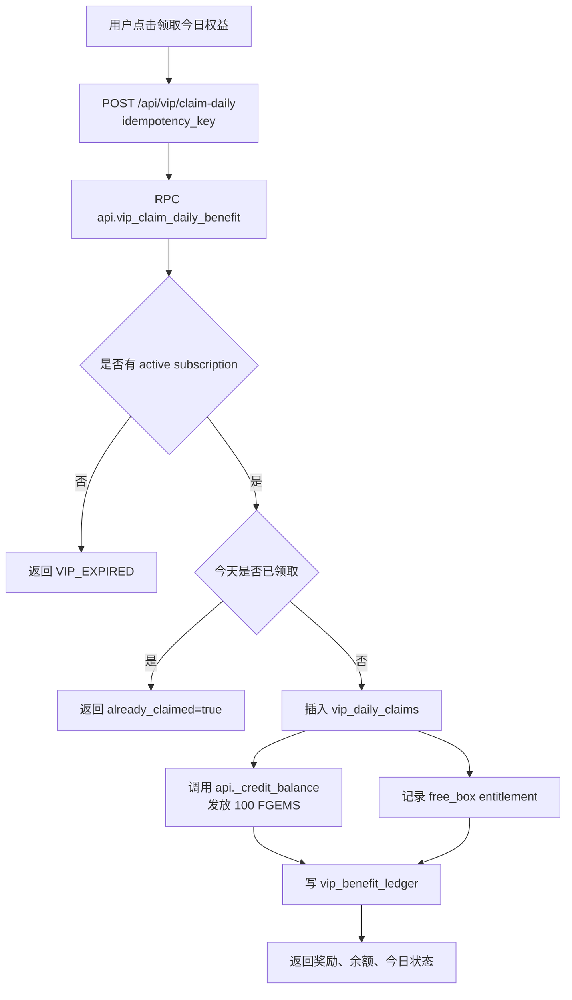
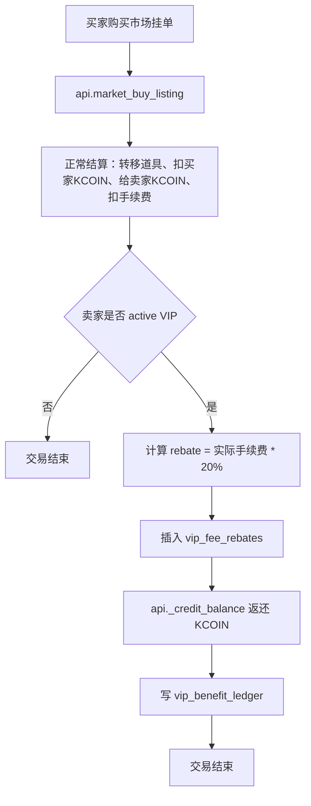

## 1. 总体实现判断

你的项目现在已经具备接入月卡的基础设施：前端是 Telegram Mini App，后端通过 Vercel API 调 Supabase RPC/Postgres transaction，真实登录、资产、开盒、支付、库存、市场、任务等都要求走 `frontend -> Vercel API -> Supabase RPC / Postgres transaction`，并且明确不能把 Bot Token、Supabase service role key、TON 私钥等密钥放到前端。

所以月卡也应该沿用这个架构：

```text
TMA 前端
→ Vercel API /api/vip/*
→ Supabase api.* RPC
→ payments.star_orders / payments.star_payments
→ vip.* 业务表
→ economy.currency_ledger / user_balances
→ market / gacha / inventory 等权益消费点
```

不要让前端直接写月卡表，也不要把“是否 VIP、能否领福利、手续费返还比例”等判断放到前端。前端只展示状态，所有核心判断由 RPC 完成。

---

## 2. 月卡功能建议范围

首发建议做 **一档 VIP 月卡**，权益按你文档里的“留存 + 每日打开率 + 促进开盒”定位，不要一次性发完 30 天奖励。文档中明确建议每天手动领取福利，并且不要购买成功后一次性发放 30 天奖励。

首发功能建议如下：

| 功能         |                     首发实现 | 说明                                      |
| ---------- | -----------------------: | --------------------------------------- |
| 月卡价格       | `vip_plans.price_xtr` 配置 | 文档价格有 359/499 冲突，先配置化                   |
| 有效期        |                     30 天 | `subscription_period_seconds = 2592000` |
| 每日免费福利蛋    |         每天 1 次，手动领取，当日过期 | 建议先实现成“VIP 免费开指定福利箱 1 次”                |
| 每日 Fgems   |        每天 100 FGEMS，手动领取 | 走 `economy.currency_ledger`，不要直接改余额     |
| 交易手续费优惠    |             成交后返还手续费 20% | 先做成交后 rebate，避免改市场结算主逻辑过多               |
| VIP 徽章/头像框 |                   订阅期间展示 | 可用 `vip_subscriptions` 状态 + 前端 UI 判断    |
| 自动续费       |                  二期或首发预留 | 表结构先支持，支付链路可先做一次性 30 天开通                |

---

## 3. 完整业务流程

### 3.1 购买月卡流程

1. 用户进入月卡页，前端调用 `/api/vip/status`。
2. 后端读取当前用户 session，不接收前端传入的 `user_id`。
3. RPC 返回当前是否 VIP、到期时间、今日福利是否可领、价格、权益配置。
4. 用户点击购买，前端调用 `/api/vip/create-order`，带 `plan_id` 和幂等键。
5. Supabase RPC `api.vip_create_order_checked` 创建：

   * `payments.star_orders`
   * `vip.vip_orders`
   * invoice payload
6. Vercel API 调 Telegram `createInvoiceLink` 或复用你现有的 Stars invoice 创建封装。
7. 前端用 Telegram WebApp 打开 invoice。
8. Telegram 发送 `pre_checkout_query` 到 `/api/telegram/webhook`。
9. 现有 webhook 会识别 `pre_checkout_query` 与 `successful_payment`，并调用支付处理函数。当前 webhook 已经具备 pre-checkout 和 successful payment 分支。
10. 付款成功后，`payments.star_payments` 记录 `telegram_payment_charge_id`，再调用新的 `api.vip_process_paid_order`。
11. RPC 开通或延长 VIP：

    * 没有有效月卡：`starts_at = now()`，`ends_at = now() + 30 days`
    * 已有有效月卡：`starts_at` 不变，`ends_at = old_ends_at + 30 days`
12. 返回前端 `/api/vip/status`，页面展示“已开通”。

当前支付模块已经把 invoice 创建、pre-checkout、successful payment、付款后 fulfillment 分成了比较清晰的层。`processTelegramSuccessfulPaymentUpdate` 会先记录付款，再根据开关决定是否 fulfillment，并调用对应 RPC。 现在它只调用 `gacha_process_paid_order`，月卡需要在这里根据 `payments.star_orders.business_type` 分流到 `vip_process_paid_order`。

---

### 3.2 每日福利领取流程

1. 用户进入月卡页或任务页，前端调用 `/api/vip/status`。
2. 后端判断：

   * 当前有 active 月卡
   * `now() < ends_at`
   * 今天是否已领过
3. 用户点击“领取今日权益”，前端调用 `/api/vip/claim-daily`，带幂等键。
4. RPC `api.vip_claim_daily_benefit` 在一个事务内：

   * 锁定用户当前有效订阅
   * 检查 `vip_daily_claims` 是否已有今日记录
   * 插入 `vip_daily_claims`
   * 给 100 FGEMS，调用现有 `api._credit_balance`
   * 写 `vip_benefit_ledger`
   * 如果包含免费福利蛋，发放“权益券”或直接生成一次 0 Stars 福利箱开盒机会
5. 返回领取结果、余额变化、明天可领取时间。

现有经济系统已经有 `economy.currencies`、`economy.user_balances`、`economy.currency_ledger`。`currency_ledger` 是不可变资产流水，`user_balances` 是快速余额快照。 因此每日 FGEMS 必须走 `_credit_balance`，不要直接 `update user_balances`。当前 `_credit_balance` 已经处理余额行创建、行锁、流水写入和幂等键。

---

### 3.3 每日免费福利蛋流程

这里有两种实现方式，推荐先做 **权益券模式**：

```text
领取每日福利
→ 写 vip_daily_claims
→ 发放 1 张 free_benefit_box_ticket
→ 用户点击开启福利蛋
→ gacha_create_vip_free_order / gacha_process_vip_free_order
→ 生成 draw_results + inventory
→ 消耗权益券
```

原因：你现在的 gacha 支付开盒逻辑已经强绑定 `payments.star_orders` 和 Telegram Stars，现有 `gacha_create_order_checked` 会创建 `payments.star_orders`，并且价格来自 blind box/price rule。 如果直接让 VIP 开盒价格为 0，容易污染现有 Stars 支付订单逻辑。权益券模式更清晰：付费月卡开通是一笔 Stars 订单；每日福利蛋是 VIP 权益消耗，不是 Stars 支付。

数据库上可以做一个新表：

```text
vip.vip_entitlements
- id
- user_id
- subscription_id
- entitlement_type = 'daily_benefit_box_ticket'
- quantity_total
- quantity_remaining
- claim_date
- expires_at
- status
```

或者更轻量：把“今日可开福利蛋”直接记录在 `vip_daily_claims.free_box_used_at`。首发建议用后者，简单可控。

---

### 3.4 交易手续费返还流程

现有 `economy.fee_rules` 中已经有 `MARKET_SELL_FEE`，当前市场卖出手续费是 500 bps，也就是 5%。 VIP 返还 20% 应按“实际扣除手续费的 20%”返还，而不是把手续费从 5% 直接变成 4%。例如：

```text
成交金额 1000 KCOIN
普通手续费 5% = 50 KCOIN
VIP 返还 20% * 50 = 10 KCOIN
卖家实际净手续费 = 40 KCOIN
```

推荐做“成交后返还”：

1. 市场成交逻辑照旧扣手续费。
2. `market_buy_listing` 或其底层 settlement 完成后，检查卖家是否 active VIP。
3. 如果是 VIP，插入 `vip_fee_rebates`。
4. 调用 `api._credit_balance` 给卖家返还 KCOIN。
5. `vip_benefit_ledger` 记录一笔 `fee_rebate`。

这样不会破坏原有市场结算、报表、风控和对账。当前项目有 `market_buy_listing`、`market_create_listing`、`market_cancel_listing` 等 RPC，说明市场交易已经通过 Supabase RPC 管控。 月卡只需要在成交完成后加一段 rebate 逻辑。

---

## 4. Mermaid 业务流程图

### 4.1 月卡购买与开通

```mermaid
flowchart TD
  A[用户进入月卡页] --> B[GET /api/vip/status]
  B --> C[返回套餐、VIP状态、今日福利状态]
  C --> D{用户点击购买}
  D --> E[POST /api/vip/create-order<br/>plan_id + idempotency_key]
  E --> F[RPC api.vip_create_order_checked]
  F --> G[写 payments.star_orders<br/>business_type=vip_monthly]
  F --> H[写 vip.vip_orders<br/>status=created]
  G --> I[Vercel API 创建 Telegram Stars Invoice]
  I --> J[前端 openInvoice]
  J --> K[Telegram pre_checkout_query]
  K --> L[/api/telegram/webhook]
  L --> M[api.payment_mark_precheckout_checked]
  M --> N{金额/用户/payload 是否匹配}
  N -- 否 --> O[answerPreCheckoutQuery false]
  N -- 是 --> P[answerPreCheckoutQuery true]
  P --> Q[Telegram successful_payment]
  Q --> R[/api/telegram/webhook]
  R --> S[api.payment_record_successful_payment]
  S --> T[按 star_orders.business_type 分流]
  T --> U[api.vip_process_paid_order]
  U --> V[开通或延长 vip_subscriptions]
  V --> W[更新 vip_orders/payments.star_orders=fulfilled]
  W --> X[前端刷新 /api/vip/status]
```

### 4.2 每日权益领取



### 4.3 VIP 手续费返还



---

## 5. 数据库开发规划

建议新建 `vip` schema，而不是把所有月卡表塞进 `payments` 或 `core`。`payments` 只保留支付订单和支付流水；`vip` 管月卡业务状态与权益。

### 5.1 新增 schema

```sql
create schema if not exists vip;
```

项目当前已经按业务拆分 schema，例如 `core,economy,catalog,gacha,inventory,market,payments,tasks,album,onchain,ops`，类型生成脚本也按 schema 生成。 新增 `vip` 后，后续 `db:types:*` 脚本也要把 `vip` 加进去。

---

### 5.2 `vip.vip_plans`

用途：配置月卡档位、价格、权益、是否自动续费。

建议字段：

```sql
create table vip.vip_plans (
  id uuid primary key default gen_random_uuid(),
  code text not null unique,
  display_name text not null,
  status text not null default 'active'
    check (status in ('draft','active','paused','archived')),
  price_xtr integer not null check (price_xtr > 0),
  duration_days integer not null default 30 check (duration_days > 0),
  subscription_period_seconds integer not null default 2592000,
  daily_fgems numeric(38,0) not null default 100 check (daily_fgems >= 0),
  daily_free_box_count integer not null default 1 check (daily_free_box_count >= 0),
  fee_rebate_bps integer not null default 2000 check (fee_rebate_bps between 0 and 10000),
  badge_code text,
  benefits jsonb not null default '{}'::jsonb,
  starts_at timestamptz,
  ends_at timestamptz,
  created_at timestamptz not null default now(),
  updated_at timestamptz not null default now()
);
```

注意：`fee_rebate_bps = 2000` 表示“手续费返还 20%”，不是“手续费打 20% 折”。

---

### 5.3 `vip.vip_orders`

用途：月卡业务订单，关联 Stars 支付订单。

```sql
create table vip.vip_orders (
  id uuid primary key default gen_random_uuid(),
  user_id uuid not null references core.users(id),
  plan_id uuid not null references vip.vip_plans(id),
  star_order_id uuid references payments.star_orders(id),
  subscription_id uuid,
  status text not null default 'created'
    check (status in ('created','invoice_created','paid','activating','active','fulfilled','cancelled','expired','failed','refunded')),
  xtr_amount integer not null check (xtr_amount > 0),
  invoice_payload text not null unique,
  idempotency_key text not null unique,
  starts_at timestamptz,
  ends_at timestamptz,
  paid_at timestamptz,
  fulfilled_at timestamptz,
  error_message text,
  metadata jsonb not null default '{}'::jsonb,
  created_at timestamptz not null default now(),
  updated_at timestamptz not null default now()
);
```

`payments.star_orders.business_type` 当前 check constraint 只允许 `gacha_open/admin_test/other`。 需要改成支持：

```sql
'gacha_open', 'vip_monthly', 'admin_test', 'other'
```

并把 `business_id` 指向 `vip_orders.id`。

---

### 5.4 `vip.vip_subscriptions`

用途：用户当前或历史订阅状态。

```sql
create table vip.vip_subscriptions (
  id uuid primary key default gen_random_uuid(),
  user_id uuid not null references core.users(id),
  plan_id uuid not null references vip.vip_plans(id),
  status text not null default 'active'
    check (status in ('active','past_due','cancelled','expired','refunded','suspended')),
  auto_renew_enabled boolean not null default false,
  current_period_start timestamptz not null,
  current_period_end timestamptz not null,
  last_vip_order_id uuid references vip.vip_orders(id),
  last_star_payment_id uuid references payments.star_payments(id),
  telegram_payment_charge_id text,
  cancelled_at timestamptz,
  expired_at timestamptz,
  refunded_at timestamptz,
  metadata jsonb not null default '{}'::jsonb,
  created_at timestamptz not null default now(),
  updated_at timestamptz not null default now()
);
```

关键索引：

```sql
create index vip_subscriptions_user_active_idx
on vip.vip_subscriptions (user_id, current_period_end desc)
where status = 'active';

create unique index vip_one_active_subscription_per_user_idx
on vip.vip_subscriptions (user_id)
where status = 'active';
```

如果后面要支持多档叠加或升级，再调整唯一约束。首发只做一档时，单用户一个 active subscription 最简单。

---

### 5.5 `vip.vip_daily_claims`

用途：每日福利领取防重。

```sql
create table vip.vip_daily_claims (
  id uuid primary key default gen_random_uuid(),
  user_id uuid not null references core.users(id),
  subscription_id uuid not null references vip.vip_subscriptions(id),
  plan_id uuid not null references vip.vip_plans(id),
  claim_date date not null,
  fgems_amount numeric(38,0) not null default 0,
  fgems_ledger_id uuid references economy.currency_ledger(id),
  free_box_count integer not null default 0,
  free_box_used_count integer not null default 0,
  free_box_used_at timestamptz,
  status text not null default 'claimed'
    check (status in ('claimed','partially_used','used','expired','reversed')),
  idempotency_key text not null unique,
  metadata jsonb not null default '{}'::jsonb,
  claimed_at timestamptz not null default now(),
  created_at timestamptz not null default now(),
  unique (user_id, claim_date)
);
```

建议用 UTC 日期还是用户本地日期要尽早确定。为了减少争议，首发可以统一按 UTC 日期；如果你希望亚洲用户体验更好，可以按 `Asia/Shanghai` 业务日。不要让前端提交 `claim_date`，由后端/RPC 计算。

---

### 5.6 `vip.vip_benefit_ledger`

用途：记录所有 VIP 权益发放、使用、返还、撤销。

```sql
create table vip.vip_benefit_ledger (
  id uuid primary key default gen_random_uuid(),
  user_id uuid not null references core.users(id),
  subscription_id uuid references vip.vip_subscriptions(id),
  vip_order_id uuid references vip.vip_orders(id),
  benefit_type text not null
    check (benefit_type in ('daily_fgems','daily_free_box','fee_rebate','badge','refund_reversal','admin_adjustment')),
  entry_type text not null
    check (entry_type in ('grant','consume','reversal','expire','adjustment')),
  amount numeric(38,0),
  currency_code text references economy.currencies(code),
  source_type text not null,
  source_id uuid,
  idempotency_key text unique,
  metadata jsonb not null default '{}'::jsonb,
  created_at timestamptz not null default now()
);
```

这张表不是余额表，而是 VIP 业务审计表。真正的 KCOIN/FGEMS 余额仍以 `economy.currency_ledger` 为准。

---

### 5.7 `vip.vip_fee_rebates`

用途：手续费返还明细。

```sql
create table vip.vip_fee_rebates (
  id uuid primary key default gen_random_uuid(),
  user_id uuid not null references core.users(id),
  subscription_id uuid not null references vip.vip_subscriptions(id),
  market_order_id uuid references market.orders(id),
  fee_currency_code text not null references economy.currencies(code),
  original_fee_amount numeric(38,0) not null check (original_fee_amount >= 0),
  rebate_bps integer not null check (rebate_bps between 0 and 10000),
  rebate_amount numeric(38,0) not null check (rebate_amount >= 0),
  ledger_id uuid references economy.currency_ledger(id),
  status text not null default 'granted'
    check (status in ('pending','granted','reversed','failed')),
  idempotency_key text not null unique,
  metadata jsonb not null default '{}'::jsonb,
  created_at timestamptz not null default now()
);
```

---

### 5.8 支付表需要改动

当前 `payments.star_orders` 是 Stars 应用订单表，字段已经有 `business_type`、`business_id`、`xtr_amount`、`telegram_invoice_payload`、`idempotency_key`、`paid_at`、`fulfilled_at` 等，非常适合复用。

需要修改：

```sql
alter table payments.star_orders
drop constraint if exists star_orders_business_type_check;

alter table payments.star_orders
add constraint star_orders_business_type_check
check (business_type in ('gacha_open','vip_monthly','admin_test','other'));
```

如果你要首发自动续费，还需要在 `payments.star_invoices` 或 `payments.star_orders.metadata` 里记录：

```json
{
  "subscription_period": 2592000,
  "is_subscription": true,
  "plan_code": "vip_monthly"
}
```

更规范的方式是给 `payments.star_invoices` 增加：

```sql
alter table payments.star_invoices
add column if not exists subscription_period_seconds integer,
add column if not exists is_subscription boolean not null default false;
```

---

## 6. 需要新增/修改的 RPC

### 6.1 `api.vip_get_status`

输入：

```sql
p_user_id uuid
```

输出：

```json
{
  "is_vip": true,
  "subscription_id": "...",
  "plan": {},
  "current_period_end": "...",
  "today_claimed": false,
  "daily_fgems": 100,
  "daily_free_box_count": 1,
  "fee_rebate_bps": 2000
}
```

用途：月卡页、首页徽章、福利按钮状态、市场页手续费提示。

---

### 6.2 `api.vip_create_order_checked`

输入：

```sql
p_user_id uuid,
p_plan_id uuid,
p_idempotency_key text,
p_expected_price_xtr integer
```

核心逻辑：

1. 校验 plan active。
2. 校验价格未变。
3. 幂等检查 `vip_orders.idempotency_key`。
4. 生成 payload，例如：

```text
vip_<uuid><uuid>
```

5. 插入 `payments.star_orders`：

```text
business_type = 'vip_monthly'
business_id = vip_order_id
xtr_amount = plan.price_xtr
```

6. 插入 `vip.vip_orders`。
7. 返回 `star_order_id`、`vip_order_id`、`invoice_payload`、`xtr_amount`。

可以参考现有 `api.gacha_create_order_checked` 的模式，它已经包含幂等键、价格校验、生成 `payments.star_orders`、业务订单绑定等逻辑。

---

### 6.3 `api.vip_process_paid_order`

输入：

```sql
p_star_order_id uuid,
p_telegram_payment_charge_id text,
p_provider_payment_charge_id text default null,
p_raw_update jsonb default '{}'
```

核心逻辑：

1. 锁定 `payments.star_orders`。
2. 校验 `business_type = 'vip_monthly'`。
3. 找到 `vip.vip_orders`。
4. 校验金额、payload、user_id。
5. 检查 `payments.star_payments.telegram_payment_charge_id` 是否已处理。
6. 如果用户已有 active subscription 且未过期：

   * `new_start = existing.current_period_start`
   * `new_end = existing.current_period_end + interval '30 days'`
7. 如果没有有效 subscription：

   * 新建 subscription
   * `current_period_start = now()`
   * `current_period_end = now() + interval '30 days'`
8. 更新 `vip_orders.status = fulfilled`。
9. 更新 `payments.star_orders.status = fulfilled`。
10. 写 `vip_benefit_ledger` 的 `badge grant` 或 `subscription_activation` 记录。
11. 返回当前订阅状态。

当前 gacha 的 `gacha_process_paid_order_without_task_progress` 已经做了非常多支付 fulfillment 防重、防错和风险记录，例如校验订单、charge id、业务类型、订单状态、重复 fulfillment 等。 月卡 fulfillment 应该复用同样的思想，但业务动作从“抽卡发货”换成“开通/延长 subscription”。

---

### 6.4 `api.vip_claim_daily_benefit`

输入：

```sql
p_user_id uuid,
p_idempotency_key text
```

核心逻辑：

1. 查找 active subscription：`status='active' and current_period_end > now()`。
2. 计算 `claim_date`。
3. `select ... for update` 或直接依赖 `(user_id, claim_date)` 唯一键防并发。
4. 如果已领取，返回 idempotent/already_claimed。
5. 插入 `vip_daily_claims`。
6. 调用：

```sql
api._credit_balance(
  p_user_id,
  'FGEMS',
  v_daily_fgems,
  'vip_daily_claim',
  v_claim_id,
  null,
  'vip:daily:' || p_user_id || ':' || v_claim_date,
  'VIP daily FGEMS',
  jsonb_build_object(...)
)
```

7. 写 `vip_benefit_ledger`。
8. 返回奖励结果。

---

### 6.5 `api.vip_apply_market_fee_rebate`

输入：

```sql
p_market_order_id uuid,
p_seller_user_id uuid,
p_fee_amount numeric,
p_currency_code text,
p_idempotency_key text
```

核心逻辑：

1. 检查 seller 是否 active VIP。
2. 查 plan rebate bps。
3. `rebate_amount = floor(fee_amount * rebate_bps / 10000)`。
4. 若 `rebate_amount <= 0`，直接返回。
5. 插入 `vip_fee_rebates`。
6. 调用 `_credit_balance` 返还。
7. 写 `vip_benefit_ledger`。

---

### 6.6 `api.vip_expire_subscriptions_job`

输入：

```sql
p_limit integer default 500
```

用于定时关闭过期月卡：

```sql
update vip.vip_subscriptions
set status = 'expired',
    expired_at = now(),
    updated_at = now()
where status = 'active'
  and current_period_end <= now()
limit ...
```

Postgres 不支持直接 `update ... limit`，实际可用 CTE。然后新增 Vercel Cron。

当前 `vercel.json` 已经有多条 cron，例如支付对账、retry-payments、排行榜、市场统计等。 可以新增：

```json
{
  "path": "/api/cron/expire-vip-subscriptions",
  "schedule": "*/10 * * * *"
}
```

---

## 7. Vercel API 开发规划

建议新增：

```text
api/vip/status.ts
api/vip/create-order.ts
api/vip/claim-daily.ts
api/vip/open-daily-box.ts       # 如果福利蛋不直接放在 claim-daily 里
api/cron/expire-vip-subscriptions.ts
```

实现方式参考 `api/tasks/check-in.ts`：

* 用统一 handler。
* 通过 session 取用户，不接收客户端身份字段。
* 要求幂等键。
* 调 Supabase RPC。
* 失败映射成业务错误。

`api/tasks/_shared.ts` 里已有 `withTaskApiHandler`、`requireSession`、`callTaskUserRpcRaw`、幂等键解析等封装思路。 月卡可以复制成 `api/vip/_shared.ts`，或抽象成更通用的 authenticated API shared helper。

---

## 8. 支付层代码改造点

### 8.1 Invoice 创建

当前 `createTelegramStarsInvoice` 的输入类型强绑定了 `drawOrderId`，并且 `markOrderInvoiceCreated` 会更新 `gacha.draw_orders`。 这对月卡不适合。

建议改造成通用版本：

```ts
type CreateTelegramStarsInvoiceInput = {
  starOrderId: string;
  businessType: "gacha_open" | "vip_monthly";
  businessId: string;
  userId: string;
  invoicePayload: string;
  xtrAmount: number;
  requestId: string;
  openMode?: TelegramInvoiceOpenMode;
  subscriptionPeriodSeconds?: number | null;
};
```

然后把业务订单状态更新分流：

```ts
if (businessType === "gacha_open") {
  update gacha.draw_orders ...
}

if (businessType === "vip_monthly") {
  update vip.vip_orders ...
}
```

更稳妥的做法：保留现有 `createTelegramStarsInvoice` 给 gacha 用，新增 `createVipTelegramStarsInvoice`，避免影响现有开盒支付。

---

### 8.2 successful payment fulfillment 分流

当前 successful payment 付款后会调用 `gacha_process_paid_order`。 需要改成：

```ts
const starOrder = await fetchStarOrder(...)
switch (starOrder.business_type) {
  case "gacha_open":
    return callRpcRaw("gacha_process_paid_order", ...)
  case "vip_monthly":
    return callRpcRaw("vip_process_paid_order", ...)
  default:
    // risk event + failed
}
```

注意不要只依赖 invoice payload 前缀。payload 前缀可以辅助排查，但最终应以 `payments.star_orders.business_type` 和 `business_id` 为准。

---

### 8.3 Pre-checkout 校验

现有 `payment_mark_precheckout_checked` 已经可以根据 payload、currency、total_amount、telegram_user_id 做支付校验。 但如果它内部写死了 `gacha_open` 或 `draw_orders`，需要扩展成：

```sql
if star_order.business_type = 'gacha_open' then
  -- 原有 gacha 校验
elsif star_order.business_type = 'vip_monthly' then
  -- 校验 vip_orders
else
  reject
end if;
```

校验项至少包括：

```text
currency = XTR
total_amount = star_orders.xtr_amount
telegram_user_id = core.users.telegram_user_id
vip_orders.status in ('created','invoice_created')
vip_plans.status = active
invoice_payload 一致
未过期
```

---

## 9. 前端开发规划

当前 web app 是 React/Vite，依赖 `@tanstack/react-query`、`@tma.js/sdk-react`、`@tma-game/api-client`、`zustand` 等。 前端建议新增：

```text
apps/web/src/features/vip/
  api.ts
  hooks.ts
  VipPage.tsx
  VipBadge.tsx
  VipDailyClaimCard.tsx
  VipBenefitList.tsx
```

页面结构：

```text
月卡页
- 当前状态：未开通 / 已开通至 yyyy-mm-dd
- 套餐卡片：VIP 月卡，价格，权益
- 今日福利：100 FGEMS + 1 次福利蛋
- 领取按钮：可领 / 已领 / 已过期
- 手续费权益说明：交易手续费返还 20%
- 自动续费说明：首发如果未做自动续费，明确显示“到期前可手动续费”
```

API client 建议新增独立 package 文件，不要混在 tasks client：

```text
packages/api-client/src/vip.client.ts
```

类似当前 `tasks.client.ts` 的模式，统一封装 endpoint、错误、幂等键和 response normalize。当前 tasks client 已经有 endpoint 常量、fetch requester、错误标准化和幂等键模式。

---

## 10. 自动续费策略

建议分两阶段。

### 阶段一：手动续费月卡

首发先做：

```text
购买 30 天
到期前用户手动续费
续费成功后 current_period_end += 30 days
```

优点：少踩 Telegram 订阅状态、取消、退款、重复回调等坑，便于先验证权益是否提升留存。

### 阶段二：Stars Subscription 自动续费

表结构先预留：

```text
vip_subscriptions.auto_renew_enabled
vip_plans.subscription_period_seconds
payments.star_invoices.is_subscription
payments.star_invoices.subscription_period_seconds
```

业务上还要处理：

```text
首次订阅成功
续费 successful_payment
用户取消订阅
付款失败或过期
退款后撤销权益或缩短有效期
```

如果首发直接做自动续费，必须把 `telegram_payment_charge_id` 和每次续费 payment 都记录下来；文档也强调付款成功后记录 `telegram_payment_charge_id`，后续退款可能用到。

---

## 11. 风控、对账和退款

必须处理这些情况：

| 场景            | 处理                                                                    |
| ------------- | --------------------------------------------------------------------- |
| 重复 webhook    | `telegram_payment_charge_id` 唯一，`vip_process_paid_order` 幂等返回         |
| 同一幂等键重复下单     | 返回原 `vip_order_id/star_order_id/invoice_payload`                      |
| 金额不一致         | pre-checkout 拒绝，并写 risk event                                         |
| payload 找不到订单 | webhook event 标记 failed，risk event                                    |
| 付款成功但开通失败     | retry-payments 或新增 retry-vip-fulfillment                              |
| 退款            | `vip_subscriptions.status=refunded/suspended`，停止后续领取；已领取权益是否追回按运营规则处理 |
| 用户已过期但未跑 cron | `vip_get_status` 实时判断 `current_period_end > now()`，cron 只做状态清理        |
| 并发领取          | `unique(user_id, claim_date)` + idempotency_key                       |
| 并发续费          | 锁定 `vip_subscriptions` user row 或 advisory lock                       |

当前项目已有 `ops.risk_events`，也有 `ops.job_runs/job_locks`、`ops.idempotency_keys`、支付 retry 和 reconciliation 相关 cron。 月卡应接入这些运营能力，而不是单独做一套不可观测逻辑。

---

## 12. 推荐实施顺序

### 第 1 步：数据库 migration

1. 新建 `vip` schema。
2. 新建：

   * `vip_plans`
   * `vip_orders`
   * `vip_subscriptions`
   * `vip_daily_claims`
   * `vip_benefit_ledger`
   * `vip_fee_rebates`
3. 修改 `payments.star_orders.business_type` check constraint。
4. seed 一条 `vip_monthly` plan。
5. 更新 db types 生成脚本，把 `vip` schema 加进去。

项目已有 migration、push、types 生成脚本；不要手动改生成后的 `database.types.ts`。

### 第 2 步：RPC

实现：

```text
api.vip_get_status
api.vip_create_order_checked
api.vip_process_paid_order
api.vip_claim_daily_benefit
api.vip_apply_market_fee_rebate
api.vip_expire_subscriptions_job
```

### 第 3 步：Vercel API

新增：

```text
GET  /api/vip/status
POST /api/vip/create-order
POST /api/vip/claim-daily
POST /api/cron/expire-vip-subscriptions
```

### 第 4 步：支付 fulfillment 分流

把 successful payment 从只处理 gacha 改成按 `business_type` 分流：

```text
gacha_open   → api.gacha_process_paid_order
vip_monthly  → api.vip_process_paid_order
```

### 第 5 步：前端页面

新增月卡页、VIP badge、每日福利卡片、购买按钮、领取按钮、到期提示。

### 第 6 步：市场手续费返还

先在市场成交完成后追加 rebate，不要直接改原手续费规则。

### 第 7 步：测试

至少覆盖：

```text
购买月卡成功
重复 webhook 不重复延长
已是 VIP 再续费会叠加有效期
今日福利只能领一次
每日 FGEMS 写入 currency_ledger
福利蛋每日只能开一次
非 VIP 不能领取
过期 VIP 不能领取
市场成交后 VIP 返还手续费
退款后停止权益
pre-checkout 金额不匹配会拒绝
```

---

## 13. 最终推荐方案

首发实现为：

```text
一档 VIP 月卡
价格配置化：359 或 499 Stars
周期：30 天
支付：Telegram Stars 一次性购买，自动续费字段预留
权益：
  - 每天手动领取 100 FGEMS
  - 每天 1 次福利蛋资格
  - 市场成交手续费返还 20%
  - VIP 徽章/头像框
```

技术上最关键的三点：

1. **复用现有 Stars 支付表，不新建一套支付系统**：`payments.star_orders/star_payments/star_invoices` 继续作为支付事实表。
2. **新增 `vip` schema 管业务状态**：订阅、每日领取、权益流水、手续费返还都放这里。
3. **把 payment fulfillment 做成 business_type 分流**：当前 gacha 已经能跑通 Stars 支付，月卡只要接入同一支付入口，然后在成功付款后执行 `vip_process_paid_order`。
