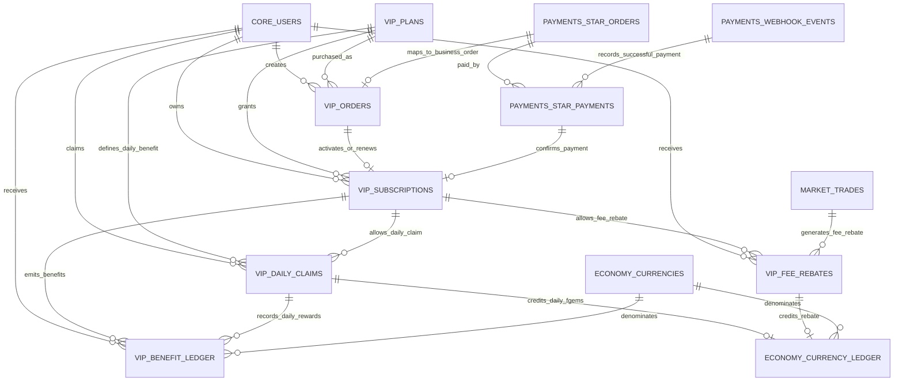
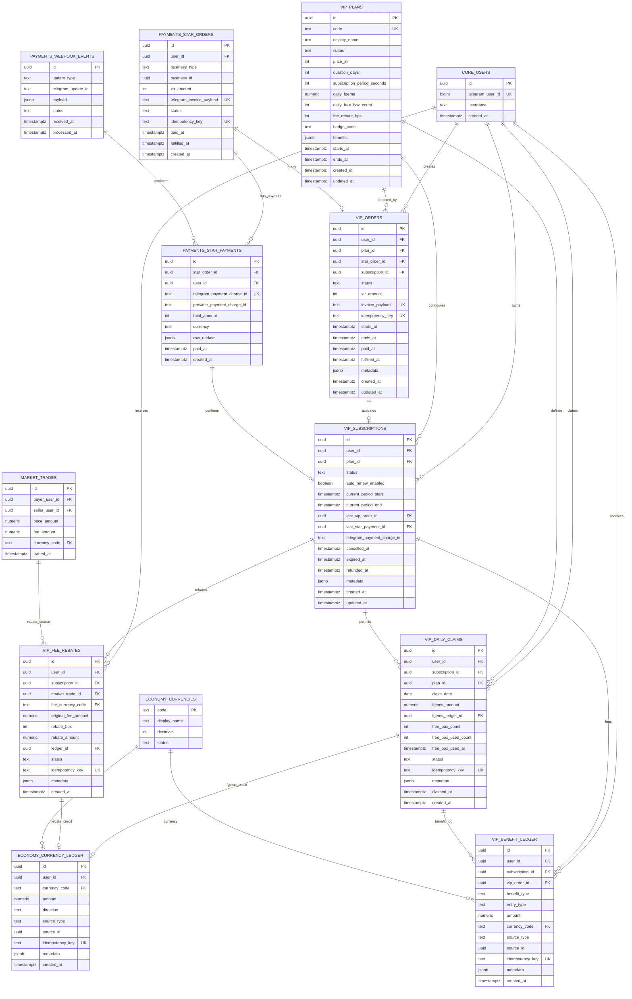

根据《月卡.md》的业务，月卡核心权益是：30 天 VIP、每日手动领取福利、每日 100 Fgems、每日 1 次福利蛋、交易完成后返还手续费 20%、订阅期间展示 VIP 身份；购买成功后开通权益，但不要一次性发放 30 天奖励。

下面先输出 **数据库 ERD / 表关系说明**，不展开完整 SQL migration。

---

# 1. 总体 ERD



---

# 2. 核心表设计分层

建议按职责拆成 4 层：

```text
core.users
  ↓
payments.*          负责 Telegram Stars 支付事实
  ↓
vip.*               负责月卡业务状态、权益领取、手续费返还
  ↓
economy.* / market.* / gacha.*
  负责资产流水、市场成交、福利蛋开盒等具体权益落地
```

不要把月卡状态直接塞进 `core.users`，也不要把每日权益领取记录塞进 `payments`。
支付是一件事，月卡权益是另一件事。

---

# 3. 推荐新增 VIP Schema

```text
vip
├── vip_plans              月卡套餐配置
├── vip_orders             月卡业务订单
├── vip_subscriptions      用户月卡订阅状态
├── vip_daily_claims       每日权益领取记录
├── vip_benefit_ledger     VIP 权益流水
└── vip_fee_rebates        交易手续费返还记录
```

---

# 4. 表结构 ERD 详情



---

# 5. 表关系说明

## 5.1 `vip.vip_plans`：月卡套餐表

这是月卡配置表。

一条记录代表一个套餐，例如：

```text
code = vip_monthly
display_name = VIP 月卡
price_xtr = 359 或 499
duration_days = 30
subscription_period_seconds = 2592000
daily_fgems = 100
daily_free_box_count = 1
fee_rebate_bps = 2000
```

关系：

```text
vip_plans 1 ── N vip_orders
vip_plans 1 ── N vip_subscriptions
vip_plans 1 ── N vip_daily_claims
```

说明：

* `price_xtr` 不建议写死在代码里。
* 文档里出现了 499 Stars 和 359 Stars 两个价格，应通过这张表配置。
* `fee_rebate_bps = 2000` 表示返还手续费的 20%，不是手续费降低 20 个百分点。
* `benefits jsonb` 可以存展示型权益，例如头像框、徽章、说明文案。

---

## 5.2 `vip.vip_orders`：月卡业务订单表

这是月卡自己的业务订单，不等同于支付订单。

一笔月卡购买应该同时产生：

```text
payments.star_orders   支付订单
vip.vip_orders         月卡业务订单
```

关系：

```text
core.users 1 ── N vip_orders
vip_plans 1 ── N vip_orders
payments.star_orders 1 ── 0/1 vip_orders
vip_orders 1 ── 0/1 vip_subscriptions
```

建议状态：

```text
created
invoice_created
paid
activating
active
fulfilled
cancelled
failed
refunded
```

关键字段：

| 字段                      | 作用                       |
| ----------------------- | ------------------------ |
| `user_id`               | 谁购买                      |
| `plan_id`               | 买哪个套餐                    |
| `star_order_id`         | 绑定 Stars 支付订单            |
| `subscription_id`       | 付款成功后绑定开通的订阅             |
| `xtr_amount`            | 下单时价格快照                  |
| `invoice_payload`       | Telegram invoice payload |
| `idempotency_key`       | 防止重复下单                   |
| `starts_at` / `ends_at` | 本次购买实际带来的权益时间            |
| `paid_at`               | 支付成功时间                   |
| `fulfilled_at`          | 月卡开通/续期完成时间              |

注意：
`vip_orders` 是业务订单，后续退款、客服排查、订单详情页都应该查这张表。

---

## 5.3 `payments.star_orders`：Stars 支付订单表

这张表建议继续复用，不新建一套月卡支付表。

月卡需要扩展：

```text
business_type = 'vip_monthly'
business_id = vip_orders.id
```

关系：

```text
payments.star_orders 1 ── 0/1 vip_orders
payments.star_orders 1 ── N payments.star_payments
```

说明：

* `payments.star_orders` 负责支付层。
* `vip.vip_orders` 负责月卡业务层。
* `business_type + business_id` 是支付系统和业务系统的桥。
* 当前如果 `business_type` 只允许 `gacha_open`，需要增加 `vip_monthly`。

推荐约束逻辑：

```text
当 business_type = 'vip_monthly' 时：
business_id 应指向 vip.vip_orders.id
xtr_amount 应等于 vip_orders.xtr_amount
telegram_invoice_payload 应等于 vip_orders.invoice_payload
```

Postgres 层面如果不方便做跨 schema polymorphic FK，可以通过 RPC 严格保证。

---

## 5.4 `payments.star_payments`：Stars 支付成功流水

这张表记录 Telegram successful_payment 事实。

关系：

```text
payments.star_orders 1 ── N payments.star_payments
payments.star_payments 1 ── 0/1 vip_subscriptions
```

关键字段：

| 字段                           | 作用                         |
| ---------------------------- | -------------------------- |
| `star_order_id`              | 对应支付订单                     |
| `telegram_payment_charge_id` | Telegram 支付成功唯一凭证          |
| `provider_payment_charge_id` | provider charge id         |
| `total_amount`               | 实付 Stars 数量                |
| `currency`                   | 应为 XTR                     |
| `raw_update`                 | 原始 Telegram payment update |
| `paid_at`                    | 付款时间                       |

强约束建议：

```text
unique(telegram_payment_charge_id)
```

用途：

* 防重复 webhook。
* 防重复开通月卡。
* 后续处理退款需要用到 `telegram_payment_charge_id`。

---

## 5.5 `vip.vip_subscriptions`：用户月卡订阅表

这是判断用户是否 VIP 的核心表。

关系：

```text
core.users 1 ── N vip_subscriptions
vip_plans 1 ── N vip_subscriptions
vip_orders 1 ── 0/1 vip_subscriptions
payments.star_payments 1 ── 0/1 vip_subscriptions
vip_subscriptions 1 ── N vip_daily_claims
vip_subscriptions 1 ── N vip_fee_rebates
vip_subscriptions 1 ── N vip_benefit_ledger
```

关键字段：

| 字段                           | 作用                                        |
| ---------------------------- | ----------------------------------------- |
| `user_id`                    | 订阅归属用户                                    |
| `plan_id`                    | 当前套餐                                      |
| `status`                     | active / expired / cancelled / refunded 等 |
| `auto_renew_enabled`         | 是否自动续费                                    |
| `current_period_start`       | 当前权益周期开始                                  |
| `current_period_end`         | 当前权益周期结束                                  |
| `last_vip_order_id`          | 最近一次月卡订单                                  |
| `last_star_payment_id`       | 最近一次成功支付                                  |
| `telegram_payment_charge_id` | 最近一次 Telegram 支付凭证                        |
| `cancelled_at`               | 取消时间                                      |
| `expired_at`                 | 过期时间                                      |
| `refunded_at`                | 退款时间                                      |

建议唯一约束：

```text
每个用户同一时间最多只有一个 active subscription
```

即：

```text
unique(user_id) where status = 'active'
```

如果用户续费，不建议新增多个 active 记录，建议延长同一条订阅：

```text
如果 current_period_end > now():
  new_end = current_period_end + 30 days

如果没有有效订阅:
  start = now()
  end = now() + 30 days
```

---

## 5.6 `vip.vip_daily_claims`：每日福利领取表

这是每日 100 Fgems 和每日 1 次福利蛋的防重表。

关系：

```text
core.users 1 ── N vip_daily_claims
vip_subscriptions 1 ── N vip_daily_claims
vip_daily_claims 1 ── 0/1 economy.currency_ledger
vip_daily_claims 1 ── N vip_benefit_ledger
```

关键字段：

| 字段                    | 作用                                  |
| --------------------- | ----------------------------------- |
| `user_id`             | 领取用户                                |
| `subscription_id`     | 哪个订阅产生的权益                           |
| `plan_id`             | 领取时对应套餐快照                           |
| `claim_date`          | 领取日期                                |
| `fgems_amount`        | 当天发放 Fgems 数量                       |
| `fgems_ledger_id`     | 对应 `economy.currency_ledger.id`     |
| `free_box_count`      | 当天获得几次福利蛋机会                         |
| `free_box_used_count` | 已使用福利蛋次数                            |
| `free_box_used_at`    | 福利蛋使用时间                             |
| `status`              | claimed / used / expired / reversed |
| `idempotency_key`     | 防重复领取                               |

最重要约束：

```text
unique(user_id, claim_date)
```

作用：

* 防止同一用户一天领多次。
* 防止并发点击。
* 防止重复请求。
* 防止 webhook 或 API retry 造成重复发放。

---

## 5.7 `vip.vip_benefit_ledger`：VIP 权益流水表

这是 VIP 业务审计表，不是资产余额表。

它记录：

```text
每日 Fgems 发放
每日福利蛋资格发放
福利蛋资格消耗
交易手续费返还
VIP 徽章/头像框权益
退款撤销
管理员调整
```

关系：

```text
core.users 1 ── N vip_benefit_ledger
vip_subscriptions 1 ── N vip_benefit_ledger
vip_orders 1 ── N vip_benefit_ledger
vip_daily_claims 1 ── N vip_benefit_ledger
vip_fee_rebates 1 ── N vip_benefit_ledger
```

建议枚举：

```text
benefit_type:
- daily_fgems
- daily_free_box
- fee_rebate
- badge
- refund_reversal
- admin_adjustment

entry_type:
- grant
- consume
- reversal
- expire
- adjustment
```

说明：

* 真正的 Fgems/KCOIN 余额变动仍然写 `economy.currency_ledger`。
* `vip_benefit_ledger` 只负责说明“为什么给了这笔权益”。
* 它适合做运营分析、客服排查、风控、退款追踪。

---

## 5.8 `vip.vip_fee_rebates`：VIP 手续费返还表

这是市场交易手续费 20% 返还的明细表。

关系：

```text
market_trades 1 ── N vip_fee_rebates
vip_subscriptions 1 ── N vip_fee_rebates
vip_fee_rebates 1 ── 0/1 economy.currency_ledger
vip_fee_rebates 1 ── N vip_benefit_ledger
```

关键字段：

| 字段                    | 作用                                    |
| --------------------- | ------------------------------------- |
| `user_id`             | 被返还的用户，通常是卖家                          |
| `subscription_id`     | 触发返还时的有效 VIP 订阅                       |
| `market_trade_id`     | 哪笔市场成交触发                              |
| `fee_currency_code`   | 手续费币种，例如 KCOIN                        |
| `original_fee_amount` | 原始扣除手续费                               |
| `rebate_bps`          | 返还比例，20% = 2000                       |
| `rebate_amount`       | 实际返还金额                                |
| `ledger_id`           | 对应 `economy.currency_ledger.id`       |
| `status`              | pending / granted / reversed / failed |
| `idempotency_key`     | 防重复返还                                 |

推荐计算：

```text
rebate_amount = floor(original_fee_amount * rebate_bps / 10000)
```

例如：

```text
成交手续费 = 50 KCOIN
VIP 返还比例 = 20%
返还金额 = 10 KCOIN
用户实际承担手续费 = 40 KCOIN
```

---

# 6. 和现有表的关系

## 6.1 和 `core.users`

所有 VIP 表都应通过 `user_id` 关联 `core.users.id`。

核心关系：

```text
core.users.id
  ├── vip_orders.user_id
  ├── vip_subscriptions.user_id
  ├── vip_daily_claims.user_id
  ├── vip_benefit_ledger.user_id
  └── vip_fee_rebates.user_id
```

说明：

* 前端不要传 `user_id`。
* 后端从 Telegram session / initData 解析真实用户。
* RPC 内部使用可信 `p_user_id`。

---

## 6.2 和 `payments.star_orders`

月卡购买要复用现有 Stars 支付订单表：

```text
payments.star_orders.business_type = 'vip_monthly'
payments.star_orders.business_id = vip.vip_orders.id
```

逻辑关系：

```text
vip_orders.star_order_id = payments.star_orders.id
```

这是月卡支付链路的核心关系。

---

## 6.3 和 `payments.star_payments`

付款成功后，Telegram successful_payment 写入：

```text
payments.star_payments
```

然后再开通或续费：

```text
payments.star_payments.id
  ↓
vip_subscriptions.last_star_payment_id
```

也就是说：

```text
star_payments 是支付事实
vip_subscriptions 是权益结果
```

不要只要收到 `successful_payment` 就直接相信前端状态，必须以后端记录为准。

---

## 6.4 和 `economy.currency_ledger`

每日 Fgems 和手续费返还都应该落到 `economy.currency_ledger`。

```text
vip_daily_claims.fgems_ledger_id
  → economy.currency_ledger.id

vip_fee_rebates.ledger_id
  → economy.currency_ledger.id
```

用途：

```text
每日 100 Fgems
交易手续费返还 KCOIN
```

说明：

* 不要直接改 `user_balances`。
* 应该通过现有 `_credit_balance` / 资产发放 RPC 写入。
* `currency_ledger` 是资产事实表。
* `vip_benefit_ledger` 是 VIP 业务解释表。

---

## 6.5 和 `market` 成交表

市场手续费返还需要关联市场成交记录。

如果你现有表叫：

```text
market.orders
market.trades
market.transactions
market.listing_sales
```

都可以，ERD 里我先统一写成：

```text
MARKET_TRADES
```

实际 migration 时替换成你当前项目里的真实成交表名。

关系：

```text
market_trades.id
  ↓
vip_fee_rebates.market_trade_id
```

触发时机：

```text
市场成交完成
→ 正常扣手续费
→ 检查卖家是否 active VIP
→ 生成 vip_fee_rebates
→ 通过 economy.currency_ledger 返还 KCOIN
```

---

# 7. 推荐主键 / 外键 / 唯一约束

## 7.1 主键

所有新表都用：

```text
id uuid primary key default gen_random_uuid()
```

包括：

```text
vip_plans.id
vip_orders.id
vip_subscriptions.id
vip_daily_claims.id
vip_benefit_ledger.id
vip_fee_rebates.id
```

---

## 7.2 外键

```text
vip_orders.user_id                 → core.users.id
vip_orders.plan_id                 → vip.vip_plans.id
vip_orders.star_order_id           → payments.star_orders.id
vip_orders.subscription_id         → vip.vip_subscriptions.id

vip_subscriptions.user_id          → core.users.id
vip_subscriptions.plan_id          → vip.vip_plans.id
vip_subscriptions.last_vip_order_id → vip.vip_orders.id
vip_subscriptions.last_star_payment_id → payments.star_payments.id

vip_daily_claims.user_id           → core.users.id
vip_daily_claims.subscription_id   → vip.vip_subscriptions.id
vip_daily_claims.plan_id           → vip.vip_plans.id
vip_daily_claims.fgems_ledger_id   → economy.currency_ledger.id

vip_benefit_ledger.user_id         → core.users.id
vip_benefit_ledger.subscription_id → vip.vip_subscriptions.id
vip_benefit_ledger.vip_order_id    → vip.vip_orders.id
vip_benefit_ledger.currency_code   → economy.currencies.code

vip_fee_rebates.user_id            → core.users.id
vip_fee_rebates.subscription_id    → vip.vip_subscriptions.id
vip_fee_rebates.market_trade_id    → market成交表.id
vip_fee_rebates.fee_currency_code  → economy.currencies.code
vip_fee_rebates.ledger_id          → economy.currency_ledger.id
```

---

## 7.3 唯一约束

```text
vip_plans.code unique

vip_orders.invoice_payload unique
vip_orders.idempotency_key unique

vip_subscriptions:
  unique(user_id) where status = 'active'

vip_daily_claims:
  unique(user_id, claim_date)
  idempotency_key unique

vip_benefit_ledger:
  idempotency_key unique nullable

vip_fee_rebates:
  idempotency_key unique
  unique(market_trade_id, user_id) 或 unique(idempotency_key)

payments.star_payments:
  telegram_payment_charge_id unique
```

---

# 8. 推荐索引

```text
vip_orders(user_id, created_at desc)
vip_orders(star_order_id)
vip_orders(status, created_at)
vip_orders(invoice_payload)
vip_orders(idempotency_key)

vip_subscriptions(user_id, current_period_end desc)
vip_subscriptions(status, current_period_end)
vip_subscriptions(user_id) where status = 'active'

vip_daily_claims(user_id, claim_date desc)
vip_daily_claims(subscription_id, claim_date desc)

vip_benefit_ledger(user_id, created_at desc)
vip_benefit_ledger(subscription_id, created_at desc)
vip_benefit_ledger(source_type, source_id)

vip_fee_rebates(user_id, created_at desc)
vip_fee_rebates(market_trade_id)
vip_fee_rebates(subscription_id, created_at desc)
```

---

# 9. 推荐删除或避免的设计

不建议这样做：

```text
core.users.is_vip boolean
core.users.vip_expired_at timestamptz
```

原因：

* 无法表达历史订阅。
* 无法表达退款。
* 无法表达续费。
* 无法表达自动续费。
* 无法和 Telegram payment charge 对账。
* 无法排查每日权益领取问题。

也不建议这样做：

```text
monthly_card_claimed_days integer
monthly_card_rewards jsonb
```

原因：

* 并发防重困难。
* 客服排查困难。
* 风控困难。
* 退款撤销困难。
* 后期数据分析困难。

---

# 10. 最小可上线版本

如果你想先做 MVP，至少需要这 4 张新表：

```text
vip.vip_plans
vip.vip_orders
vip.vip_subscriptions
vip.vip_daily_claims
```

但我建议上线时直接加上这 6 张：

```text
vip.vip_plans
vip.vip_orders
vip.vip_subscriptions
vip.vip_daily_claims
vip.vip_benefit_ledger
vip.vip_fee_rebates
```

原因：

* `vip_benefit_ledger` 解决权益审计。
* `vip_fee_rebates` 解决手续费返还明细。
* 这两张表后补会比较麻烦，尤其是上线后产生真实支付和真实资产流水时。
