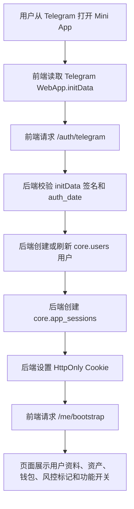
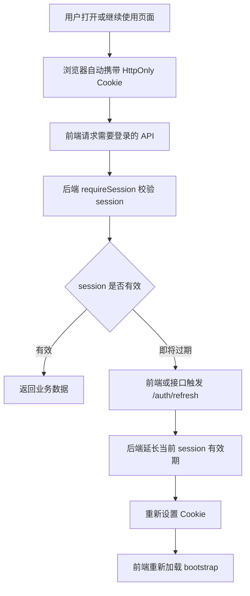
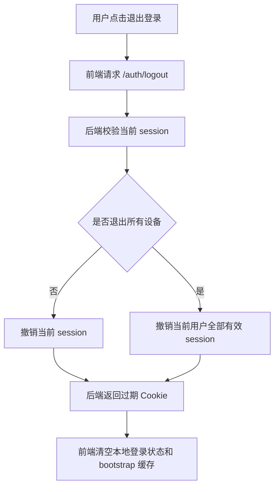
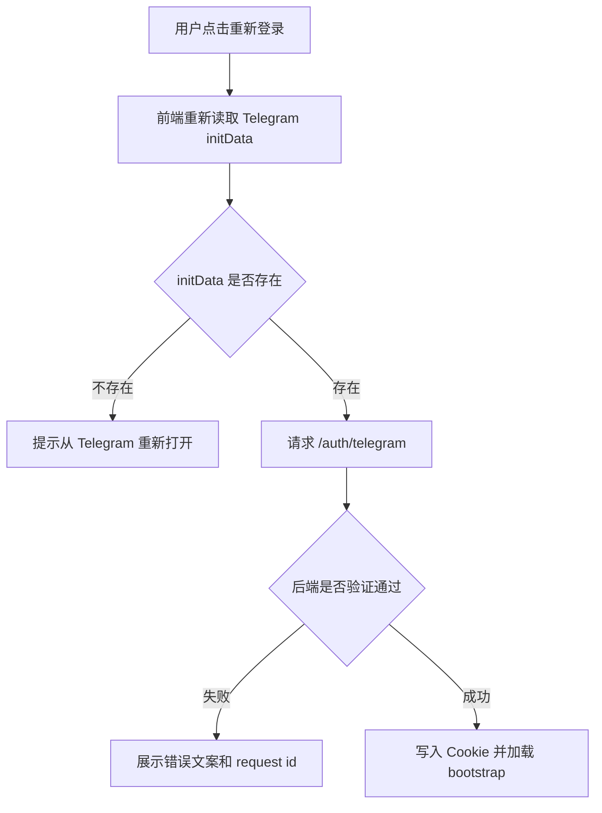
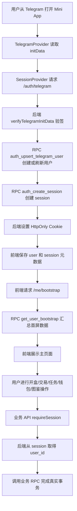

下面是完善后的 **用户与登录功能完整设计方案**，可以直接给产品、前端、后端、数据库开发人员使用。

# 用户与登录功能设计方案

## 1. 功能定位

用户与登录模块不是一个普通账号密码登录系统，而是 Telegram Mini App 的 **身份校验 + 用户创建 + session 签发 + 首屏数据加载 + 风控入口**。

它的核心目标有 5 个：

1. 让用户从 Telegram 打开 Mini App 后自动完成登录。
2. 让后端验证 Telegram `initData`，确认真实 Telegram 用户身份。
3. 让数据库创建或刷新用户资料、资产快照、邀请信息和 session。
4. 让前端拿到安全的登录状态和首屏数据，但不能拿到明文 session token。
5. 让所有后续开盒、交易、任务、钱包、图鉴等接口都从后端 session 中识别用户。

---

# 2. 用户操作流程

## 2.1 入口登录流程

用户从 Telegram 打开 Mini App：



重点规则：

```text
前端只提交原始 initData。
后端必须自己验签。
后端必须从已验证 session 中取得 user_id。
前端 body/query 传来的 user_id 一律不能信。
```

---

## 2.2 Session 刷新流程

用户已经登录过，继续使用 Mini App 时：



当前项目已经有：

| 能力 | 当前实现 |
| --- | --- |
| 登录 | `api/auth/telegram.ts` |
| 刷新 session | `api/auth/refresh.ts` |
| 退出登录 | `api/auth/logout.ts` |
| 统一 session 校验 | `api/_shared/requireSession.ts` |
| 前端登录状态 | `apps/web/src/app/providers/SessionProvider.tsx` |

---

## 2.3 退出登录流程

用户主动退出登录时：



第一版用户界面可以不放明显“退出登录”入口，但接口和 session 撤销能力需要保留，方便风控、测试和后续账号安全功能使用。

---

# 3. 登录状态页面结构

登录模块建议分成 4 个前端区域：

```text
┌─────────────────────────────┐
│ Telegram 环境初始化区         │
│ 读取 initData、主题色、安全区   │
├─────────────────────────────┤
│ 登录状态区                    │
│ 登录中 / 登录失败 / 已登录      │
├─────────────────────────────┤
│ 首屏数据区                    │
│ 用户资料 / 资产 / 钱包 / 红点    │
├─────────────────────────────┤
│ 业务页面区                    │
│ 开盒 / 交易 / 藏品 / 图鉴 / 任务 │
└─────────────────────────────┘
```

当前项目里，这几个区域大致对应：

| 区域 | 当前文件 |
| --- | --- |
| Telegram 环境初始化 | `apps/web/src/app/providers/TelegramProvider.tsx` |
| Telegram viewport 初始化 | `apps/web/src/app/bootstrap.ts` |
| 登录状态管理 | `apps/web/src/app/providers/SessionProvider.tsx` |
| 登录拦截页面 | `apps/web/src/app/guards/RequireSession.tsx` |
| API 请求封装 | `apps/web/src/api/client.ts` |
| API 路径集中管理 | `apps/web/src/api/endpoints.ts` |

---

# 4. 登录展示规则

## 4.1 登录中状态

当 Telegram 环境已准备好，但后端还在校验 `initData` 时，页面展示登录中。

建议文案：

```text
登录中
正在验证 Telegram 身份
请保持在 Telegram Mini App 内打开页面。
```

这个状态只做展示，不能提前放行业务页面，也不能提前显示真实余额、库存、任务进度。

---

## 4.2 登录失败状态

登录失败常见原因：

| 原因 | 前端表现 | 处理方式 |
| --- | --- | --- |
| 缺少 `initData` | 提示从 Telegram 重新打开 | 不进入业务页面 |
| `initData` 签名错误 | 提示登录校验失败 | 不重试刷接口 |
| `auth_date` 过期 | 提示重新进入应用 | 引导关闭后重进 |
| session 过期 | 提示登录已失效 | 重新走登录 |
| 用户被限制 | 提示账号受限 | 禁止写操作 |
| 网络错误 | 提示网络异常 | 允许用户重试 |

建议文案：

```text
无法完成自动登录
请从 Telegram 重新打开应用。

[重新登录]
```

---

## 4.3 已登录状态

登录成功后，前端可以展示：

| 内容 | 来源 |
| --- | --- |
| 用户头像 | 后端返回的用户资料或 bootstrap |
| Telegram 昵称 | 后端已验证后的用户资料 |
| 邀请码 | `core.users.invite_code` |
| K-coin / Fgems | `/me/bootstrap` 的余额数据 |
| 钱包公开地址 | `/me/bootstrap` 的已连接钱包数据 |
| 未读通知数 | `/me/bootstrap` 的 unread notifications |

注意：

```text
前端可以展示这些数据，但不能把它们当业务真相。
真实余额、库存、订单状态、任务状态，必须以后端接口返回为准。
```

---

# 5. 点击交互设计

## 5.1 点击重新登录

当用户点击“重新登录”按钮：



按钮只触发登录请求，不允许用户自己输入 Telegram ID，也不允许用户手动选择账号。

---

## 5.2 点击退出登录

当用户点击退出登录：

| 选项 | 行为 |
| --- | --- |
| 退出当前设备 | 后端只撤销当前 session |
| 退出全部设备 | 后端撤销当前用户所有未过期 session |

当前项目的 `POST /auth/logout` 已支持 `allDevices` 参数。

第一版可以只做“退出当前设备”。“退出所有设备”更适合后续账号安全页。

---

## 5.3 Session 失效自动处理

当前前端 API client 已有 401 处理入口。

建议规则：

| 场景 | 处理方式 |
| --- | --- |
| 普通业务接口返回 401 | 自动重新登录一次 |
| `/auth/telegram` 本身返回 401 | 不循环重登，展示错误 |
| `/auth/refresh` 返回 401 | 清空本地登录态，提示重进 |
| 用户状态不是 active | 不自动重试，展示账号受限 |

这样可以避免接口死循环，也能避免用户被封禁后继续发起写操作。

---

# 6. 用户资料和首屏数据

## 6.1 用户基础资料

用户资料来自后端已验证的 Telegram `initData`，不是来自前端手动填写。

当前登录成功后，业务 data 中会返回：

```json
{
  "status": "ok",
  "isNewUser": false,
  "user": {
    "id": "app-user-id",
    "telegramUserId": "telegram-user-id",
    "username": "telegram_username",
    "firstName": "First",
    "lastName": "Last",
    "languageCode": "zh-hans",
    "avatarUrl": "https://...",
    "inviteCode": "ABC123"
  },
  "session": {
    "sessionId": "session-id",
    "expiresAt": "2026-06-06T00:00:00.000Z",
    "expiresInSeconds": 604800,
    "cookieBased": true
  }
}
```

说明：

```text
上面是接口 data 里的业务内容。
真实 HTTP 响应外层仍使用项目统一的 ok / success / data / requestId 格式。
```

---

## 6.2 首屏 bootstrap 数据

登录成功后，前端请求：

```http
GET /me/bootstrap
```

当前 `api.get_user_bootstrap` 会返回这些模块：

| 字段 | 说明 |
| --- | --- |
| `profile` | 用户资料 |
| `balances` | KCOIN、FGEMS 等资产快照 |
| `wallets` | 已连接钱包公开信息 |
| `flags` | 当前有效用户标记 |
| `unread_notifications` | 未读通知数量 |
| `feature_flags` | 功能开关 |
| `server_time` | 服务端时间 |

前端拿到 bootstrap 后，可以给资产栏、钱包入口、通知红点和功能开关使用。

---

## 6.3 用户资料编辑

当前项目已有 `core.user_profiles` 表，但 `api/me/profile.ts` 目前是空文件。

所以第一版文档只定义规则，不声明资料编辑接口已经完成：

| 功能 | 第一版建议 |
| --- | --- |
| 修改昵称 | 暂不开放，优先使用 Telegram 名称 |
| 修改头像 | 暂不开放，优先使用 Telegram 头像 |
| 语言偏好 | 可以后续做用户设置 |
| 展示藏品 | 可以后续结合藏品页选择 |

如果后续要做资料编辑，必须走后端 API，不能让前端直接写 `core.user_profiles`。

---

# 7. 当前已存在实现

## 7.1 前端已存在

| 能力 | 文件 |
| --- | --- |
| Telegram WebApp 快照 | `apps/web/src/app/providers/TelegramProvider.tsx` |
| 读取 `initData` | `apps/web/src/app/providers/TelegramProvider.tsx` |
| 登录态管理 | `apps/web/src/app/providers/SessionProvider.tsx` |
| 登录失败页 | `apps/web/src/app/guards/RequireSession.tsx` |
| API endpoint 常量 | `apps/web/src/api/endpoints.ts` |
| API 请求封装 | `apps/web/src/api/client.ts` |
| 自动携带 Cookie | `credentials: "include"` |
| 401 统一处理 | `setApiUnauthorizedHandler` |

---

## 7.2 后端 API 已存在

| 接口 | 方法 | 作用 |
| --- | --- | --- |
| `/auth/telegram` | POST | 校验 Telegram `initData`，创建用户和 session |
| `/auth/refresh` | POST | 刷新当前 session |
| `/auth/logout` | POST | 撤销当前或全部 session |
| `/me/bootstrap` | GET | 获取首屏用户数据 |

当前 `api/me/profile.ts` 是空文件，不应在文档里写成已实现资料更新接口。

---

## 7.3 后端工具已存在

| 能力 | 文件 |
| --- | --- |
| Telegram initData 验签 | `packages/server/src/auth/verifyTelegramInitData.ts` |
| session token 生成和 hash | `packages/server/src/auth/issueSession.ts` |
| session 配置 | `packages/server/src/auth/sessionConfig.ts` |
| session 校验 | `api/_shared/requireSession.ts` |
| API handler 和统一响应 | `api/_shared/handler.ts` |
| 登录参数 schema | `packages/validation/src/auth.schemas.ts` |

---

## 7.4 数据库 RPC 已存在

| RPC | 作用 |
| --- | --- |
| `api.auth_upsert_telegram_user` | 创建或刷新 Telegram 用户、资料、初始余额、邀请绑定 |
| `api.auth_create_session` | 创建 app session、防止 initData 重放、限制活跃 session 数 |
| `api.get_user_bootstrap` | 返回用户首屏资料、余额、钱包、标记、通知和功能开关 |

---

# 8. 用户状态设计

## 8.1 用户状态

数据库 `core.users.status` 是登录和写操作的基础状态。

当前数据库状态包括：

| 状态 | 说明 | 登录和业务行为 |
| --- | --- | --- |
| `active` | 正常用户 | 允许登录和正常使用 |
| `restricted` | 受限用户 | 登录或写操作应被拒绝，具体按后端策略 |
| `banned` | 封禁用户 | 拒绝登录或写操作 |
| `deleted` | 已删除用户 | 拒绝登录或写操作 |

注意：

```text
后端必须判断用户状态。
前端不能用 role、is_admin、status 这种客户端字段决定权限。
```

---

## 8.2 Session 状态

`core.app_sessions` 的有效性由以下条件共同决定：

| 条件 | 说明 |
| --- | --- |
| token hash 匹配 | 数据库只存 `session_token_hash` |
| 未过期 | `expires_at` 必须大于当前时间 |
| 未撤销 | `revoked_at` 必须为空 |
| 用户存在 | session 绑定的用户必须存在 |
| 用户 active | 普通业务接口要求用户状态正常 |

只要其中任何一项失败，都应返回稳定错误码，并让前端重新登录或展示受限提示。

---

## 8.3 设备记录

当前 session 创建时会写入或刷新 `core.user_devices`。

它的作用：

| 用途 | 说明 |
| --- | --- |
| 识别同设备重复登录 | 同一设备新 session 创建时撤销旧 session |
| 风控分析 | 结合 IP hash、User-Agent hash、平台信息判断异常 |
| 多端管理 | 后续可以做设备列表和退出设备 |

第一版不需要做设备管理页面。

---

# 9. 前端页面交互细节

## 9.1 Telegram 环境初始化

页面启动时需要做：

1. 读取 `Telegram.WebApp`。
2. 同步安全区变量。
3. 设置 Telegram 顶部、背景、底栏颜色。
4. 调用 `ready()` 和 `expand()`。
5. 支持的客户端可以请求 fullscreen。
6. 记录平台、主题、viewport 等上下文。

这些信息只做 UI 适配和登录辅助，不作为业务身份依据。

---

## 9.2 登录态 Provider

`SessionProvider` 负责：

| 责任 | 说明 |
| --- | --- |
| 自动登录 | Telegram ready 后请求 `/auth/telegram` |
| 保存登录状态 | 保存 user、session 元数据 |
| 加载 bootstrap | 登录后请求 `/me/bootstrap` |
| 刷新 session | 请求 `/auth/refresh` |
| 退出登录 | 请求 `/auth/logout` |
| 清理本地状态 | 登录失败或退出后清空 user/session/bootstrap |

它不应该保存明文 session token，因为浏览器前端拿不到 HttpOnly Cookie。

---

## 9.3 业务页面登录拦截

所有需要用户身份的业务页面都应该在登录成功后展示。

建议展示规则：

| 登录状态 | 页面 |
| --- | --- |
| `idle` | 登录中 |
| `authenticating` | 登录中 |
| `authenticated` | 展示业务页面 |
| `error` | 登录失败页 |

---

# 10. 后端接口说明

## 10.1 Telegram 登录

```http
POST /auth/telegram
```

请求 body：

```json
{
  "initData": "telegram-web-app-raw-init-data",
  "clientContext": {
    "platform": "ios",
    "theme": "light",
    "launchSource": "referral",
    "viewportHeight": 812,
    "viewportStableHeight": 780
  }
}
```

后端必须做：

1. 限制 method。
2. 校验 body schema。
3. 校验 Telegram `initData` 签名。
4. 校验 `auth_date` 是否过期或来自未来。
5. 解析 Telegram user。
6. 调用 `api.auth_upsert_telegram_user`。
7. 检查用户是否 active。
8. 生成 opaque session token。
9. 只保存 token hash。
10. 调用 `api.auth_create_session`。
11. 通过 HttpOnly Cookie 返回 session。
12. 返回用户资料和 session 元数据。

---

## 10.2 刷新 session

```http
POST /auth/refresh
```

请求 body：

```json
{
  "clientContext": {
    "platform": "ios",
    "theme": "light"
  }
}
```

后端必须做：

1. 校验当前 session。
2. 检查是否已撤销或过期。
3. 检查用户是否 active。
4. 按配置延长过期时间。
5. 不超过 session 最大生命周期。
6. 重新设置 Cookie。
7. 返回新的 session 元数据。

---

## 10.3 退出登录

```http
POST /auth/logout
```

请求 body：

```json
{
  "allDevices": false
}
```

后端必须做：

1. 校验当前 session。
2. 如果 `allDevices = false`，只撤销当前 session。
3. 如果 `allDevices = true`，撤销当前用户所有 active session。
4. 返回过期 Cookie。
5. 返回撤销数量。

---

## 10.4 获取首屏数据

```http
GET /me/bootstrap
```

后端必须做：

1. 校验 session。
2. 从 session 取得 `user_id`。
3. 调用 `api.get_user_bootstrap`。
4. 返回用户资料、资产、钱包、标记、通知、功能开关和服务端时间。

前端不能向这个接口传 `user_id`。

---

# 11. 数据库数据说明

## 11.1 用户主表

```text
core.users
```

作用：保存 Telegram 用户对应的应用用户身份。

当前关键字段：

| 字段 | 说明 |
| --- | --- |
| `id` | 应用内部用户 ID |
| `telegram_user_id` | Telegram 用户 ID，来自已验证 initData |
| `username` | Telegram 用户名 |
| `first_name` | Telegram 名 |
| `last_name` | Telegram 姓 |
| `language_code` | Telegram 语言 |
| `is_premium` | 是否 Telegram Premium |
| `photo_url` | Telegram 头像 |
| `invite_code` | 邀请码 |
| `referred_by_user_id` | 邀请人 |
| `status` | 用户状态 |
| `risk_score` | 风险分 |
| `first_seen_at` | 首次进入时间 |
| `last_seen_at` | 最近活跃时间 |
| `last_auth_at` | 最近登录时间 |
| `metadata` | 元数据 |

---

## 11.2 用户资料表

```text
core.user_profiles
```

作用：保存展示资料和 UI 偏好。

当前关键字段：

| 字段 | 说明 |
| --- | --- |
| `user_id` | 用户 ID |
| `display_name` | 展示名 |
| `avatar_url` | 展示头像 |
| `bio` | 简介 |
| `selected_item_instance_id` | 当前展示藏品 |
| `selected_language` | 用户选择语言 |
| `timezone` | 用户时区 |
| `ui_settings` | UI 偏好 |

---

## 11.3 App Session 表

```text
core.app_sessions
```

作用：保存后端签发的应用 session，数据库只保存 hash。

当前关键字段：

| 字段 | 说明 |
| --- | --- |
| `id` | session ID |
| `user_id` | 用户 ID |
| `session_token_hash` | session token hash |
| `telegram_auth_date` | Telegram auth_date |
| `init_data_hash` | Telegram initData hash |
| `ip_hash` | IP 指纹 |
| `user_agent` | User-Agent 指纹 |
| `device_id` | 服务端生成的设备标识 |
| `platform` | Telegram 平台 |
| `expires_at` | 过期时间 |
| `revoked_at` | 撤销时间 |
| `last_seen_at` | 最近使用时间 |
| `created_at` | 创建时间 |

---

## 11.4 用户设备表

```text
core.user_devices
```

作用：记录用户设备，用于多端登录和风控。

当前关键字段：

| 字段 | 说明 |
| --- | --- |
| `user_id` | 用户 ID |
| `device_key` | 设备标识 |
| `platform` | 平台 |
| `user_agent` | User-Agent 指纹 |
| `first_seen_at` | 首次出现 |
| `last_seen_at` | 最近出现 |
| `metadata` | 元数据 |

---

## 11.5 用户标记表

```text
core.user_flags
```

作用：保存风控、限制、封禁等用户标记。

当前关键字段：

| 字段 | 说明 |
| --- | --- |
| `user_id` | 用户 ID |
| `flag_code` | 标记编码 |
| `flag_level` | 标记级别 |
| `reason` | 原因 |
| `active` | 是否有效 |
| `starts_at` | 生效时间 |
| `ends_at` | 结束时间 |
| `metadata` | 元数据 |

---

## 11.6 通知表

```text
core.notifications
```

作用：保存用户通知和红点消息。

当前关键字段：

| 字段 | 说明 |
| --- | --- |
| `user_id` | 用户 ID |
| `notification_type` | 通知类型 |
| `title` | 标题 |
| `body` | 内容 |
| `payload` | 附加数据 |
| `read_at` | 已读时间 |
| `created_at` | 创建时间 |

---

# 12. RLS 和权限规则

## 12.1 客户端不能直写核心表

登录和用户模块涉及身份、资产入口、session 和风控，不能让前端直接写核心表。

| 表 | 前端权限原则 |
| --- | --- |
| `core.users` | 只允许读自己的必要资料，不允许前端直接写 |
| `core.user_profiles` | 只允许读自己的资料，写入必须走后端 API |
| `core.app_sessions` | 不应让前端直接读写 |
| `core.user_devices` | 不应让前端直接写 |
| `core.user_flags` | 可按需要只读自己的非敏感标记 |
| `core.notifications` | 只读自己的通知 |
| `core.user_api_tokens` | 不应让前端直接读写 |

---

## 12.2 RPC 权限

登录相关 RPC 是 `SECURITY DEFINER`，必须满足：

1. 固定 `search_path`。
2. 只能由可信后端调用。
3. 不返回敏感字段。
4. 不暴露 token 明文。
5. 不允许 `anon` / `authenticated` 直接调用核心写操作 RPC。

---

# 13. 防刷与安全规则

登录模块是所有业务的入口，不能只靠前端判断。

必须由后端重新校验：

| 风险 | 解决方案 |
| --- | --- |
| 用户伪造 Telegram ID | 只接受原始 `initData`，后端验签 |
| 用户篡改 `initDataUnsafe` | 后端完全不信 `initDataUnsafe` |
| 重放同一 `initData` | 使用 `ops.telegram_init_data_consumptions` 记录消耗 |
| session token 泄露 | 使用 HttpOnly Cookie，数据库只存 hash |
| session 重放 | 支持撤销、过期、设备限制 |
| 用户被封禁后继续操作 | 每个需要身份的 API 都 `requireSession` |
| 前端传入 `user_id` | 后端全部忽略，从 session 取用户 |
| 登录暴力尝试 | 登录接口使用 rate limit |
| 日志泄露敏感数据 | 不打印完整 token、Cookie、Authorization、initData |

重点建议：

```text
浏览器前端不要拿到明文 session token。
登录响应只设置 HttpOnly Cookie。
所有业务接口只通过后端 session 判断用户身份。
```

---

# 14. 推荐业务规则

## 14.1 是否信任 Telegram initDataUnsafe？

不信任。

`initDataUnsafe` 只适合前端临时展示，例如显示昵称、头像占位、主题辅助。

真正登录必须使用：

```text
Telegram WebApp.initData 原始字符串
+ 后端 Bot Token 验签
+ 后端 session
```

---

## 14.2 是否把 Bearer token 返回给浏览器？

不返回。

当前项目已经采用：

```text
浏览器前端：HttpOnly Cookie
后端/测试客户端：可以使用 Bearer 携带同一 opaque session token
```

也就是说，普通浏览器前端不应该把 session token 存在 localStorage、Zustand、React state 或 URL 参数里。

---

## 14.3 用户是否可以在普通浏览器打开？

生产环境不建议。

原因：

```text
普通浏览器没有真实 Telegram initData。
没有 initData 就无法完成后端身份校验。
```

本地开发可以使用 mock，但必须由环境变量开关控制，不能在生产环境启用。

---

## 14.4 用户资料是否允许自行修改？

第一版建议暂不开放。

原因：

1. Telegram 已经提供基础头像和昵称。
2. 用户资料编辑不是开盒抽卡主流程。
3. 资料编辑会增加审核、敏感词、头像安全和风控成本。

如果后续开放，应只允许修改展示层字段，不能修改 Telegram ID、邀请码、用户状态、余额、钱包、角色权限等事实字段。

---

## 14.5 用户被限制后还能做什么？

建议分层：

| 用户状态 | 可以做 | 不可以做 |
| --- | --- | --- |
| `active` | 正常使用 | 无 |
| `restricted` | 可看部分只读数据 | 开盒、交易、领奖、钱包写操作 |
| `banned` | 尽量只显示受限提示 | 所有写操作 |
| `deleted` | 不允许登录 | 所有操作 |

第一版可以简单处理：

```text
非 active 用户拒绝登录或拒绝进入主业务页面。
```

---

# 15. 当前需要注意的实现现状

## 15.1 用户资料接口未完成

当前存在文件：

```text
api/me/profile.ts
```

但文件内容为空。

因此文档中不能把 `/me/profile` 写成已完成的更新接口。后续如果要做资料编辑，需要补 API、schema、测试和权限规则。

---

## 15.2 前端 auth API client 未封装

当前存在文件：

```text
packages/api-client/src/auth.client.ts
```

但文件内容为空。

现在前端主要通过 `apps/web/src/api/client.ts` 和 `API_ENDPOINTS` 请求登录接口。后续如果要做共享 auth client，可以再补。

---

## 15.3 用户状态命名需要保持一致

数据库 `core.users.status` 当前使用：

```text
active / restricted / banned / deleted
```

`packages/validation/src/auth.schemas.ts` 中的 `AuthUserStatusSchema` 当前使用：

```text
active / blocked / deleted / risk_limited
```

这两个命名不完全一致，后续做用户状态展示、风控提示或类型收口时要统一，否则容易出现“数据库返回一个前端 schema 不认识的状态”的问题。

---

# 16. 完整业务闭环



---

# 17. 给开发人员的简化版本

第一版 MVP 可以这样做：

## 必做功能

1. 用户从 Telegram 打开 Mini App 后自动登录。
2. 前端只提交原始 `initData`。
3. 后端校验 `initData` 签名和过期时间。
4. 后端创建或刷新 `core.users`。
5. 后端创建 `core.app_sessions`。
6. 登录响应只设置 HttpOnly Cookie。
7. 前端登录成功后请求 `/me/bootstrap`。
8. 所有需要用户身份的接口都使用 `requireSession`。
9. 用户状态不是 active 时拒绝写操作。
10. 登录失败、session 过期、网络错误都要有稳定提示。

## 暂时可以不做

1. 用户资料编辑。
2. 设备管理页面。
3. 退出所有设备 UI。
4. 账号安全中心。
5. 邮箱、手机号、账号密码登录。
6. 后台管理系统。

---

# 18. 验收和测试清单

用户与登录模块至少要测：

| 场景 | 期望 |
| --- | --- |
| 缺少 `initData` | 登录失败，不进入业务页面 |
| 伪造 `initData` | 后端拒绝 |
| `auth_date` 过期 | 后端拒绝 |
| 同一 `initData` 重放 | 后端拒绝或复用安全 session |
| 新用户首次登录 | 创建用户、资料、初始余额和 session |
| 老用户再次登录 | 刷新资料和 session |
| session 过期 | 业务接口返回登录失效 |
| session 撤销 | 业务接口返回登录失效 |
| 用户被限制 | 写操作拒绝 |
| 前端传 `user_id` | 后端忽略，从 session 取用户 |
| 退出当前设备 | 当前 session 失效 |
| 退出所有设备 | 用户所有 active session 失效 |
| `/me/bootstrap` 未登录访问 | 返回鉴权错误 |
| API 返回 401 | 前端不死循环请求 |

建议运行：

```bash
pnpm typecheck
pnpm lint
pnpm test
pnpm test:db
pnpm build
```

如果某些脚本在当前项目里不存在，应使用项目实际脚本替代。

---

# 19. 最终产品文案示例

## 登录中

```text
正在验证 Telegram 身份
请保持在 Telegram Mini App 内打开页面。
```

## 登录失败

```text
无法完成自动登录
请从 Telegram 重新打开应用。
```

## Session 过期

```text
登录已失效
请重新进入 Telegram Mini App。
```

## 账号受限

```text
当前账号已被限制使用
如有疑问，请联系官方支持。
```

## 网络错误

```text
网络请求失败
请检查网络后重试。
```

---

# 20. 总结建议

用户与登录功能可以设计成：

```text
Telegram 自动登录
= 前端读取原始 initData
+ 后端验签
+ 用户 upsert
+ session 签发
+ HttpOnly Cookie
+ bootstrap 首屏数据
+ requireSession 统一保护业务接口
```

最重要的核心规则是：

```text
前端只负责提交“我要登录”这个动作；
真实身份以后端校验 Telegram initData 为准；
真实用户以后端 session 为准；
真实资产、库存、任务、钱包、图鉴状态以后端和数据库为准；
浏览器前端永远不要保存明文 token 或任何服务端密钥。
```

这样登录模块才能支撑后续开盒、交易、任务、支付、钱包和图鉴这些高风险业务。
