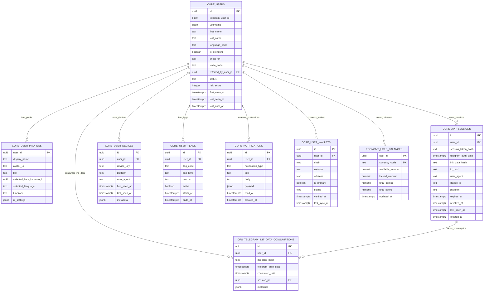
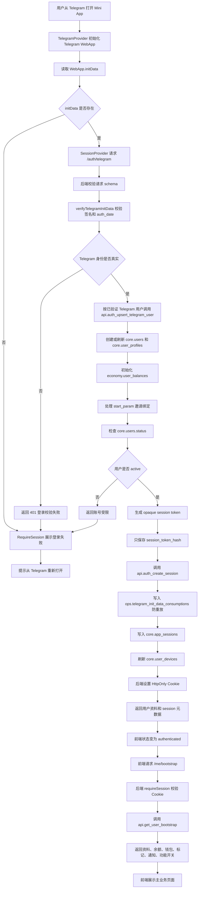
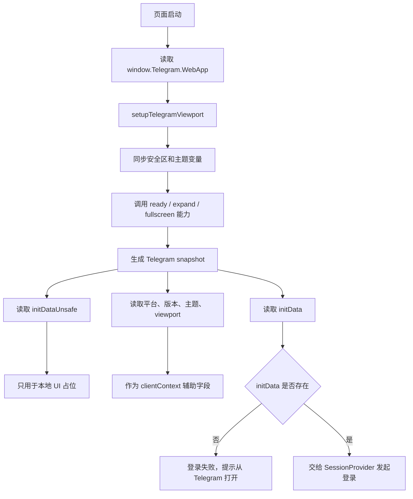
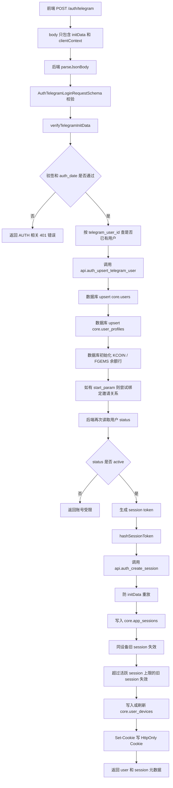
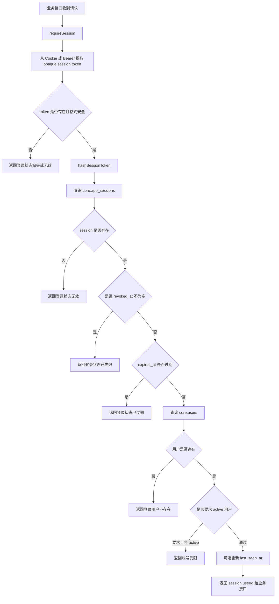
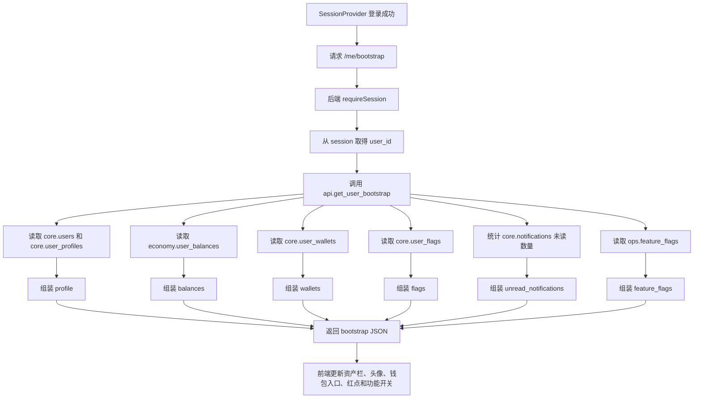
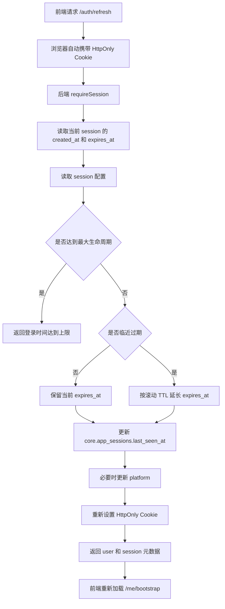
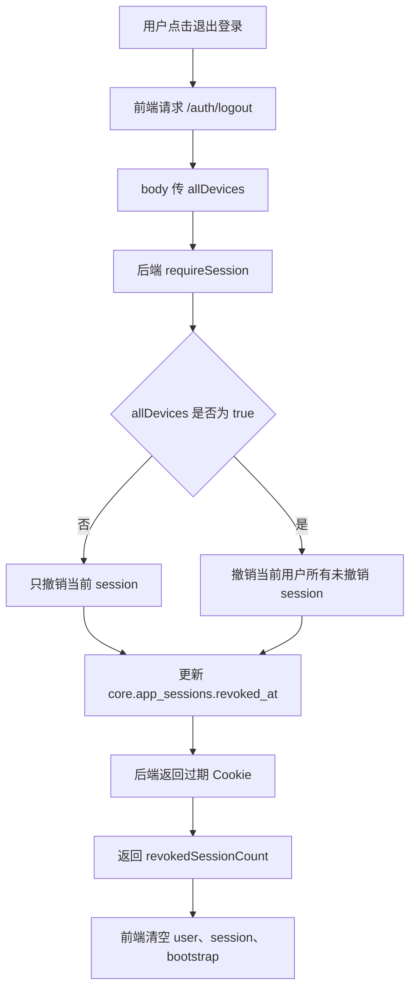
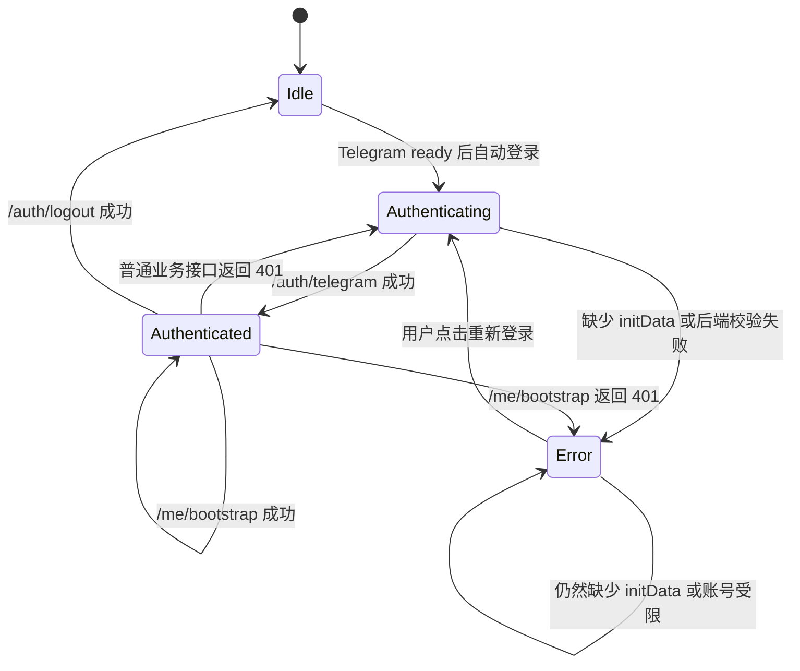

下面是一份可以直接放进开发文档的 **用户与登录功能业务全流程设计**。核心原则是：

```text
登录身份 = 后端验证过的 Telegram initData
当前用户 = 后端 session 绑定的 user_id
首屏数据 = 后端根据 session 聚合返回
前端只负责发起用户动作，不能自己决定用户是谁
```

---

# 1. 用户与登录功能涉及的数据表

当前项目最少涉及这些表。

| 表名 | 作用 |
| --- | --- |
| `core.users` | 用户主身份表，保存已验证 Telegram 用户 |
| `core.user_profiles` | 用户展示资料和 UI 偏好 |
| `core.app_sessions` | 后端签发的应用 session，数据库只保存 token hash |
| `core.user_devices` | 用户设备记录，用于同设备 session 管理和风控 |
| `core.user_flags` | 用户风控、限制、封禁等标记 |
| `core.notifications` | 用户通知和红点数量 |
| `core.user_wallets` | 用户已连接 TON 钱包公开信息 |
| `economy.user_balances` | KCOIN、FGEMS 等资产快照 |
| `ops.telegram_init_data_consumptions` | Telegram initData 消耗记录，用于防重放 |
| `ops.feature_flags` | 功能开关 |

重点是这两张表：

```text
core.users
core.app_sessions
```

它们表示：

```text
core.users 负责“这个 Telegram 用户是谁”
core.app_sessions 负责“这次请求有没有有效登录态”
```

不是表示前端传来的 `user_id` 就可信。

---

# 2. 推荐表关系 ERD



---

# 3. 用户与登录核心业务规则

| 场景 | 是否信任前端传来的身份 | 后端必须做什么 |
| --- | ---: | --- |
| 用户打开 Mini App | 否 | 读取原始 `initData` 并验签 |
| 用户提交 Telegram ID | 否 | 不允许作为登录依据 |
| 用户提交 `initDataUnsafe` | 否 | 只可前端临时展示，不可后端鉴权 |
| 用户登录成功 | 否 | 后端签发 opaque session token，写 HttpOnly Cookie |
| 后续业务请求 | 否 | 后端从 session 取 `user_id` |
| 前端传 `user_id` | 否 | 后端忽略，不能用来操作资产、库存、订单 |
| session 过期 | 否 | 返回登录失效，前端重新走登录 |
| 用户状态非 `active` | 否 | 拒绝登录或拒绝业务写操作 |
| 退出登录 | 否 | 后端撤销 session 并返回过期 Cookie |

结论：

```text
前端只能提交 Telegram WebApp.initData 原始字符串。
用户身份、资产、库存、订单、任务、钱包，全都以后端 session 和数据库事务为准。
```

---

# 4. 用户与登录完整总流程 Mermaid



---

# 5. 和 Telegram 环境初始化的连接流程

Telegram 环境初始化是登录的前置步骤，但它本身不等于登录成功。



正确做法是：

```text
initData 用于后端验签。
initDataUnsafe 只用于前端临时展示，不作为身份依据。
```

---

# 6. 和 Telegram 登录接口的连接流程

当前前端路径来自 `API_ENDPOINTS.auth.telegram`：

```http
POST /auth/telegram
```



注意：

```text
浏览器前端不拿明文 session token。
数据库不存明文 session token。
登录响应只返回 sessionId、expiresAt、expiresInSeconds、cookieBased 这类元数据。
```

---

# 7. 和 Session 校验的连接流程

所有需要登录的后端接口都应该通过 `requireSession` 取得用户身份。



核心规则：

```text
业务接口只能使用 requireSession 返回的 userId。
不能使用 body、query、header 里用户自己传的 userId。
```

---

# 8. 和首屏 Bootstrap 的连接流程

登录成功后，前端马上加载首屏数据。

当前前端路径来自 `API_ENDPOINTS.me.bootstrap`：

```http
GET /me/bootstrap
```



当前 `api.get_user_bootstrap` 返回这些模块：

| 字段 | 说明 |
| --- | --- |
| `profile` | 用户资料 |
| `balances` | KCOIN、FGEMS 等资产快照 |
| `wallets` | 已连接钱包公开信息 |
| `flags` | 当前有效用户标记 |
| `unread_notifications` | 未读通知数量 |
| `feature_flags` | 功能开关 |
| `server_time` | 服务端时间 |

注意：

```text
bootstrap 是展示数据，不是前端做业务判断的最终真相。
开盒、购买、出售、领奖、钱包写操作，都必须重新请求后端接口并由后端校验。
```

---

# 9. 和 Session 刷新的连接流程

当前前端路径来自 `API_ENDPOINTS.auth.refresh`：

```http
POST /auth/refresh
```



当前配置默认值来自 `packages/server/src/auth/sessionConfig.ts`：

| 配置 | 默认含义 |
| --- | --- |
| `SESSION_TTL_SECONDS` | 默认 7 天 |
| `SESSION_REFRESH_THRESHOLD_SECONDS` | 默认剩余 1 天内才需要延长 |
| `SESSION_MAX_LIFETIME_SECONDS` | 默认最长 30 天 |
| `TELEGRAM_INIT_DATA_MAX_AGE_SECONDS` | 默认 Telegram initData 最长 24 小时 |
| `TELEGRAM_INIT_DATA_CLOCK_TOLERANCE_SECONDS` | 默认允许 5 分钟时钟偏差 |

---

# 10. 和退出登录的连接流程

当前前端路径来自 `API_ENDPOINTS.auth.logout`：

```http
POST /auth/logout
```



第一版用户界面可以不放明显的退出登录入口，但接口能力需要保留：

```text
测试、风控、账号安全、设备管理，都需要可撤销 session。
```

---

# 11. 登录状态页面结构

登录模块建议分成 4 个前端区域：

```text
┌─────────────────────────────┐
│ Telegram 环境初始化区         │
│ 读取 initData、主题色、安全区   │
├─────────────────────────────┤
│ 登录状态区                    │
│ 登录中 / 登录失败 / 已登录      │
├─────────────────────────────┤
│ 首屏数据区                    │
│ 用户资料 / 资产 / 钱包 / 红点    │
├─────────────────────────────┤
│ 业务页面区                    │
│ 开盒 / 交易 / 藏品 / 图鉴 / 任务 │
└─────────────────────────────┘
```

当前项目里，这几个区域大致对应：

| 区域 | 当前文件 |
| --- | --- |
| Telegram 环境初始化 | `apps/web/src/app/providers/TelegramProvider.tsx` |
| Telegram viewport 初始化 | `apps/web/src/app/bootstrap.ts` |
| 登录状态管理 | `apps/web/src/app/providers/SessionProvider.tsx` |
| 登录拦截页面 | `apps/web/src/app/guards/RequireSession.tsx` |
| API 请求封装 | `apps/web/src/api/client.ts` |
| API 路径集中管理 | `apps/web/src/api/endpoints.ts` |

---

# 12. 登录展示规则

## 12.1 登录中状态

当前 `RequireSession` 在 `idle` 或 `authenticating` 时展示：

```text
登录中
正在验证 Telegram 身份
请保持在 Telegram Mini App 内打开页面。
```

这个状态只做展示：

```text
不能提前放行业务页面。
不能提前显示真实余额、库存、任务进度。
```

## 12.2 登录失败状态

登录失败常见原因：

| 原因 | 前端表现 | 处理方式 |
| --- | --- | --- |
| 缺少 `initData` | 提示从 Telegram 重新打开 | 不进入业务页面 |
| `initData` 签名错误 | 提示登录校验失败 | 不循环重试 |
| `auth_date` 过期 | 提示重新进入应用 | 引导关闭后重进 |
| session 过期 | 提示登录已失效 | 重新走登录 |
| 用户不是 `active` | 提示账号受限 | 禁止写操作 |
| 网络错误 | 提示网络异常 | 允许用户重试 |

当前 `RequireSession` 失败页展示：

```text
登录失败
无法完成自动登录
错误消息
[重新登录]
```

## 12.3 已登录状态

登录成功后，前端可以展示：

| 内容 | 来源 |
| --- | --- |
| 用户头像 | `/me/bootstrap` 的 `profile.avatar_url` |
| Telegram 昵称 | `/auth/telegram` 或 `/me/bootstrap` 返回的用户资料 |
| 邀请码 | `core.users.invite_code` |
| KCOIN / FGEMS | `/me/bootstrap` 的 `balances` |
| 钱包公开地址 | `/me/bootstrap` 的 `wallets` |
| 未读通知数 | `/me/bootstrap` 的 `unread_notifications` |

注意：

```text
前端可以展示这些数据，但不能把它们当业务真相。
真实余额、库存、订单状态、任务状态，必须以后端业务接口返回为准。
```

---

# 13. 用户登录状态机



这个状态机表达的核心是：

```text
登录状态只能由后端校验结果推进。
不能因为前端读到了 Telegram 昵称或头像，就认为用户已经登录。
```

---

# 14. 当前已存在接口

## 14.1 Telegram 登录

```http
POST /auth/telegram
```

请求：

```json
{
  "initData": "telegram-web-app-raw-init-data",
  "clientContext": {
    "platform": "ios",
    "theme": "light",
    "launchSource": "referral",
    "viewportHeight": 812,
    "viewportStableHeight": 780
  }
}
```

后端校验：

| 校验项 | 说明 |
| --- | --- |
| 请求方法 | 必须是 POST |
| 请求体 schema | 必须符合 `AuthTelegramLoginRequestSchema` |
| `initData` 签名 | 必须由 Bot Token 验证通过 |
| `auth_date` | 不能过期，不能超过允许时钟偏差 |
| Telegram user | 必须能从已验证 initData 中解析 |
| 用户状态 | 必须是 `active` |
| initData 重放 | 通过 `ops.telegram_init_data_consumptions` 控制 |

返回业务 data：

```json
{
  "status": "ok",
  "isNewUser": false,
  "user": {
    "id": "app-user-id",
    "telegramUserId": "telegram-user-id",
    "username": "telegram_username",
    "firstName": "First",
    "lastName": "Last",
    "languageCode": "zh-hans",
    "avatarUrl": "https://example.com/avatar.png",
    "inviteCode": "ABC123"
  },
  "session": {
    "sessionId": "session-id",
    "expiresAt": "2026-06-06T00:00:00.000Z",
    "expiresInSeconds": 604800,
    "cookieBased": true
  }
}
```

说明：

```text
真实 HTTP 响应外层仍然走项目统一响应格式。
浏览器前端拿到的是 session 元数据，不是 session token 明文。
```

## 14.2 刷新 session

```http
POST /auth/refresh
```

请求：

```json
{
  "clientContext": {
    "platform": "ios",
    "theme": "light"
  }
}
```

后端必须做：

1. 校验当前 session。
2. 检查 session 是否撤销或过期。
3. 检查用户是否 `active`。
4. 按配置判断是否延长过期时间。
5. 不超过 session 最大生命周期。
6. 重新设置 HttpOnly Cookie。
7. 返回新的 session 元数据。

## 14.3 退出登录

```http
POST /auth/logout
```

请求：

```json
{
  "allDevices": false
}
```

后端必须做：

1. 校验当前 session。
2. 如果 `allDevices = false`，只撤销当前 session。
3. 如果 `allDevices = true`，撤销当前用户所有未撤销 session。
4. 返回过期 Cookie。
5. 返回撤销数量。

## 14.4 获取首屏数据

```http
GET /me/bootstrap
```

后端必须做：

1. 校验 session。
2. 从 session 取得 `user_id`。
3. 调用 `api.get_user_bootstrap`。
4. 返回用户资料、资产、钱包、标记、通知、功能开关和服务端时间。

前端不能向这个接口传 `user_id`。

---

# 15. 不建议开放的接口

不建议开放这种接口给前端：

```http
POST /auth/login-by-telegram-id
```

也不建议开放：

```http
POST /auth/set-user-id
POST /me/update-balance
POST /me/update-status
```

原因：

```text
前端不能直接告诉后端“我是谁”。
前端也不能直接改余额、用户状态、钱包状态或风控字段。
```

正确方式是：

```text
Telegram 登录必须由后端验证原始 initData。
业务接口必须从 requireSession 拿 user_id。
资产、库存、订单、任务奖励，必须由后端事务写入。
```

---

# 16. RPC 和权限规则

当前用户与登录模块已经使用这些 RPC：

| RPC | 作用 |
| --- | --- |
| `api.auth_upsert_telegram_user` | 创建或刷新 Telegram 用户、资料、初始余额、邀请绑定 |
| `api.auth_create_session` | 创建 app session、防 initData 重放、限制活跃 session 数 |
| `api.get_user_bootstrap` | 返回用户首屏资料、余额、钱包、标记、通知和功能开关 |

权限原则：

```text
这些 RPC 是可信后端调用的能力，不是给前端直接随便调用的按钮。
浏览器前端只调用 Vercel Functions。
Vercel Functions 使用 server-only Supabase secret/service role 访问内部表和 RPC。
```

表权限原则：

| 表 | 前端权限原则 |
| --- | --- |
| `core.users` | 只读自己的必要展示资料，不允许前端直接改 |
| `core.user_profiles` | 资料编辑如后续开放，也必须走后端 API |
| `core.app_sessions` | 不允许前端直接读写 |
| `core.user_devices` | 不允许前端直接写 |
| `core.user_flags` | 可按需要只读自己的非敏感标记 |
| `core.notifications` | 只读自己的通知和红点 |
| `core.user_api_tokens` | 不允许前端直接读写 |
| `ops.telegram_init_data_consumptions` | 不允许前端直接读写 |

---

# 17. 来源 clientContext 建议

`clientContext` 是登录辅助信息，不是身份真相。

当前 schema 支持这些字段：

| 字段 | 含义 |
| --- | --- |
| `platform` | Telegram 平台，例如 ios、android、web |
| `theme` | 前端主题，light 或 dark |
| `appVersion` | Telegram WebApp 版本 |
| `launchSource` | direct、start_param、referral、group、unknown |
| `viewportHeight` | 当前 viewport 高度 |
| `viewportStableHeight` | 稳定 viewport 高度 |
| `colorScheme` | light 或 dark |
| `userAgent` | 浏览器 User-Agent，后端会做长度限制 |

这些字段可以用于：

```text
设备记录
风控分析
UI 适配
排查线上问题
```

不能用于：

```text
证明用户身份
决定余额
决定订单归属
决定钱包归属
```

---

# 18. 最终业务闭环总结

完整用户与登录系统应该是：

```text
用户从 Telegram 打开 Mini App
→ 前端读取原始 initData
→ 后端验证 initData 签名和 auth_date
→ 后端创建或刷新 core.users
→ 后端初始化资料和余额快照
→ 后端签发 opaque session token
→ 数据库只保存 session_token_hash
→ 浏览器只保存 HttpOnly Cookie
→ 前端请求 /me/bootstrap
→ 后端从 session 取 user_id
→ 后端返回资料、余额、钱包、标记、通知、功能开关
→ 前端展示主业务页面
→ 后续开盒、交易、任务、钱包、图鉴都从 requireSession 识别用户
```

最重要的设计原则是：

```text
Telegram initData 负责“证明 Telegram 用户身份”
core.users 负责“应用内用户身份”
core.app_sessions 负责“这次请求是否登录”
requireSession 负责“业务接口拿到可信 user_id”
/me/bootstrap 负责“首屏展示数据”
```

这样用户与登录功能才能和开盲盒、交易市场、藏品、图鉴、任务、钱包稳定连接，不会因为前端被篡改就让用户冒充身份、改余额、改库存或绕过风控。
