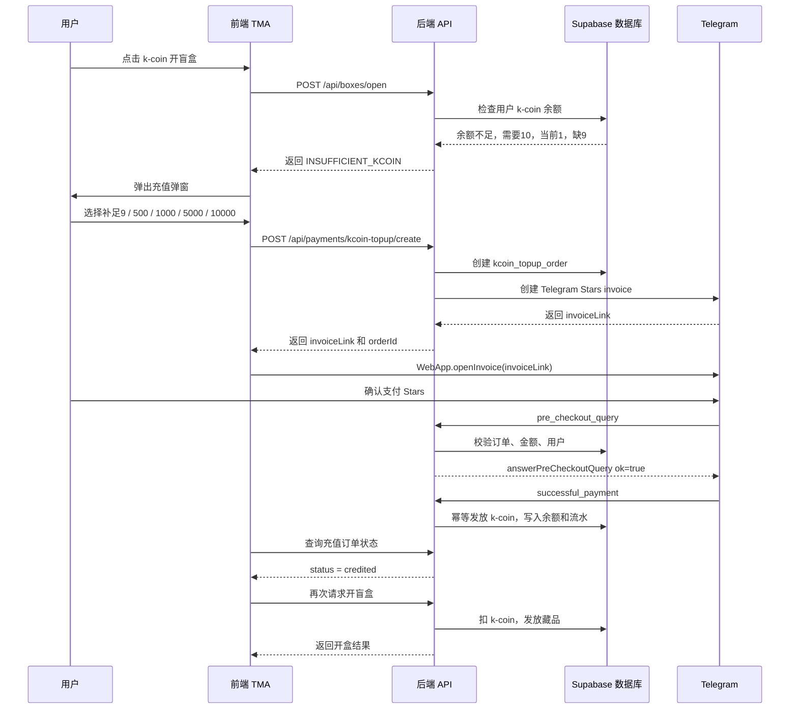

# k-coin 不足时使用 Telegram Stars 充值功能设计

## 1. 功能目标

当用户使用 **k-coin** 支付开盲盒费用时，如果余额不足，前端弹出充值弹窗。

例如：

```text
开盲盒需要：10 k-coin
用户余额：1 k-coin
还差：9 k-coin
```

前端弹出：

```text
k-coin 不足

本次开盲盒需要 10 k-coin
当前余额 1 k-coin
还差 9 k-coin

请选择充值数量：

[补足 9 k-coin]
[500 k-coin]
[1000 k-coin]
[5000 k-coin]
[10000 k-coin]
```

用户选择充值数量后，前端打开 Telegram Stars 支付确认弹窗。用户支付成功后，后端给用户发放对应数量的 k-coin，然后继续开盲盒。

---

# 2. 核心原则

最重要的一点：

```text
前端不能直接给用户增加 k-coin。
```

正确流程是：

```text
前端只负责展示充值按钮和打开 Telegram Stars 支付弹窗。
真正发放 k-coin 必须由后端在收到 Telegram successful_payment webhook 后完成。
```

否则用户可能伪造前端请求，直接刷 k-coin。

---

# 3. 整体业务流程



---

# 4. 前端弹窗设计

当后端返回余额不足：

```json
{
  "code": "INSUFFICIENT_KCOIN",
  "required": 10,
  "balance": 1,
  "shortage": 9
}
```

前端展示弹窗：

```text
k-coin 不足

本次开盲盒需要：10 k-coin
当前余额：1 k-coin
还差：9 k-coin

请选择充值数量：

[补足 9 k-coin] 推荐
[500 k-coin]
[1000 k-coin]
[5000 k-coin]
[10000 k-coin]
```

建议保留 **“补足差额”** 选项，因为用户当前最直接的需求是完成这一次开盒。

---

# 5. 前端生成充值选项

```ts
const fixedPackages = [500, 1000, 5000, 10000];

const topupOptions = [
  {
    label: `补足 ${shortage} k-coin`,
    amount: shortage,
    topupType: 'SHORTAGE',
    recommended: true,
  },
  ...fixedPackages.map(amount => ({
    label: `${amount} k-coin`,
    amount,
    topupType: 'PACKAGE',
    recommended: false,
  })),
];
```

用户点击某个选项后，请求后端创建充值订单。

```ts
await api.post('/api/payments/kcoin-topup/create', {
  amount: 500,
  intent: 'OPEN_BOX',
  boxId: currentBoxId,
});
```

---

# 6. 前端支付逻辑

```ts
async function createTopupAndPay(boxId: string, amount: number) {
  const res = await api.post('/api/payments/kcoin-topup/create', {
    amount,
    intent: 'OPEN_BOX',
    boxId,
  });

  const { orderId, invoiceLink } = res;

  window.Telegram.WebApp.openInvoice(invoiceLink, async (status) => {
    if (status === 'paid') {
      await waitUntilTopupCredited(orderId);
      await openBoxWithKcoin(boxId);
    }

    if (status === 'cancelled') {
      showToast('支付已取消');
    }

    if (status === 'failed') {
      showToast('支付失败，请重试');
    }

    if (status === 'pending') {
      showToast('支付处理中，请稍后刷新余额');
    }
  });
}
```

注意：

```text
openInvoice 返回 paid 之后，前端仍然不能直接加余额。
前端需要查询后端订单状态，等 status = credited 后，再刷新余额或继续开盒。
```

---

# 7. 后端接口设计

建议新增 4 个接口。

---

## 7.1 开盒接口

```text
POST /api/boxes/open
```

作用：

1. 校验用户登录状态。
2. 查询盲盒价格。
3. 查询用户 k-coin 余额。
4. 如果余额不足，返回差额。
5. 如果余额足够，扣 k-coin、抽奖、发放藏品。

余额不足时返回：

```json
{
  "code": "INSUFFICIENT_KCOIN",
  "required": 10,
  "balance": 1,
  "shortage": 9,
  "canTopup": true,
  "fixedTopupPackages": [500, 1000, 5000, 10000]
}
```

---

## 7.2 创建 k-coin 充值订单

```text
POST /api/payments/kcoin-topup/create
```

请求示例：

```json
{
  "amount": 500,
  "intent": "OPEN_BOX",
  "boxId": "box_rare_001"
}
```

后端必须重新校验：

```ts
const allowedPackages = [500, 1000, 5000, 10000];

const box = await getBox(boxId);
const balance = await getUserKcoinBalance(userId);
const shortage = Math.max(0, box.kcoinPrice - balance);

const isShortageTopup = amount === shortage;
const isFixedPackage = allowedPackages.includes(amount);

if (!isShortageTopup && !isFixedPackage) {
  throw new Error('INVALID_TOPUP_AMOUNT');
}

if (intent === 'OPEN_BOX' && balance + amount < box.kcoinPrice) {
  throw new Error('TOPUP_AMOUNT_NOT_ENOUGH_FOR_OPEN_BOX');
}
```

核心规则：

```text
允许充值金额 = 当前差额 OR 固定充值包
```

也就是：

```text
9、500、1000、5000、10000
```

如果当前差额是 9，那么 9 是合法的；如果用户伪造前端传 1、2、9999，则后端拒绝。

---

## 7.3 创建 Telegram Stars 发票

假设你的比例是：

```text
1 Telegram Star = 1 k-coin
```

那么：

```text
starAmount = kcoinAmount
```

创建发票时：

```ts
async function createTelegramStarsInvoice(order) {
  const payload = `kc_topup:${order.id}`;

  const res = await fetch(`https://api.telegram.org/bot${BOT_TOKEN}/createInvoiceLink`, {
    method: 'POST',
    headers: {
      'Content-Type': 'application/json'
    },
    body: JSON.stringify({
      title: `充值 ${order.kcoinAmount} k-coin`,
      description: `用于补足开盲盒所需的 k-coin`,
      payload,
      currency: 'XTR',
      prices: [
        {
          label: `${order.kcoinAmount} k-coin`,
          amount: order.starAmount
        }
      ],
      provider_token: ''
    })
  });

  const data = await res.json();

  if (!data.ok) {
    throw new Error(data.description || 'createInvoiceLink failed');
  }

  return data.result;
}
```

返回给前端：

```json
{
  "orderId": "xxx",
  "invoiceLink": "https://t.me/...",
  "kcoinAmount": 500,
  "starAmount": 500,
  "estimatedBalanceAfterTopup": 501,
  "estimatedBalanceAfterOpenBox": 491
}
```

---

## 7.4 查询充值订单状态

```text
GET /api/payments/kcoin-topup/status?orderId=xxx
```

返回：

```json
{
  "orderId": "xxx",
  "status": "credited",
  "kcoinAmount": 500,
  "balance": 501
}
```

前端只有查询到：

```text
status = credited
```

之后，才可以继续执行开盲盒。

---

## 7.5 Telegram webhook

```text
POST /api/telegram/webhook
```

用于接收 Telegram 的支付回调。

主要处理两种事件：

```text
pre_checkout_query
successful_payment
```

---

# 8. Telegram pre_checkout_query 处理

Telegram 在用户正式付款前，会向你的后端确认订单是否有效。

后端需要检查：

1. 订单是否存在。
2. 订单状态是否是 pending。
3. Telegram 用户 ID 是否匹配。
4. 支付币种是否是 XTR。
5. 支付金额是否正确。

伪代码：

```ts
async function handlePreCheckoutQuery(update: any) {
  const q = update.pre_checkout_query;

  const payload = q.invoice_payload;
  const orderId = payload.replace('kc_topup:', '');

  const order = await getTopupOrder(orderId);

  if (!order) {
    return answerPreCheckout(q.id, false, '订单不存在');
  }

  if (order.status !== 'pending') {
    return answerPreCheckout(q.id, false, '订单状态异常');
  }

  if (q.from.id !== order.telegram_user_id) {
    return answerPreCheckout(q.id, false, '用户不匹配');
  }

  if (q.currency !== 'XTR') {
    return answerPreCheckout(q.id, false, '支付币种错误');
  }

  if (q.total_amount !== order.star_amount) {
    return answerPreCheckout(q.id, false, '支付金额错误');
  }

  return answerPreCheckout(q.id, true);
}
```

---

# 9. Telegram successful_payment 处理

用户支付成功后，Telegram 会发送 `successful_payment`。

这时后端才可以给用户发放 k-coin。

```ts
async function handleSuccessfulPayment(update: any) {
  const msg = update.message;
  const sp = msg.successful_payment;

  const payload = sp.invoice_payload;
  const orderId = payload.replace('kc_topup:', '');

  await supabase.rpc('credit_kcoin_topup_order', {
    p_order_id: orderId,
    p_telegram_payment_charge_id: sp.telegram_payment_charge_id,
    p_provider_payment_charge_id: sp.provider_payment_charge_id,
    p_currency: sp.currency,
    p_total_amount: sp.total_amount
  });
}
```

---

# 10. 数据库表设计

建议新增充值订单表：

```sql
create table kcoin_topup_orders (
  id uuid primary key default gen_random_uuid(),

  user_id uuid not null references users(id),
  telegram_user_id bigint not null,

  status text not null check (
    status in (
      'pending',
      'precheckout_approved',
      'paid',
      'credited',
      'failed',
      'expired',
      'refunded'
    )
  ),

  topup_type text not null check (
    topup_type in ('SHORTAGE', 'PACKAGE')
  ),

  kcoin_amount integer not null check (kcoin_amount > 0),
  star_amount integer not null check (star_amount > 0),
  currency text not null default 'XTR',

  intent text not null default 'MANUAL_TOPUP',
  box_id uuid null references boxes(id),

  invoice_payload text not null unique,
  invoice_link text null,

  telegram_payment_charge_id text null unique,
  provider_payment_charge_id text null,

  created_at timestamptz not null default now(),
  paid_at timestamptz null,
  credited_at timestamptz null,
  refunded_at timestamptz null,

  metadata jsonb not null default '{}'::jsonb
);
```

---

# 11. 余额流水设计

充值成功后，需要写入 k-coin 流水。

示例：

```text
user_id: 用户ID
currency: KCOIN
direction: IN
amount: 500
reason: KCOIN_TOPUP_BY_STARS
ref_type: kcoin_topup_order
ref_id: topup_order_id
available_before: 1
available_after: 501
```

如果用户充值 500 后继续开盒：

```text
充值前余额：1
充值金额：500
充值后余额：501
开盒消耗：10
开盒后余额：491
```

---

# 12. 发放 k-coin 的 RPC 设计

必须用数据库事务和幂等逻辑，避免 Telegram webhook 重复调用导致重复发放。

核心逻辑：

```sql
create or replace function credit_kcoin_topup_order(
  p_order_id uuid,
  p_telegram_payment_charge_id text,
  p_provider_payment_charge_id text,
  p_currency text,
  p_total_amount integer
)
returns void
language plpgsql
security definer
as $$
declare
  v_order kcoin_topup_orders%rowtype;
  v_before integer;
  v_after integer;
begin
  select *
  into v_order
  from kcoin_topup_orders
  where id = p_order_id
  for update;

  if not found then
    raise exception 'TOPUP_ORDER_NOT_FOUND';
  end if;

  -- 已经发放过，直接返回，防止重复加钱
  if v_order.status = 'credited' then
    return;
  end if;

  if v_order.currency <> p_currency then
    raise exception 'CURRENCY_MISMATCH';
  end if;

  if v_order.star_amount <> p_total_amount then
    raise exception 'AMOUNT_MISMATCH';
  end if;

  if exists (
    select 1
    from kcoin_topup_orders
    where telegram_payment_charge_id = p_telegram_payment_charge_id
      and id <> p_order_id
  ) then
    raise exception 'DUPLICATE_TELEGRAM_CHARGE_ID';
  end if;

  select kcoin_available
  into v_before
  from user_balances
  where user_id = v_order.user_id
  for update;

  v_after := v_before + v_order.kcoin_amount;

  update user_balances
  set kcoin_available = v_after,
      updated_at = now()
  where user_id = v_order.user_id;

  insert into currency_ledger (
    user_id,
    currency,
    direction,
    amount,
    reason,
    ref_type,
    ref_id,
    available_before,
    available_after,
    created_at
  )
  values (
    v_order.user_id,
    'KCOIN',
    'IN',
    v_order.kcoin_amount,
    'KCOIN_TOPUP_BY_STARS',
    'kcoin_topup_order',
    v_order.id,
    v_before,
    v_after,
    now()
  );

  update kcoin_topup_orders
  set status = 'credited',
      telegram_payment_charge_id = p_telegram_payment_charge_id,
      provider_payment_charge_id = p_provider_payment_charge_id,
      paid_at = coalesce(paid_at, now()),
      credited_at = now()
  where id = p_order_id;
end;
$$;
```

---

# 13. 充值档位设计

推荐第一版使用：

```text
补足差额 + 固定充值包
```

例如：

```text
补足 9 k-coin
500 k-coin
1000 k-coin
5000 k-coin
10000 k-coin
```

对应规则：

| 选项           | 类型       | 说明         |
| ------------ | -------- | ---------- |
| 补足 9 k-coin  | SHORTAGE | 用户只想完成本次开盒 |
| 500 k-coin   | PACKAGE  | 小额充值       |
| 1000 k-coin  | PACKAGE  | 常用充值       |
| 5000 k-coin  | PACKAGE  | 中档充值       |
| 10000 k-coin | PACKAGE  | 大额充值       |

第一版可以先设置：

```text
1 Telegram Star = 1 k-coin
```

后续如果要做优惠包，可以改成：

```text
500 Stars = 550 k-coin
1000 Stars = 1150 k-coin
5000 Stars = 6000 k-coin
```

所以数据库里必须分开记录：

```text
star_amount
kcoin_amount
```

不要写死成完全相等。

---

# 14. 必须做的安全校验

| 风险                     | 正确做法                                       |
| ---------------------- | ------------------------------------------ |
| 前端伪造充值金额               | 后端只允许“当前差额”或固定充值包                          |
| 前端伪造 shortage          | 后端重新计算差额                                   |
| 重复点击充值按钮               | pending 订单复用或前端按钮 loading                  |
| webhook 重复通知           | RPC 幂等 + telegram_payment_charge_id unique |
| 支付成功但前端没收到             | 用户重新进页面后根据订单状态恢复                           |
| 前端显示 paid 但后端没入账       | 前端必须轮询订单状态到 credited                       |
| 用户支付后马上退款              | 保存 telegram_payment_charge_id，后续用于退款/扣回    |
| 用户充值后不开盒               | k-coin 留在余额中，可以后使用                         |
| 用户选择 500 充值后余额超过本次开盒费用 | 正常允许，多余 k-coin 留在余额里                       |

---

# 15. 最终推荐开发结构

```text
前端：
- 开盒按钮
- 余额不足弹窗
- 充值选项：补足差额 / 500 / 1000 / 5000 / 10000
- 调用创建充值订单接口
- 使用 Telegram WebApp.openInvoice 打开支付弹窗
- 支付后轮询订单状态
- credited 后刷新余额
- 自动继续开盲盒

后端：
- POST /api/boxes/open
- POST /api/payments/kcoin-topup/create
- GET /api/payments/kcoin-topup/status
- POST /api/telegram/webhook

数据库：
- kcoin_topup_orders
- user_balances
- currency_ledger
- credit_kcoin_topup_order RPC

Telegram：
- createInvoiceLink
- pre_checkout_query
- successful_payment
```

---

# 16. 最终一句话总结

这个功能应该设计成：

```text
用户 k-coin 不足时，前端展示“补足差额 + 固定充值包”；
用户选择充值数量后，后端创建 Telegram Stars 发票；
用户支付成功后，Telegram webhook 通知后端；
后端通过幂等数据库事务发放 k-coin；
前端确认订单 credited 后，再继续开盲盒。
```

不要让前端直接加 k-coin，也不要相信前端传来的余额、差额、价格和充值金额。
