# 资产功能开发说明书

---

## 1. 最终采用的核心方案

### 1.1 一句话结论

```text
资产余额展示 = 读取后端返回的用户余额快照
资产真实变动 = 只能由后端 RPC / 数据库事务完成
余额快照 = economy.user_balances
资产真账本 = economy.currency_ledger
充值入口 = Telegram Stars 充值 K-coin
前端职责 = 只提交用户动作，不提交最终余额
```

### 1.2 为什么使用这个方案

不要让前端直接决定资产结果。

原因：

1. 前端代码不可信，用户可以篡改请求。
2. K-coin、FGEMS 都是商业化资产，错一次就可能造成真实亏损。
3. 充值、开盒、交易、任务、图鉴、月卡都会改资产，必须有统一账本。
4. 余额展示可以缓存，但最终扣款和入账必须以后端为准。
5. 出现争议时，只能靠不可变流水追查每一次资产变化。

最终规则：

```text
economy.user_balances 负责“快速展示当前余额”
economy.currency_ledger 负责“记录每次资产变化”
payments.kcoin_topup_orders 负责“K-coin 充值业务订单”
payments.star_orders / payments.star_payments 负责“Telegram Stars 支付记录”
```

最重要的一句话：

```text
任何资产增加、扣减、冻结、解冻，都必须写 currency_ledger。
```

---

## 2. 功能目标

资产功能不是一个简单的余额数字，而是整个游戏的资金底座。

它需要支撑：

```text
顶部资产栏
+ K-coin 充值
+ K-coin 开盒扣款
+ FGEMS 奖励展示
+ 任务 / 邀请 / 图鉴 / 月卡奖励入账
+ 市场交易扣款和收款
+ 余额刷新
+ 资产对账
+ 防重复发放
```

核心目标：

1. 用户进入 TMA 后能看到自己的头像、K-coin、FGEMS 和钱包入口。
2. K-coin 不足时，用户可以用 Telegram Stars 充值 K-coin。
3. 充值成功后，K-coin 必须只到账一次。
4. 开盒、市场购买、升级、进化等消耗资产的动作，必须由后端校验余额。
5. 任务、邀请、图鉴、月卡等发放奖励的动作，必须由后端写入资产流水。
6. 所有资产流水都能追溯来源。
7. 任何用户不能读取或修改别人的资产。
8. 前端不能直接传“余额应该变成多少”。

---

## 3. MVP 范围

### 3.1 第一版必须做

1. 顶部资产栏展示：
   - 用户头像
   - K-coin 可用余额
   - FGEMS 可用余额
   - 钱包入口
2. 页面加载时读取用户资产。
3. 资产读取失败时允许用户手动刷新。
4. 点击 K-coin 打开充值弹窗。
5. 充值档位使用当前项目已有档位：
   - `1`
   - `500`
   - `1000`
   - `5000`
   - `10000`
6. 充值规则：

```text
1 Telegram Star = 1 K-coin
```

7. 前端提交充值档位ID和幂等键。
8. 后端创建 K-coin 充值订单和 Telegram Stars 订单。
9. Telegram 支付成功后，后端通过 webhook 给 K-coin 入账。
10. 入账必须写 `economy.currency_ledger`。
11. 充值状态可以刷新和轮询。
12. 开盒、交易、任务、图鉴、月卡等模块完成后刷新资产栏。
13. 资产变动必须可测试、可追踪、可对账。

### 3.2 第一版暂时不做

1. 站内用户之间直接转账。
2. 用户提现。
3. 资产明细页的完整账单列表。
4. 多币种自由兑换。
5. 复杂资产图表。
6. 后台管理系统。
7. 前端展示真实链上钱包私钥、服务端密钥或收款地址。
8. 让前端直接调用资产写入 RPC。
9. 用户手动输入任意充值金额。

---

## 4. 数据表设计

资产功能当前围绕以下核心表。

| 表名 | 作用 |
| --- | --- |
| `economy.currencies` | 资产币种配置，比如 KCOIN、FGEMS、XTR |
| `economy.user_balances` | 用户余额快照，用来快速展示当前余额 |
| `economy.currency_ledger` | 不可变资产流水，是真账本 |
| `economy.balance_locks` | 余额冻结记录，给未来托管/冻结场景使用 |
| `payments.kcoin_topup_orders` | K-coin 充值业务订单 |
| `payments.star_orders` | Telegram Stars 支付订单 |
| `payments.star_payments` | Telegram Stars 实际支付记录 |
| `core.users` | 用户主表，资产归属必须绑定用户 |

说明：

```text
user_balances 是结果快照。
currency_ledger 是审计凭证。
两者不一致时，以 ledger 为排查源头。
```

---

## 5. ERD 表关系

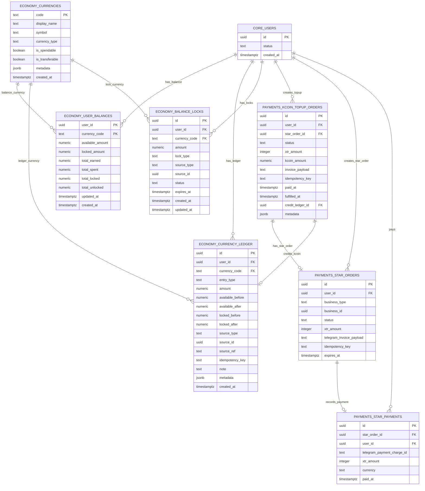

---

## 6. 表结构说明

### 6.1 `economy.currencies`

作用：

```text
定义系统支持哪些资产。
```

当前项目里已经有：

| code | 含义 | 用途 |
| --- | --- | --- |
| `KCOIN` | K-coin | 开盒、交易等主要消耗资产 |
| `FGEMS` | Fgems | 奖励、成长或后续兑换类资产 |
| `XTR` | Telegram Stars | Telegram 外部支付单位 |
| `STAR_DISPLAY` | Stars 展示单位 | 展示用途，不作为可消费余额 |

规则：

1. 前端资产栏第一版只展示 `KCOIN` 和 `FGEMS`。
2. `XTR` 是外部支付单位，不等于站内可花余额。
3. `STAR_DISPLAY` 只能用于展示，不应参与扣款。
4. 新增币种前必须先确认业务用途，不能在代码里随手加。

### 6.2 `economy.user_balances`

作用：

```text
保存用户每个币种的余额快照。
```

关键字段：

| 字段 | 说明 |
| --- | --- |
| `user_id` | 用户 ID |
| `currency_code` | 币种 |
| `available_amount` | 可用余额 |
| `locked_amount` | 锁定余额 |
| `total_earned` | 累计获得 |
| `total_spent` | 累计消耗 |
| `total_locked` | 累计锁定 |
| `total_unlocked` | 累计解锁 |
| `updated_at` | 最近更新时间 |

规则：

1. 前端只能读取自己的余额。
2. 前端不能直接改 `available_amount`。
3. 后端也不应该绕过统一 RPC 直接改余额。
4. 余额不能小于 0。
5. 每次余额变化都必须同时写 `currency_ledger`。

### 6.3 `economy.currency_ledger`

作用：

```text
记录每一次资产变化，是资产系统的真账本。
```

关键字段：

| 字段 | 说明 |
| --- | --- |
| `id` | 流水 ID |
| `user_id` | 用户 ID |
| `currency_code` | 币种 |
| `entry_type` | 流水类型 |
| `amount` | 本次变化金额 |
| `available_before` | 变化前可用余额 |
| `available_after` | 变化后可用余额 |
| `locked_before` | 变化前锁定余额 |
| `locked_after` | 变化后锁定余额 |
| `source_type` | 来源业务 |
| `source_id` | 来源记录 ID |
| `source_ref` | 来源引用 |
| `idempotency_key` | 幂等键 |
| `metadata` | 扩展信息 |
| `created_at` | 创建时间 |

`entry_type` 当前支持：

```text
credit
debit
lock
unlock
fee
refund
adjustment
reversal
```

规则：

1. 这张表不能 update。
2. 这张表不能 delete。
3. 资产修正只能追加 `adjustment`、`reversal` 或受控补偿记录。
4. 同一个业务动作必须有稳定的 `idempotency_key`。
5. 每条流水必须能通过 `source_type`、`source_id` 或 `source_ref` 找回来源。

### 6.4 `economy.balance_locks`

作用：

```text
记录被暂时锁住的余额。
```

当前项目市场购买是即时结算，冻结表更多是给未来托管、退款 hold、活动 hold 使用。

规则：

1. 锁定时从可用余额扣到锁定余额。
2. 解锁时可以释放回可用余额。
3. 消耗锁定余额时不回到可用余额。
4. 锁定和解锁都必须写 `currency_ledger`。

### 6.5 `payments.kcoin_topup_orders`

作用：

```text
记录用户用 Telegram Stars 充值 K-coin 的业务订单。
```

关键字段：

| 字段 | 说明 |
| --- | --- |
| `id` | 充值订单 ID |
| `user_id` | 用户 ID |
| `star_order_id` | 关联 Telegram Stars 订单 |
| `status` | 充值订单状态 |
| `xtr_amount` | 用户需要支付的 Stars 数量 |
| `kcoin_amount` | 到账 K-coin 数量 |
| `invoice_payload` | Telegram invoice payload |
| `idempotency_key` | 创建订单幂等键 |
| `paid_at` | 支付时间 |
| `fulfilled_at` | 到账时间 |
| `credit_ledger_id` | K-coin 入账流水 ID |

规则：

1. 当前汇率固定：

```text
1 XTR = 1 KCOIN
```

2. 当前允许档位：

```text
1, 500, 1000, 5000, 10000
```

3. 一个充值订单最多只能入账一次。
4. 入账成功必须写 `credit_ledger_id`。
5. 前端不能提交任意金额。

### 6.6 `payments.star_orders`

作用：

```text
记录 Telegram Stars 支付订单。
```

资产功能里主要用：

```text
business_type = 'kcoin_topup'
```

规则：

1. Stars 只是支付通道。
2. Stars 支付成功不等于 K-coin 已到账。
3. K-coin 到账以 `payments.kcoin_topup_orders.status = fulfilled` 和 `credit_ledger_id` 为准。
4. `telegram_invoice_payload` 必须和充值订单中的 `invoice_payload` 对上。

### 6.7 `payments.star_payments`

作用：

```text
记录 Telegram 回调里确认的成功支付。
```

规则：

1. 同一个 `telegram_payment_charge_id` 不能重复绑定到不同订单。
2. 支付记录、充值订单、K-coin 流水必须能串起来。
3. webhook 重试时必须幂等，不能重复给 K-coin。

---

## 7. 资产核心业务规则

### 7.1 余额展示规则

1. 前端资产栏读取后端接口。
2. 首屏可以使用 bootstrap 里的资产快照。
3. 后续刷新使用 `GET /api/me/assets`。
4. 前端不能长期用本地计算结果覆盖后端余额。
5. 业务成功后要重新刷新资产栏。
6. 接口失败时，可以显示上一次成功余额，并给用户刷新按钮。

### 7.2 入账规则

入账来源包括：

1. K-coin 充值到账。
2. 任务奖励。
3. 邀请奖励。
4. 图鉴奖励。
5. 月卡每日 FGEMS。
6. 市场卖出收入。
7. 分解返还。
8. 运营补偿或修正。

统一规则：

```text
先确认业务条件
再写余额
再写 ledger
最后返回结果
```

不能出现：

```text
业务记录成功了，但资产没有到账
资产到账了，但没有 ledger
ledger 写了，但来源查不到
```

### 7.3 扣款规则

扣款场景包括：

1. K-coin 开盒。
2. 市场购买。
3. 升级。
4. 进化。
5. 未来可能的 Mint 手续费。

统一规则：

1. 后端根据服务端配置计算金额。
2. 前端最多提交“用户动作”，比如开哪个盒子、开 1 次还是 10 次。
3. 后端检查余额是否足够。
4. 余额不足直接失败，不能扣成负数。
5. 扣款和业务结果必须在同一个事务里完成。
6. 扣款必须写 `currency_ledger`。

### 7.4 冻结和解冻规则

冻结不是第一版重点，但底层已经有表和 RPC 支撑。

适合用于：

1. 市场托管。
2. 风控 hold。
3. 退款等待。
4. 活动临时锁定。

规则：

1. 冻结必须减少 `available_amount`，增加 `locked_amount`。
2. 释放必须增加 `available_amount`，减少 `locked_amount`。
3. 消耗锁定余额时只减少 `locked_amount`。
4. 每一步都必须写流水。

### 7.5 充值规则

当前充值只支持：

```text
Telegram Stars -> K-coin
```

流程规则：

1. 用户选择固定档位。
2. 后端创建充值订单。
3. 后端创建 Telegram Stars 订单。
4. 前端打开 Telegram invoice。
5. Telegram webhook 确认支付。
6. 后端给 K-coin 入账。
7. 前端刷新充值状态和资产栏。

明确不做：

1. 前端直接给用户加 K-coin。
2. Stars 直接当 K-coin 消费。
3. 任意自定义充值金额。
4. 充值未确认就提前发货。

---

## 8. 资产状态机

### 8.1 用户余额状态

余额本身不是一张复杂状态表，但可以按下面理解：

```text
available = 可直接花的余额
locked = 被业务暂时锁住的余额
available + locked = 用户当前站内资产快照
```

变化方式：

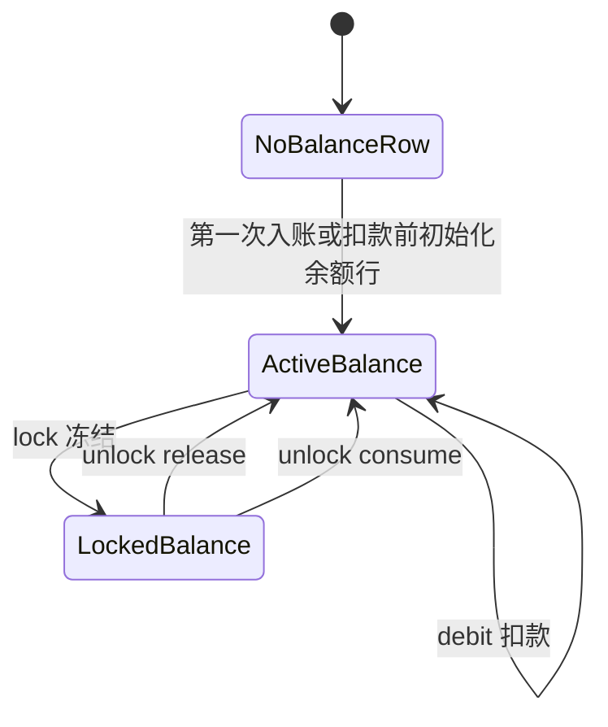

### 8.2 K-coin 充值订单状态机

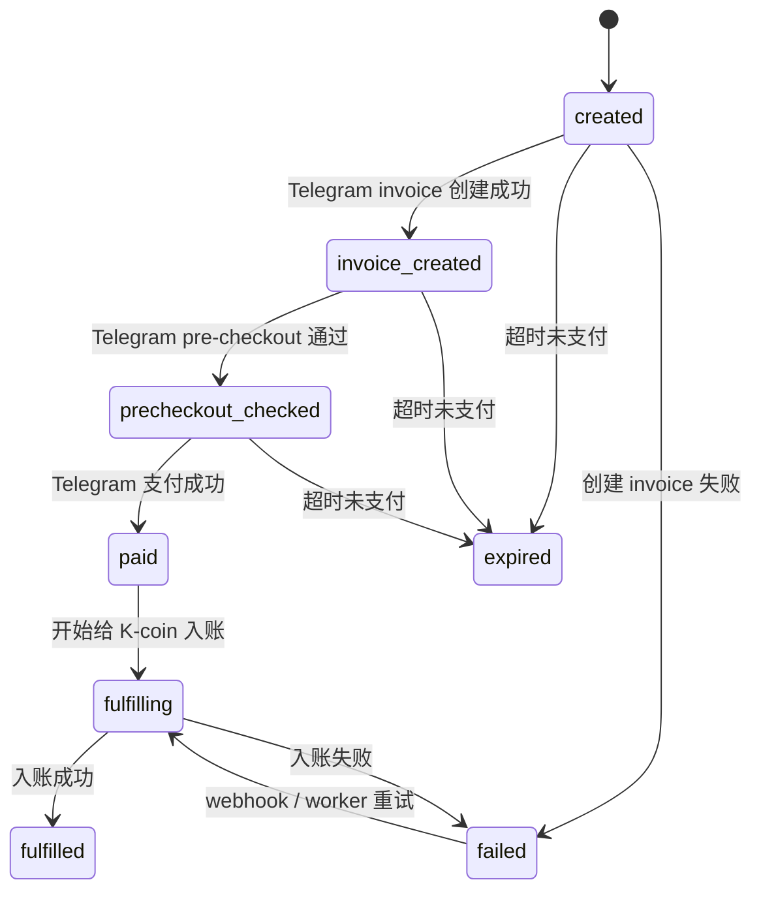

前端展示时可以简化为：

| 后端状态 | 前端文案方向 |
| --- | --- |
| `created` | 等待支付 |
| `precheckout_checked` | 支付确认中 |
| `paid` | 支付成功，等待到账 |
| `fulfilling` | 正在到账 |
| `fulfilled` | 充值成功 |
| `failed` | 充值失败 |
| `expired` | 订单已过期 |
| `refunded` | 已退款 |
| `disputed` | 支付争议处理中 |

---

## 9. 统一资产变动函数

### 9.1 职责

资产变动必须统一走服务端可信路径。

当前项目已有核心 RPC：

```text
api.economy_credit
api.economy_debit
api.economy_lock_balance
api.economy_unlock_balance
```

职责：

1. 校验用户和金额。
2. 初始化余额行。
3. 对余额行加锁。
4. 修改 `user_balances`。
5. 写入 `currency_ledger`。
6. 返回变动后的余额。
7. 支持幂等。

### 9.2 伪 SQL

入账逻辑：

```sql
begin;

select user_balances
for update;

update user_balances
set available_amount = available_amount + amount,
    total_earned = total_earned + amount;

insert into currency_ledger (
  user_id,
  currency_code,
  entry_type,
  amount,
  available_before,
  available_after,
  source_type,
  source_id,
  idempotency_key
);

commit;
```

扣款逻辑：

```sql
begin;

select user_balances
for update;

if available_amount < amount then
  raise insufficient_balance;
end if;

update user_balances
set available_amount = available_amount - amount,
    total_spent = total_spent + amount;

insert into currency_ledger (
  user_id,
  currency_code,
  entry_type,
  amount,
  available_before,
  available_after,
  source_type,
  source_id,
  idempotency_key
);

commit;
```

### 9.3 来源枚举建议

资产流水的 `source_type` 必须可读、稳定、可追溯。

建议按业务来源使用：

| 来源 | 用途 |
| --- | --- |
| `kcoin_topup` | Stars 充值 K-coin |
| `gacha_open` | 开盒扣 K-coin |
| `market_buy` | 市场购买扣款 |
| `market_sell` | 市场卖出收入 |
| `market_fee` | 市场手续费 |
| `task_reward` | 任务奖励 |
| `referral_reward` | 邀请奖励 |
| `album_reward` | 图鉴奖励 |
| `vip_daily_fgems` | 月卡每日 FGEMS |
| `inventory_upgrade` | 升级消耗 |
| `inventory_evolve` | 进化消耗 |
| `inventory_decompose` | 分解返还 |
| `payment_refund` | 支付退款 |
| `asset_adjustment` | 受控资产修正 |
| `asset_reversal` | 资产冲正 |

注意：

```text
如果现有数据库已经使用了不同 source_type，以现有数据库为准。
不要为了文档随意改历史枚举。
```

---

## 10. 总业务闭环

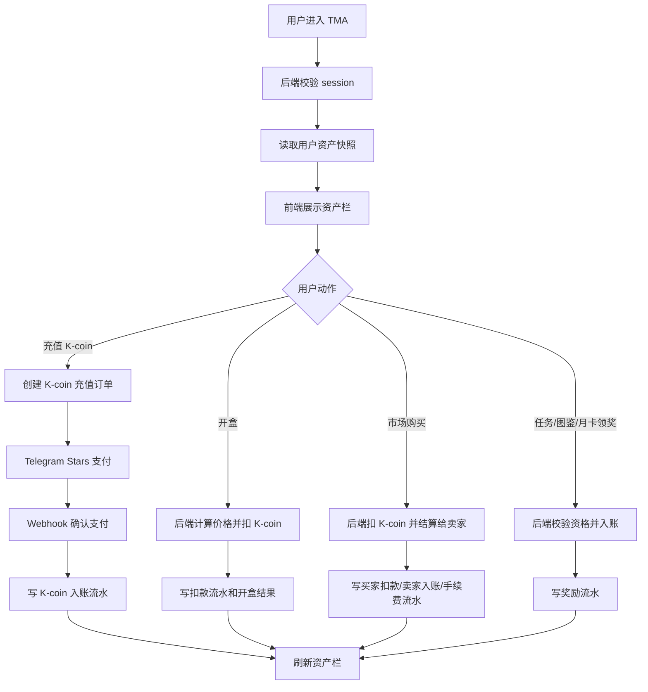

资产闭环关键点：

```text
用户动作
→ 后端校验
→ 服务端计算金额
→ 数据库事务改余额
→ 写 currency_ledger
→ 返回结果
→ 前端刷新展示
```

---

## 11. 和开盲盒功能的连接

### 11.1 业务规则

开盒消耗 K-coin。

前端只能提交：

```text
box_slug
draw_count
idempotency_key
```

后端必须自己确定：

1. 盒子是否存在。
2. 盒子是否可开。
3. 单次价格是多少。
4. 10 连价格是多少。
5. 用户余额是否足够。
6. 奖励池是否可用。
7. 保底状态是否需要触发。
8. 开盒结果是什么。

前端不能提交：

```text
total_price_kcoin
paid_kcoin
discount_bps
reward_items
balance_after
```

这些都必须由后端算。

### 11.2 流程

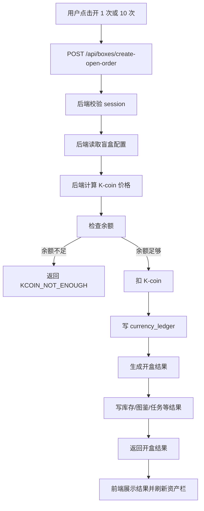

---

## 12. 和交易市场功能的连接

### 12.1 市场购买

市场购买消耗买家的 K-coin，并给卖家结算 K-coin。

后端必须做：

1. 校验 listing 是否存在。
2. 校验 listing 是否可购买。
3. 校验买家不是卖家本人。
4. 校验购买数量。
5. 计算总价。
6. 计算平台手续费。
7. 扣买家 K-coin。
8. 给卖家入账。
9. 写交易记录。
10. 写买家、卖家、手续费相关流水。

### 12.2 市场出售

创建挂单本身不应该给卖家加钱。

只有买家付款成交后，卖家才获得结算收入。

规则：

1. 前端不能提交卖家应得金额。
2. 后端按规则计算手续费和卖家净收入。
3. 成交事务里必须同时处理库存和资产。
4. 失败时不能出现“钱扣了但东西没转移”。

### 12.3 流程

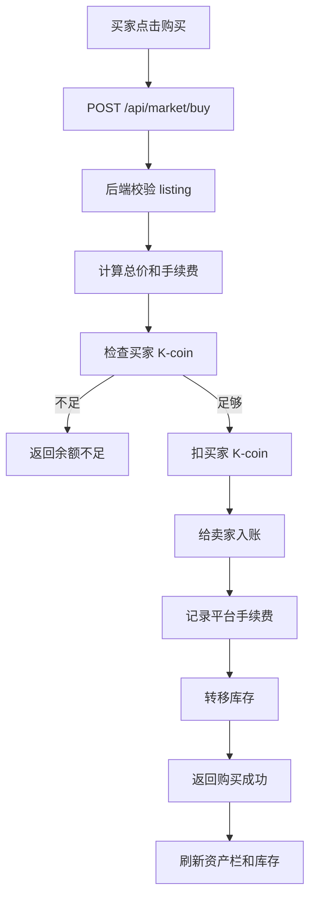

---

## 13. 和任务 / 邀请 / 签到功能的连接

### 13.1 业务规则

任务和邀请属于资产发放入口。

后端必须校验：

1. 用户是否登录。
2. 任务是否存在。
3. 用户是否满足任务条件。
4. 是否已经领取过。
5. 奖励配置是否合法。
6. 幂等键是否重复。

奖励发放规则：

```text
任务完成记录
奖励领取记录
资产入账流水
```

必须在同一个可信流程里完成。

### 13.2 流程

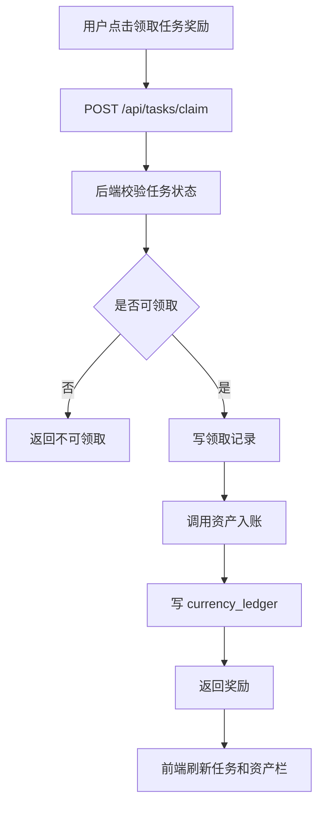

---

## 14. 和图鉴奖励功能的连接

### 14.1 业务规则

图鉴奖励如果发 K-coin 或 FGEMS，也属于资产入账。

规则：

1. 前端不能提交奖励金额。
2. 后端必须从图鉴配置读取奖励。
3. 用户必须完成对应图鉴条件。
4. 每个奖励只能领取一次。
5. 奖励记录和资产流水必须同事务完成。

### 14.2 流程

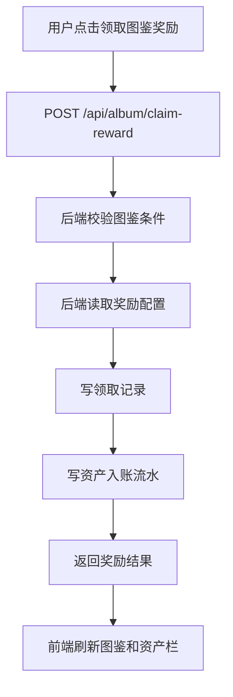

---

## 15. 和月卡功能的连接

### 15.1 业务规则

月卡会涉及：

1. 用户购买月卡。
2. 每日领取 FGEMS。
3. 每日免费盲盒。
4. 交易手续费返利。

资产规则：

1. 月卡购买用 Telegram Stars 支付，不允许前端确认付款。
2. 每日 FGEMS 领取必须写 `economy.currency_ledger`。
3. 免费盲盒不是 K-coin 余额，不能伪装成 K-coin 发放。
4. 手续费返利如果发 K-coin，也必须写资产流水。

### 15.2 流程

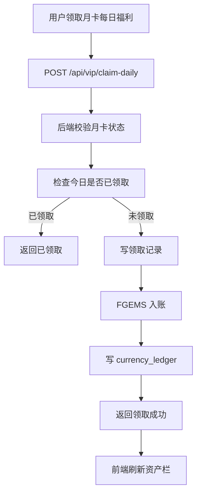

---

## 16. 和钱包 / Mint 功能的连接

### 16.1 业务规则

资产栏里的钱包入口只是入口。

钱包功能负责：

1. 连接 TON 钱包。
2. 验证钱包签名。
3. 展示钱包状态。
4. Mint 藏品到链上。

资产功能负责：

1. 展示钱包入口状态。
2. 不保存真实钱包私钥。
3. 不把服务端钱包地址、密钥、Webhook Secret 放到前端。
4. Mint 如果涉及手续费，必须由后端计算并扣款。

### 16.2 注意事项

```text
TON 钱包地址可以作为用户公开连接状态展示。
真实密钥、Bot Token、service role key、签名私钥不能进前端。
```

---

## 17. 后端接口设计

### 17.1 获取我的资产

```http
GET /api/me/assets
```

作用：

```text
返回当前登录用户的 K-coin 和 FGEMS 余额。
```

后端必须做：

1. 校验 session。
2. 调用 `api.get_user_asset_balances`。
3. 只返回当前用户资产。
4. 对返回结构做校验。
5. 失败时返回统一错误。

返回结构：

```json
{
  "userId": "00000000-0000-0000-0000-000000000000",
  "balances": {
    "KCOIN": {
      "currencyCode": "KCOIN",
      "available": "1000",
      "locked": "0"
    },
    "FGEMS": {
      "currencyCode": "FGEMS",
      "available": "300",
      "locked": "0"
    }
  },
  "assets": {
    "kcoin": {
      "currencyCode": "KCOIN",
      "available": "1000",
      "locked": "0"
    },
    "fgems": {
      "currencyCode": "FGEMS",
      "available": "300",
      "locked": "0"
    }
  },
  "updatedAt": "2026-06-06T00:00:00.000Z"
}
```

注意：

```text
金额用字符串返回，避免大整数在前端丢精度。
```

### 17.2 创建 K-coin 充值订单

```http
POST /api/payments/kcoin-topup/create-order
```

请求：

```json
{
  "amount": 500,
  "idempotency_key": "kcoin:topup:500:client-generated-key"
}
```

后端必须校验：

| 校验项 | 是否必须 |
| --- | --- |
| 用户是否登录 | 必须 |
| 用户状态是否 active | 必须 |
| 充值档位是否合法 | 必须 |
| 幂等键是否存在 | 必须 |
| 幂等键是否被其他请求占用 | 必须 |
| 是否允许创建 Stars 支付 | 必须 |
| 用户风控是否允许支付 | 必须 |

返回：

```json
{
  "order_id": "00000000-0000-0000-0000-000000000000",
  "topup_order_id": "00000000-0000-0000-0000-000000000000",
  "star_order_id": "00000000-0000-0000-0000-000000000001",
  "invoice_payload": "kcoin_xxx",
  "invoice_link": "https://t.me/invoice/xxx",
  "invoice_open_mode": "url",
  "xtr_amount": 500,
  "kcoin_amount": 500,
  "order_status": "created",
  "payment_status": "created",
  "payment_order_status": "created",
  "expires_at": "2026-06-06T00:15:00.000Z",
  "paid_at": null,
  "fulfilled_at": null,
  "idempotent": false
}
```

### 17.3 查询 K-coin 充值状态

```http
GET /api/payments/kcoin-topup/status?orderId=00000000-0000-0000-0000-000000000000
```

作用：

```text
查询充值订单、Stars 订单、支付记录和到账状态。
```

后端必须做：

1. 校验 session。
2. 校验 `orderId`。
3. 只能查询当前用户自己的订单。
4. 返回充值状态快照。

返回核心字段：

```json
{
  "order_id": "00000000-0000-0000-0000-000000000000",
  "topup_order_id": "00000000-0000-0000-0000-000000000000",
  "star_order_id": "00000000-0000-0000-0000-000000000001",
  "status": "fulfilled",
  "payment_order_status": "fulfilled",
  "xtr_amount": 500,
  "kcoin_amount": 500,
  "paid_at": "2026-06-06T00:03:00.000Z",
  "fulfilled_at": "2026-06-06T00:03:02.000Z",
  "fulfillment": {
    "status": "fulfilled",
    "credited": true,
    "completed_at": "2026-06-06T00:03:02.000Z",
    "failed": false,
    "retryable": false
  },
  "server_time": "2026-06-06T00:03:05.000Z"
}
```

### 17.4 不建议开放的接口

不要开放这些接口：

```http
POST /api/assets/credit
POST /api/assets/debit
POST /api/assets/set-balance
POST /api/assets/adjust
POST /api/assets/unlock
DELETE /api/assets/ledger/:id
```

原因：

1. 用户不能直接请求给自己加钱。
2. 用户不能直接请求扣别人钱。
3. 余额不能由前端传最终结果。
4. 流水不能删。
5. 修正资产必须走服务端受控流程，不做后台管理系统入口。

---

## 18. K-coin 充值流程

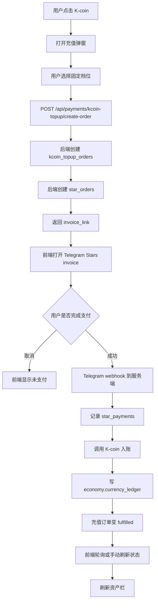

关键规则：

1. 支付成功后由 webhook 入账，不由前端入账。
2. webhook 可能重复到达，入账必须幂等。
3. 用户关闭 invoice 不代表支付失败，只能查询状态确认。
4. 如果状态是 `fulfilled`，前端刷新资产栏。
5. 如果状态是 `failed` 或 `expired`，允许重新选择档位。

---

## 19. 资产刷新流程

资产刷新触发点：

1. App 首次启动。
2. 登录成功。
3. 充值 fulfilled。
4. 开盒成功。
5. 市场购买成功。
6. 市场卖出成交后。
7. 任务奖励领取成功。
8. 图鉴奖励领取成功。
9. 月卡每日奖励领取成功。
10. 用户手动点击刷新。

流程：

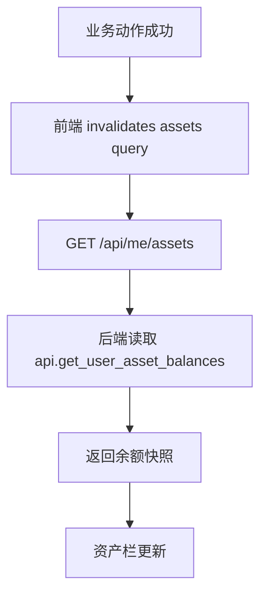

规则：

```text
前端可以为了体验先显示加载状态。
但不能把本地预估余额当成最终余额长期展示。
```

---

## 20. 前端 UI 结构

### 20.1 顶部资产栏

资产栏建议结构：

```text
┌────────────────────────────────────┐
│ 头像 / 钱包入口                     │
│ K-coin 按钮       FGEMS 展示        │
└────────────────────────────────────┘
```

当前已有组件：

```text
apps/web/src/features/assets/components/AssetBar.tsx
apps/web/src/features/assets/components/KCoinPill.tsx
apps/web/src/features/assets/components/FgemsPill.tsx
apps/web/src/features/assets/components/UserAvatar.tsx
apps/web/src/features/assets/components/WalletEntryButton.tsx
apps/web/src/features/assets/components/KcoinTopupSheet.tsx
```

展示规则：

1. K-coin 可点击，打开充值弹窗。
2. FGEMS 第一版只展示，不做点击功能。
3. 钱包按钮进入钱包连接/状态功能。
4. 读取失败时显示刷新按钮。
5. 加载中不能造成布局跳动。

### 20.2 K-coin 充值弹窗

弹窗内容：

1. 标题：充值 K-coin。
2. 规则：`1 Star = 1 K-coin`。
3. 当前余额。
4. 如果来自余额不足场景，展示还差多少。
5. 固定充值档位。
6. 支付状态提示。
7. 刷新到账状态按钮。
8. 失败或过期后允许重新选择。

### 20.3 错误展示

错误不要写成技术黑话。

建议文案：

| 场景 | 文案 |
| --- | --- |
| 余额不足 | K-coin 不足，请先充值。 |
| 充值档位无效 | 这个充值档位不可用，请重新选择。 |
| 订单不存在 | 充值订单不存在或已失效。 |
| 支付未完成 | 还没有收到支付成功通知。 |
| 到账失败 | 充值到账失败，请稍后刷新。 |
| 资产刷新失败 | 资产刷新失败，请重试。 |

---

## 21. 前端展示规则

### 21.1 金额格式

1. 后端返回金额是字符串。
2. 前端展示时可以格式化千分位。
3. 前端不能用浮点数处理大额资产。
4. K-coin 和 FGEMS 当前都是整数资产。
5. 不能显示负数。

### 21.2 加载态

首次加载：

```text
显示骨架或 loading 数字占位。
```

已有余额但正在刷新：

```text
保留旧余额，同时显示刷新状态。
```

接口失败：

```text
如果有旧余额，继续显示旧余额并给刷新按钮。
如果没有旧余额，显示不可用状态。
```

### 21.3 余额变化后展示

业务成功后：

1. 不要直接把按钮上的余额做加减后当真。
2. 先让业务接口返回成功。
3. 再刷新 `GET /api/me/assets`。
4. 以刷新后的余额为准。

---

## 22. 点击交互

### 22.1 点击 K-coin

流程：

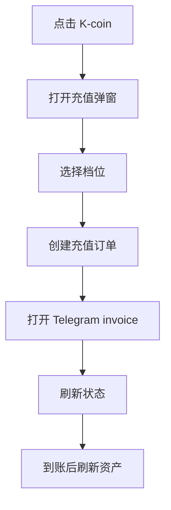

规则：

1. 已有未完成订单时，不要重复创建一堆订单。
2. 支付未完成时展示当前订单状态。
3. 失败、过期、取消后再允许重新选择。

### 22.2 点击 FGEMS

第一版不做复杂交互。

可以：

```text
无点击
或只显示简单提示
```

不要做：

```text
前端兑换
前端转账
前端调整余额
```

### 22.3 点击刷新

流程：

1. 调用 `GET /api/me/assets`。
2. 成功后更新资产栏。
3. 失败后保留旧值并提示用户。

---

## 23. 充值弹窗设计

### 23.1 档位

第一版固定档位：

| Stars | K-coin |
| --- | --- |
| 1 | 1 |
| 500 | 500 |
| 1000 | 1000 |
| 5000 | 5000 |
| 10000 | 10000 |

规则：

1. 前端展示这些档位。
2. 后端也必须校验这些档位。
3. 以后改档位时，前后端和数据库校验要一起改。

### 23.2 来自余额不足场景

如果用户开盒时余额不足：

```text
当前余额 = 120
需要余额 = 270
还差 150
```

弹窗应清楚提示：

```text
还差 150 K-coin，当前余额 120。
```

但后端不能因为前端说“还差 150”就相信。

### 23.3 重试支付

如果订单还是可支付状态：

```text
created
precheckout_checked
```

可以允许用户重新打开 invoice。

如果订单已经：

```text
fulfilled
failed
expired
refunded
disputed
```

要按对应状态处理，不能继续当新订单支付。

---

## 24. 支付状态展示

### 24.1 状态合并

前端展示时不要把所有底层状态都暴露给用户。

可以合并成：

| 展示状态 | 包含后端状态 |
| --- | --- |
| 等待支付 | `created` |
| 支付确认中 | `precheckout_checked`、`paid` |
| 正在到账 | `fulfilling` |
| 充值成功 | `fulfilled` |
| 充值失败 | `failed` |
| 已过期 | `expired` |
| 已退款 | `refunded` |
| 争议处理中 | `disputed` |

### 24.2 成功状态

只有满足下面条件，前端才展示“充值成功”：

```text
payment_order_status = fulfilled
或 fulfillment.credited = true
```

成功后必须：

1. 关闭或更新充值弹窗状态。
2. 刷新资产栏。
3. 不再重复创建同一个订单。

### 24.3 失败状态

失败后：

1. 展示失败文案。
2. 允许用户重新选择充值档位。
3. 不要本地给 K-coin 加余额。
4. 如果用户已经支付但未到账，引导刷新状态，不要让用户重复支付同一个订单。

---

## 25. 安全与防刷规则

| 风险 | 规则 |
| --- | --- |
| 前端篡改余额 | 前端不能提交最终余额 |
| 前端篡改充值金额 | 后端只允许固定档位 |
| 重复点击充值 | 使用幂等键 |
| Telegram webhook 重复到达 | 入账 RPC 必须幂等 |
| 开盒并发扣款 | 余额行 `for update`，不能扣成负数 |
| 市场并发购买 | listing、库存、余额必须同事务锁定 |
| 任务重复领奖 | 领取记录唯一约束 + 幂等 |
| 图鉴重复领奖 | 领取记录唯一约束 + 幂等 |
| 月卡重复领取 | 按日期唯一限制 |
| 用户查别人资产 | session userId 必须来自后端 |
| 用户直接调 RPC | 写入 RPC 不给 anon/authenticated 直接执行 |
| ledger 被修改 | 禁止 update/delete 历史流水 |
| 密钥泄露 | Bot Token、service role key、TON 私钥只放服务端环境变量 |

重点：

```text
资产功能的安全，不靠前端按钮隐藏。
必须靠后端校验、RPC 权限、数据库约束和不可变流水。
```

---

## 26. RLS 建议

### 26.1 公共配置表

`economy.currencies` 可以作为配置表读取，但也要注意：

```text
只读公开币种配置，不开放写入。
```

### 26.2 用户私有表

以下表只能用户读自己的记录，或者只允许 service role 读写：

```text
economy.user_balances
economy.currency_ledger
economy.balance_locks
payments.kcoin_topup_orders
payments.star_orders
payments.star_payments
```

更推荐的方式：

```text
前端不直接读这些表。
前端只调用 Vercel API。
Vercel API 用 service role 调安全 RPC。
```

### 26.3 写入权限

用户不能直接 insert/update/delete：

```text
economy.user_balances
economy.currency_ledger
economy.balance_locks
payments.kcoin_topup_orders
payments.star_orders
payments.star_payments
```

这些写操作必须由：

```text
Vercel Function
Supabase RPC
Telegram webhook
后端 worker
```

触发。

---

## 27. 后端实现建议

建议检查或维护以下文件。

### 27.1 Validation

```text
packages/validation/src/me.schemas.ts
packages/validation/src/payment.schemas.ts
```

需要保证：

1. `/me/assets` 返回 KCOIN 和 FGEMS。
2. 金额是非负整数字符串。
3. K-coin 充值档位只能是固定档位。
4. 充值状态查询必须校验 UUID。
5. 幂等键格式要有限制。

### 27.2 API

```text
api/me/assets.ts
api/payments/kcoin-topup/create-order.ts
api/payments/kcoin-topup/status.ts
```

需要保证：

1. 所有接口校验 session。
2. 所有写接口校验风控和幂等。
3. 所有 RPC 返回都做结构校验。
4. 错误码对前端稳定。

### 27.3 Server / Payment Service

```text
packages/server/src/db/rpc.ts
packages/server/src/payments/telegramStars.ts
packages/server/src/payments/paymentGuards.ts
```

需要保证：

1. Telegram invoice 只能由服务端创建。
2. webhook 处理必须幂等。
3. 失败可重试，但不能重复入账。

### 27.4 RPC / SQL

```text
supabase/rpc/01_economy_credit.sql
supabase/rpc/02_economy_debit.sql
supabase/rpc/04_economy_lock_balance.sql
supabase/rpc/05_economy_unlock_balance.sql
supabase/migrations/20260521170705_add_api_read_rpc_for_initial_tma.sql
supabase/migrations/20260605141107_kcoin_open_and_topup.sql
supabase/migrations/20260605142608_kcoin_topup_status.sql
supabase/migrations/20260605151000_kcoin_topup_recharge_amounts_final.sql
```

注意：

```text
文档列的是当前项目已出现的路径。
后续如果合并迁移或重命名文件，以实际代码为准。
```

---

## 28. 数据库函数说明

### 28.1 `api.get_user_asset_balances`

职责：

```text
读取用户 KCOIN、FGEMS、STAR_DISPLAY 的余额快照。
```

资产栏当前只使用：

```text
KCOIN
FGEMS
```

输入：

| 参数 | 类型 | 说明 |
| --- | --- | --- |
| `p_user_id` | uuid | 用户 ID |

输出：

| 字段 | 说明 |
| --- | --- |
| `userId` | 用户 ID |
| `balances` | 按币种聚合的余额 |
| `assets` | 前端友好的资产字段 |
| `updatedAt` | 余额更新时间 |

### 28.2 `api.economy_credit`

职责：

```text
给用户资产入账，并写入 currency_ledger。
```

输入：

| 参数 | 类型 | 说明 |
| --- | --- | --- |
| `p_user_id` | uuid | 用户 ID |
| `p_currency_code` | text | 币种 |
| `p_amount` | numeric | 入账金额 |
| `p_source_type` | text | 来源业务 |
| `p_source_id` | uuid | 来源记录 ID |
| `p_idempotency_key` | text | 幂等键 |
| `p_metadata` | jsonb | 扩展信息 |

规则：

1. 金额必须大于 0。
2. 同一幂等键重复调用只能返回同一流水。
3. 必须返回 ledger ID。

### 28.3 `api.economy_debit`

职责：

```text
扣减用户可用余额，并写入 currency_ledger。
```

规则：

1. 金额必须大于 0。
2. 可用余额不足时直接失败。
3. 不能扣成负数。
4. 必须写入扣款前后余额。

### 28.4 `api.economy_lock_balance`

职责：

```text
把可用余额转成锁定余额。
```

适用：

```text
market_buy
admin_hold
event_hold
refund_hold
```

注意：

```text
项目不做后台管理系统。
admin_hold 这类能力如果未来使用，也只能走服务端受控脚本或内部任务，不做用户可见后台页面。
```

### 28.5 `api.economy_unlock_balance`

职责：

```text
释放或消耗已经锁定的余额。
```

模式：

| mode | 含义 |
| --- | --- |
| `release` | 锁定余额回到可用余额 |
| `consume` | 锁定余额被业务消耗 |

### 28.6 `api.kcoin_topup_create_order`

职责：

```text
创建 K-coin 充值订单和 Telegram Stars 订单。
```

输入：

| 参数 | 类型 | 说明 |
| --- | --- | --- |
| `p_user_id` | uuid | 用户 ID |
| `p_amount` | integer | 充值档位 |
| `p_idempotency_key` | text | 幂等键 |

规则：

1. 用户必须存在且 active。
2. 金额只能是固定档位。
3. 同一幂等键重复请求返回原订单。
4. 幂等键冲突必须失败。

### 28.7 `api.kcoin_topup_process_paid_order`

职责：

```text
Telegram Stars 支付成功后，给用户 K-coin 入账。
```

输入：

| 参数 | 类型 | 说明 |
| --- | --- | --- |
| `p_star_order_id` | uuid | Stars 订单 ID |
| `p_telegram_payment_charge_id` | text | Telegram 支付流水 |
| `p_provider_payment_charge_id` | text | 支付服务商流水 |
| `p_raw_update` | jsonb | Telegram 原始回调 |

规则：

1. Stars 订单必须是 `kcoin_topup`。
2. topup order 和 star order 必须匹配。
3. invoice payload 必须匹配。
4. 支付金额必须匹配。
5. 成功后调用资产入账。
6. 已 fulfilled 的订单重复处理必须返回幂等结果。

### 28.8 `api.kcoin_topup_get_status`

职责：

```text
返回充值订单、支付订单、支付记录和到账结果。
```

规则：

1. 只能查当前用户自己的订单。
2. 返回结构要能让前端判断是否到账。
3. 不暴露不必要的服务端内部信息。

---

## 29. 资产口径说明

资产功能最容易出错的地方，不是页面怎么摆，而是“同一个数字到底代表什么”。

所以必须先把口径说清楚。

### 29.1 可用余额和锁定余额

```text
available = 用户现在能直接花的钱
locked = 已经被业务占用、暂时不能花的钱
```

示例：

| 场景 | available | locked |
| --- | --- | --- |
| 用户充值 500 K-coin | 增加 500 | 不变 |
| 用户开盒花 270 K-coin | 减少 270 | 不变 |
| 未来市场托管冻结 100 K-coin | 减少 100 | 增加 100 |
| 冻结释放 | 增加 100 | 减少 100 |
| 冻结被消费 | 不变 | 减少 100 |

前端资产栏第一版只展示可用余额。

如果未来要展示锁定余额，必须明确文案，不能让用户误以为锁定余额也能直接消费。

### 29.2 K-coin、Stars、FGEMS 的区别

| 名称 | 类型 | 说明 |
| --- | --- | --- |
| K-coin | 站内可消费资产 | 用于开盒、交易等核心消费 |
| Telegram Stars / XTR | 外部支付单位 | 用来购买 K-coin 或月卡 |
| FGEMS | 站内奖励资产 | 用于奖励、成长或后续兑换类玩法 |
| STAR_DISPLAY | 展示单位 | 只做展示，不参与消费 |

关键区别：

```text
Stars 支付成功
不等于
K-coin 已经到账
```

K-coin 是否到账，只看：

```text
payments.kcoin_topup_orders.status = fulfilled
credit_ledger_id 不为空
economy.currency_ledger 有对应 credit 流水
```

### 29.3 站内资产和链上资产

站内资产：

```text
KCOIN
FGEMS
站内藏品库存
```

链上资产：

```text
用户 TON 钱包里的 NFT
```

规则：

1. K-coin 和 FGEMS 是站内资产，不是链上资产。
2. TON 钱包里的 NFT 由钱包和 Mint 功能处理。
3. 资产栏钱包入口只负责跳转或展示入口状态。
4. 不要把 TON 钱包余额和站内 K-coin 混在一起展示。

### 29.4 业务金额口径

涉及金额时，必须区分下面几类：

| 口径 | 说明 |
| --- | --- |
| `unit_price` | 单价 |
| `total_price` | 总价 |
| `fee_amount` | 平台手续费 |
| `net_amount` | 扣除手续费后的实际到账 |
| `reward_amount` | 奖励金额 |
| `refund_amount` | 退款金额 |

规则：

1. 总价、手续费、净收入都必须由后端算。
2. 前端可以展示预估，但不能决定最终金额。
3. 市场卖出时，卖家看到的预计到手金额只能作为展示，最终以后端成交事务为准。
4. 任何金额口径变更，都要同步更新测试。

---

## 30. 异常与补偿处理

资产异常不能靠“直接改余额”解决。

所有修正都必须留下可追溯记录。

### 30.1 充值支付成功但未到账

可能原因：

1. Telegram webhook 延迟。
2. webhook 到达但处理失败。
3. 支付记录已写入，但 K-coin 入账失败。
4. 状态接口还没刷新到最新结果。

处理规则：

1. 前端先引导用户刷新到账状态。
2. 后端查询 `payments.star_payments`。
3. 后端查询 `payments.kcoin_topup_orders`。
4. 如果确实已支付但未 fulfilled，由后端重试 fulfillment。
5. 重试时必须使用原订单和原幂等键。
6. 成功后补写 K-coin credit 流水。

不能做：

```text
前端本地给用户加 K-coin
直接 update user_balances
直接伪造 fulfilled 状态
```

### 30.2 资产流水和余额不一致

如果发现 `currency_ledger` 和 `user_balances` 对不上：

1. 先停止相关自动修复脚本，避免继续扩大问题。
2. 查最近一批资产写入来源。
3. 查是否有绕过 RPC 的直接写表。
4. 查是否有失败事务只写了一半。
5. 查是否有重复 webhook 或重复任务。
6. 用追加流水的方式修正，不改历史流水。

修正原则：

```text
能用 reversal 说明的，用 reversal。
能用 adjustment 说明的，用 adjustment。
必须保留 source_type、source_ref、note 和 metadata。
```

### 30.3 奖励多发或少发

多发：

1. 不删除原 ledger。
2. 追加 `reversal` 或受控扣回流水。
3. 如果用户余额不足以扣回，需要进入人工处理流程。
4. 记录原因和原始 source。

少发：

1. 确认用户确实满足条件。
2. 确认没有已有幂等流水。
3. 追加补发 `credit` 或 `adjustment` 流水。
4. 补发必须带清楚的 source 和 note。

注意：

```text
项目不做后台管理系统。
补偿和修正只能走受控服务端脚本、内部任务或明确审批后的后端流程。
```

### 30.4 用户反馈处理边界

用户反馈“钱没到账”时，客服或运营不能直接让前端改余额。

正确顺序：

1. 要求用户提供时间、金额、订单截图或 Telegram 支付信息。
2. 后端查充值订单。
3. 后端查 Stars 支付记录。
4. 后端查 K-coin ledger。
5. 如果已到账，返回到账时间和订单。
6. 如果未到账但已支付，触发后端补偿或重试。
7. 如果未支付，提示用户重新支付。

---

## 31. 对账与监控

资产功能上线后，不能只靠用户反馈发现问题。

必须有主动对账和监控。

### 31.1 对账对象

至少要对这些对象：

| 对账对象 | 目的 |
| --- | --- |
| `currency_ledger` vs `user_balances` | 确认余额快照和流水一致 |
| `kcoin_topup_orders` vs `star_orders` | 确认充值订单和支付订单一致 |
| `star_orders` vs `star_payments` | 确认支付成功记录没有丢 |
| `kcoin_topup_orders.credit_ledger_id` | 确认 fulfilled 订单都有入账流水 |
| 市场成交记录 vs 买卖双方 ledger | 确认交易结算完整 |
| 任务领取记录 vs 奖励 ledger | 确认奖励没有多发或漏发 |

### 31.2 监控指标

建议监控：

1. 充值创建数。
2. 充值支付成功数。
3. 充值 fulfilled 数。
4. 支付成功但未 fulfilled 数。
5. K-coin 入账失败数。
6. ledger 和 balance 不一致数。
7. 余额不足失败数。
8. 幂等冲突数。
9. webhook 重复到达数。
10. 单用户短时间高频充值或高频扣款。

### 31.3 告警处理原则

告警不是让人直接改数据库。

处理原则：

1. 先确认影响范围。
2. 再确认资金方向，是多发、少发、漏扣还是误扣。
3. 能暂停相关入口时，先暂停风险入口。
4. 修复必须追加流水。
5. 修复后重新跑对账。
6. 最后补测试，避免同类问题重复出现。

### 31.4 定时对账建议

可以按频率拆：

| 频率 | 对账内容 |
| --- | --- |
| 每 5 分钟 | 支付成功但未 fulfilled 的充值订单 |
| 每小时 | ledger 和 user_balances 是否一致 |
| 每天 | 市场结算、任务奖励、月卡奖励汇总 |
| 每次发布前 | 跑资产相关 SQL / API / E2E 测试 |

---

## 32. 缓存和刷新策略

资产栏要快，但不能为了快牺牲正确性。

### 32.1 前端缓存

前端可以缓存：

```text
最后一次成功读取到的资产快照
```

但必须遵守：

1. 业务成功后立即刷新。
2. 支付 fulfilled 后立即刷新。
3. 用户手动刷新时重新请求后端。
4. 错误时保留旧值，但要显示刷新入口。

### 32.2 后端返回

后端资产接口返回的是快照。

建议保留：

```text
updatedAt
serverTime
requestId
```

当前 `/api/me/assets` 已有 `updatedAt`。

如果未来补 `serverTime` 或 `requestId`，需要前后端一起调整校验。

### 32.3 跨功能缓存失效

这些功能成功后必须刷新资产：

| 功能 | 刷新原因 |
| --- | --- |
| K-coin 充值 | K-coin 增加 |
| 开盒 | K-coin 扣减 |
| 市场购买 | K-coin 扣减 |
| 市场卖出成交 | K-coin 增加 |
| 任务奖励 | K-coin / FGEMS 增加 |
| 图鉴奖励 | K-coin / FGEMS 增加 |
| 月卡每日福利 | FGEMS 增加 |
| 升级 / 进化 | K-coin 或 FGEMS 扣减 |
| 分解 | 可能有资产返还 |

### 32.4 禁止做法

不要这样做：

```text
充值成功回调一回来，前端直接 balance += amount
开盒前端自己 balance -= price
市场购买前端自己算 seller_net_amount
任务领奖前端自己把奖励写进余额
```

正确做法：

```text
业务接口成功
→ invalidate assets query
→ 重新请求 /api/me/assets
→ 用后端余额更新 UI
```

---

## 33. 测试用例

### 33.1 资产读取测试

| 用例 | 预期 |
| --- | --- |
| 用户有 KCOIN 和 FGEMS 余额 | `/api/me/assets` 返回两个币种 |
| 用户没有余额行 | 返回 0，而不是报错 |
| RPC 返回格式错误 | API 返回资产数据格式无效 |
| 未登录请求资产 | 返回未登录 |
| 用户 A 请求资产 | 只能返回用户 A 的资产 |

### 33.2 K-coin 充值测试

| 用例 | 预期 |
| --- | --- |
| 选择 500 档位 | 创建 topup order 和 star order |
| 选择非法档位 | 返回充值档位无效 |
| 缺少幂等键 | 返回缺少幂等键 |
| 相同幂等键重复请求 | 返回同一个订单 |
| 相同幂等键换金额 | 返回幂等冲突 |
| 支付成功 webhook 到达 | K-coin 入账，写 ledger |
| webhook 重复到达 | 只入账一次 |
| 支付金额不匹配 | 拒绝到账 |
| invoice payload 不匹配 | 拒绝到账 |

### 33.3 扣款测试

| 用例 | 预期 |
| --- | --- |
| K-coin 余额足够开盒 | 扣款成功，写 ledger |
| K-coin 余额不足开盒 | 返回余额不足，不写扣款 |
| 并发开盒 | 不会扣成负数 |
| 市场购买余额足够 | 买家扣款，卖家入账 |
| 市场购买余额不足 | 交易失败 |
| 交易失败回滚 | 不出现钱扣了但库存没转 |

### 33.4 奖励入账测试

| 用例 | 预期 |
| --- | --- |
| 任务首次领取 | 奖励入账并写 ledger |
| 任务重复领取 | 不重复入账 |
| 图鉴奖励首次领取 | 按配置入账 |
| 图鉴奖励前端篡改金额 | 后端忽略前端金额 |
| 月卡每日 FGEMS | 每日只能领取一次 |

### 33.5 ledger 测试

| 用例 | 预期 |
| --- | --- |
| credit 后 | ledger 有 before/after |
| debit 后 | ledger 有 before/after |
| lock 后 | available 减少，locked 增加 |
| unlock release 后 | available 增加，locked 减少 |
| 尝试 update ledger | 被拒绝 |
| 尝试 delete ledger | 被拒绝 |
| ledger 与余额对账 | 不一致数量为 0 |

---

## 34. 开发任务拆分

### 34.1 数据库任务

1. 检查 `economy.currencies` 是否包含 `KCOIN`、`FGEMS`、`XTR`。
2. 检查 `economy.user_balances` 约束，余额不能小于 0。
3. 检查 `economy.currency_ledger` 是否不可变。
4. 检查 `currency_ledger.idempotency_key` 唯一约束。
5. 检查 `payments.kcoin_topup_orders` 固定档位和汇率约束。
6. 检查 `payments.star_orders` 支持 `kcoin_topup`。
7. 检查 RLS 和 grant 权限。
8. 补充 ledger 对账 SQL 测试。

### 34.2 RPC / 事务任务

1. 检查 `api.get_user_asset_balances`。
2. 检查 `api.economy_credit`。
3. 检查 `api.economy_debit`。
4. 检查 `api.economy_lock_balance`。
5. 检查 `api.economy_unlock_balance`。
6. 检查 `api.kcoin_topup_create_order`。
7. 检查 `api.kcoin_topup_process_paid_order`。
8. 检查 `api.kcoin_topup_get_status`。
9. 所有资产写入都要有幂等和并发测试。

### 34.3 后端 API 任务

1. 维护 `GET /api/me/assets`。
2. 维护 `POST /api/payments/kcoin-topup/create-order`。
3. 维护 `GET /api/payments/kcoin-topup/status`。
4. 统一错误码。
5. 所有接口校验 session。
6. 充值创建接口校验风控。
7. 查询接口禁止越权查询。
8. 不开放直接加钱、扣钱、改余额接口。

### 34.4 前端任务

1. 维护 `AssetBar`。
2. 维护 K-coin 展示组件。
3. 维护 FGEMS 展示组件。
4. 维护头像展示。
5. 维护钱包入口。
6. 维护 K-coin 充值弹窗。
7. 创建充值订单时带幂等键。
8. 支付后轮询或刷新状态。
9. fulfilled 后刷新资产栏。
10. 业务成功后统一刷新资产 query。
11. 资产失败时保留旧余额并提供刷新。

### 34.5 测试任务

1. API 测试：`/api/me/assets`。
2. API 测试：K-coin 充值创建。
3. API 测试：K-coin 充值状态。
4. 单元测试：资产响应 normalize。
5. 组件测试：资产栏展示。
6. 组件测试：点击 K-coin 打开充值弹窗。
7. E2E 测试：余额不足打开充值。
8. 数据库测试：ledger 不可变。
9. 数据库测试：余额和流水对账。

---

## 35. 验收标准

### 35.1 数据库验收

1. `user_balances` 不会出现负数。
2. 每次资产变化都有 `currency_ledger`。
3. `currency_ledger` 不能被 update/delete。
4. 同一幂等键不会重复发放。
5. K-coin 充值订单 fulfilled 后有 `credit_ledger_id`。
6. 充值订单、Stars 订单、Stars 支付、K-coin 流水能互相追溯。
7. ledger 与 user_balances 对账一致。

### 35.2 API 验收

1. 未登录不能读取资产。
2. 登录用户只能读取自己的资产。
3. `/api/me/assets` 返回 KCOIN 和 FGEMS。
4. 金额字段是非负整数字符串。
5. 非法充值档位会被拒绝。
6. 重复创建充值订单不会生成重复订单。
7. 查询别人的充值订单会失败。
8. fulfilled 状态能让前端判断到账成功。

### 35.3 前端验收

1. 资产栏能展示头像、K-coin、FGEMS、钱包入口。
2. 首次加载和刷新中不会布局跳动。
3. 资产读取失败时有刷新入口。
4. 点击 K-coin 可以打开充值弹窗。
5. 充值弹窗只展示固定档位。
6. 选择档位后能打开 Telegram invoice。
7. 支付成功后能刷新到账状态。
8. 到账后资产栏更新为后端余额。
9. 余额不足开盒时能引导充值。

---

## 36. 给 AI Coding 的最终提示词

可以直接把下面这段发给 AI Coding：

```text
请根据《资产功能开发说明书（融合版）》维护资产功能。

必须遵守以下规则：

1. 前端只提交用户动作，不提交最终余额。
2. K-coin、FGEMS 的真实变动必须由后端 RPC / 数据库事务完成。
3. economy.user_balances 只是余额快照。
4. economy.currency_ledger 是资产真账本，不能 update/delete。
5. 每次 credit、debit、lock、unlock 都必须写 currency_ledger。
6. 所有资产写入必须有 source_type、source_id 或 source_ref。
7. 所有可重复触发的资产动作必须有幂等键。
8. K-coin 充值只支持固定档位：1、500、1000、5000、10000。
9. 当前充值规则是 1 Telegram Star = 1 K-coin。
10. Telegram Stars 只是支付通道，不能直接当站内余额消费。
11. 充值成功必须由 webhook / 后端 RPC 入账，前端不能自己加余额。
12. 开盒、市场购买、升级、进化等扣款必须由服务端计算金额。
13. 任务、邀请、图鉴、月卡等奖励金额必须从服务端配置读取。
14. 用户不能读取或修改别人的资产。
15. 不允许开放 /api/assets/credit、/api/assets/debit、/api/assets/set-balance 这类接口。
16. 不做后台管理系统；资产修正如果未来需要，只能走服务端受控脚本或内部流程。
17. Bot Token、Supabase service role key、TON 私钥、webhook secret、session secret 只能放服务端环境变量。
18. 修改代码时必须补测试，至少覆盖资产读取、充值幂等、webhook 重复到账、余额不足扣款失败、ledger 不可变。
```

---

## 37. 最终结论

后续编写资产相关代码时，只使用这份融合版文档。

最终架构可以概括为：

```text
用户动作
→ Vercel API 校验 session
→ 后端读取服务端配置
→ Supabase RPC 执行事务
→ economy.user_balances 更新余额快照
→ economy.currency_ledger 写不可变流水
→ 返回业务结果
→ 前端刷新资产栏
```

最重要的三个原则：

```text
余额以后端为准
资产变化必须有 ledger
前端永远不能决定最终资产结果
```

最重要的三类表：

```text
economy.user_balances：当前余额快照
economy.currency_ledger：不可变资产流水
payments.kcoin_topup_orders / star_orders / star_payments：充值支付链路
```
